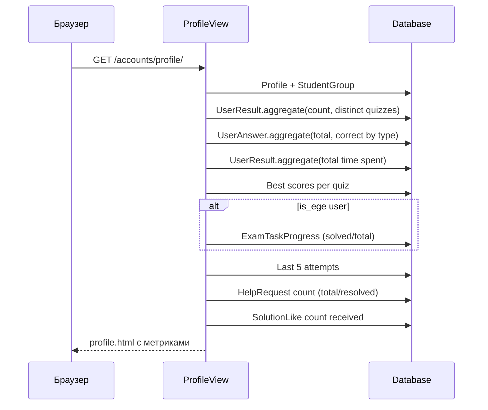

# Accounts API

Приложение `accounts` предоставляет 1 endpoint + стандартные Django auth views.

---

## Endpoints

### GET `/accounts/profile/` — Профиль пользователя

**View:** `ProfileView` (Class-Based View)
**Auth:** `LoginRequiredMixin`
**Template:** `registration/profile.html`

Агрегирует метрики активности пользователя из нескольких таблиц.

**Контекст шаблона:**

| Переменная | Тип | Описание |
|------------|-----|----------|
| `profile` | Profile | Профиль пользователя |
| `group` | StudentGroup | Группа (может быть None) |
| `total_attempts` | int | Всего попыток тестов |
| `total_quizzes` | int | Уникальных тестов пройдено |
| `total_answers` | int | Всего ответов |
| `total_time` | timedelta | Суммарное время |
| `type_stats` | list[dict] | Статистика по типам вопросов |
| `quiz_stats` | list[dict] | Лучший результат по каждому тесту |
| `ege_progress` | dict | Прогресс EGE (если is_ege) |
| `last_attempts` | QuerySet | Последние 5 попыток |
| `help_stats` | dict | Запросы помощи (total/resolved) |
| `likes_received` | int | Получено лайков на решения |

---

## Django Auth URLs

Стандартные маршруты из `django.contrib.auth.urls`:

| URL | Описание |
|-----|----------|
| `/accounts/login/` | Страница входа |
| `/accounts/logout/` | Выход |
| `/accounts/password_change/` | Смена пароля |
| `/accounts/password_reset/` | Сброс пароля |

!!! info "Регистрация"
    Регистрация обрабатывается через кастомную view `accounts.views.signup_view` (не через `django.contrib.auth`). При регистрации автоматически создаётся `Profile`.
