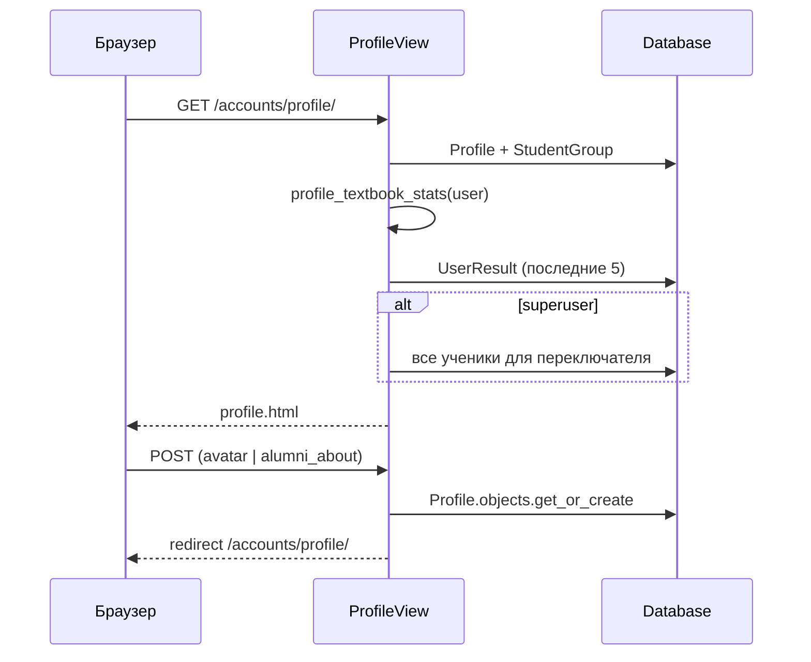

# Accounts API

Приложение `accounts` предоставляет 2 endpoint'а профиля и `AlumniView`, который
подключён в корневом `config/urls.py` по адресу `/alumni/`. Всё остальное под
`/accounts/` – стандартные Django auth views.

---

## Endpoints

### GET/POST `/accounts/profile/` – Свой профиль

**View:** `ProfileView` (`LoginRequiredMixin`, `generic.TemplateView`)
**Auth:** `LoginRequiredMixin`
**Template:** `registration/profile.html`

Профиль собирается вокруг двух вещей: как человек учится (блок **Учебник** из
`textbook.services.profile_textbook_stats`) и что он делал в тренажёре ЕГЭ.
Прогресс по номерам ЕГЭ намеренно живёт не здесь, а на вкладке «Мой прогресс»
тренажёра: две страницы с одними и теми же цифрами неизбежно расходятся.

```mermaid
sequenceDiagram
    participant B as Браузер
    participant V as ProfileView
    participant DB as Database

    B->>V: GET /accounts/profile/
    V->>DB: Profile + StudentGroup
    V->>V: profile_textbook_stats(user)
    V->>DB: UserResult (последние 5)
    alt superuser
        V->>DB: все ученики для переключателя
    end
    V-->>B: profile.html

    B->>V: POST (avatar | alumni_about)
    V->>DB: Profile.objects.get_or_create
    V-->>B: redirect /accounts/profile/
```

**Контекст шаблона:**

| Переменная | Тип | Описание |
|------------|-----|----------|
| `profile_user` | User | Чей профиль показывается |
| `profile` | Profile | Профиль (может быть None) |
| `group` | StudentGroup | Группа (может быть None) |
| `is_own` | bool | Свой ли это профиль |
| `is_ege` | bool | Готовится ли ученик к ЕГЭ |
| `textbook` | dict | Статистика по учебнику (`profile_textbook_stats`) |
| `recent_results` | list[UserResult] | Последние 5 сданных тестов |
| `students` | QuerySet | Переключатель учеников – только суперпользователю |

**POST** – две формы на странице, различаются по полю: если в теле есть
`alumni_about`, сохраняется карточка выпускника (`alumni_place`, `alumni_about`),
иначе принимается файл аватара. Аватар прогоняется через `AvatarForm`
(`ModelForm` – ради валидации Pillow), лимит 2 МБ; старый файл удаляется после
успешного `save()`. Править можно только свой профиль: учитель чужой не трогает.

---

### GET/POST `/accounts/profile/<user_id>/` – Профиль ученика

**View:** тот же `ProfileView`
**Auth:** `LoginRequiredMixin` + `is_superuser` (иначе `PermissionDenied` → 403)

Тот же шаблон и тот же контекст, что у своего профиля, плюс переключатель
учеников. Чужой профиль открывает только суперпользователь – тот же критерий
«учителя», что и у отчётов по блокам учебника.

---

### GET `/alumni/` – Архив выпускных классов

**View:** `AlumniView` (`UserPassesTestMixin`, `generic.ListView`)
**Auth:** `is_superuser` (`test_func`), `raise_exception=True` → 403
**Template:** `accounts/alumni.html`
**Context object:** `groups`

Общее фото, слово учителя и карточки выпускников. Страница внутренняя: ссылки в
шапке сайта нет, вход только из учительской панели внутри профиля.

QuerySet – `StudentGroup` с заполненным `graduation_year`, ученики
предзагружены через `Prefetch`, сортировка `-graduation_year, name`. Группа
самого раннего выпуска получает флаг `is_first`; год в код не зашит.

---

## Django Auth URLs

Стандартные маршруты из `django.contrib.auth.urls` (8 штук под `/accounts/`):

| URL | Описание |
|-----|----------|
| `/accounts/login/` | Страница входа |
| `/accounts/logout/` | Выход |
| `/accounts/password_change/` | Смена пароля |
| `/accounts/password_change/done/` | Пароль изменён |
| `/accounts/password_reset/` | Запрос сброса пароля |
| `/accounts/password_reset/done/` | Письмо отправлено |
| `/accounts/reset/<uidb64>/<token>/` | Новый пароль по ссылке из письма |
| `/accounts/reset/done/` | Пароль сброшен |

!!! info "Регистрация"
    Самостоятельной регистрации на сайте нет: учётные записи заводит учитель в
    админке, там же `Profile` заполняется инлайном (`ProfileInline`). Если
    профиля у пользователя всё же нет, `ProfileView` создаёт его при первом POST.
