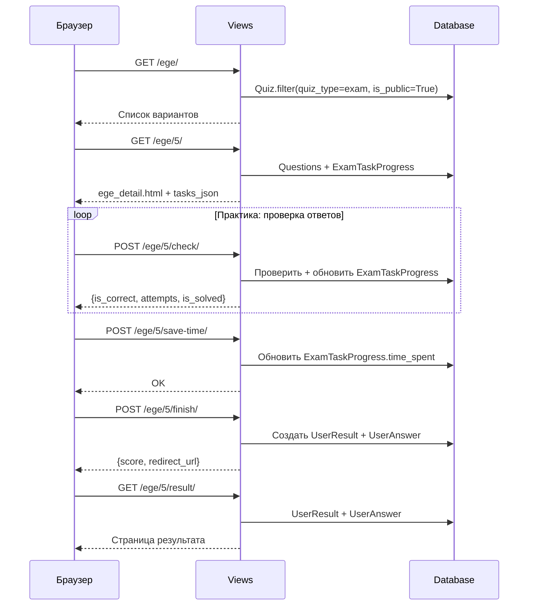

# EGE API

EGE-тренажёр — отдельный набор из **10 endpoints** для работы с экзаменационными вариантами.

Все endpoints требуют авторизацию. Тесты фильтруются по `quiz_type='exam'` и `is_public=True`.

---

## Основной flow



---

## Endpoints

### GET `/ege/` — Список вариантов

**View:** `ege_list_view`
**Template:** `quizzes/ege_list.html`

Показывает доступные EGE-варианты. Для каждого отображается прогресс пользователя.

---

### GET `/ege/<id>/` — Детали варианта

**View:** `ege_detail_view`
**Template:** `quizzes/ege_detail.html`

Основная страница EGE-варианта с навигацией по задачам.

**Логика:**

- **Exam mode:** если `UserResult` уже существует — redirect на результат (одна попытка)
- **Practice mode:** вопросы доступны для повторного решения
- Загружает `ExamTaskProgress` для каждого вопроса (solved, attempts, time)
- Для code-вопросов: последний `CodeSubmission` + лучшие метрики
- Для text-вопросов: восстанавливает последний ответ из `UserAnswer`

**`tasks_json` структура:**
```json
[
  {
    "id": 1,
    "ege_number": 1,
    "type": "text",
    "is_solved": true,
    "attempts": 3,
    "time_spent": 120,
    "saved_answer": "42",
    "points": 1
  },
  {
    "id": 5,
    "ege_number": 25,
    "type": "code",
    "is_solved": false,
    "attempts": 1,
    "time_spent": 300,
    "last_code": "n = int(input())",
    "best_cpu_time_ms": 45.2,
    "best_memory_kb": 8192,
    "points": 2
  }
]
```

---

### POST `/ege/<id>/check/` — Проверить ответ

**View:** `ege_check_answer_view`
**Content-Type:** `application/json`

Мгновенная проверка текстового ответа. **Только в practice mode.**

**Запрос:**
```json
{"question_id": 1, "answer": "42"}
```

**Ответ (200):**
```json
{
  "is_correct": true,
  "attempts": 3,
  "is_solved": true
}
```

| Код | Причина |
|-----|---------|
| 400 | Пустой ответ или невалидный question_id |
| 403 | Exam mode (проверка запрещена) |
| 404 | Вопрос не найден в этом тесте |

!!! tip "Нормализация"
    Ответ нормализуется через `normalize_text_answer()` — lowercase, strip, удаление ведущих нулей. Также проверяется `alternative_answers` JSON-поле.

---

### POST `/ege/<id>/finish/` — Завершить вариант

**View:** `ege_finish_view`
**Content-Type:** `application/json`

Финализирует EGE-вариант: создаёт `UserResult` и `UserAnswer` для каждого вопроса.

**Запрос:**
```json
{
  "answers": {"1": "42", "3": "100"},
  "force": false
}
```

**Ответ (200):**
```json
{
  "success": true,
  "result_id": 20,
  "score": 15,
  "total_points": 28,
  "pending_checks": 1,
  "redirect_url": "/ege/5/result/"
}
```

**Логика:**

1. Exam mode: блокирует повторную сдачу (403 если `UserResult` существует)
2. Text-вопросы: проверяет через `check_text_answer()`
3. Code-вопросы: использует последний `CodeSubmission`
4. Обновляет `ExamTaskProgress` для правильных ответов

---

### GET `/ege/<id>/result/` — Результат варианта

**View:** `ege_result_view`
**Template:** `quizzes/ege_result.html`

Показывает результат: набранные баллы, правильные/неправильные ответы.

---

### GET `/ege/<id>/results/` — Все результаты

**View:** `ege_results_view`
**Template:** `quizzes/ege_results.html`

История всех попыток пользователя по данному варианту.

---

### POST `/ege/<id>/save-time/` — Сохранить время

**View:** `ege_save_time_view`
**Content-Type:** `application/json`

Периодически сохраняет время, потраченное на текущую задачу.

**Запрос:**
```json
{"question_id": 1, "time_spent": 120}
```

---

### POST `/ege/<id>/task/<num>/upload-attachment/` — Загрузить решение

**View:** `ege_upload_attachment_view`
**Content-Type:** `multipart/form-data`

Загружает файл или изображение решения. Создаёт/обновляет `SolutionAttachment`.

| Поле | Тип | Описание |
|------|-----|----------|
| `file` | File | Файл решения (опционально) |
| `image` | File | Скриншот решения (опционально) |
| `comment` | string | Комментарий к решению |

---

### GET `/ege/<id>/task/<num>/solution/<user_id>/` — Просмотр решения

**View:** `ege_solution_detail_view`

Просмотр решения конкретного ученика. Доступно автору и staff.

---

### POST `/ege/solutions/<answer_id>/like/` — Лайк

**View:** `ege_toggle_like_view`
**Content-Type:** `application/json`

Toggle лайка на решение. Повторный запрос убирает лайк.

**Ответ:**
```json
{"liked": true, "total_likes": 5}
```

---

## Два режима EGE

| Аспект | Exam Mode | Practice Mode |
|--------|-----------|---------------|
| Попытки | Одна | Без ограничений |
| Проверка `/check/` | Запрещена (403) | Доступна |
| Навигация | Линейная | Свободная |
| ExamTaskProgress | Обновляется при finish | Обновляется при каждой проверке |
| Таймер | Обратный отсчёт | Прямой отсчёт |
