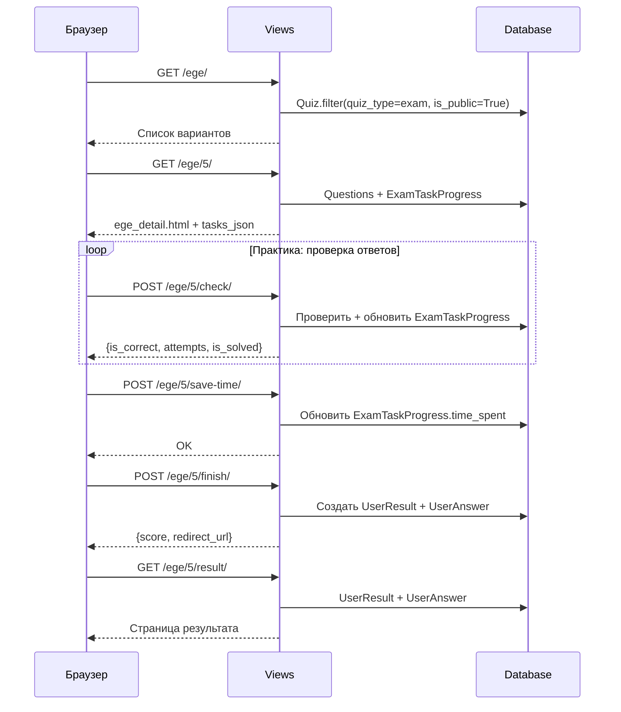

# EGE API

EGE-тренажёр смонтирован на `/ege/` (`quizzes/urls_ege.py`) и состоит из двух
подсистем, которые не пересекаются данными:

- **варианты** — собранная работа целиком, `Quiz(quiz_type='exam')`, прогресс в `ExamTaskProgress`;
- **тренировка по темам** — короткие сессии из банка задач, `Quiz(quiz_type='bank')`,
  журнал в `PracticeSession` / `PracticeItem`.

Разделение жёсткое: задача принадлежит одному квизу, поэтому вариант никогда не
вычерпывает тренировочную выдачу, а тренировка не попадает в статистику варианта.

Все endpoints требуют авторизацию, кроме `/ege/` — гостю хаб показывается с
демонстрационным прогрессом (`ege_stats.demo_overview`).

---

## Основной flow


```mermaid
sequenceDiagram
    participant B as Браузер
    participant V as Views
    participant DB as Database

    B->>V: GET /ege/
    V->>DB: Quiz.filter(quiz_type=exam, is_public=True)
    V-->>B: Список вариантов

    B->>V: GET /ege/5/
    V->>DB: Questions + ExamTaskProgress
    V-->>B: ege_detail.html + tasks_json

    loop Практика: проверка ответов
        B->>V: POST /ege/5/check/
        V->>DB: Проверить + обновить ExamTaskProgress
        V-->>B: {is_correct, attempts, is_solved}
    end

    B->>V: POST /ege/5/save-time/
    V->>DB: Обновить ExamTaskProgress.time_spent
    V-->>B: OK

    B->>V: POST /ege/5/finish/
    V->>DB: Создать UserResult + UserAnswer
    V-->>B: {score, redirect_url}

    B->>V: GET /ege/5/result/
    V->>DB: UserResult + UserAnswer
    V-->>B: Страница результата
```

---

## Endpoints

### GET `/ege/` — Список вариантов

**View:** `ege_list_view`
**Template:** `quizzes/ege_list.html`

Показывает доступные EGE-варианты. Для каждого отображается прогресс пользователя.

---

### GET `/ege/<id>/` — Детали варианта

**View:** `ege_detail_view`
**Template:** `quizzes/ege_detail.html`

Основная страница EGE-варианта с навигацией по задачам.

**Логика:**

- **Exam mode:** если `UserResult` уже существует — redirect на результат (одна попытка)
- **Practice mode:** вопросы доступны для повторного решения
- Загружает `ExamTaskProgress` для каждого вопроса (solved, attempts, time)
- Для code-вопросов: последний `CodeSubmission` + лучшие метрики
- Для text-вопросов: восстанавливает последний ответ из `UserAnswer`

**`tasks_json` структура:**
```json
[
  {
    "id": 1,
    "ege_number": 1,
    "type": "text",
    "is_solved": true,
    "attempts": 3,
    "time_spent": 120,
    "saved_answer": "42",
    "points": 1
  },
  {
    "id": 5,
    "ege_number": 25,
    "type": "code",
    "is_solved": false,
    "attempts": 1,
    "time_spent": 300,
    "last_code": "n = int(input())",
    "best_cpu_time_ms": 45.2,
    "best_memory_kb": 8192,
    "points": 2
  }
]
```

---

### POST `/ege/<id>/check/` — Проверить ответ

**View:** `ege_check_answer_view`
**Content-Type:** `application/json`

Мгновенная проверка текстового ответа. **Только в practice mode.**

**Запрос:**
```json
{"question_id": 1, "answer": "42"}
```

**Ответ (200):**
```json
{
  "is_correct": true,
  "attempts": 3,
  "is_solved": true
}
```

| Код | Причина |
|-----|---------|
| 400 | Пустой ответ или невалидный question_id |
| 403 | Exam mode (проверка запрещена) |
| 404 | Вопрос не найден в этом тесте |

!!! tip "Нормализация"
    Ответ нормализуется через `normalize_text_answer()` — lowercase, strip, удаление ведущих нулей. Также проверяется `alternative_answers` JSON-поле.

---

### POST `/ege/<id>/finish/` — Завершить вариант

**View:** `ege_finish_view`
**Content-Type:** `application/json`

Финализирует EGE-вариант: создаёт `UserResult` и `UserAnswer` для каждого вопроса.

**Запрос:**
```json
{
  "answers": {"1": "42", "3": "100"},
  "force": false
}
```

**Ответ (200):**
```json
{
  "success": true,
  "result_id": 20,
  "score": 15,
  "total_points": 28,
  "pending_checks": 1,
  "redirect_url": "/ege/5/result/"
}
```

**Логика:**

1. Exam mode: блокирует повторную сдачу (403 если `UserResult` существует)
2. Text-вопросы: проверяет через `check_text_answer()`
3. Code-вопросы: использует последний `CodeSubmission`
4. Обновляет `ExamTaskProgress` для правильных ответов

---

### GET `/ege/<id>/result/` — Результат варианта

**View:** `ege_result_view`
**Template:** `quizzes/ege_result.html`

Показывает результат: набранные баллы, правильные/неправильные ответы.

---

### GET `/ege/<id>/results/` — Сводная таблица результатов

**View:** `ege_results_view`
**Template:** `quizzes/ege_results.html`

Сводная таблица результатов всех учеников по данному варианту.

**Колонки таблицы:**

| Колонка | Описание |
|---------|----------|
| Участник | Имя ученика; для суперпользователя — ссылка на детальную статистику |
| №1 … №N | Результат по каждой задаче (✓ / ✗ / —), клик → решение |
| ✓ | Количество правильных ответов |
| Баллы | Первичный балл (сумма `question.points`) |
| Тест | Тестовый балл по шкале ЕГЭ 2024 (`EGE_SCORE_CONVERSION`) |
| Время | Суммарное время ученика на весь вариант |

---

### GET `/ege/<id>/results/student/<user_id>/` — Статистика ученика

**View:** `ege_student_stats_view`
**Template:** `quizzes/ege_student_stats.html`
**Доступ:** только суперпользователь (иначе 403)

Детальная статистика конкретного ученика по варианту: время, попытки, статус, CPU и память по каждой задаче.

**Карточки-итоги:** всего задач / решено / всего попыток / общее время.

---

### POST `/ege/<id>/save-time/` — Сохранить время

**View:** `ege_save_time_view`
**Content-Type:** `application/json`

Периодически сохраняет время, потраченное на текущую задачу.

**Запрос:**
```json
{"question_id": 1, "time_spent": 120}
```

---

### POST `/ege/<id>/task/<num>/upload-attachment/` — Загрузить решение

**View:** `ege_upload_attachment_view`
**Content-Type:** `multipart/form-data`

Загружает файл или изображение решения. Создаёт/обновляет `SolutionAttachment`.

| Поле | Тип | Описание |
|------|-----|----------|
| `file` | File | Файл решения (опционально) |
| `image` | File | Скриншот решения (опционально) |
| `comment` | string | Комментарий к решению |

---

### GET `/ege/<id>/task/<num>/solution/<user_id>/` — Просмотр решения

**View:** `ege_solution_detail_view`

Просмотр решения конкретного ученика. Доступно автору и staff.

---

### POST `/ege/solutions/<answer_id>/like/` — Лайк

**View:** `ege_toggle_like_view`
**Content-Type:** `application/json`

Toggle лайка на решение. Повторный запрос убирает лайк.

**Ответ:**
```json
{"liked": true, "total_likes": 5}
```


---

## Тренировка по темам

Сессия — короткая пачка задач, отобранная под одну цель. Отбором занимается
`quizzes/ege_practice.py`, статистикой — `quizzes/ege_stats.py`, вьюхи лежат
в `quizzes/views_practice.py`.

```mermaid
sequenceDiagram
    participant B as Браузер
    participant V as views_practice
    participant P as ege_practice
    participant DB as Database

    B->>V: POST /ege/practice/start/
    V->>P: build_session(kind, mode, size, mix)
    P->>DB: отбор из банка + expand_groups (19–21)
    P-->>V: PracticeSession + PracticeItem[]
    V-->>B: redirect /ege/practice/<pk>/

    loop Решение
        B->>V: POST /ege/practice/<pk>/answer/
        V->>DB: PracticeItem.is_correct, attempts, score
        V-->>B: study — вердикт; exam — только {saved: true}
        B->>V: POST /ege/practice/<pk>/time/
    end

    B->>V: POST /ege/practice/<pk>/finish/
    V-->>B: redirect /ege/practice/<pk>/result/
```

### GET `/ege/task/<number>/` — Карточка задания

**View:** `views_practice.ege_task_view` · **Template:** `quizzes/ege_task.html`

Теория по заданию, личная статистика и форма запуска сессии. Связка 19–21
живёт одной страницей: `/ege/task/20/` и `/21/` редиректят на `/ege/task/19/`.

### POST `/ege/task/<number>/classroom/` — Рубильник «Задачи для урока»

**View:** `views_practice.classroom_toggle_view` · **Только суперпользователь**

Переключает `EgeTask.classroom_enabled`. Пока выключен, ученик не видит кнопку,
а прямой POST на старт отклоняется.

### GET `/ege/task/<number>/solved/` — Решённые задачи

**View:** `views_practice.ege_solved_view` · **Template:** `quizzes/ege_solved.html`

Решённые задачи вместе с ответом или кодом ученика и лучшими метриками
(`ege_practice.best_code_metrics` — минимум CPU и памяти по верным отправкам).

### GET/POST `/ege/task/<number>/bank/` — Банк задач

**View:** `views_practice.ege_bank_view` · **Только суперпользователь**

Весь банк одного задания с условием, отрисованным как у ученика, и раскладкой
по трём пулам: тренировка / в классе (`classroom_only`) / экзамен (`exam_only`).
Сохранение — одним `bulk_update`; связка 19–21 переезжает целиком.

### POST `/ege/practice/start/` — Старт сессии

**View:** `views_practice.practice_start_view`

| Поле формы | Значения |
|------------|----------|
| `kind` | `topic` / `mistakes` / `mixed` / `classroom` |
| `mode` | `study` / `exam` |
| `ege_number` | 1–27, обязателен для `topic` и `classroom` |
| `size` | 1–`STUDY_MAX_SIZE`; у связки — число троек |
| `mix_1` / `mix_2` / `mix_3` | Ручной состав по сложности |

Серверные проверки: экзамен закрыт, пока не решено `EgeTask.exam_unlock_threshold`
разных задач в режиме `study`; одновременно идёт не больше одного экзамена;
состав экзамена (`size`, `mix`) игнорируется. Пустой отбор — не ошибка, а редирект
на карточку задания с флагом в сессии.

### POST `/ege/practice/retry/<question_id>/` — Переписать решение

**View:** `views_practice.practice_retry_view`

Сессия `kind='retry'` из одной задачи на коде. Не оценивается: провал не
переводит задачу в нерешённые, замка на повторные отправки нет, в статистику
и в счётчик открытия экзамена не идёт.

### GET `/ege/practice/<pk>/` — Страница сессии

**View:** `views_practice.practice_view` · **Template:** `quizzes/ege_practice.html`

Одна задача на экране. **Правильные ответы в браузер не уходят** ни в одном
режиме — их отдаёт только `/reveal/`. У экзамена страница получает
`seconds_left`, посчитанный на сервере.

### POST `/ege/practice/<pk>/answer/` — Ответ на задачу

**Content-Type:** `application/json` · `{"item_id": 12, "answer": "42", "seconds": 40}`

- `mode='study'` — `{"is_correct", "score", "attempts", "locked"}`; верный ответ не отдаётся
- `mode='exam'` — `{"saved": true, "item_id"}`, ни исхода, ни намёка на него
- Решённая или открытая задача — 409; задача на коде — 400 (проверяется отправкой кода)

### POST `/ege/practice/<pk>/reveal/` — «Показать ответ»

Только в `study`. Ставит `gave_up`, закрывает задачу как нерешённую и лишь
после этого отдаёт `correct_answer`. Цена подсказки равна цене неверного ответа.

### POST `/ege/practice/<pk>/time/` — Досылка времени

Порция обрезается `MAX_SECONDS_PER_REPORT` (600 с): цифры идут в отчёт учителю.

### POST `/ege/practice/<pk>/finish/` — Завершение

Поле `beacon=1` — уход с экзамена через `sendBeacon`: недосланные ответы
(`answers`, до 100 штук) сохраняются и сессия закрывается одним запросом,
ответ 204. Обычный POST — редирект на разбор.

### GET `/ege/practice/<pk>/result/` — Разбор сессии

Открывается **только у завершённой сессии**: иначе страница разбора работала бы
второй вкладкой с верными ответами посреди экзамена. Незакрытая сессия —
редирект обратно на `/ege/practice/<pk>/`.

---

## Учительские страницы

### GET `/ege/class/` — Сравнительная таблица класса

**View:** `ege_class_view` · **Только суперпользователь**

Строка на ученика: прогноз балла и на скольких заданиях он держится, последний
экзаменационный вариант, долг по ошибкам, три самые дорогие дыры, график
активности по неделям. Один класс за раз (`?group=<id>`, `all`, `none`).
`ege_stats.class_rows()` считает весь класс семью запросами.

### GET `/ege/student/<user_id>/mistakes/` — Долг ученика

**View:** `ege_student_mistakes_view` · **Только суперпользователь**

Тот же набор задач, что ученик получит по кнопке «Работа над ошибками», но в
режиме чтения: условие, ответ ученика, лог ошибки и панель с верным ответом.
Не сессия — чужую сессию открыть и «просто посмотреть» нельзя.

### GET `/ege/?student=<id>` — Чужой прогресс

Тот же хаб с цифрами ученика (`views._viewed_student`). Отдельного шаблона нет
намеренно: вторая вёрстка тех же чисел — второе место для расхождений.

---

## Два режима EGE

| Аспект | Exam Mode | Practice Mode |
|--------|-----------|---------------|
| Попытки | Одна | Без ограничений |
| Проверка `/check/` | Запрещена (403) | Доступна |
| Навигация | Линейная | Свободная |
| ExamTaskProgress | Обновляется при finish | Обновляется при каждой проверке |
| Таймер | Обратный отсчёт | Прямой отсчёт |

Внутри тренировки по темам режимы называются так же, но означают другое:

| Аспект | `mode='exam'` | `mode='study'` (в UI «Тренировка») |
|--------|---------------|------------------------------------|
| Проверка | Молча до конца сессии | Сразу после каждого ответа |
| Повторная попытка | Ответ правится как черновик | Новая попытка, растёт `attempts` |
| «Показать ответ» | Нет | Есть, ставит `gave_up` |
| Лимит времени | `EXAM_MINUTES` от `created_at` | Нет |
| Состав | Отбирает сервер, форма игнорируется | Задаёт ученик |
| Открыт | После `exam_unlock_threshold` решённых задач | Всегда |

## Частичный балл (задания 26 и 27)

`quizzes/ege_scoring.py` — единственное место, знающее правила ФИПИ. С КИМ-2027
у обоих заданий одно правило: ответ — два числа, 1 балл за перестановку или
одну верную ячейку. Сравниваются числа, а не раскладка вывода, поэтому
`43656 36` и те же числа в две строки — один ответ. Балл попадает в
`CodeSubmission.score`, `PracticeItem.score`, `UserAnswer.score`,
`ExamTaskProgress.score`; везде остальное — `null`.
