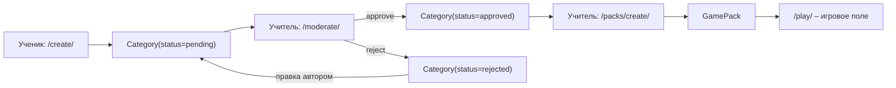

# Games API

Раздел игр смонтирован на `/games/` (`games/urls.py`) – **16 endpoint'ов**.
Пока игра одна, «Своя игра»: ученик предлагает `Category` с вопросами, учитель
их модерирует и собирает `GamePack`, а `GameSession` хранит состояние доски и
игроков в JSON.

Права делятся на три уровня: публичное чтение, `@login_required` для участия и
`is_staff` (`_is_staff`) для модерации и сборки паков.

---

## Публичные

### GET `/games/` – Лендинг раздела

**View:** `games_landing_view` · **Template:** `games/landing.html`

Список типов игр. Пока в нём одна карточка – «Своя игра».

### GET `/games/svoya-igra/` – Список паков

**View:** `svoya_igra_list_view` · **Template:** `games/svoya_igra/list.html`

`GamePack` с `is_public=True`. Непубличный пак в списке не показывается.

### GET `/games/svoya-igra/pack/<pack_id>/` – Детали пака

**View:** `svoya_igra_pack_detail_view` · **Template:** `games/svoya_igra/pack_detail.html`

Состав пака по порядку `GamePackCategory.order`. Персонал (`is_staff`) видит
любой пак, остальные – только `is_public=True`, иначе 404.

---

## Участие (login_required)

### GET `/games/svoya-igra/pack/<pack_id>/play/` – Игра

**View:** `svoya_igra_play_view` · **Template:** `games/svoya_igra/play.html`
**Auth:** `@login_required`

Пак берётся только публичный. Активная `GameSession` ищется по паре
`(game_pack, created_by=request.user)`; если её нет – создаётся. Шаблон получает
`session_id` и три JSON-блоба: `board_state_json`, `players_json`,
`categories_json` (категории с вопросами, медиа и автором темы). Доску рисует
`static/js/svoya-igra-board.js`.

### POST `/games/svoya-igra/session/<session_id>/update/` – Сохранить доску

**View:** `svoya_igra_session_update_view`
**Auth:** `@login_required`, сессия принадлежит пользователю
**Content-Type:** `application/json`

Тело: `{"board_state": {...}, "players": [...], "is_active": true}` – любое из
полей опционально. Ответ `{"ok": true}`; невалидный JSON – 400. Чужая сессия
отдаёт 404.

### GET/POST `/games/svoya-igra/create/` – Предложить тему

**View:** `svoya_igra_create_view` · **Template:** `games/svoya_igra/create.html`
**Auth:** `@login_required`

GET отдаёт `CategoryForm` и формсет вопросов. POST в одной транзакции создаёт
`Category` со `status='pending'` и автором `request.user`, затем вопросы с медиа.
Вопрос с медиа больше 20 МБ (`MAX_QUESTION_MEDIA_SIZE`) не проходит – ошибка
возвращается по номеру формы, ничего не сохраняется. Успех – редирект на «Мои
заявки».

### GET `/games/svoya-igra/my/` – Мои заявки

**View:** `svoya_igra_my_view` · **Template:** `games/svoya_igra/my.html`
**Auth:** `@login_required`

Свои `Category`, разложенные по статусам: «На проверке», «Одобренные»,
«Отклонённые».

### GET/POST `/games/svoya-igra/my/<category_id>/edit/` – Правка отклонённой темы

**View:** `svoya_igra_my_category_edit_view` · **Template:** `games/svoya_igra/my_edit.html`
**Auth:** `@login_required`, тема принадлежит пользователю

Открывается только у темы со `status='rejected'`, иначе редирект на «Мои
заявки». POST с полем `resubmit` правит заголовок и описание, **снимает**
`moderator_comment` и возвращает тему в `pending` – второй круг модерации.

### POST `/games/svoya-igra/question/<question_id>/edit/` – Править вопрос

**View:** `svoya_igra_question_edit_view`
**Auth:** `is_staff` **или** автор отклонённой темы

Форма сохраняет вопрос и досоздаёт медиа (до 5 файлов на тип). `next=my_edit`
возвращает автора в правку своей темы, иначе – в карточку модерации. Без прав
редирект на список паков.

### POST `/games/svoya-igra/media/<media_id>/delete/` – Удалить медиа

**View:** `svoya_igra_media_delete_view`
**Auth:** `is_staff` **или** автор отклонённой темы

Удаляет файл с диска и запись `QuestionMedia`. Тот же выбор адреса возврата по
`next=my_edit`.

---

## Модерация (is_staff)

### GET `/games/svoya-igra/moderate/` – Очередь заявок

**View:** `svoya_igra_moderate_list_view` · **Template:** `games/svoya_igra/moderate_list.html`
**Auth:** `is_staff`

`?status=pending|approved|rejected`, по умолчанию `pending`.

### GET/POST `/games/svoya-igra/moderate/<category_id>/` – Карточка модерации

**View:** `svoya_igra_moderate_detail_view` · **Template:** `games/svoya_igra/moderate_detail.html`
**Auth:** `is_staff`

Вопросы с медиа и формами правки. POST сохраняет `CategoryModerationForm`
(статус и комментарий) и возвращает в очередь.

### POST `/games/svoya-igra/category/<category_id>/edit/` – Править тему

**View:** `svoya_igra_category_edit_view`
**Auth:** `is_staff`

Меняет заголовок и описание темы, возвращает в карточку модерации.

### GET `/games/svoya-igra/packs/manage/` – Управление паками

**View:** `svoya_igra_pack_manage_view` · **Template:** `games/svoya_igra/pack_manage.html`
**Auth:** `is_staff`

Все паки, включая непубличные.

### POST `/games/svoya-igra/pack/<pack_id>/toggle-public/` – Публикация пака

**View:** `svoya_igra_pack_toggle_public_view`
**Auth:** `is_staff`

Переключает `GamePack.is_public`, возвращает в управление паками – так пак
готовят к уроку, не заходя в админку.

### GET/POST `/games/svoya-igra/packs/create/` – Собрать пак

**View:** `svoya_igra_pack_create_view` · **Template:** `games/svoya_igra/pack_create.html`
**Auth:** `is_staff`

Форма пака плюс выбор одобренных категорий (`category_ids`, порядок – порядок
галочек). Пак и его `GamePackCategory` создаются одной транзакцией; пустой
выбор категорий форму не проходит. Успех – редирект на список паков.
