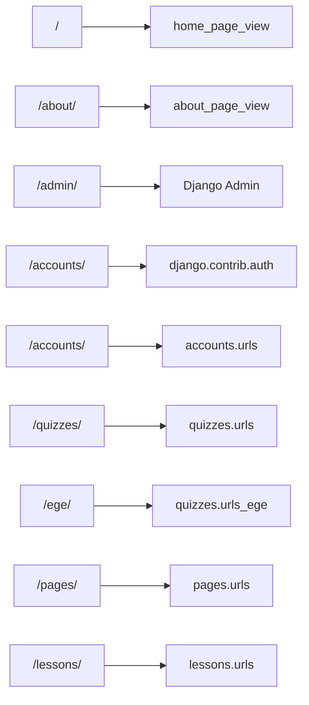

# API и маршруты — Обзор

Проект имеет **~37 HTTP endpoints** и **2 WebSocket маршрута**, распределённых по 4 приложениям.

---

## Корневая маршрутизация (config/urls.py)

| Префикс | Include | App Name |
|----------|---------|----------|
| `/` | `pages.views.home_page_view` | home |
| `/about/` | `pages.views.about_page_view` | about |
| `/admin/` | `admin.site.urls` | — |
| `/accounts/` | `django.contrib.auth.urls` | — |
| `/accounts/` | `accounts.urls` | accounts |
| `/quizzes/` | `quizzes.urls` | quizzes |
| `/ege/` | `quizzes.urls_ege` | ege |
| `/pages/` | `pages.urls` | pages |
| `/lessons/` | `lessons.urls` | lessons |

---

## Сводная таблица endpoints

### Публичные (без авторизации)

| Метод | URL | Описание |
|-------|-----|----------|
| GET | `/` | Главная страница |
| GET | `/about/` | О проекте |
| GET | `/lessons/` | Список уроков |
| GET | `/lessons/<id>/` | Детали урока |
| GET | `/lessons/<id>/file/` | Скачать файл урока |

### Авторизованные (login_required)

| Метод | URL | Описание |
|-------|-----|----------|
| GET | `/accounts/profile/` | Профиль пользователя |
| GET/POST | `/quizzes/<id>/` | Прохождение теста |
| POST | `/quizzes/<id>/question/<id>/submit/` | Отправить код |
| GET | `/quizzes/submission/<id>/status/` | Статус проверки кода |
| POST | `/quizzes/<id>/finish/` | Завершить тест |
| GET | `/quizzes/question-file/<id>/download/` | Скачать файл вопроса |
| GET/POST | `/quizzes/<id>/question/<id>/help/` | Запрос помощи |
| GET | `/quizzes/help-requests/` | Список запросов помощи |
| GET | `/quizzes/help-requests/unread-count/` | Количество непрочитанных |
| GET | `/quizzes/help-requests/my-notifications/` | Мои уведомления |
| GET | `/quizzes/help-requests/<id>/` | Просмотр запроса |
| POST | `/quizzes/help-requests/<id>/reply/` | Ответ на запрос |
| POST | `/quizzes/help-requests/<id>/resolve/` | Закрыть запрос |

### EGE endpoints (login_required)

| Метод | URL | Описание |
|-------|-----|----------|
| GET | `/ege/` | Список EGE-вариантов |
| GET | `/ege/<id>/` | Детали варианта |
| POST | `/ege/<id>/check/` | Проверить ответ (практика) |
| POST | `/ege/<id>/finish/` | Завершить вариант |
| GET | `/ege/<id>/result/` | Результат варианта |
| GET | `/ege/<id>/results/` | Все результаты |
| POST | `/ege/<id>/save-time/` | Сохранить время задачи |
| POST | `/ege/<id>/task/<num>/upload-attachment/` | Загрузить файл решения |
| GET | `/ege/<id>/task/<num>/solution/<user_id>/` | Просмотр решения |
| POST | `/ege/solutions/<answer_id>/like/` | Лайк решения |

### Staff-only (staff_member_required)

| Метод | URL | Описание |
|-------|-----|----------|
| GET | `/quizzes/<id>/stats/` | Статистика теста (superuser) |
| GET | `/quizzes/<id>/stats/<user_id>/` | Попытки ученика (superuser) |
| GET | `/quizzes/attempt/<id>/` | Детали попытки (superuser) |

### WebSocket

| URL | Consumer | Описание |
|-----|----------|----------|
| `ws/quiz/<quiz_id>/` | `QuizConsumer` | Результаты проверки кода в реальном времени |
| `ws/notifications/` | `NotificationConsumer` | Уведомления о помощи |

---

## Аутентификация

Проект использует стандартную сессионную аутентификацию Django:

- `django.contrib.auth.urls` — login, logout, password reset
- `@login_required` — большинство quiz/ege endpoints
- `@staff_member_required` — content API, upload API
- `@user_passes_test(lambda u: u.is_superuser)` — статистика тестов
- WebSocket — авторизация через session cookie в `QuizConsumer.connect()`
