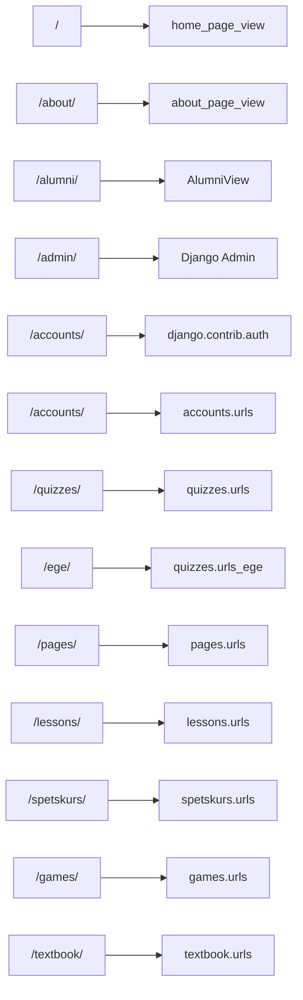

# API и маршруты – Обзор

Проект – **8 приложений**, **72 HTTP endpoint'а** и **1 WebSocket-маршрут**
(сверх этого – `/admin/`, 8 стандартных auth-маршрутов Django и раздача media
в режиме `DEBUG`). `quizzes` монтируется дважды: обычные тесты на `/quizzes/`,
тренажёр ЕГЭ – на `/ege/` (`quizzes/urls_ege.py`).

---

## Корневая маршрутизация (config/urls.py)

```mermaid
graph LR
    ROOT["/"] --> HOME["home_page_view"]
    ABOUT["/about/"] --> ABOUT_V["about_page_view"]
    ALUMNI["/alumni/"] --> ALUMNI_V["AlumniView"]
    ADMIN["/admin/"] --> DJANGO["Django Admin"]
    AUTH["/accounts/"] --> AUTH_V["django.contrib.auth"]
    ACC["/accounts/"] --> ACC_V["accounts.urls"]
    QUIZ["/quizzes/"] --> QUIZ_V["quizzes.urls"]
    EGE["/ege/"] --> EGE_V["quizzes.urls_ege"]
    PAGES["/pages/"] --> PAGES_V["pages.urls"]
    LESS["/lessons/"] --> LESS_V["lessons.urls"]
    SPETS["/spetskurs/"] --> SPETS_V["spetskurs.urls"]
    GAMES["/games/"] --> GAMES_V["games.urls"]
    TB["/textbook/"] --> TB_V["textbook.urls"]
```

| Префикс | Include | App Name |
|----------|---------|----------|
| `/` | `pages.views.home_page_view` | home |
| `/about/` | `pages.views.about_page_view` | about |
| `/alumni/` | `accounts.views.AlumniView` | alumni |
| `/admin/` | `admin.site.urls` | – |
| `/accounts/` | `django.contrib.auth.urls` | – |
| `/accounts/` | `accounts.urls` | accounts |
| `/quizzes/` | `quizzes.urls` | quizzes |
| `/ege/` | `quizzes.urls_ege` | ege |
| `/pages/` | `pages.urls` | pages |
| `/lessons/` | `lessons.urls` | lessons |
| `/spetskurs/` | `spetskurs.urls` | spetskurs |
| `/games/` | `games.urls` | games |
| `/textbook/` | `textbook.urls` | textbook |

В режиме `DEBUG` дополнительно подключается `re_path(r'^media/(?P<path>.*)$')` с
показом `index.html` для каталогов – это нужно SPA-презентациям Slidev.

---

## Сводная таблица endpoints

### Публичные (без авторизации)

| Метод | URL | Приложение | Описание |
|-------|-----|------------|----------|
| GET | `/` | pages | Карта курса с прогрессом |
| GET | `/about/` | pages | О проекте |
| GET | `/pages/changelog/` | pages | История версий из `CHANGELOG.md` |
| GET | `/lessons/` | lessons | Список уроков |
| GET | `/lessons/<id>/` | lessons | Детали урока |
| GET | `/lessons/<id>/file/<attachment_id>/` | lessons | Скачать файл урока |
| GET | `/lessons/<id>/presentation-pdf/` | lessons | Скачать PDF презентации |
| GET | `/ege/` | ege | Хаб тренажёра (гостю – демо-прогресс) |
| GET | `/ege/task/<number>/` | ege | Карточка задания |
| GET | `/textbook/` | textbook | Главная учебника |
| GET | `/textbook/article/<slug>/` | textbook | Статья |
| GET | `/spetskurs/` | spetskurs | Лендинг спецкурса |
| GET | `/spetskurs/tasks/` | spetskurs | Список задач |
| GET | `/spetskurs/task/<slug>/` | spetskurs | Страница задачи |
| GET | `/spetskurs/basics/` | spetskurs | Основы C++ |
| GET | `/games/` | games | Лендинг игр |
| GET | `/games/svoya-igra/` | games | Список паков |
| GET | `/games/svoya-igra/pack/<id>/` | games | Детали пака |

### Авторизованные (login_required)

| Метод | URL | Приложение | Описание |
|-------|-----|------------|----------|
| GET/POST | `/accounts/profile/` | accounts | Свой профиль (аватар, карточка выпускника) |
| GET/POST | `/accounts/profile/<user_id>/` | accounts | Профиль ученика (только superuser) |
| GET/POST | `/quizzes/<id>/` | quizzes | Прохождение теста |
| GET | `/quizzes/question-file/<id>/download/` | quizzes | Скачать файл вопроса |
| POST | `/quizzes/<id>/question/<id>/submit/` | quizzes | Отправить код |
| GET | `/quizzes/submission/<id>/status/` | quizzes | Статус проверки кода |
| POST | `/quizzes/<id>/finish/` | quizzes | Завершить тест |
| GET/POST | `/quizzes/question/<id>/hint/` | quizzes | Подсказка к задаче |
| POST | `/quizzes/question/<id>/check/` | quizzes | Вердикт по текстовому ответу |
| GET | `/ege/<id>/` | ege | Детали варианта |
| GET | `/ege/<id>/results/` | ege | Сводная таблица результатов |
| POST | `/ege/<id>/check/` | ege | Проверить ответ (практика) |
| POST | `/ege/<id>/finish/` | ege | Завершить вариант |
| GET | `/ege/<id>/result/` | ege | Результат варианта |
| POST | `/ege/<id>/save-time/` | ege | Сохранить время задачи |
| POST | `/ege/<id>/task/<num>/upload-attachment/` | ege | Загрузить файл решения |
| GET | `/ege/<id>/task/<num>/solution/<user_id>/` | ege | Просмотр решения |
| POST | `/ege/solutions/<answer_id>/like/` | ege | Лайк решения |
| POST | `/ege/task/<number>/classroom/` | ege | Рубильник «Задачи для урока» (superuser) |
| GET | `/ege/task/<number>/solved/` | ege | Решённые задачи задания |
| GET/POST | `/ege/task/<number>/bank/` | ege | Банк задач задания (superuser) |
| POST | `/ege/practice/start/` | ege | Старт сессии тренировки |
| POST | `/ege/practice/retry/<question_id>/` | ege | Переписать решение |
| GET | `/ege/practice/<pk>/` | ege | Страница сессии |
| POST | `/ege/practice/<pk>/answer/` | ege | Ответ на задачу |
| POST | `/ege/practice/<pk>/reveal/` | ege | «Показать ответ» |
| POST | `/ege/practice/<pk>/time/` | ege | Досылка времени |
| POST | `/ege/practice/<pk>/finish/` | ege | Завершение сессии |
| GET | `/ege/practice/<pk>/result/` | ege | Разбор сессии |
| POST | `/textbook/article/<slug>/read/` | textbook | Отметить статью прочитанной |
| POST | `/textbook/article/<slug>/time/` | textbook | Учёт времени чтения |
| POST | `/textbook/block/<pk>/visibility/` | textbook | Рубильник разбора (superuser) |
| GET | `/games/svoya-igra/pack/<id>/play/` | games | Игровое поле |
| POST | `/games/svoya-igra/session/<id>/update/` | games | Сохранить состояние доски |
| GET/POST | `/games/svoya-igra/create/` | games | Предложить тему |
| GET | `/games/svoya-igra/my/` | games | Мои заявки |
| POST | `/games/svoya-igra/question/<id>/edit/` | games | Править вопрос |
| POST | `/games/svoya-igra/media/<id>/delete/` | games | Удалить медиа |
| GET/POST | `/games/svoya-igra/my/<id>/edit/` | games | Править отклонённую тему |

### Staff-only

| Метод | URL | Приложение | Проверка |
|-------|-----|------------|----------|
| GET | `/alumni/` | accounts | `is_superuser` (`UserPassesTestMixin`) |
| GET | `/quizzes/<id>/stats/` | quizzes | `is_superuser` |
| GET | `/quizzes/<id>/stats/<user_id>/` | quizzes | `is_superuser` |
| GET | `/quizzes/attempt/<id>/` | quizzes | `is_superuser` |
| GET | `/ege/class/` | ege | `is_superuser` |
| GET | `/ege/student/<user_id>/mistakes/` | ege | `is_superuser` |
| GET | `/ege/<id>/results/student/<user_id>/` | ege | `is_superuser` |
| GET | `/textbook/section/<slug>/stats/` | textbook | `is_superuser` |
| GET | `/textbook/section/<slug>/stats/<user_id>/errors/` | textbook | `is_superuser` |
| GET | `/games/svoya-igra/moderate/` | games | `is_staff` |
| GET/POST | `/games/svoya-igra/moderate/<category_id>/` | games | `is_staff` |
| POST | `/games/svoya-igra/category/<category_id>/edit/` | games | `is_staff` |
| GET | `/games/svoya-igra/packs/manage/` | games | `is_staff` |
| POST | `/games/svoya-igra/pack/<id>/toggle-public/` | games | `is_staff` |
| GET/POST | `/games/svoya-igra/packs/create/` | games | `is_staff` |

Деление на две таблицы – про то, где стоит проверка, а не про строгость доступа.
В staff-таблице вьюха закрыта целиком (`@user_passes_test` / `UserPassesTestMixin`);
ещё три маршрута из таблицы авторизованных (`…/classroom/`, `…/bank/`,
`…/block/<pk>/visibility/`) доступны любому вошедшему по декоратору и отклоняют
не-учителя внутри тела – так рубильник остаётся рядом с породившей его страницей.

### WebSocket

| URL | Consumer | Описание |
|-----|----------|----------|
| `ws/quiz/<quiz_id>/` | `QuizConsumer` | Результаты проверки кода в реальном времени |

Маршрут объявлен в `quizzes/routing.py` и подключён в `config/asgi.py` через
`AllowedHostsOriginValidator` + `AuthMiddlewareStack`.

---

## Аутентификация

Проект использует стандартную сессионную аутентификацию Django:

- `django.contrib.auth.urls` – login, logout, password reset (8 маршрутов под `/accounts/`)
- `@login_required` – большинство quiz/ege/учебных endpoints
- `@user_passes_test(...)` – статистика и учительские страницы
- `UserPassesTestMixin` – `AlumniView`
- WebSocket – авторизация через session cookie в `QuizConsumer.connect()`

Правило доступа у учительских страниц одно: `is_superuser` – там, где видно чужие
имена и ответы (профили, отчёты, таблицы классов); `is_staff` – там, где работают
с чужим контентом (модерация «Своей игры»). Это отдельный вопрос от
`get_effective_quiz_settings()`: тот решает, назначен ли тест этому ученику, и
работает поверх `@login_required`.
