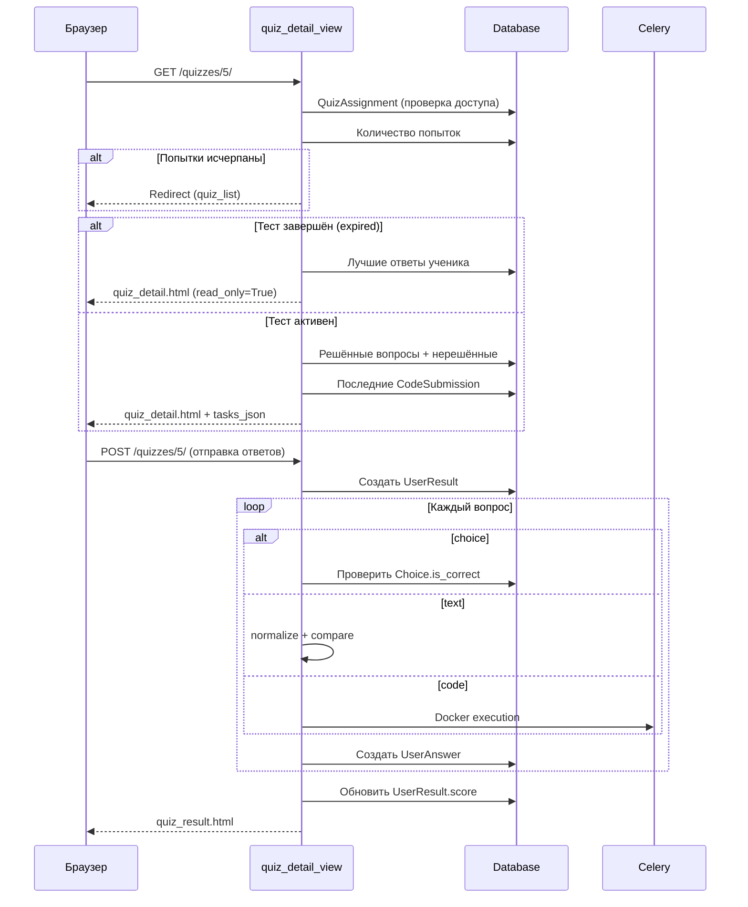
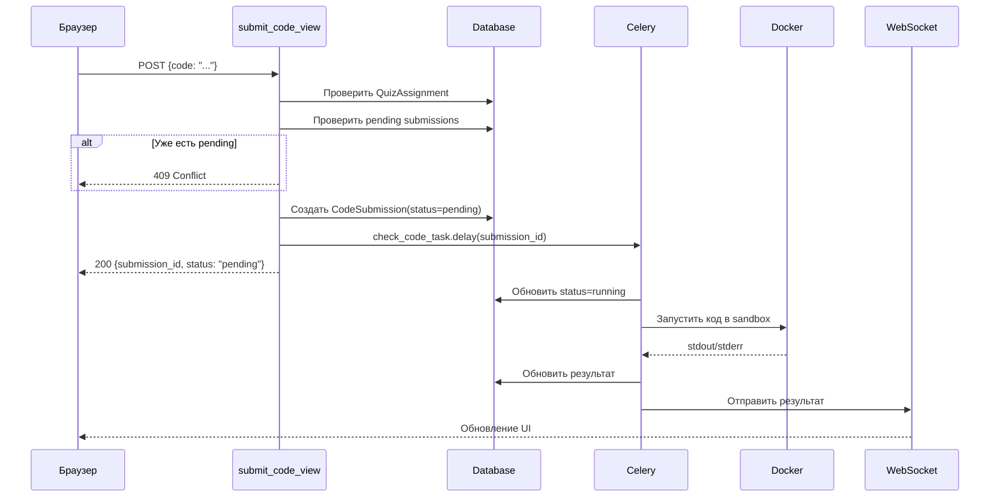

# Quizzes API

Основное приложение — **17 endpoints** для тестирования, проверки кода и системы помощи.

---

## Тесты

### GET/POST `/quizzes/<id>/` — Прохождение теста

**View:** `quiz_detail_view`
**Auth:** Требуется (проверка через `get_effective_quiz_settings`)
**Template:** `quizzes/quiz_detail.html` (GET) / `quizzes/quiz_result.html` (POST)

Центральный endpoint теста — обрабатывает показ вопросов и приём ответов.



**Контроль доступа:**

1. `get_effective_quiz_settings()` — находит `QuizAssignment` (по группе или индивидуально)
2. Проверяет `start_date` / `end_date` окно
3. Считает использованные попытки vs `max_attempts`
4. Публичные тесты (`is_public=True`) доступны без назначения

**Alpine.js интеграция:**

В шаблоне используется `tasks_data` JSON для навигации по задачам:
```json
{
  "tasks": [
    {
      "id": 1,
      "type": "choice",
      "solved": false,
      "choices": ["..."],
      "last_code": "...",
      "submission_status": "success"
    }
  ]
}
```

---

### GET `/quizzes/` — Список тестов

**View:** `quiz_list_view`
**Auth:** Требуется
**Template:** `quizzes/quiz_list.html`

Показывает доступные тесты для текущего пользователя с учётом назначений и времени.

---

### GET `/quizzes/question-file/<id>/download/` — Скачать файл вопроса

**View:** `question_file_download_view`
**Auth:** Требуется
**Response:** `FileResponse`

Скачивание файла `QuestionFile` (вложение к вопросу).

---

## Асинхронная проверка кода

### POST `/quizzes/<id>/question/<id>/submit/` — Отправить код

**View:** `submit_code_view`
**Auth:** Требуется
**Content-Type:** `application/json`

Создаёт `CodeSubmission` и ставит задачу Celery.



**Тело запроса:**
```json
{"code": "n = int(input())\nprint(n * 2)"}
```

**Ответ (200):**
```json
{"submission_id": 42, "status": "pending"}
```

**Коды ошибок:**

| Код | Причина |
|-----|---------|
| 400 | Пустой код |
| 403 | Нет назначения / время вышло |
| 409 | Уже есть pending/running посылка |
| 503 | Celery недоступен |

---

### GET `/quizzes/submission/<id>/status/` — Статус проверки

**View:** `submission_status_view`
**Auth:** Требуется

Polling endpoint для проверки статуса `CodeSubmission`. Резервный механизм на случай недоступности WebSocket.

**Ответ:**
```json
{
  "status": "success",
  "is_correct": true,
  "error_log": null,
  "cpu_time_ms": 45.2,
  "memory_kb": 8192
}
```

---

### POST `/quizzes/<id>/finish/` — Завершить тест

**View:** `finish_quiz_view`
**Auth:** Требуется
**Content-Type:** `application/json`

Финализирует тест: создаёт `UserResult`, обрабатывает все ответы.

**Тело запроса:**
```json
{
  "answers": {
    "1": "42",
    "2": "3",
    "5": "selected_choice_id"
  },
  "force": false
}
```

**Ответ (200):**
```json
{
  "success": true,
  "result_id": 15,
  "score": 8,
  "total": 10,
  "failed_questions": [
    {"id": 3, "title": "Задача 3", "correct_answer": "42"}
  ],
  "pending_checks": 0,
  "redirect_url": "/quizzes/attempt/15/"
}
```

!!! warning "Pending submissions"
    Если `force=false` и есть pending/running `CodeSubmission`, вернёт **409** с `pending_questions`. Клиент может повторить с `force=true` для принудительного завершения.

---

## Статистика (superuser only)

### GET `/quizzes/<id>/stats/` — Статистика теста

**View:** `quiz_stats_view`
**Auth:** Superuser
**Template:** `quizzes/quiz_stats.html`

Группирует учеников по `StudentGroup`, показывает best score, количество попыток, % правильных.

### GET `/quizzes/<id>/stats/<user_id>/` — Попытки ученика

**View:** `user_attempts_view`
**Auth:** Superuser

Все попытки конкретного ученика по данному тесту.

### GET `/quizzes/attempt/<id>/` — Детали попытки

**View:** `attempt_detail_view`
**Auth:** Superuser

Подробности конкретной попытки: все ответы, правильность, код.

---

## Система помощи

### GET/POST `/quizzes/<id>/question/<id>/help/` — Запрос помощи

**View:** `help_request_view`
**Auth:** Требуется

**GET** — получить/создать запрос помощи + все комментарии:
```json
{
  "help_request_id": 7,
  "status": "open",
  "comments": [
    {
      "id": 1,
      "author": "student1",
      "text": "Не понимаю условие",
      "line_number": null,
      "created_at": "2026-01-15T10:30:00"
    }
  ]
}
```

С параметром `?mark_read=1` отмечает сообщения прочитанными для ученика.

**POST** — добавить комментарий:
```json
{
  "text": "Посмотри на строку 5",
  "line_number": 5,
  "code_snapshot": "n = int(input())\nprint(n)"
}
```

!!! info "Inline-комментарии"
    Если указан `line_number`, комментарий привязывается к строке кода. `code_snapshot` фиксирует состояние кода на момент комментария.

---

### GET `/quizzes/help-requests/` — Список запросов

**View:** `help_requests_list_view`
**Auth:** Требуется

Для staff: все открытые запросы. Для учеников: только свои.

### GET `/quizzes/help-requests/unread-count/` — Непрочитанные

**View:** `help_unread_count_view`
**Auth:** Требуется
**Response:** JSON `{"count": 3}`

### GET `/quizzes/help-requests/my-notifications/` — Уведомления

**View:** `help_my_notifications_view`
**Auth:** Требуется

Список уведомлений о новых ответах в запросах помощи.

### GET `/quizzes/help-requests/<id>/` — Просмотр запроса

**View:** `help_request_review_view`
**Auth:** Требуется (staff или автор)

### POST `/quizzes/help-requests/<id>/reply/` — Ответить

**View:** `help_request_reply_view`
**Auth:** Требуется

Добавляет ответ и обновляет статус: `open` → `answered` (если ответил учитель).

### POST `/quizzes/help-requests/<id>/resolve/` — Закрыть

**View:** `help_request_resolve_view`
**Auth:** Требуется

Устанавливает `status='resolved'`.
