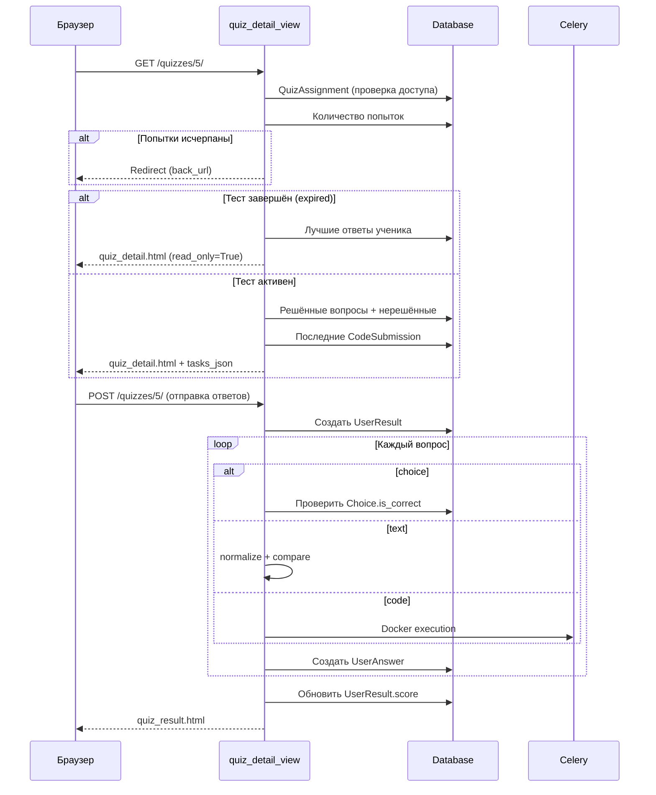
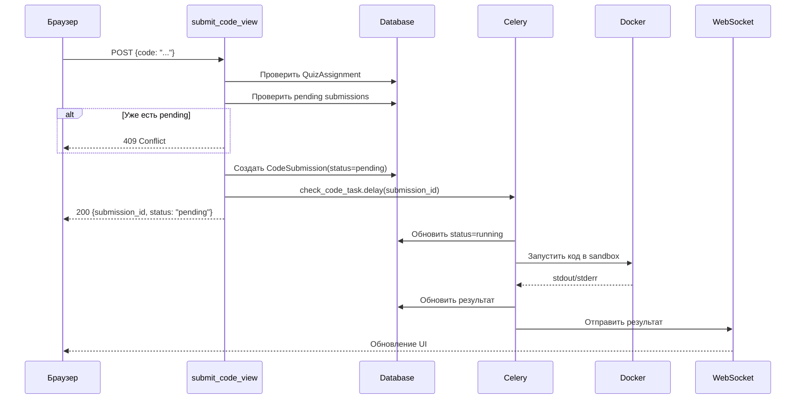

# Quizzes API

Основное приложение – **10 endpoint'ов** для тестирования, проверки кода и
подсказок. Всё смонтировано под `/quizzes/`; тренажёр ЕГЭ живёт отдельно, на
`/ege/` (см. [EGE API](ege.md)).

---

## Тесты

### GET/POST `/quizzes/<id>/` – Прохождение теста

**View:** `quiz_detail_view`
**Auth:** `@login_required` + назначение (`get_effective_quiz_settings`)
**Template:** `quizzes/quiz_detail.html` (GET) / `quizzes/quiz_result.html` (POST)

Центральный endpoint теста – обрабатывает показ вопросов и приём ответов.


```mermaid
sequenceDiagram
    participant B as Браузер
    participant V as quiz_detail_view
    participant DB as Database
    participant C as Celery

    B->>V: GET /quizzes/5/
    V->>DB: QuizAssignment (проверка доступа)
    V->>DB: Количество попыток
    alt Попытки исчерпаны
        V-->>B: Redirect (back_url)
    end
    alt Тест завершён (expired)
        V->>DB: Лучшие ответы ученика
        V-->>B: quiz_detail.html (read_only=True)
    else Тест активен
        V->>DB: Решённые вопросы + нерешённые
        V->>DB: Последние CodeSubmission
        V-->>B: quiz_detail.html + tasks_json
    end

    B->>V: POST /quizzes/5/ (отправка ответов)
    V->>DB: Создать UserResult
    loop Каждый вопрос
        alt choice
            V->>DB: Проверить Choice.is_correct
        else text
            V->>V: normalize + compare
        else code
            V->>C: Docker execution
        end
        V->>DB: Создать UserAnswer
    end
    V->>DB: Обновить UserResult.score
    V-->>B: quiz_result.html
```

**Контроль доступа:**

1. `get_effective_quiz_settings()` – находит `QuizAssignment` (по группе или индивидуально)
2. Проверяет `start_date` / `end_date` окно
3. `quiz_is_locked()` – дедлайн блока учебника закрывает и задачи блока, и
   самопроверки его уроков: решать нельзя, смотреть свои ответы можно
4. Считает использованные попытки vs `max_attempts`
5. Публичные тесты (`is_public=True`) доступны без назначения

Просроченный тест или закрытый блок отдаётся в режиме `read_only=True`:
все вопросы с лучшими ответами ученика, отправка ответов отклоняется.

**Alpine.js интеграция:**

В шаблон уходит `tasks_json` – плоский список задач для навигации:
```json
[
  {
    "id": 1,
    "type": "choice",
    "title": "Задача 1",
    "points": 1,
    "is_solved": false,
    "saved_answer": "",
    "hint_state": "taken",
    "hint_html": "...",
    "best_cpu_time_ms": 45.2,
    "best_memory_kb": 8192
  }
]
```

Поля `hint_state` / `hint_html` появляются только у открытой подсказки,
`best_*` – только у решённых задач на код. Верных ответов в этом JSON нет.

---

### GET `/quizzes/question-file/<id>/download/` – Скачать файл вопроса

**View:** `question_file_download_view`
**Auth:** Требуется
**Response:** `FileResponse`

Скачивание файла `QuestionFile` (вложение к вопросу).

---

## Подсказки и мгновенная проверка

### GET/POST `/quizzes/question/<id>/hint/` – Подсказка к задаче

**View:** `question_hint_view`
**Auth:** `@login_required` + тест назначен

GET отдаёт только состояние – пока ученик не нажал «показать», текста подсказки
в ответе нет: иначе её можно было бы вычитать прямо из сети, не делая выбора.
POST с `action=take` / `action=decline` фиксирует выбор (`HintChoice`) – учителю
в статистику.

**Логика:**

- доступность самой подсказки решает `textbook.services.hint_state` (рубильник
  разбора, близкий дедлайн);
- без назначения теста или при закрытой подсказке возвращается `{"state": null}`
  – существование подсказки не выдаётся;
- при `state == 'taken'` в ответе появляется поле `hint` с отрендеренным
  Markdown.

### POST `/quizzes/question/<id>/check/` – Вердикт по текстовому ответу

**View:** `question_check_view`
**Auth:** `@login_required` + тест назначен
**Content-Type:** `application/json` · `{"answer": "42"}`

Мгновенная обратная связь для текстовых задач (у задач на код она была и так).
Ничего не сохраняет и правильный ответ не отдаёт: балл по-прежнему выставляет
`finish_quiz_view`.

**Ответ (200):** `{"is_correct": true}`

| Код | Причина |
|-----|---------|
| 400 | Не текстовый вопрос, пустой ответ или невалидный JSON |
| 403 | Тест не назначен |

---

## Асинхронная проверка кода

### POST `/quizzes/<id>/question/<id>/submit/` – Отправить код

**View:** `submit_code_view`
**Auth:** Требуется
**Content-Type:** `application/json`

Создаёт `CodeSubmission` и ставит задачу Celery.


```mermaid
sequenceDiagram
    participant B as Браузер
    participant V as submit_code_view
    participant DB as Database
    participant C as Celery
    participant D as Docker
    participant WS as WebSocket

    B->>V: POST {code: "..."}
    V->>DB: Проверить QuizAssignment
    V->>DB: Проверить pending submissions
    alt Уже есть pending
        V-->>B: 409 Conflict
    end
    V->>DB: Создать CodeSubmission(status=pending)
    V->>C: check_code_task.delay(submission_id)
    V-->>B: 200 {submission_id, status: "pending"}

    C->>DB: Обновить status=running
    C->>D: Запустить код в sandbox
    D-->>C: stdout/stderr
    C->>DB: Обновить результат
    C->>WS: Отправить результат
    WS-->>B: Обновление UI
```

**Тело запроса:**
```json
{"code": "n = int(input())\nprint(n * 2)"}
```

**Ответ (200):**
```json
{"submission_id": 42, "status": "pending"}
```

**Коды ошибок:**

| Код | Причина |
|-----|---------|
| 400 | Пустой код, вопрос не на код, задача уже решена |
| 403 | Нет назначения / тест не начался / время вышло / дедлайн блока |
| 409 | Уже есть pending/running посылка (в ответе – её `submission_id`) |
| 503 | Celery недоступен (посылка сохраняется со `status='error'`) |

---

### GET `/quizzes/submission/<id>/status/` – Статус проверки

**View:** `submission_status_view`
**Auth:** Требуется

Polling endpoint для проверки статуса `CodeSubmission`. Резервный механизм на случай недоступности WebSocket.

**Ответ:**
```json
{
  "submission_id": 42,
  "question_id": 7,
  "status": "success",
  "is_correct": true,
  "score": null,
  "points": 1,
  "error_log": null,
  "cpu_time_ms": 45.2,
  "memory_kb": 8192,
  "created_at": "2026-03-01T10:00:00+07:00",
  "completed_at": "2026-03-01T10:00:04+07:00"
}
```

Посылка ищется по `user=request.user`: чужая по id не отдаётся.

---

### POST `/quizzes/<id>/finish/` – Завершить тест

**View:** `finish_quiz_view`
**Auth:** Требуется
**Content-Type:** `application/json`

Финализирует тест: создаёт `UserResult`, обрабатывает все ответы.

**Тело запроса:**
```json
{
  "answers": {
    "1": "42",
    "2": "3",
    "5": "selected_choice_id"
  },
  "force": false
}
```

**Ответ (200):**
```json
{
  "success": true,
  "result_id": 15,
  "score": 8,
  "total": 10,
  "failed_questions": [
    {"id": 3, "title": "Задача 3", "error_log": "expected 42, got 43"}
  ],
  "pending_checks": 0,
  "redirect_url": "/textbook/article/..."
}
```

В `failed_questions` лежат `id`, `title` и `error_log` задачи – верный ответ
здесь **не отдаётся**. `redirect_url` ведёт в учебник, если тест оттуда
(`textbook_link_for_quiz`), иначе на `/quizzes/`.

**Коды ошибок:**

| Код | Причина |
|-----|---------|
| 403 | Дедлайн блока прошёл, тест не назначен или попытки исчерпаны |
| 409 | Есть pending/running `CodeSubmission`, а `force=false` |

!!! warning "Pending submissions"
    Ответ **409** несёт `pending_questions` – список id задач, ещё висящих на
    проверке. Клиент может повторить с `force=true`: посылки были отправлены
    вовремя, и Celery досчитает их после завершения.

---

## Статистика (superuser only)

### GET `/quizzes/<id>/stats/` – Статистика теста

**View:** `quiz_stats_view`
**Auth:** Superuser
**Template:** `quizzes/quiz_stats.html`

Группирует учеников по `StudentGroup`, показывает best score, количество попыток, % правильных.

### GET `/quizzes/<id>/stats/<user_id>/` – Попытки ученика

**View:** `user_attempts_view`
**Auth:** Superuser

Все попытки конкретного ученика по данному тесту.

### GET `/quizzes/attempt/<id>/` – Детали попытки

**View:** `attempt_detail_view`
**Auth:** Superuser

Подробности конкретной попытки: все ответы, правильность, код.

