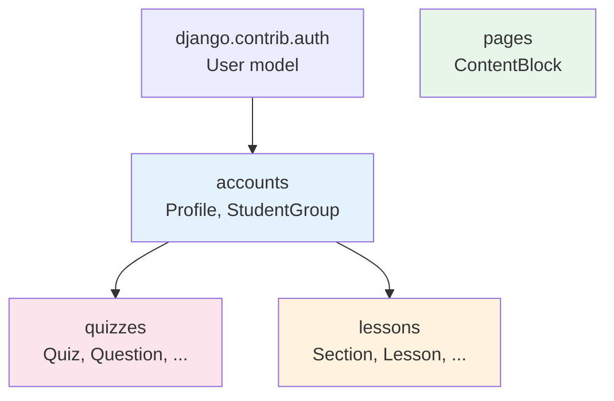
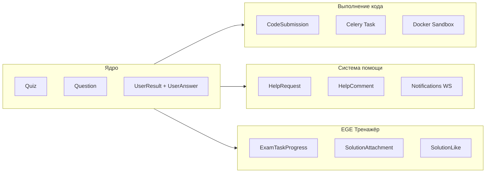

# Приложения

Проект состоит из 4 Django-приложений. Каждое имеет стандартную структуру: `models.py`, `views.py`, `urls.py`, `admin.py`, `forms.py`.

---

## Зависимости между приложениями



- **accounts** зависит от `django.contrib.auth` (User)
- **quizzes** зависит от `accounts` (Profile, StudentGroup для назначений)
- **lessons** — независимое приложение
- **pages** — независимое приложение
- **lessons** и **pages** разделяют Content Block Pattern (идентичная структура полей)

---

## accounts — Пользователи и группы

**Моделей:** 2 (`StudentGroup`, `Profile`)

| Функция | Описание |
|---------|----------|
| Профиль | Агрегация метрик из quizzes (время, баллы, EGE-прогресс) |
| Группы | Организация учеников в классы для назначений |
| EGE-доступ | Флаг `is_ege` на Profile определяет видимость EGE-тренажёра |

**Endpoints:** 1 (`/accounts/profile/`)
**Template tags:** `duration_display`, `duration_short` (форматирование timedelta)

---

## pages — Контентные страницы

**Моделей:** 1 (`ContentBlock`)

| Функция | Описание |
|---------|----------|
| Главная | Парсинг CHANGELOG.md → отображение версий |
| О проекте | Блоки контента из БД с полной стилизацией |

**Endpoints:** 2 (главная + about)

---

## lessons — Уроки

**Моделей:** 4 (`Section`, `Lesson`, `LessonAttachment`, `LessonBlock`)

| Функция | Описание |
|---------|----------|
| Разделы | Группировка уроков по темам |
| Уроки | Превью, видео, Slidev-презентация |
| Вложения | Множественные файлы к уроку (LessonAttachment) |
| Блоки | Контент урока (аналогично ContentBlock) |
| Скачивание | FileResponse с RFC 5987 + Nginx X-Accel-Redirect |
| Презентации | Slidev SPA в `media/lessons/{title}/presentation/`, PDF-экспорт |

**Endpoints:** 4 (список, детали, скачивание вложения, скачивание PDF презентации)

**Upload paths:** все файлы урока хранятся в единой иерархии `media/lessons/{safe_title}/`

---

## quizzes — Тесты и EGE

**Моделей:** 13 — центральное приложение проекта.

| Функция | Описание |
|---------|----------|
| Тесты | 3 типа вопросов: choice, text, code |
| Назначения | Группе или индивидуально с переопределением лимитов |
| Async код | Celery → Docker → WebSocket pipeline |
| Помощь | Inline-треды в CodeMirror с WS-уведомлениями |
| EGE | Exam/Practice режимы, метрики производительности |
| Лайки | Toggle-лайки на решения учеников |

**Endpoints:** 27 (17 quizzes + 10 ege)
**WebSocket:** 2 consumer'а (`QuizConsumer`, `NotificationConsumer`)
**JS:** `quiz-async.js`, `help-requests.js`, `notifications.js`, `ege-timer.js`

### Подсистемы quizzes



---

## Файловая структура приложения

```
<app>/
├── __init__.py
├── models.py          # Модели данных
├── views.py           # View-функции / CBV
├── urls.py            # URL-маршруты
├── admin.py           # Django Admin конфигурация
├── forms.py           # Django Forms (если есть)
├── apps.py            # AppConfig
│
│   # Только в quizzes:
├── views_ege.py       # EGE-specific views (не отдельный файл, через urls_ege)
├── urls_ege.py        # EGE URL-маршруты
├── consumers.py       # WebSocket consumers
├── tasks.py           # Celery tasks
├── utils.py           # Docker sandbox
├── routing.py         # WS URL routing
└── management/
    └── commands/
        └── load_quiz.py  # Import quiz from JSON
```
