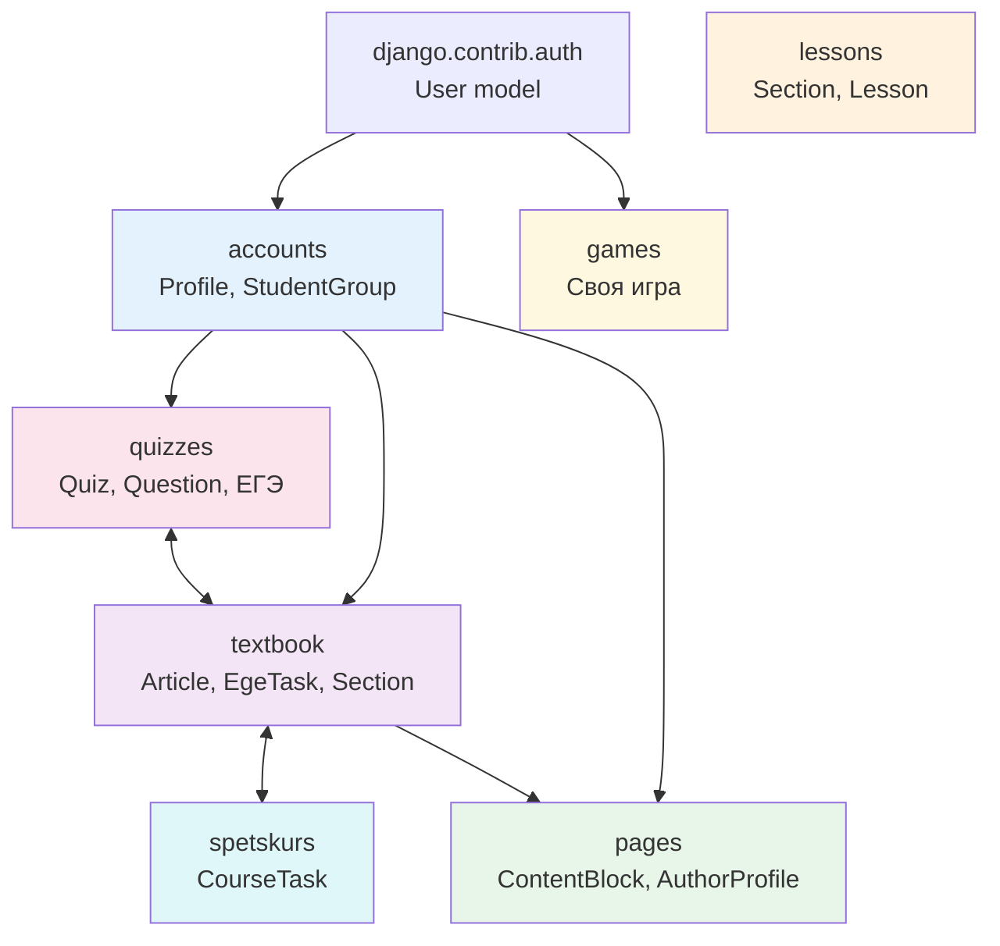
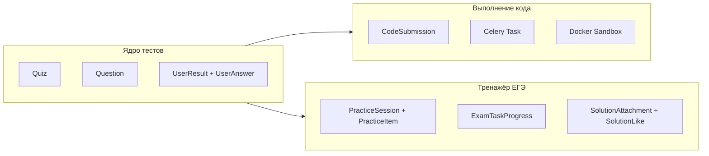

# Приложения

Проект состоит из 7 Django-приложений. Каждое имеет стандартную структуру: `models.py`, `views.py`, `urls.py`, `admin.py`, `forms.py`.

| Приложение | Моделей | Назначение |
|-----------|---------|-----------|
| `accounts` | 2 | Пользователи, классы, выпускники |
| `pages` | 5 | Главная, «Обо мне», changelog |
| `lessons` | 4 | Старые уроки с файлами и презентациями |
| `quizzes` | 16 | Тесты и тренажёр ЕГЭ |
| `textbook` | 7 | Учебник, теория ЕГЭ, спецкурс |
| `spetskurs` | 1 | Задачи курса численного моделирования |
| `games` | 6 | «Своя игра» |

---

## Зависимости между приложениями


```mermaid
graph TD
    AUTH[django.contrib.auth\nUser model]
    ACC[accounts\nProfile, StudentGroup]
    QUI[quizzes\nQuiz, Question, ЕГЭ]
    TXT[textbook\nArticle, EgeTask, Section]
    SPK[spetskurs\nCourseTask]
    PAG[pages\nContentBlock, AuthorProfile]
    LES[lessons\nSection, Lesson]
    GAM[games\nСвоя игра]

    AUTH --> ACC
    ACC --> QUI
    ACC --> TXT
    ACC --> PAG
    QUI <--> TXT
    TXT <--> SPK
    TXT --> PAG
    AUTH --> GAM

    style PAG fill:#e8f5e9
    style ACC fill:#e3f2fd
    style LES fill:#fff3e0
    style QUI fill:#fce4ec
    style TXT fill:#f3e5f5
    style SPK fill:#e0f7fa
    style GAM fill:#fff8e1
```

- **accounts** зависит от `django.contrib.auth` (User)
- **quizzes** зависит от `accounts` (`StudentGroup` в назначениях) и от `textbook`: задачи ЕГЭ нельзя отобрать, не зная `EgeTask.exam_size` и `exam_unlock_threshold`, а статьи теории ЕГЭ лежат на `Article(track='ege')`
- **textbook** зависит от `quizzes` (`Section.practicum_quiz`, `ArticleQuiz.quiz`) и от `accounts` (классы в отчёте учителя); связь с quizzes двусторонняя, поэтому импорты внутри функций, а не на уровне модуля
- **textbook ↔ spetskurs**: `Article.course_task` ссылается на `spetskurs.CourseTask` строкой (иначе приложения импортировали бы друг друга по кругу), а `spetskurs.views` читает `textbook.Article` – одна модель статьи на весь сайт
- **pages** зависит от `accounts` и `textbook.services` (карта курса на главной)
- **lessons** – независимое приложение, живёт отдельно от учебника
- **games** зависит только от `django.contrib.auth`
- **pages** и **lessons** разделяют Content Block Pattern (идентичная структура полей); `textbook.ArticleBlock` – блок другого рода (см. `architecture/overview.md`)

---

## accounts – Пользователи и группы

**Моделей:** 2 (`StudentGroup`, `Profile`)

| Функция | Описание |
|---------|----------|
| Профиль | `ProfileView` – свой профиль и чужой для учителя, один и тот же шаблон; блок учебника собирает `textbook.services.profile_textbook_stats` |
| Группы | `StudentGroup` – класс ученика; заполненный `graduation_year` делает класс выпускным и уводит его из активных списков |
| Выпускники | `/alumni/` (`AlumniView`, только суперпользователь): общее фото класса, слово учителя, карточки выпускников |
| ЕГЭ | Флаг `is_ege` помечает ученика, сдающего ЕГЭ; им подписан блок ЕГЭ в профиле и колонка в отчёте по тесту. Доступ к тренажёру он не ограничивает – хаб `/ege/` открыт всем |

Аватар и карточку выпускника ученик правит сам, чужой профиль учителю доступен только на чтение.

**Endpoints:** `profile/`, `profile/<int:user_id>/` (плюс стандартные `django.contrib.auth.urls` под тем же префиксом `/accounts/`); `/alumni/` подключён в `config/urls.py`

**Template tags:** `duration_display`, `surname_first`, `student_name`, `bio_paragraphs` – `accounts/templatetags/profile_tags.py`

---

## pages – Контентные страницы

**Моделей:** 5 (`ContentBlock`, `AuthorProfile`, `AuthorPhoto`, `AuthorVideo`, `AuthorEvent`)

| Функция | Описание |
|---------|----------|
| Главная | Карта курса из `textbook.services.course_map` плюс блоки `ContentBlock` с полной стилизацией |
| Обо мне | `AuthorProfile` с фотографиями, видео и событиями (`AuthorPhoto` / `AuthorVideo` / `AuthorEvent`) |
| Changelog | `parse_changelog` разбирает `CHANGELOG.md` в список версий |

**Endpoints:** 3 (`/`, `/about/`, `/pages/changelog/`) – первые два подключены в `config/urls.py`

---

## lessons – Уроки

**Моделей:** 4 (`Section`, `Lesson`, `LessonAttachment`, `LessonBlock`)

| Функция | Описание |
|---------|----------|
| Разделы | Группировка уроков по темам |
| Уроки | Превью, видео, Slidev-презентация |
| Вложения | Множественные файлы к уроку (LessonAttachment) |
| Блоки | Контент урока с настройками шрифтов, цветов и кропа (аналогично ContentBlock) |
| Скачивание | FileResponse с RFC 5987 + Nginx X-Accel-Redirect |
| Презентации | Slidev SPA в `media/lessons/{title}/presentation/`, PDF-экспорт |

**Endpoints:** 4 (список, детали, скачивание вложения, скачивание PDF презентации)

**Upload paths:** все файлы урока хранятся в единой иерархии `media/lessons/{safe_title}/`

---

## quizzes – Тесты и тренажёр ЕГЭ

**Моделей:** 16 – центральное приложение проекта. Внутри него живут две подсистемы: обычные тесты и тренажёр ЕГЭ.

| Функция | Описание |
|---------|----------|
| Тесты | 3 типа вопросов: choice, text, code |
| Назначения | Группе или индивидуально с переопределением лимитов |
| Async код | Celery → Docker → WebSocket pipeline |
| Тренажёр ЕГЭ | Сессии тренировки и экзамена, прогноз балла, статистика класса |
| Подсказки | Подсказка открывается после трёх неудач, перед дедлайном блока или рубильником учителя; выбор ученика видит учитель |
| Лайки | Toggle-лайки на решения учеников |

**Модели**

| Группа | Модели |
|--------|--------|
| Ядро тестов | `Quiz`, `Question`, `Choice`, `TestCase`, `QuizAssignment`, `UserResult`, `UserAnswer` |
| Материалы вопроса | `QuestionImage`, `QuestionFile` |
| Выполнение кода | `CodeSubmission` |
| Решения учеников | `SolutionAttachment`, `SolutionLike` |
| Подсказки | `HintChoice` |
| Варианты ЕГЭ | `ExamTaskProgress` |
| Тренажёр | `PracticeSession`, `PracticeItem` |

`Quiz.quiz_type` разделяет три сущности: `exam` – собранный вариант, `bank` – тематическая подборка задач ЕГЭ, `standard` – обычный тест. Тренировка берёт задачи только из банков (`PRACTICE_QUIZ_TYPES`), варианты живут своей выдачей.

**Модули тренажёра ЕГЭ**

| Модуль | Что делает |
|--------|-----------|
| `urls_ege.py` | Маршруты на префиксе `/ege/`: хаб, карточка задания, банк задач, сессии практики, варианты, отчёты учителя |
| `views_practice.py` | Вью тренажёра: карточка задания, банк, архив решённых, сессии практики и их результат |
| `ege_practice.py` | Отбор задач и размер сессии: `build_session`, `expand_groups`, `exam_access`, `effective_difficulty_expr` |
| `ege_stats.py` | Вся аналитика: статистика по режимам, точность по заданиям, `predicted_score`, динамика по неделям, таблица класса |
| `ege_scoring.py` | Частичный балл за задания 26 и 27: `grade`, `outputs_match` |
| `ege_constants.py` | Перевод первичных баллов, норматив времени, баллы за задание, размеры сессий, цвета |
| `tasks.py` | Celery-задача `check_code_task`: прогон решения в Docker и уведомление по WebSocket |
| `consumers.py`, `routing.py` | `QuizConsumer` и канал `/ws/quiz/<quiz_id>/` |
| `utils.py` | Docker-песочница (`run_code_in_docker`) и `js_json` для безопасной вставки данных в `<script>` |

**Management commands:** `load_quiz`, `load_ege`, `ege_pools`, `retag_ege`, `mark_exam_pool`, `recalc_ege_difficulty`

**Endpoints:** 10 (`quizzes/urls.py`) + 25 (`quizzes/urls_ege.py`)
**WebSocket:** 1 consumer (`QuizConsumer`)
**JS:** `quiz-async.js`, `ege-timer.js`

### Подсистемы quizzes


```mermaid
graph LR
    subgraph Core["Ядро тестов"]
        QUIZ[Quiz]
        QUESTION[Question]
        RESULT[UserResult + UserAnswer]
    end

    subgraph CodeExec["Выполнение кода"]
        SUBMISSION[CodeSubmission]
        TASK[Celery Task]
        DOCKER[Docker Sandbox]
    end

    subgraph EGE["Тренажёр ЕГЭ"]
        SESSION[PracticeSession + PracticeItem]
        PROGRESS[ExamTaskProgress]
        SOLUTION[SolutionAttachment + SolutionLike]
    end

    Core --> CodeExec
    Core --> EGE
```

---

## textbook – Учебник, теория ЕГЭ и спецкурс

**Моделей:** 7. Одна модель статьи обслуживает три вкладки, различаясь полем `track`.

| Модель | Описание |
|--------|----------|
| `Section` | Блок курса: дедлайн, практикум (`quizzes.Quiz`), пороги оценок, рубильник подсказок |
| `SectionExtension` | Личное продление дедлайна блока одному ученику |
| `EgeTask` | Справочник заданий ЕГЭ 1–27: `exam_size`, `exam_unlock_threshold`, `classroom_enabled` |
| `Article` | Статья; якоря трека: `section` (материал), `ege_task` (ЕГЭ), `course_task` (`spetskurs.CourseTask`) |
| `ArticleBlock` | Блок статьи: text / code / image / video / formula / widget, плюс ось `visibility` для разбора |
| `ArticleQuiz` | Привязка самопроверки (`quizzes.Quiz`) к статье |
| `ArticleProgress` | Прогресс чтения: время, статус, даты |

**Ключевые модули**

| Модуль | Что делает |
|--------|-----------|
| `services.py` | Правила учебника: дедлайны и продления, видимость статей и блоков-разборов, состояние подсказок, карта курса, статистика профиля |
| `views.py` | Главная учебника, статья, отметки о чтении, переключатель видимости разбора, отчёты учителя по блоку |
| `templatetags/textbook_tags.py` | `markdownify`, `plural` (три формы склонения) |
| `management/commands/` | `seed_textbook_structure`, `seed_textbook_block1–13`, `seed_ege_tasks`, `seed_ege_theory_<N>`, `seed_spetskurs_*`, `publish_spetskurs`, `check_articles`, `fix_dashes` |

**Endpoints:** 6 (главная, статья, отметка о прочтении, учёт времени, переключатель видимости, отчёты по блоку)

**JS:** `textbook-widgets.js` (реестр виджетов), `textbook-progress.js`, `article-present.js` (показ урока с проектора)

---

## spetskurs – Курс численного моделирования

**Моделей:** 1 (`CourseTask`)

| Функция | Описание |
|---------|----------|
| Задача курса | `CourseTask` связывает физику, исходник `main.cpp`, WASM-симуляцию и задания |
| Симуляция | `html_path` указывает на сборку в `static/spetskurs/wasm/`, кадр встраивается iframe'ом |
| Теория | Живёт на моделях учебника: `Article(track='spetskurs')`, где заполненный `course_task` – разбор задачи, пустой – «Основы C++» |

`TheoryPage` / `TheoryBlock` удалены: это была урезанная копия `textbook.Article` / `ArticleBlock`, из которой учебник когда-то и вырос. Модель `Simulation` переименована в `CourseTask`, потому что теперь означает не только симуляцию.

**Endpoints:** 4 (лендинг, список задач, задача, «Основы C++»)

**Выкладка:** `.wasm` и архив исходников библиотеки в git не коммитятся – см. `docs/spetskurs-deploy.md`

---

## games – «Своя игра»

**Моделей:** 6 (`Category`, `Question`, `QuestionMedia`, `GamePack`, `GamePackCategory`, `GameSession`)

| Модель | Описание |
|--------|----------|
| `Category` | Тема с вопросами; статус `pending` / `approved` / `rejected` – модерация учителем |
| `Question` | Вопрос темы: текст, ответ, стоимость, порядок. Это своя модель, с `quizzes.Question` она не связана |
| `QuestionMedia` | Медиа вопроса или ответа (`is_answer`) |
| `GamePack` | Игровой пакет из тем, публичный или личный |
| `GamePackCategory` | Порядок тем внутри пакета (through-модель) |
| `GameSession` | Партия: состояние доски и игроки в JSON |

**Endpoints:** 16 (лендинг, список пакетов, пакет, игра, создание, мои темы и пакеты, модерация, правки, загрузка медиа, обновление сессии)

**JS:** `svoya-igra-board.js`

---

## Файловая структура приложения

```
<app>/
├── __init__.py
├── models.py          # Модели данных
├── views.py           # View-функции / CBV
├── urls.py            # URL-маршруты
├── admin.py           # Django Admin конфигурация
├── forms.py           # Django Forms (если есть)
├── apps.py            # AppConfig
│
│   # Только в quizzes:
├── urls_ege.py        # URL-маршруты тренажёра ЕГЭ (/ege/)
├── views_practice.py  # Вью тренажёра: карточка задания, банк, сессии
├── ege_practice.py    # Отбор задач и размер сессии
├── ege_stats.py       # Аналитика ЕГЭ
├── ege_scoring.py     # Частичный балл за задания 26 и 27
├── ege_constants.py   # Константы ЕГЭ и производные от них функции
├── consumers.py       # WebSocket consumers
├── routing.py         # WS URL routing
├── tasks.py           # Celery tasks
├── utils.py           # Docker sandbox, js_json
└── management/
    └── commands/      # load_quiz, load_ege, ege_pools, retag_ege, ...
```
