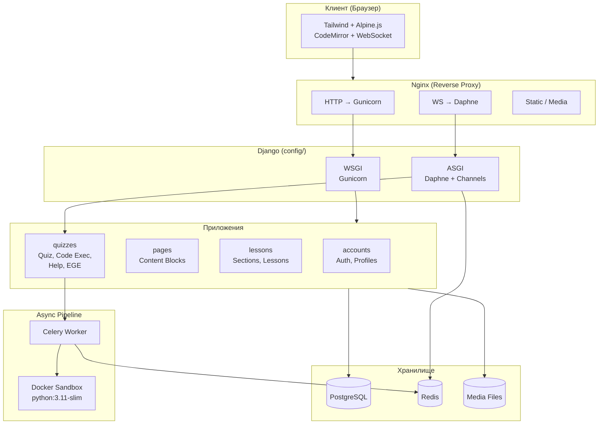

# Архитектура — Обзор

## Общая схема



---

## Слои приложения

| Слой | Технология | Файлы |
|------|-----------|-------|
| **Presentation** | Django Templates + Alpine.js + Tailwind | `templates/`, `static/` |
| **Routing** | Django URLs + Channels routing | `config/urls.py`, `*/urls.py`, `quizzes/routing.py` |
| **Business Logic** | Django Views (FBV/CBV) | `*/views.py` |
| **Data Access** | Django ORM + Models | `*/models.py` |
| **Async Tasks** | Celery + Docker | `quizzes/tasks.py`, `quizzes/utils.py` |
| **Real-time** | Django Channels (WebSocket) | `quizzes/consumers.py` |
| **Storage** | PostgreSQL + Redis + Filesystem | `.env`, `media/` |

---

## Потоки данных

### Синхронный (HTTP)

```
Браузер → Nginx → Gunicorn → Django View → ORM → PostgreSQL
                                         → Template → HTML → Браузер
```

### Асинхронный (Code Execution)

```
Браузер → HTTP POST → Django View → CodeSubmission (DB)
                                  → Celery task.delay()
       Celery Worker → Docker container → stdout/stderr
                     → Update DB → channel_layer.group_send()
       Daphne → QuizConsumer → WebSocket → Браузер (UI update)
```

### Real-time (Notifications)

```
Ученик POST → Django View → HelpComment (DB)
                          → channel_layer → NotificationConsumer
                          → WebSocket → Учитель (badge update)
```

---

## Ключевые паттерны

### Content Block Pattern

`ContentBlock` (pages) и `LessonBlock` (lessons) используют одинаковую структуру — самодостаточная модель с полным набором стилизации (шрифты, цвета, позиционирование, кроп изображений). Позволяет создавать страницы без написания HTML.

### Assignment Cascade

Доступ к тесту определяется каскадом: индивидуальное назначение → групповое назначение → публичный доступ → superuser. Каждый уровень может переопределять `start_date`, `end_date`, `max_attempts`.

### Graceful Degradation

WebSocket-каналы имеют HTTP-polling fallback:

- `QuizCodeChecker`: polling каждые 2 сек при потере WS
- `NotificationManager`: polling каждые 30 сек при потере WS

### Docker Sandbox

Пользовательский код выполняется в изолированном Docker-контейнере без сети, с лимитами CPU/RAM. Метрики производительности собираются через `resource.getrusage()`.
