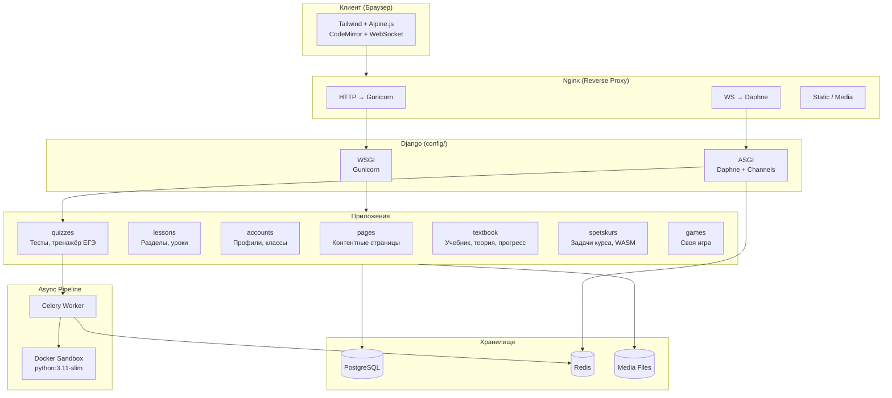

# Архитектура – Обзор

## Общая схема


```mermaid
graph TB
    subgraph Client["Клиент (Браузер)"]
        BROWSER[Tailwind + Alpine.js\nCodeMirror + WebSocket]
    end

    subgraph Nginx["Nginx (Reverse Proxy)"]
        HTTP_PROXY[HTTP → Gunicorn]
        WS_PROXY[WS → Daphne]
        STATIC_SERVE[Static / Media]
    end

    subgraph Django["Django (config/)"]
        WSGI[WSGI\nGunicorn]
        ASGI[ASGI\nDaphne + Channels]
    end

    subgraph Apps["Приложения"]
        PAG[pages\nКонтентные страницы]
        LES[lessons\nРазделы, уроки]
        ACC[accounts\nПрофили, классы]
        QUI[quizzes\nТесты, тренажёр ЕГЭ]
        TXT[textbook\nУчебник, теория, прогресс]
        SPK[spetskurs\nЗадачи курса, WASM]
        GAM[games\nСвоя игра]
    end

    subgraph Async["Async Pipeline"]
        CELERY[Celery Worker]
        DOCKER[Docker Sandbox\npython:3.11-slim]
    end

    subgraph Storage["Хранилище"]
        PG[(PostgreSQL)]
        REDIS[(Redis)]
        MEDIA[(Media Files)]
    end

    BROWSER --> Nginx
    HTTP_PROXY --> WSGI
    WS_PROXY --> ASGI

    WSGI --> Apps
    ASGI --> QUI

    Apps --> PG
    Apps --> MEDIA
    QUI --> CELERY
    CELERY --> DOCKER
    CELERY --> REDIS
    ASGI --> REDIS
```

Все семь приложений перечислены в `INSTALLED_APPS` (`config/settings.py`): `pages`, `lessons`, `accounts`, `quizzes`, `spetskurs`, `games`, `textbook` – в этом порядке они и подключены. Маршруты верхнего уровня собирает `config/urls.py`; у каждого приложения свой `urls.py`, а у тренажёра ЕГЭ – отдельный `quizzes/urls_ege.py` на префиксе `/ege/`.

---

## Слои приложения

| Слой | Технология | Файлы |
|------|-----------|-------|
| **Presentation** | Django Templates + Alpine.js + Tailwind | `templates/`, `static/` |
| **Routing** | Django URLs + Channels routing | `config/urls.py`, `*/urls.py`, `quizzes/urls_ege.py`, `quizzes/routing.py` |
| **Business Logic** | Django Views (FBV/CBV) + сервисы | `*/views.py`, `quizzes/views_practice.py`, `textbook/services.py` |
| **Domain Logic** | правила без HTTP, вызываются вью и командами | `quizzes/ege_practice.py`, `ege_stats.py`, `ege_scoring.py`, `ege_constants.py` |
| **Data Access** | Django ORM + Models | `*/models.py` |
| **Async Tasks** | Celery + Docker | `quizzes/tasks.py`, `quizzes/utils.py` |
| **Real-time** | Django Channels (WebSocket) | `quizzes/consumers.py`, `quizzes/routing.py` |
| **Storage** | PostgreSQL + Redis + Filesystem | `.env`, `media/` |

---

## Потоки данных

### Синхронный (HTTP)

```
Браузер → Nginx → Gunicorn → Django View → ORM → PostgreSQL
                                         → Template → HTML → Браузер
```

Этим путём идёт и тренажёр ЕГЭ: отбор задач считает `ege_practice`, вью пишут `PracticeSession`/`PracticeItem`, а аналитику для страниц собирает `ege_stats`.

### Асинхронный (Code Execution)

```
Браузер → HTTP POST → Django View → CodeSubmission (DB)
                                  → Celery task.delay()
       Celery Worker → Docker container → stdout/stderr
                     → Update DB → channel_layer.group_send()
       Daphne → QuizConsumer → WebSocket → Браузер (UI update)
```

---

## Ключевые паттерны

### Content Block Pattern

`ContentBlock` (pages) и `LessonBlock` (lessons) используют одинаковую структуру – самодостаточная модель с полным набором стилизации (шрифты, цвета, позиционирование, кроп изображений). Позволяет создавать страницы без написания HTML.

Рядом живёт `ArticleBlock` (textbook) – блок другого рода: типизированный (`text`, `code`, `image`, `video`, `formula`, `widget`) и без стилевых полей. Типографику статьи задаёт вёрстка, а не поля блока, поэтому одна и та же модель обслуживает уроки, теорию ЕГЭ и спецкурс, а собирается из seed-команд. Стилевые поля остались только у `LessonBlock`, где редактор собирает урок из блоков вручную.

### Assignment Cascade

Доступ к тесту определяется каскадом: индивидуальное назначение → групповое назначение → публичный доступ → superuser. Каждый уровень может переопределять `start_date`, `end_date`, `max_attempts`.

### Graceful Degradation

WebSocket-каналы имеют HTTP-polling fallback:

- `QuizCodeChecker`: polling каждые 2 сек при потере WS

### Docker Sandbox

Пользовательский код выполняется в изолированном Docker-контейнере без сети, с лимитами CPU/RAM. Контейнер работает от `nobody`, сброшены все capabilities (`cap_drop: ALL`) и запрещён подъём прав (`no-new-privileges`), `pids_limit` закрывает форк-бомбу. Метрики производительности собираются через `resource.getrusage()`.
