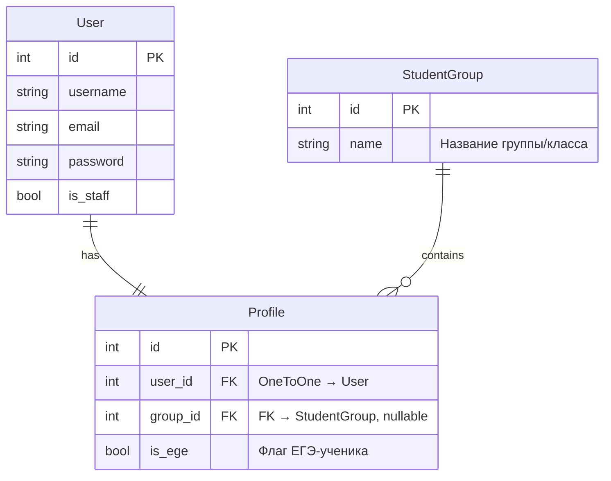
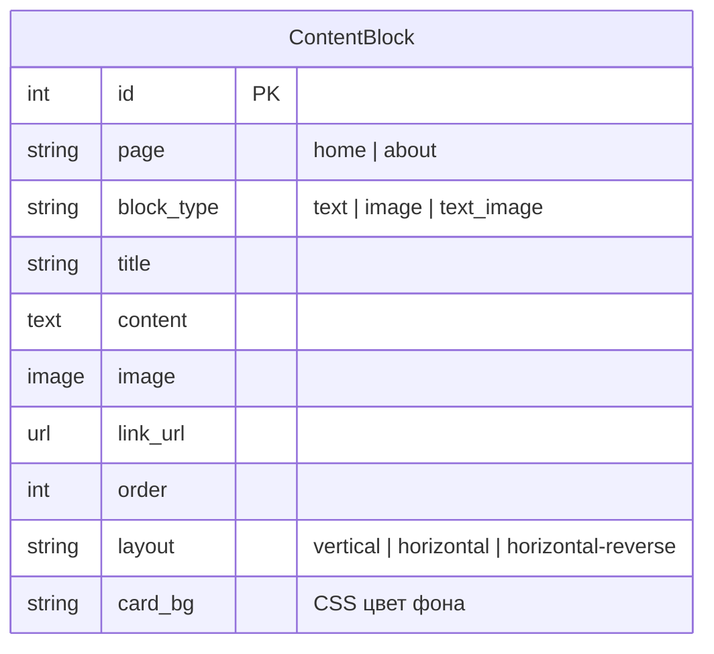
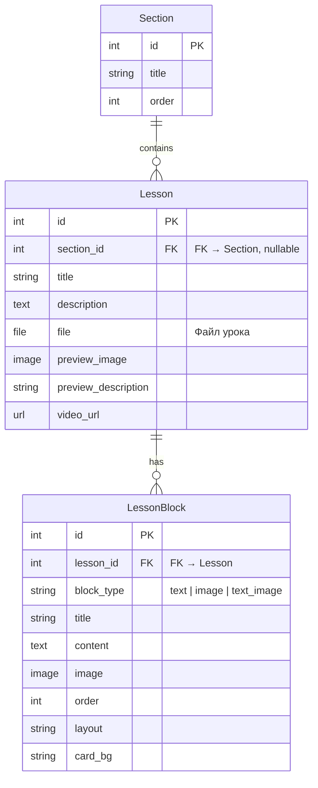
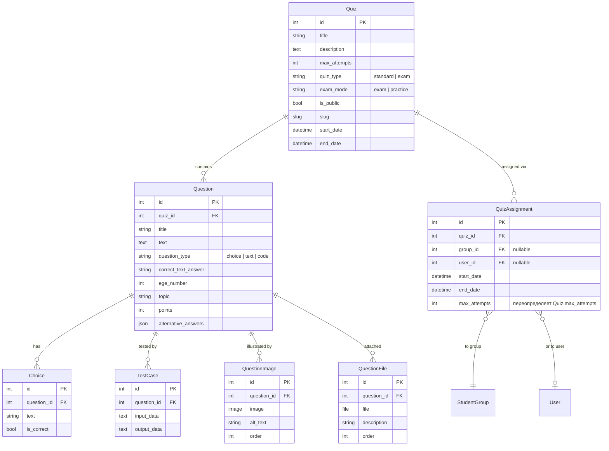
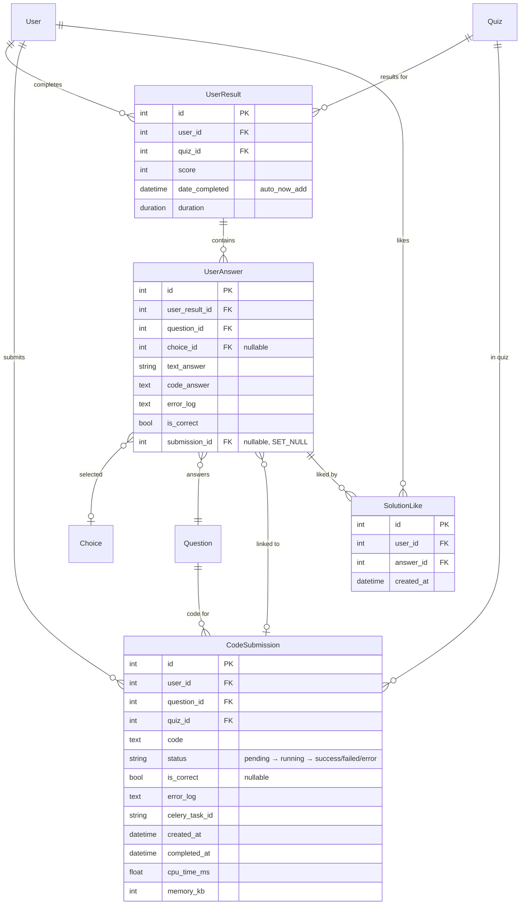
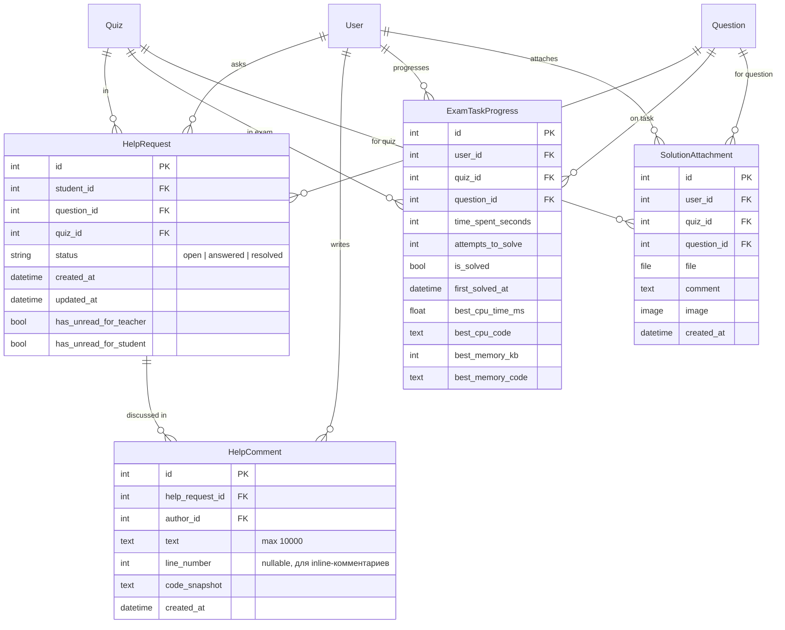

# ER-диаграммы

Модели проекта разбиты на 4 домена. Всего **19 моделей** + стандартная модель `User` из Django.

---

## Accounts — Пользователи и группы

!!! info "Связь User ↔ Profile"
    `Profile` расширяет стандартного `User` через `OneToOneField`. Создаётся автоматически при регистрации. Поле `is_ege` определяет доступ к EGE-тренажёру.

---

## Pages — Контент главной и about-страницы

!!! note "Content Block Pattern"
    `ContentBlock` — самодостаточная модель без связей. Каждый блок содержит полный набор параметров стилизации: шрифты, цвета, позиционирование, кроп изображений. Аналогичная структура используется в `LessonBlock`.

---

## Lessons — Разделы и уроки

---

## Quizzes — Тесты, вопросы и результаты

Самый крупный домен — **13 моделей**. Разделён на 3 подгруппы для читабельности.

### Структура теста

### Результаты и выполнение кода

### Помощь и EGE-прогресс

---

## Сводная таблица связей

| Связь | Тип | ON_DELETE | Описание |
|-------|-----|----------|----------|
| User → Profile | OneToOne | CASCADE | Расширение пользователя |
| Profile → StudentGroup | FK | SET_NULL | Группа ученика |
| Lesson → Section | FK | SET_NULL | Раздел урока |
| LessonBlock → Lesson | FK | CASCADE | Блоки контента урока |
| Question → Quiz | FK | CASCADE | Вопросы теста |
| QuizAssignment → Quiz | FK | CASCADE | Назначение теста |
| QuizAssignment → StudentGroup | FK | SET_NULL | Назначение группе |
| QuizAssignment → User | FK | SET_NULL | Индивидуальное назначение |
| Choice → Question | FK | CASCADE | Варианты ответа |
| TestCase → Question | FK | CASCADE | Тест-кейсы для кода |
| UserResult → User, Quiz | FK | CASCADE | Результат прохождения |
| UserAnswer → UserResult | FK | CASCADE | Ответ на вопрос |
| UserAnswer → CodeSubmission | FK | SET_NULL | Связь с посылкой кода |
| CodeSubmission → User, Question, Quiz | FK | CASCADE | Посылка кода |
| HelpRequest → User, Question, Quiz | FK | CASCADE | Запрос помощи |
| HelpComment → HelpRequest, User | FK | CASCADE | Комментарий |
| ExamTaskProgress → User, Quiz, Question | FK | CASCADE | Прогресс EGE |
| SolutionAttachment → User, Quiz, Question | FK | CASCADE | Прикрепление решения |
| SolutionLike → User, UserAnswer | FK | CASCADE | Лайк решения |

!!! warning "Уникальные ограничения"
    - `HelpRequest`: `unique_together = [student, question]` — один запрос на вопрос
    - `ExamTaskProgress`: `unique_together = [user, quiz, question]` — один прогресс на задачу
    - `SolutionAttachment`: `unique_together = [user, quiz, question]` — одно прикрепление на задачу
    - `SolutionLike`: `UniqueConstraint(user, answer)` — один лайк на ответ
