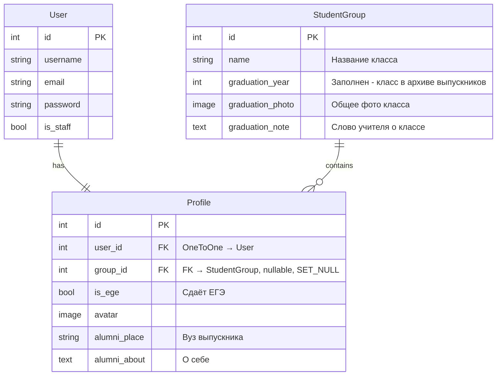
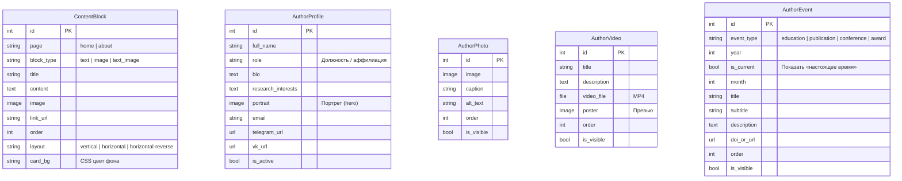
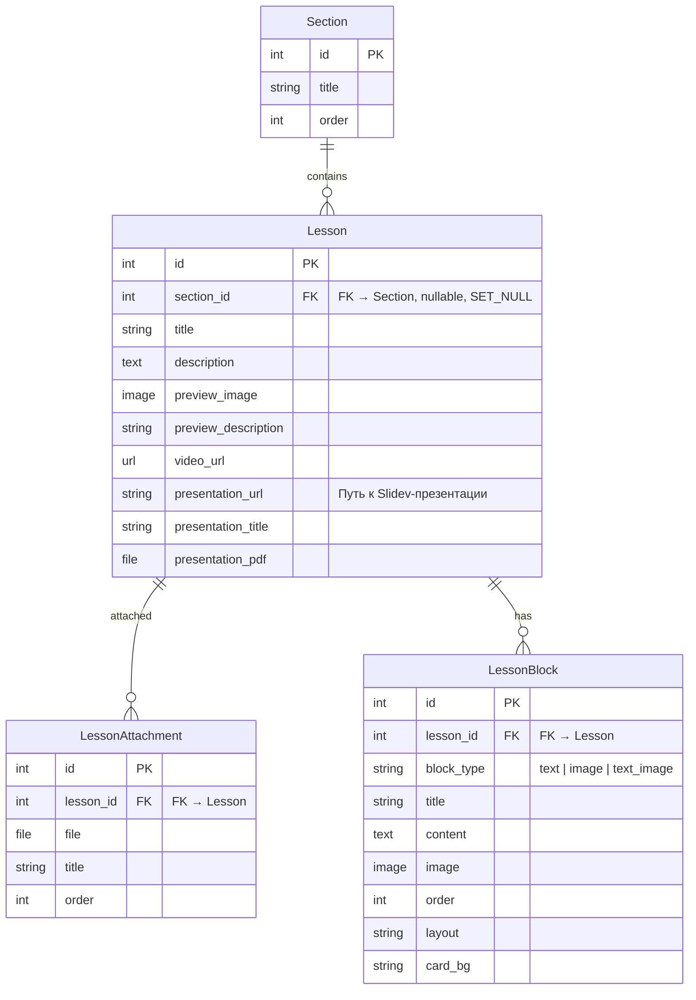
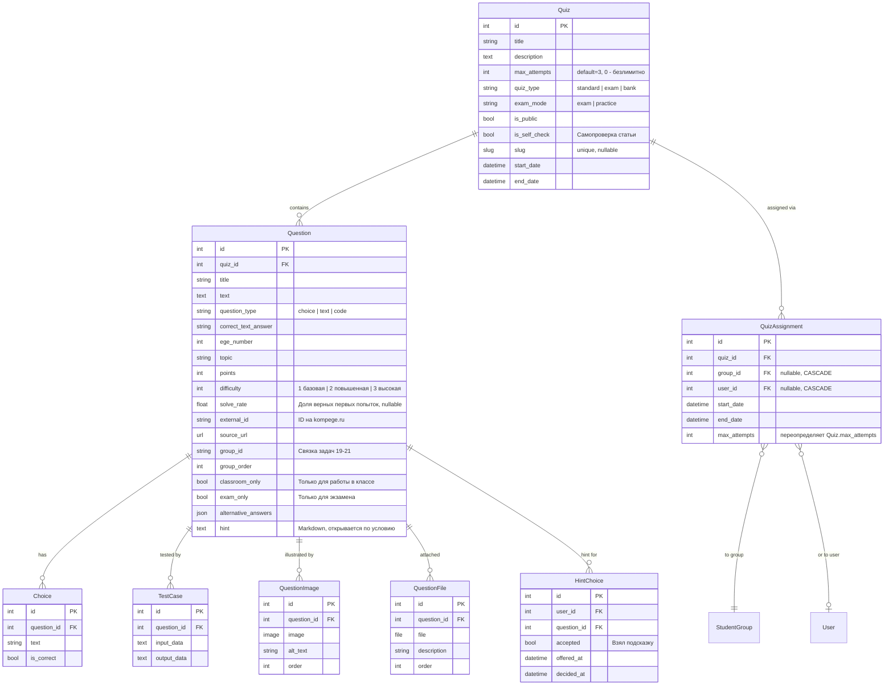
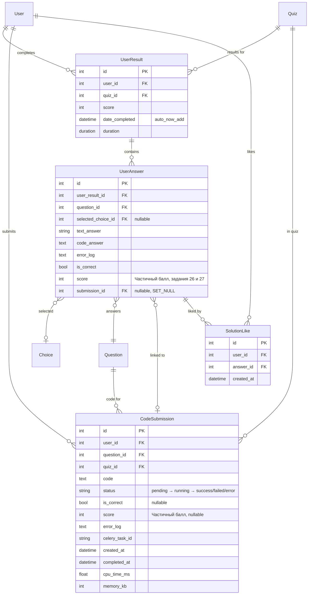
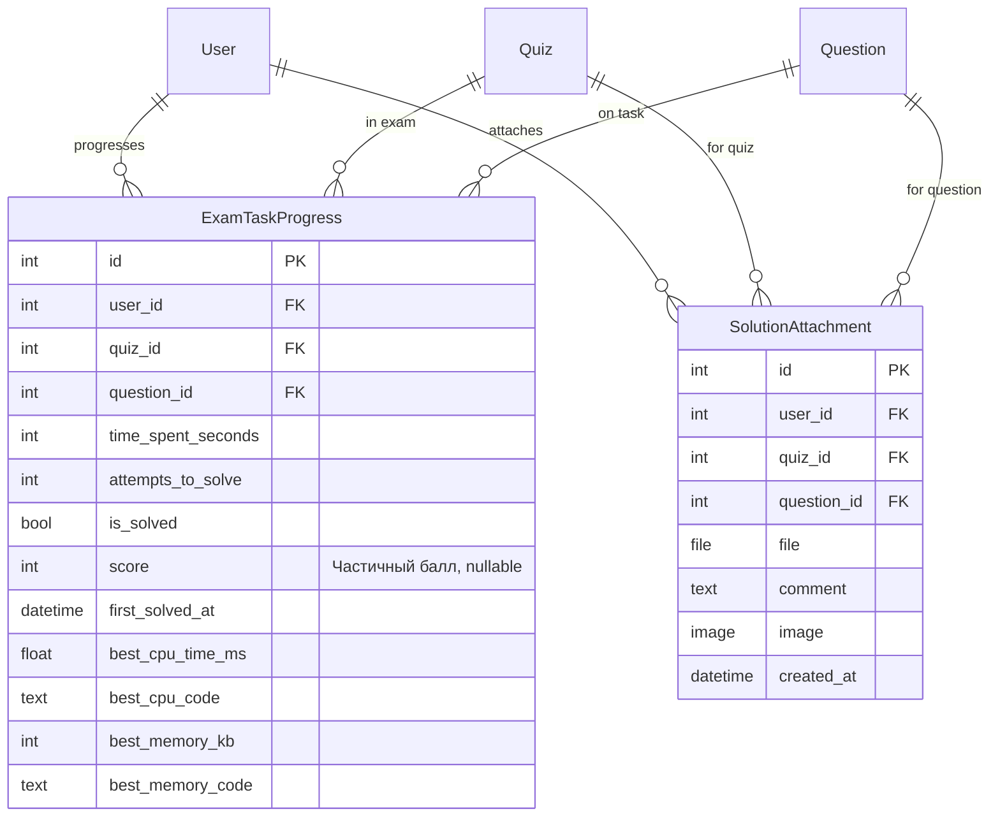
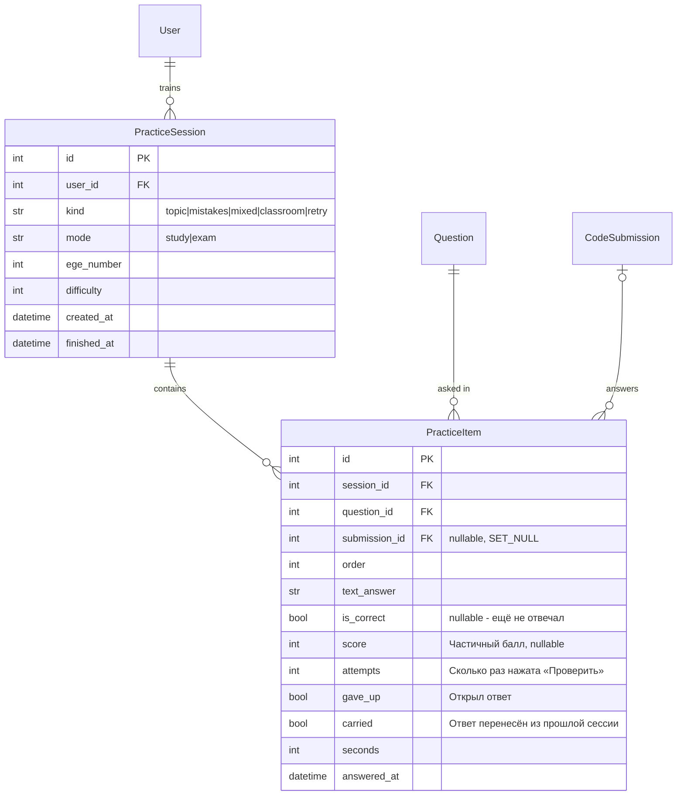
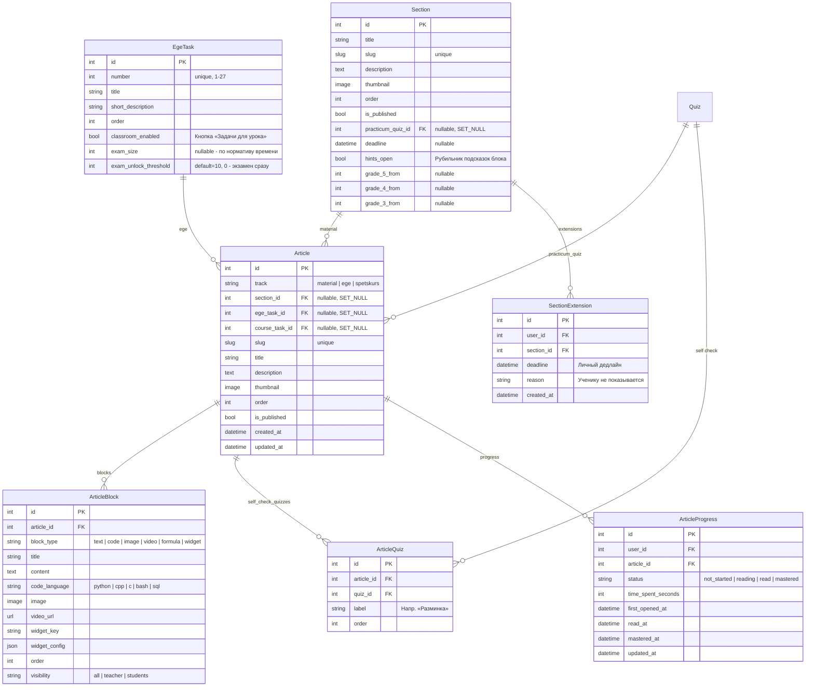
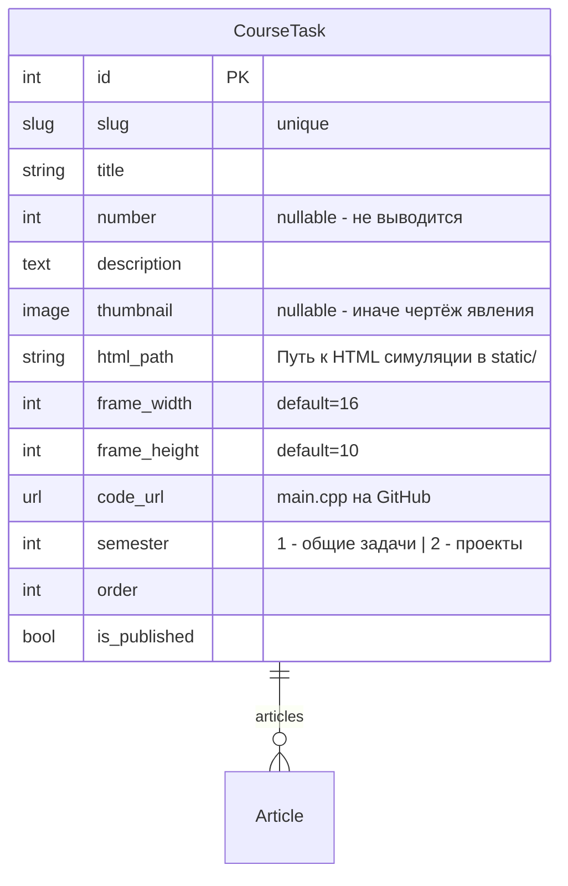
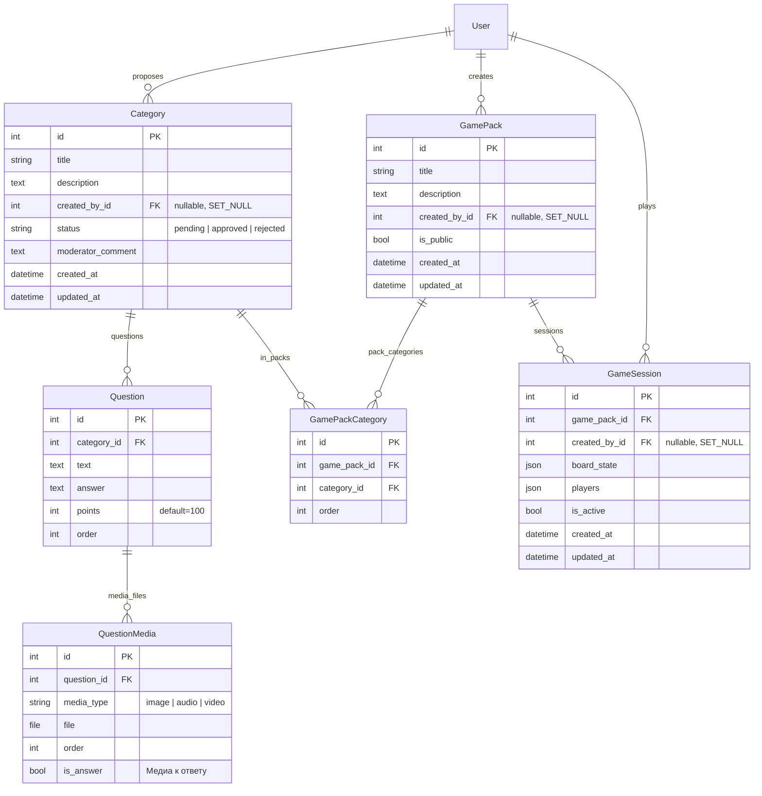

# ER-диаграммы

Модели проекта разбиты на 7 доменов. Всего **41 модель** + стандартная модель `User` из Django.

| Домен | Моделей | Что описывает |
|-------|---------|---------------|
| accounts | 2 | Пользователи, классы, выпускники |
| pages | 5 | Контентные блоки главной и страница «Обо мне» |
| lessons | 4 | Разделы, уроки, вложения, блоки урока |
| quizzes | 16 | Тесты, варианты ЕГЭ, банк задач, сессии тренировки |
| textbook | 7 | Учебник: блоки, статьи, теория ЕГЭ, прогресс чтения |
| spetskurs | 1 | Задачи курса численного моделирования |
| games | 6 | «Своя игра»: темы, вопросы, пакеты, партии |

---

## Accounts – Пользователи и группы

```mermaid
erDiagram
    User ||--|| Profile : "has"
    StudentGroup ||--o{ Profile : "contains"

    User {
        int id PK
        string username
        string email
        string password
        bool is_staff
    }

    Profile {
        int id PK
        int user_id FK "OneToOne → User"
        int group_id FK "FK → StudentGroup, nullable, SET_NULL"
        bool is_ege "Сдаёт ЕГЭ"
        image avatar
        string alumni_place "Вуз выпускника"
        text alumni_about "О себе"
    }

    StudentGroup {
        int id PK
        string name "Название класса"
        int graduation_year "Заполнен - класс в архиве выпускников"
        image graduation_photo "Общее фото класса"
        text graduation_note "Слово учителя о классе"
    }
```

!!! info "Связь User ↔ Profile"
    `Profile` расширяет стандартного `User` через `OneToOneField`. Создаётся автоматически при регистрации. Поле `is_ege` определяет доступ к EGE-тренажёру. Заполненный `StudentGroup.graduation_year` – единственный признак архива: отдельного флага `is_archived` нет, он выводится из года.

---

## Pages – Контент главной и about-страницы

```mermaid
erDiagram
    ContentBlock {
        int id PK
        string page "home | about"
        string block_type "text | image | text_image"
        string title
        text content
        image image
        string link_url
        int order
        string layout "vertical | horizontal | horizontal-reverse"
        string card_bg "CSS цвет фона"
    }

    AuthorProfile {
        int id PK
        string full_name
        string role "Должность / аффилиация"
        text bio
        text research_interests
        image portrait "Портрет (hero)"
        string email
        url telegram_url
        url vk_url
        bool is_active
    }

    AuthorPhoto {
        int id PK
        image image
        string caption
        string alt_text
        int order
        bool is_visible
    }

    AuthorVideo {
        int id PK
        string title
        text description
        file video_file "MP4"
        image poster "Превью"
        int order
        bool is_visible
    }

    AuthorEvent {
        int id PK
        string event_type "education | publication | conference | award"
        int year
        bool is_current "Показать «настоящее время»"
        int month
        string title
        string subtitle
        text description
        url doi_or_url
        int order
        bool is_visible
    }
```

!!! note "Content Block Pattern"
    `ContentBlock` – самодостаточная модель без связей. Каждый блок содержит полный набор параметров стилизации: шрифты, цвета, позиционирование, кроп изображений. Аналогичная структура используется в `LessonBlock`.

    Остальные модели домена – страница «Обо мне» (`/about/`): профиль автора и три
    его коллекции. Связей между ними нет: страница собирается из всех активных
    (`is_visible`) записей каждого типа.

---

## Lessons – Разделы и уроки

```mermaid
erDiagram
    Section ||--o{ Lesson : "contains"
    Lesson ||--o{ LessonAttachment : "attached"
    Lesson ||--o{ LessonBlock : "has"

    Section {
        int id PK
        string title
        int order
    }

    Lesson {
        int id PK
        int section_id FK "FK → Section, nullable, SET_NULL"
        string title
        text description
        image preview_image
        string preview_description
        url video_url
        string presentation_url "Путь к Slidev-презентации"
        string presentation_title
        file presentation_pdf
    }

    LessonAttachment {
        int id PK
        int lesson_id FK "FK → Lesson"
        file file
        string title
        int order
    }

    LessonBlock {
        int id PK
        int lesson_id FK "FK → Lesson"
        string block_type "text | image | text_image"
        string title
        text content
        image image
        int order
        string layout
        string card_bg
    }
```

!!! warning "Два разных `Section`"
    `lessons.Section` – раздел уроков, у него есть только `title` и `order`.
    `textbook.Section` – тематический блок учебника со статьями, практикумом и
    дедлайном. Это разные модели разных приложений с одинаковым именем.

---

## Quizzes – Тесты, вопросы и результаты

Самый крупный домен – **16 моделей**. Разделён на 4 подгруппы для читабельности.

### Структура теста

```mermaid
erDiagram
    Quiz ||--o{ Question : "contains"
    Quiz ||--o{ QuizAssignment : "assigned via"
    QuizAssignment }o--|| StudentGroup : "to group"
    QuizAssignment }o--o| User : "or to user"
    Question ||--o{ Choice : "has"
    Question ||--o{ TestCase : "tested by"
    Question ||--o{ QuestionImage : "illustrated by"
    Question ||--o{ QuestionFile : "attached"
    Question ||--o{ HintChoice : "hint for"

    Quiz {
        int id PK
        string title
        text description
        int max_attempts "default=3, 0 - безлимитно"
        string quiz_type "standard | exam | bank"
        string exam_mode "exam | practice"
        bool is_public
        bool is_self_check "Самопроверка статьи"
        slug slug "unique, nullable"
        datetime start_date
        datetime end_date
    }

    QuizAssignment {
        int id PK
        int quiz_id FK
        int group_id FK "nullable, CASCADE"
        int user_id FK "nullable, CASCADE"
        datetime start_date
        datetime end_date
        int max_attempts "переопределяет Quiz.max_attempts"
    }

    Question {
        int id PK
        int quiz_id FK
        string title
        text text
        string question_type "choice | text | code"
        string correct_text_answer
        int ege_number
        string topic
        int points
        int difficulty "1 базовая | 2 повышенная | 3 высокая"
        float solve_rate "Доля верных первых попыток, nullable"
        string external_id "ID на kompege.ru"
        url source_url
        string group_id "Связка задач 19-21"
        int group_order
        bool classroom_only "Только для работы в классе"
        bool exam_only "Только для экзамена"
        json alternative_answers
        text hint "Markdown, открывается по условию"
    }

    Choice {
        int id PK
        int question_id FK
        string text
        bool is_correct
    }

    TestCase {
        int id PK
        int question_id FK
        text input_data
        text output_data
    }

    QuestionImage {
        int id PK
        int question_id FK
        image image
        string alt_text
        int order
    }

    QuestionFile {
        int id PK
        int question_id FK
        file file
        string description
        int order
    }

    HintChoice {
        int id PK
        int user_id FK
        int question_id FK
        bool accepted "Взял подсказку"
        datetime offered_at
        datetime decided_at
    }
```

!!! tip "Поле `quiz_type`"
    `standard` – обычный тест, `exam` – вариант ЕГЭ, `bank` – тематическая подборка
    задач с kompege. Банк целиком никто не решает: из него сессии тренировки берут
    задачи по `ege_number`, а в списке вариантов его нет – там фильтр `quiz_type='exam'`.

### Результаты и выполнение кода

```mermaid
erDiagram
    User ||--o{ UserResult : "completes"
    Quiz ||--o{ UserResult : "results for"
    UserResult ||--o{ UserAnswer : "contains"
    UserAnswer }o--o| Choice : "selected"
    UserAnswer }o--|| Question : "answers"
    UserAnswer }o--o| CodeSubmission : "linked to"
    User ||--o{ CodeSubmission : "submits"
    Question ||--o{ CodeSubmission : "code for"
    Quiz ||--o{ CodeSubmission : "in quiz"
    UserAnswer ||--o{ SolutionLike : "liked by"
    User ||--o{ SolutionLike : "likes"

    UserResult {
        int id PK
        int user_id FK
        int quiz_id FK
        int score
        datetime date_completed "auto_now_add"
        duration duration
    }

    UserAnswer {
        int id PK
        int user_result_id FK
        int question_id FK
        int selected_choice_id FK "nullable"
        string text_answer
        text code_answer
        text error_log
        bool is_correct
        int score "Частичный балл, задания 26 и 27"
        int submission_id FK "nullable, SET_NULL"
    }

    CodeSubmission {
        int id PK
        int user_id FK
        int question_id FK
        int quiz_id FK
        text code
        string status "pending → running → success/failed/error"
        bool is_correct "nullable"
        int score "Частичный балл, nullable"
        text error_log
        string celery_task_id
        datetime created_at
        datetime completed_at
        float cpu_time_ms
        int memory_kb
    }

    SolutionLike {
        int id PK
        int user_id FK
        int answer_id FK
        datetime created_at
    }
```

### EGE-прогресс

```mermaid
erDiagram
    User ||--o{ ExamTaskProgress : "progresses"
    Quiz ||--o{ ExamTaskProgress : "in exam"
    Question ||--o{ ExamTaskProgress : "on task"
    User ||--o{ SolutionAttachment : "attaches"
    Quiz ||--o{ SolutionAttachment : "for quiz"
    Question ||--o{ SolutionAttachment : "for question"

    ExamTaskProgress {
        int id PK
        int user_id FK
        int quiz_id FK
        int question_id FK
        int time_spent_seconds
        int attempts_to_solve
        bool is_solved
        int score "Частичный балл, nullable"
        datetime first_solved_at
        float best_cpu_time_ms
        text best_cpu_code
        int best_memory_kb
        text best_memory_code
    }

    SolutionAttachment {
        int id PK
        int user_id FK
        int quiz_id FK
        int question_id FK
        file file
        text comment
        image image
        datetime created_at
    }
```

### Сессии тренировки ЕГЭ

`ExamTaskProgress` – агрегат по варианту («решена / столько-то попыток»),
`PracticeItem` – журнал каждой попытки в тренажёре по темам. Наборы задач
у них не пересекаются: вариант это `quiz_type='exam'`, тренировка – `'bank'`.

```mermaid
erDiagram
    User ||--o{ PracticeSession : "trains"
    PracticeSession ||--o{ PracticeItem : "contains"
    Question ||--o{ PracticeItem : "asked in"
    CodeSubmission |o--o{ PracticeItem : "answers"

    PracticeSession {
        int id PK
        int user_id FK
        str kind "topic|mistakes|mixed|classroom|retry"
        str mode "study|exam"
        int ege_number
        int difficulty
        datetime created_at
        datetime finished_at
    }

    PracticeItem {
        int id PK
        int session_id FK
        int question_id FK
        int submission_id FK "nullable, SET_NULL"
        int order
        str text_answer
        bool is_correct "nullable - ещё не отвечал"
        int score "Частичный балл, nullable"
        int attempts "Сколько раз нажата «Проверить»"
        bool gave_up "Открыл ответ"
        bool carried "Ответ перенесён из прошлой сессии"
        int seconds
        datetime answered_at
    }
```

---

## Textbook – Учебник

Блоки материала, статьи трёх треков и теория ЕГЭ. Одна модель `Article`
обслуживает все треки, различаясь полем `track`: `material` (статьи уроков),
`ege` (теория по `EgeTask`) и `spetskurs` (разборы задач спецкурса).

```mermaid
erDiagram
    Section ||--o{ Article : "material"
    Section ||--o{ SectionExtension : "extensions"
    EgeTask ||--o{ Article : "ege"
    Article ||--o{ ArticleBlock : "blocks"
    Article ||--o{ ArticleQuiz : "self_check_quizzes"
    Article ||--o{ ArticleProgress : "progress"
    Quiz ||--o{ Article : "practicum_quiz"
    Quiz ||--o{ ArticleQuiz : "self check"

    Section {
        int id PK
        string title
        slug slug "unique"
        text description
        image thumbnail
        int order
        bool is_published
        int practicum_quiz_id FK "nullable, SET_NULL"
        datetime deadline "nullable"
        bool hints_open "Рубильник подсказок блока"
        int grade_5_from "nullable"
        int grade_4_from "nullable"
        int grade_3_from "nullable"
    }

    SectionExtension {
        int id PK
        int user_id FK
        int section_id FK
        datetime deadline "Личный дедлайн"
        string reason "Ученику не показывается"
        datetime created_at
    }

    EgeTask {
        int id PK
        int number "unique, 1-27"
        string title
        string short_description
        int order
        bool classroom_enabled "Кнопка «Задачи для урока»"
        int exam_size "nullable - по нормативу времени"
        int exam_unlock_threshold "default=10, 0 - экзамен сразу"
    }

    Article {
        int id PK
        string track "material | ege | spetskurs"
        int section_id FK "nullable, SET_NULL"
        int ege_task_id FK "nullable, SET_NULL"
        int course_task_id FK "nullable, SET_NULL"
        slug slug "unique"
        string title
        text description
        image thumbnail
        int order
        bool is_published
        datetime created_at
        datetime updated_at
    }

    ArticleBlock {
        int id PK
        int article_id FK
        string block_type "text | code | image | video | formula | widget"
        string title
        text content
        string code_language "python | cpp | c | bash | sql"
        image image
        url video_url
        string widget_key
        json widget_config
        int order
        string visibility "all | teacher | students"
    }

    ArticleQuiz {
        int id PK
        int article_id FK
        int quiz_id FK
        string label "Напр. «Разминка»"
        int order
    }

    ArticleProgress {
        int id PK
        int user_id FK
        int article_id FK
        string status "not_started | reading | read | mastered"
        int time_spent_seconds
        datetime first_opened_at
        datetime read_at
        datetime mastered_at
        datetime updated_at
    }
```

!!! info "Три якоря статьи"
    `Article` привязана к якорю своего трека: `section` у учебного материала,
    `ege_task` у теории ЕГЭ, `course_task` у спецкурса. Якоря взаимоисключающие,
    но все три nullable – статья может висеть и без якоря.

    `ArticleBlock.visibility` – отдельная ось, а не тип блока: разбор задания
    (`teacher` / `students`) бывает и текстом, и формулой, и кодом, типом его
    не выразить.

---

## Spetskurs – Задачи курса численного моделирования

Теория спецкурса живёт на моделях учебника (`Article` с `track='spetskurs'`);
в приложении остался один якорь трека – `CourseTask`.

```mermaid
erDiagram
    CourseTask ||--o{ Article : "articles"

    CourseTask {
        int id PK
        slug slug "unique"
        string title
        int number "nullable - не выводится"
        text description
        image thumbnail "nullable - иначе чертёж явления"
        string html_path "Путь к HTML симуляции в static/"
        int frame_width "default=16"
        int frame_height "default=10"
        url code_url "main.cpp на GitHub"
        int semester "1 - общие задачи | 2 - проекты"
        int order
        bool is_published
    }
```

!!! note "Что описывает `CourseTask`"
    Одна задача связывает четыре вещи: физику (статьи `track='spetskurs'`),
    исходник `main.cpp`, WASM-симуляцию и задания. Бывшая `Simulation`
    означала только третий пункт. Пропорция кадра у каждой задачи своя:
    маятник и гравитация рассчитаны на разные окна, общая сплющила бы половину.
    `Article.course_task` пустой – статья относится к «Основам C++» (`/spetskurs/basics/`).

---

## Games – «Своя игра»

Ученики предлагают темы и вопросы, учитель их модерирует и собирает игровой
пакет; партия хранится как JSON-состояние доски.

```mermaid
erDiagram
    User ||--o{ Category : "proposes"
    Category ||--o{ Question : "questions"
    Question ||--o{ QuestionMedia : "media_files"
    GamePack ||--o{ GamePackCategory : "pack_categories"
    Category ||--o{ GamePackCategory : "in_packs"
    GamePack ||--o{ GameSession : "sessions"
    User ||--o{ GamePack : "creates"
    User ||--o{ GameSession : "plays"

    Category {
        int id PK
        string title
        text description
        int created_by_id FK "nullable, SET_NULL"
        string status "pending | approved | rejected"
        text moderator_comment
        datetime created_at
        datetime updated_at
    }

    Question {
        int id PK
        int category_id FK
        text text
        text answer
        int points "default=100"
        int order
    }

    QuestionMedia {
        int id PK
        int question_id FK
        string media_type "image | audio | video"
        file file
        int order
        bool is_answer "Медиа к ответу"
    }

    GamePack {
        int id PK
        string title
        text description
        int created_by_id FK "nullable, SET_NULL"
        bool is_public
        datetime created_at
        datetime updated_at
    }

    GamePackCategory {
        int id PK
        int game_pack_id FK
        int category_id FK
        int order
    }

    GameSession {
        int id PK
        int game_pack_id FK
        int created_by_id FK "nullable, SET_NULL"
        json board_state
        json players
        bool is_active
        datetime created_at
        datetime updated_at
    }
```

!!! note "Промежуточная модель пакета"
    `GamePack.categories` – `ManyToManyField` через `GamePackCategory`: порядок
    тем на доске хранится отдельным полем, а не выводится из порядка создания.
    Скрипт доски – `static/js/svoya-igra-board.js`.

---

## Сводная таблица связей

| Связь | Тип | ON_DELETE | Описание |
|-------|-----|----------|----------|
| User → Profile | OneToOne | CASCADE | Расширение пользователя |
| Profile → StudentGroup | FK | SET_NULL | Класс ученика |
| Lesson → Section | FK | SET_NULL | Раздел урока |
| LessonAttachment → Lesson | FK | CASCADE | Файлы-вложения урока |
| LessonBlock → Lesson | FK | CASCADE | Блоки контента урока |
| Question → Quiz | FK | CASCADE | Вопросы теста |
| QuizAssignment → Quiz | FK | CASCADE | Назначение теста |
| QuizAssignment → StudentGroup | FK | CASCADE | Назначение группе |
| QuizAssignment → User | FK | CASCADE | Индивидуальное назначение |
| Choice → Question | FK | CASCADE | Варианты ответа |
| TestCase → Question | FK | CASCADE | Тест-кейсы для кода |
| QuestionImage → Question | FK | CASCADE | Иллюстрации вопроса |
| QuestionFile → Question | FK | CASCADE | Файлы вопроса |
| HintChoice → User, Question | FK | CASCADE | Выбор по подсказке |
| PracticeSession → User | FK | CASCADE | Сессии тренировки ЕГЭ |
| PracticeItem → PracticeSession | FK | CASCADE | Задачи сессии |
| PracticeItem → Question | FK | CASCADE | Какая задача выдана |
| PracticeItem → CodeSubmission | FK | SET_NULL | Отправка кода по задаче |
| UserResult → User, Quiz | FK | CASCADE | Результат прохождения |
| UserAnswer → UserResult | FK | CASCADE | Ответ на вопрос |
| UserAnswer → Choice | FK | CASCADE | Выбранный вариант |
| UserAnswer → CodeSubmission | FK | SET_NULL | Связь с посылкой кода |
| CodeSubmission → User, Question, Quiz | FK | CASCADE | Посылка кода |
| ExamTaskProgress → User, Quiz, Question | FK | CASCADE | Прогресс EGE |
| SolutionAttachment → User, Quiz, Question | FK | CASCADE | Прикрепление решения |
| SolutionLike → User, UserAnswer | FK | CASCADE | Лайк решения |
| Article → Section | FK | SET_NULL | Статья учебного материала |
| Article → EgeTask | FK | SET_NULL | Теория задания ЕГЭ |
| Article → CourseTask | FK | SET_NULL | Разбор задачи спецкурса |
| ArticleBlock → Article | FK | CASCADE | Блоки содержимого статьи |
| ArticleQuiz → Article, Quiz | FK | CASCADE | Самопроверка статьи |
| ArticleProgress → User, Article | FK | CASCADE | Прогресс чтения |
| Section → Quiz | FK | SET_NULL | Практикум блока учебника |
| SectionExtension → User, Section | FK | CASCADE | Личное продление дедлайна |
| Category → User | FK | SET_NULL | Автор темы «Своей игры» |
| Question (games) → Category | FK | CASCADE | Вопросы темы |
| QuestionMedia → Question (games) | FK | CASCADE | Медиафайлы вопроса |
| GamePack → User | FK | SET_NULL | Автор пакета |
| GamePackCategory → GamePack, Category | FK | CASCADE | Тема в пакете |
| GamePack ↔ Category | M2M | через GamePackCategory | Темы пакета |
| GameSession → GamePack | FK | CASCADE | Партия пакета |
| GameSession → User | FK | SET_NULL | Игрок, начавший партию |

!!! warning "Уникальные ограничения"
    - `ExamTaskProgress`: `unique_together = [user, quiz, question]` – один прогресс на задачу
    - `SolutionAttachment`: `unique_together = [user, quiz, question]` – одно прикрепление на задачу
    - `SolutionLike`: `UniqueConstraint(user, answer)` – один лайк на ответ
    - `HintChoice`: `UniqueConstraint(user, question)` – один выбор по подсказке
    - `PracticeItem`: `unique_together = [session, question]` – одна задача в сессии один раз
    - `SectionExtension`: `UniqueConstraint(user, section)` – одно продление на пару «ученик + блок»
    - `ArticleQuiz`: `UniqueConstraint(article, quiz)` – один тест самопроверки на статью
    - `ArticleProgress`: `UniqueConstraint(user, article)` – один прогресс на статью
    - `GamePackCategory`: `unique_together = [game_pack, category]` – тема в пакете один раз
