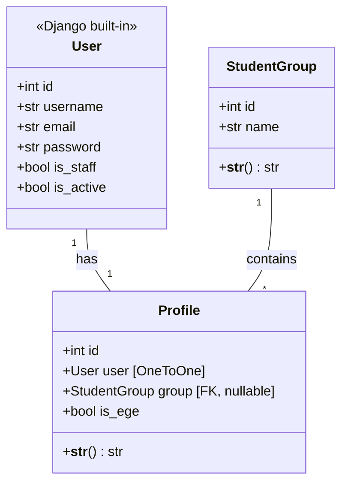
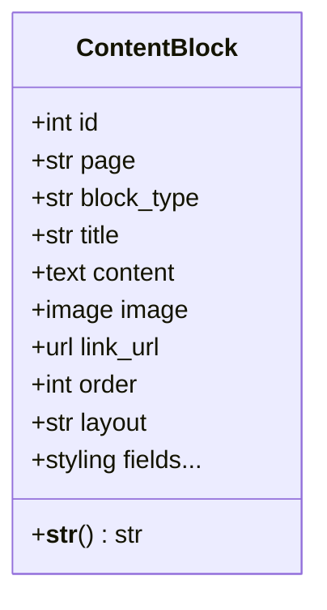
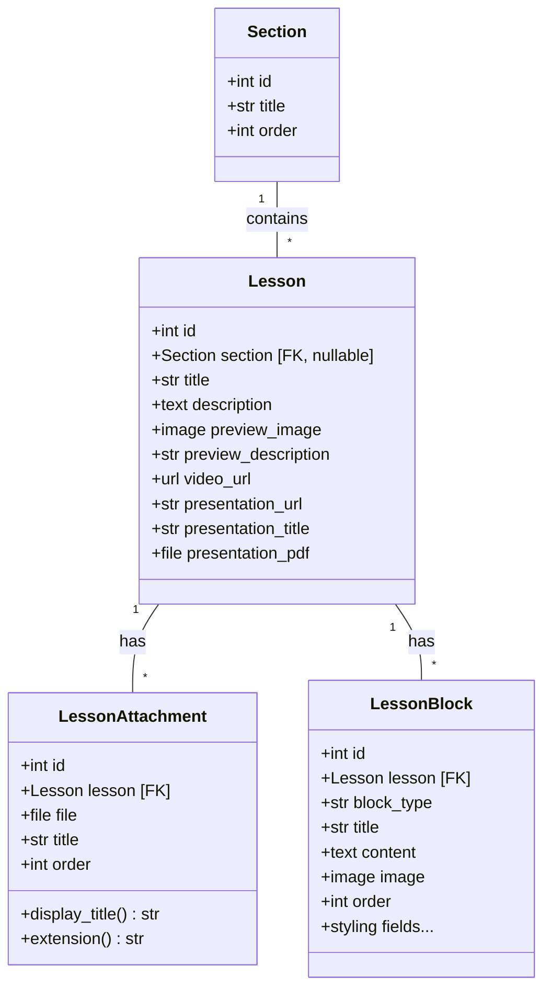
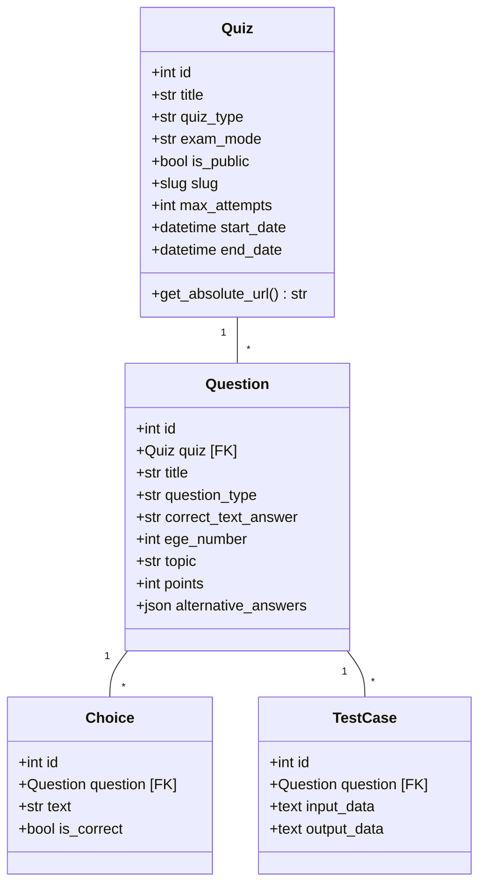

# Модели

Детальное описание всех **20 моделей** проекта с диаграммами классов и пояснениями.

---

## accounts — Пользователи

### StudentGroup

Группа/класс учеников. Используется для группового назначения тестов через `QuizAssignment`.

| Поле | Тип | Описание |
|------|-----|----------|
| `name` | CharField(100) | Название группы (напр. "10А") |

**Meta:** `ordering = ['name']`

### Profile

Расширение стандартного `User`. Создаётся при регистрации.

| Поле | Тип | Описание |
|------|-----|----------|
| `user` | OneToOneField(User) | Связь с пользователем, CASCADE |
| `group` | ForeignKey(StudentGroup) | Группа ученика, nullable |
| `is_ege` | BooleanField | Доступ к EGE-тренажёру, default=False |

---

## pages — Контентные блоки

### ContentBlock

Универсальный блок контента для главной и about-страницы. Полностью самодостаточная модель — все параметры отображения хранятся в БД.

| Поле | Тип | Описание |
|------|-----|----------|
| `page` | CharField | `home` или `about` |
| `block_type` | CharField | `text`, `image`, `text_image` |
| `title` | CharField(200) | Заголовок блока |
| `content` | TextField | Текстовое содержание, blank |
| `image` | ImageField | Загружается в `content/` |
| `link_url` | URLField | Ссылка, blank |
| `order` | PositiveIntegerField | Порядок на странице |
| `layout` | CharField | `vertical`, `horizontal`, `horizontal-reverse` |

**Поля стилизации:**

| Группа | Поля |
|--------|------|
| Позиционирование текста | `text_pos_x`, `text_pos_y` |
| Позиционирование изображения | `image_pos_x`, `image_pos_y`, `image_align`, `image_position_x`, `image_position_y` |
| Размеры изображения | `image_width`, `image_height` |
| Кроп изображения | `image_crop_x`, `image_crop_y`, `image_crop_width`, `image_crop_height`, `image_natural_width`, `image_natural_height` |
| CSS изображения | `image_object_fit`, `image_border_radius`, `image_opacity` |
| Шрифты заголовка | `title_font_size`, `title_font_family`, `title_color` |
| Шрифты контента | `content_font_size`, `content_font_family`, `content_color` |
| Выравнивание | `text_align` |
| Фон | `card_bg` |

**Meta:** `ordering = ['page', 'order']`

---

## lessons — Уроки

### Section

Раздел — группирует уроки.

| Поле | Тип | Описание |
|------|-----|----------|
| `title` | CharField(200) | Название раздела |
| `order` | PositiveIntegerField | Порядок отображения, default=0 |

**Meta:** `ordering = ['order']`

### Lesson

Урок с файлами, презентацией, превью и видео.

| Поле | Тип | Описание |
|------|-----|----------|
| `section` | ForeignKey(Section) | Раздел, SET_NULL, nullable |
| `title` | CharField(200) | Название урока |
| `description` | TextField | Описание, blank |
| `preview_image` | ImageField | Превью в `lessons/<title>/`, blank |
| `preview_description` | CharField(200) | Краткое описание для карточки, blank |
| `video_url` | URLField | Ссылка на видео, blank |
| `presentation_url` | CharField(300) | Путь к собранной Slidev-презентации, blank |
| `presentation_title` | CharField(200) | Название презентации для отображения, blank |
| `presentation_pdf` | FileField | PDF-версия презентации в `lessons/<title>/`, blank |

### LessonAttachment

Файловое вложение к уроку (задания, примеры, материалы).

| Поле | Тип | Описание |
|------|-----|----------|
| `lesson` | ForeignKey(Lesson) | Урок, CASCADE, related_name=`attachments` |
| `file` | FileField | Файл в `lessons/<title>/` |
| `title` | CharField(200) | Название вложения, blank |
| `order` | PositiveIntegerField | Порядок отображения, default=0 |

**Properties:**
- `display_title` — название или имя файла, если `title` не задан
- `extension` — расширение файла в нижнем регистре (например, `pdf`, `odt`)

**Meta:** `ordering = ['order']`

**Upload path:** `lessons/{safe_title}/{filename}` — все файлы урока хранятся в единой директории `media/lessons/{название_урока}/`.

### LessonBlock

Блок контента урока. Структура стилизации идентична `ContentBlock`.

| Поле | Тип | Описание |
|------|-----|----------|
| `lesson` | ForeignKey(Lesson) | Урок, CASCADE, related_name=`blocks` |
| `block_type` | CharField | `text`, `image`, `text_image` |
| `title` | CharField(200) | Заголовок блока, blank |
| `content` | TextField | Текст блока, blank |
| `image` | ImageField | Изображение, blank |
| `order` | PositiveIntegerField | Порядок, default=0 |
| `layout` | CharField | `vertical`, `horizontal`, `horizontal-reverse` |
| + все поля стилизации | — | Аналогично `ContentBlock` |

**Meta:** `ordering = ['order']`

---

## quizzes — Тесты

Основной домен приложения — **13 моделей**.

### Quiz

Тест/экзамен с контролем доступа по времени.

| Поле | Тип | Описание |
|------|-----|----------|
| `title` | CharField(200) | Название теста |
| `description` | TextField | Описание, blank |
| `max_attempts` | PositiveIntegerField | Лимит попыток, default=0 (безлимит) |
| `quiz_type` | CharField | `standard` (обычный) или `exam` (EGE) |
| `exam_mode` | CharField | `exam` или `practice`, blank |
| `is_public` | BooleanField | Публичный доступ, default=False |
| `slug` | SlugField | URL-slug, unique, blank |
| `start_date` | DateTimeField | Начало доступа, nullable |
| `end_date` | DateTimeField | Конец доступа, nullable |

### Question

Вопрос с тремя типами: выбор, текст, код.

| Поле | Тип | Описание |
|------|-----|----------|
| `quiz` | ForeignKey(Quiz) | Тест, CASCADE |
| `title` | CharField(500) | Заголовок вопроса, blank |
| `text` | TextField | Текст вопроса |
| `question_type` | CharField | `choice`, `text`, `code` |
| `correct_text_answer` | CharField(200) | Правильный ответ для text-типа, blank |
| `ege_number` | PositiveIntegerField | Номер задания ЕГЭ, nullable |
| `topic` | CharField(200) | Тема вопроса, blank |
| `points` | PositiveIntegerField | Баллы, default=1 |
| `alternative_answers` | JSONField | Список альтернативных правильных ответов, nullable |

!!! tip "Нормализация текстовых ответов"
    Функция `normalize_text_answer()` приводит ответ к нижнему регистру, убирает пробелы и ведущие нули — для корректного сравнения при проверке.

### QuizAssignment

Назначение теста группе или конкретному пользователю.

| Поле | Тип | Описание |
|------|-----|----------|
| `quiz` | ForeignKey(Quiz) | Тест, CASCADE |
| `group` | ForeignKey(StudentGroup) | Группа, SET_NULL, nullable |
| `user` | ForeignKey(User) | Пользователь, SET_NULL, nullable |
| `start_date` | DateTimeField | Начало доступа, nullable |
| `end_date` | DateTimeField | Конец доступа, nullable |
| `max_attempts` | PositiveIntegerField | Переопределяет `Quiz.max_attempts`, nullable |

!!! info "Логика назначения"
    Назначение может быть **групповым** (`group` заполнено) или **индивидуальным** (`user` заполнено). Поля `start_date`, `end_date` и `max_attempts` переопределяют аналогичные поля `Quiz` для данного назначения.

### QuestionImage / QuestionFile

Медиа-вложения к вопросу.

| Модель | Поля | Upload path |
|--------|------|-------------|
| **QuestionImage** | image, alt_text, order | `question_files/<slug>/` |
| **QuestionFile** | file, description, order | `question_files/<slug>/` |

Обе используют EGE-aware upload paths: если у quiz есть slug, файлы группируются в `question_files/<slug>/`.

### Choice

Вариант ответа для `question_type = 'choice'`.

| Поле | Тип | Описание |
|------|-----|----------|
| `question` | ForeignKey(Question) | Вопрос, CASCADE |
| `text` | CharField(200) | Текст варианта |
| `is_correct` | BooleanField | Правильный ли вариант |

### TestCase

Тест-кейс для `question_type = 'code'`. Используется при автоматической проверке кода.

| Поле | Тип | Описание |
|------|-----|----------|
| `question` | ForeignKey(Question) | Вопрос, CASCADE |
| `input_data` | TextField | Входные данные, blank |
| `output_data` | TextField | Ожидаемый вывод |

### UserResult

Результат прохождения теста пользователем.

| Поле | Тип | Описание |
|------|-----|----------|
| `user` | ForeignKey(User) | Пользователь, CASCADE |
| `quiz` | ForeignKey(Quiz) | Тест, CASCADE |
| `score` | IntegerField | Набранные баллы |
| `date_completed` | DateTimeField | auto_now_add |
| `duration` | DurationField | Время прохождения, nullable |

**Indexes:** `(user, quiz)`, `(quiz, date_completed)`

### UserAnswer

Ответ на конкретный вопрос.

| Поле | Тип | Описание |
|------|-----|----------|
| `user_result` | ForeignKey(UserResult) | Результат, CASCADE |
| `question` | ForeignKey(Question) | Вопрос |
| `choice` | ForeignKey(Choice) | Выбранный вариант, nullable |
| `text_answer` | CharField(200) | Текстовый ответ, blank |
| `code_answer` | TextField | Код ответа, blank |
| `error_log` | TextField | Лог ошибки, blank |
| `is_correct` | BooleanField | Правильный ли ответ |
| `submission` | ForeignKey(CodeSubmission) | Связь с посылкой, SET_NULL, nullable |

### CodeSubmission

Посылка кода на проверку через Celery + Docker.

| Поле | Тип | Описание |
|------|-----|----------|
| `user` | ForeignKey(User) | Автор, CASCADE |
| `question` | ForeignKey(Question) | Вопрос, CASCADE |
| `quiz` | ForeignKey(Quiz) | Тест, CASCADE |
| `code` | TextField | Исходный код |
| `status` | CharField | `pending` → `running` → `success`/`failed`/`error` |
| `is_correct` | BooleanField | Все тесты пройдены, nullable |
| `error_log` | TextField | Лог ошибок, blank |
| `celery_task_id` | CharField | ID задачи Celery, blank |
| `created_at` | DateTimeField | auto_now_add |
| `completed_at` | DateTimeField | Время завершения, nullable |
| `cpu_time_ms` | FloatField | Время CPU в мс, nullable |
| `memory_kb` | IntegerField | Использование памяти в КБ, nullable |

### HelpRequest

Запрос помощи от ученика по конкретному вопросу.

| Поле | Тип | Описание |
|------|-----|----------|
| `student` | ForeignKey(User) | Ученик, CASCADE |
| `question` | ForeignKey(Question) | Вопрос, CASCADE |
| `quiz` | ForeignKey(Quiz) | Тест, CASCADE |
| `status` | CharField | `open` → `answered` → `resolved` |
| `created_at` | DateTimeField | auto_now_add |
| `updated_at` | DateTimeField | auto_now |
| `has_unread_for_teacher` | BooleanField | Есть непрочитанные сообщения для учителя |
| `has_unread_for_student` | BooleanField | Есть непрочитанные для ученика |

**Constraint:** `unique_together = [student, question]` — один запрос на вопрос на ученика.

### HelpComment

Комментарий в обсуждении запроса помощи. Поддерживает inline-комментарии к строкам кода.

| Поле | Тип | Описание |
|------|-----|----------|
| `help_request` | ForeignKey(HelpRequest) | Запрос, CASCADE |
| `author` | ForeignKey(User) | Автор |
| `text` | TextField | Текст, max 10000 символов |
| `line_number` | PositiveIntegerField | Номер строки для inline-комментария, nullable |
| `code_snapshot` | TextField | Снимок кода на момент комментария, blank |
| `created_at` | DateTimeField | auto_now_add |

### ExamTaskProgress

Прогресс ученика по задаче EGE-тренажёра. Хранит метрики производительности.

| Поле | Тип | Описание |
|------|-----|----------|
| `user` | ForeignKey(User) | Ученик, CASCADE |
| `quiz` | ForeignKey(Quiz) | EGE-тест, CASCADE |
| `question` | ForeignKey(Question) | Задача, CASCADE |
| `time_spent_seconds` | PositiveIntegerField | Общее время, default=0 |
| `attempts_to_solve` | PositiveIntegerField | Количество попыток, default=0 |
| `is_solved` | BooleanField | Решена ли задача, default=False |
| `first_solved_at` | DateTimeField | Первое решение, nullable |
| `best_cpu_time_ms` | FloatField | Лучшее время CPU, nullable |
| `best_cpu_code` | TextField | Код лучшего по CPU, blank |
| `best_memory_kb` | IntegerField | Лучшее использование памяти, nullable |
| `best_memory_code` | TextField | Код лучшего по памяти, blank |

**Constraint:** `unique_together = [user, quiz, question]`

### SolutionAttachment

Прикрепление файла/изображения к решению задачи.

| Поле | Тип | Описание |
|------|-----|----------|
| `user` | ForeignKey(User) | Автор, CASCADE |
| `quiz` | ForeignKey(Quiz) | Тест, CASCADE |
| `question` | ForeignKey(Question) | Вопрос, CASCADE |
| `file` | FileField | Файл решения, blank |
| `comment` | TextField | Комментарий, blank |
| `image` | ImageField | Изображение решения, blank |
| `created_at` | DateTimeField | auto_now_add |

**Constraint:** `unique_together = [user, quiz, question]`

### SolutionLike

Лайк на решение другого ученика.

| Поле | Тип | Описание |
|------|-----|----------|
| `user` | ForeignKey(User) | Кто лайкнул, CASCADE |
| `answer` | ForeignKey(UserAnswer) | Ответ, CASCADE, related_name=`likes` |
| `created_at` | DateTimeField | auto_now_add |

**Constraint:** `UniqueConstraint(fields=['user', 'answer'])`

---

## Вспомогательные функции

В `quizzes/models.py` определены helper-функции:

| Функция | Описание |
|---------|----------|
| `normalize_text_answer(answer)` | strip + lowercase + убрать ведущие нули |
| `question_image_upload_path(instance, filename)` | EGE-aware путь загрузки изображений |
| `question_file_upload_path(instance, filename)` | EGE-aware путь загрузки файлов |
| `solution_file_upload_path(instance, filename)` | Путь загрузки решений по пользователю |
| `solution_image_upload_path(instance, filename)` | Путь загрузки изображений решений |
