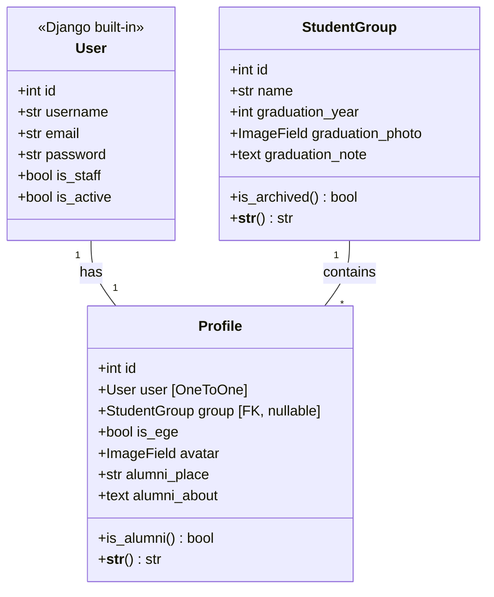
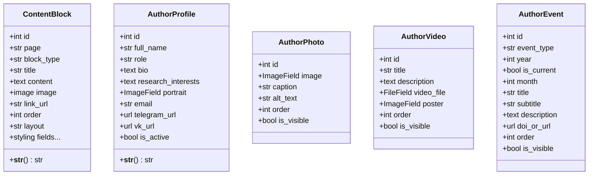
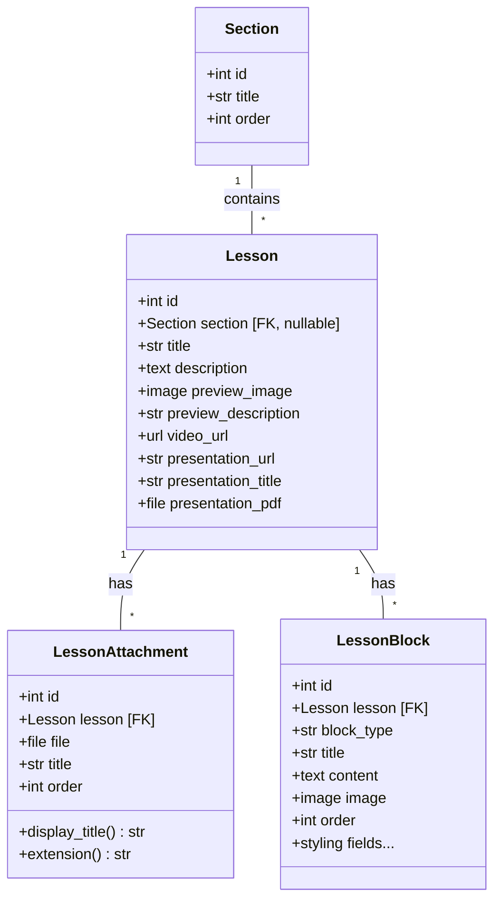
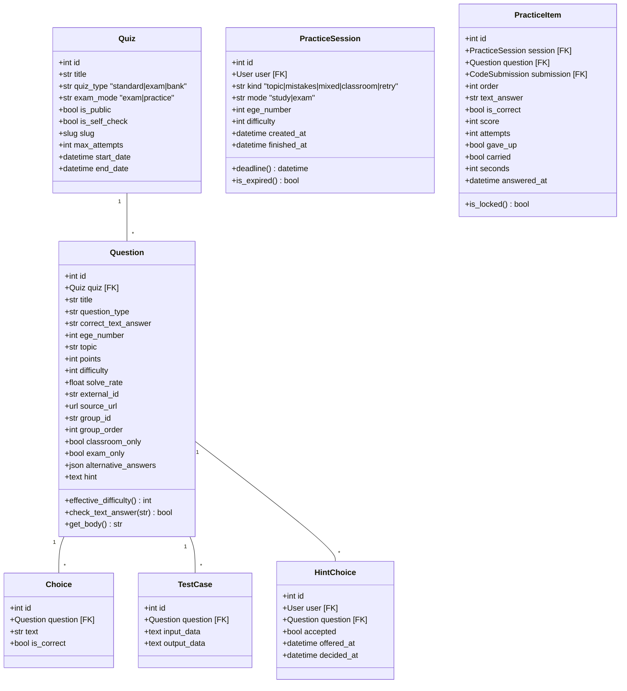
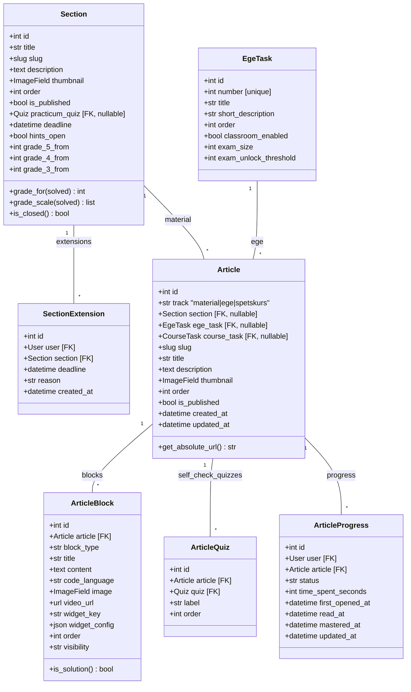
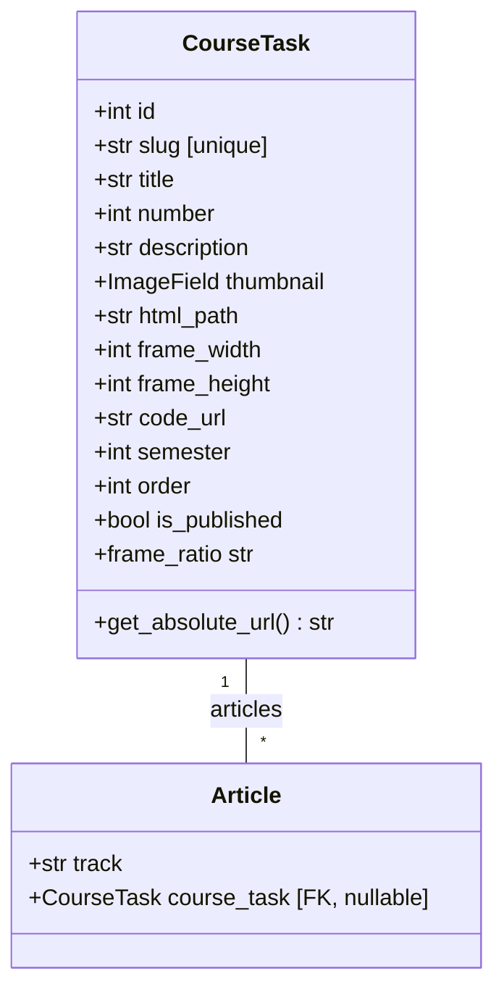
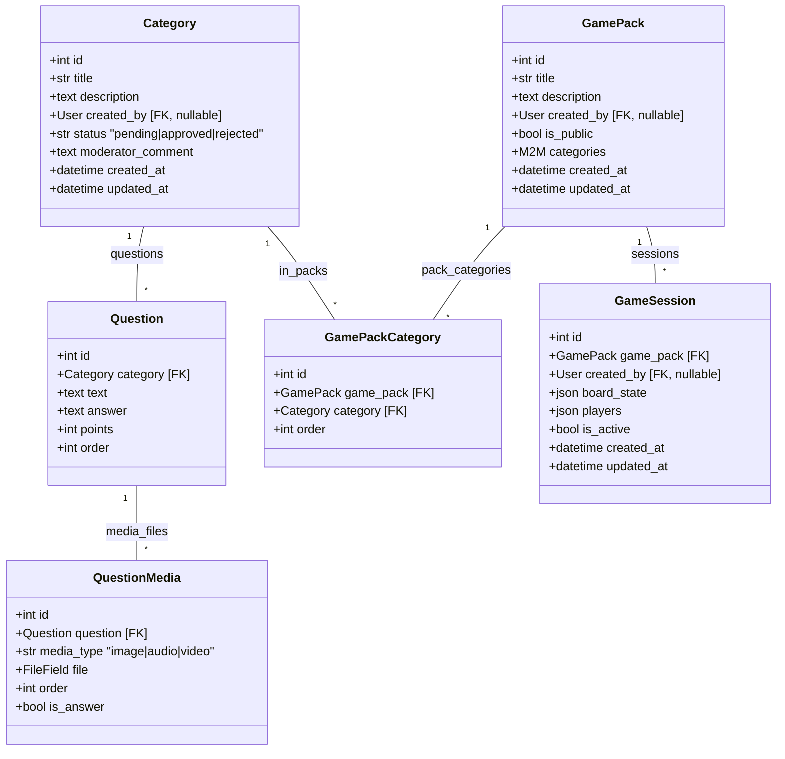

# Модели

Детальное описание всех **41 модели** проекта с диаграммами классов и пояснениями
(плюс стандартная `User` из Django).

---

## accounts – Пользователи

```mermaid
classDiagram
    class User {
        <<Django built-in>>
        +int id
        +str username
        +str email
        +str password
        +bool is_staff
        +bool is_active
    }

    class Profile {
        +int id
        +User user [OneToOne]
        +StudentGroup group [FK, nullable]
        +bool is_ege
        +ImageField avatar
        +str alumni_place
        +text alumni_about
        +is_alumni() bool
        +__str__() str
    }

    class StudentGroup {
        +int id
        +str name
        +int graduation_year
        +ImageField graduation_photo
        +text graduation_note
        +is_archived() bool
        +__str__() str
    }

    User "1" -- "1" Profile : has
    StudentGroup "1" -- "*" Profile : contains
```

### StudentGroup

Учебный класс. Используется для группового назначения тестов через `QuizAssignment`,
для таблицы класса `/ege/class/` и для страницы выпускников `/alumni/`.

| Поле | Тип | Описание |
|------|-----|----------|
| `name` | CharField(50) | Название группы (напр. "10А") |
| `graduation_year` | PositiveSmallIntegerField | Год выпуска, nullable. Заполнено – класс уходит в архив выпускников и пропадает из активных списков |
| `graduation_photo` | ImageField | Общее фото класса, `alumni/`, blank |
| `graduation_note` | TextField | Слово учителя о классе, blank |

**Свойство:** `is_archived` – проставлен `graduation_year`. Отдельного флага архива нет:
выпускаются классами целиком, а год сразу даёт и заголовок, и группировку на `/alumni/`.

### Profile

Расширение стандартного `User`. Создаётся автоматически при регистрации.

| Поле | Тип | Описание |
|------|-----|----------|
| `user` | OneToOneField(User) | Связь с пользователем, CASCADE, related_name=`profile` |
| `group` | ForeignKey(StudentGroup) | Класс ученика, SET_NULL, nullable, related_name=`students` |
| `is_ege` | BooleanField | Сдаёт ЕГЭ, default=False |
| `avatar` | ImageField | Аватар, `avatars/`, blank |
| `alumni_place` | CharField(200) | Вуз выпускника, blank |
| `alumni_about` | TextField | О себе, blank |

**Свойство:** `is_alumni` – у ученика есть класс с проставленным годом выпуска.
Карточку выпускника заполняет сам ученик; имя и аватар на `/alumni/` показываются
у всех учеников класса с годом выпуска независимо от этих полей.

---

## pages – Контентные блоки и «Обо мне»

```mermaid
classDiagram
    class ContentBlock {
        +int id
        +str page
        +str block_type
        +str title
        +text content
        +image image
        +str link_url
        +int order
        +str layout
        +styling fields...
        +__str__() str
    }

    class AuthorProfile {
        +int id
        +str full_name
        +str role
        +text bio
        +text research_interests
        +ImageField portrait
        +str email
        +url telegram_url
        +url vk_url
        +bool is_active
        +__str__() str
    }

    class AuthorPhoto {
        +int id
        +ImageField image
        +str caption
        +str alt_text
        +int order
        +bool is_visible
    }

    class AuthorVideo {
        +int id
        +str title
        +text description
        +FileField video_file
        +ImageField poster
        +int order
        +bool is_visible
    }

    class AuthorEvent {
        +int id
        +str event_type
        +int year
        +bool is_current
        +int month
        +str title
        +str subtitle
        +text description
        +url doi_or_url
        +int order
        +bool is_visible
    }
```

### ContentBlock

Универсальный блок контента для главной и about-страницы. Полностью самодостаточная модель – все параметры отображения хранятся в БД.

| Поле | Тип | Описание |
|------|-----|----------|
| `page` | CharField(20) | `home` или `about` |
| `block_type` | CharField(20) | `text`, `image`, `text_image` |
| `title` | CharField(200) | Заголовок блока |
| `content` | TextField | Текстовое содержание, blank |
| `image` | ImageField | Загружается в `content/`, nullable |
| `link_url` | CharField(200) | Ссылка, blank |
| `order` | PositiveIntegerField | Порядок на странице |
| `layout` | CharField(20) | `vertical`, `horizontal`, `horizontal-reverse` |

**Поля стилизации:**

| Группа | Поля |
|--------|------|
| Позиционирование текста | `text_pos_x`, `text_pos_y` |
| Позиционирование изображения | `image_pos_x`, `image_pos_y`, `image_align`, `image_position_x`, `image_position_y` |
| Размеры изображения | `image_width`, `image_height` |
| Кроп изображения | `image_crop_x`, `image_crop_y`, `image_crop_width`, `image_crop_height`, `image_natural_width`, `image_natural_height` |
| CSS изображения | `image_object_fit`, `image_border_radius`, `image_opacity` |
| Шрифты заголовка | `title_font_size`, `title_font_family`, `title_color` |
| Шрифты контента | `content_font_size`, `content_font_family`, `content_color` |
| Выравнивание | `text_align` |
| Фон | `card_bg` |

**Meta:** `ordering = ['page', 'order']`

### AuthorProfile

Профиль автора для страницы `/about/`. Отдельных связей нет.

| Поле | Тип | Описание |
|------|-----|----------|
| `full_name` | CharField(200) | Полное имя |
| `role` | CharField(300) | Должность / аффилиация |
| `bio` | TextField | О себе, blank |
| `research_interests` | TextField | Научные интересы, blank |
| `portrait` | ImageField | Портрет (hero), `about/portrait/`, nullable |
| `email` | EmailField | Email, blank |
| `telegram_url` | URLField | Ссылка Telegram, blank |
| `vk_url` | URLField | Ссылка ВКонтакте, blank |
| `is_active` | BooleanField | Активен, default=True |

### AuthorPhoto

Фотография автора в галерее «Обо мне».

| Поле | Тип | Описание |
|------|-----|----------|
| `image` | ImageField | Фото, `about/photos/` |
| `caption` | CharField(200) | Подпись, blank |
| `alt_text` | CharField(200) | Alt-текст, blank |
| `order` | PositiveSmallIntegerField | Порядок, default=0 |
| `is_visible` | BooleanField | Отображать, default=True |

**Meta:** `ordering = ['order']`

### AuthorVideo

Видео автора. Грузится файлом, не ссылкой.

| Поле | Тип | Описание |
|------|-----|----------|
| `title` | CharField(200) | Название |
| `description` | TextField | Описание, blank |
| `video_file` | FileField | Видеофайл (MP4), `about/videos/` |
| `poster` | ImageField | Постер (превью), `about/video_posters/`, nullable |
| `order` | PositiveSmallIntegerField | Порядок, default=0 |
| `is_visible` | BooleanField | Отображать, default=True |

**Meta:** `ordering = ['order']`

### AuthorEvent

Событие или публикация в хронологии «Обо мне».

| Поле | Тип | Описание |
|------|-----|----------|
| `event_type` | CharField(20) | `education`, `publication`, `conference`, `award` |
| `year` | PositiveSmallIntegerField | Год |
| `is_current` | BooleanField | Показывать «настоящее время» вместо конечного года, default=False |
| `month` | PositiveSmallIntegerField | Месяц (1–12), nullable |
| `title` | CharField(300) | Заголовок |
| `subtitle` | CharField(300) | Подзаголовок, blank |
| `description` | TextField | Описание, blank |
| `doi_or_url` | URLField | DOI / ссылка, blank |
| `order` | PositiveSmallIntegerField | Порядок, default=0 |
| `is_visible` | BooleanField | Отображать, default=True |

**Meta:** `ordering = ['-year', 'order']`

---

## lessons – Уроки

```mermaid
classDiagram
    class Section {
        +int id
        +str title
        +int order
    }

    class Lesson {
        +int id
        +Section section [FK, nullable]
        +str title
        +text description
        +image preview_image
        +str preview_description
        +url video_url
        +str presentation_url
        +str presentation_title
        +file presentation_pdf
    }

    class LessonAttachment {
        +int id
        +Lesson lesson [FK]
        +file file
        +str title
        +int order
        +display_title() str
        +extension() str
    }

    class LessonBlock {
        +int id
        +Lesson lesson [FK]
        +str block_type
        +str title
        +text content
        +image image
        +int order
        +styling fields...
    }

    Section "1" -- "*" Lesson : contains
    Lesson "1" -- "*" LessonAttachment : has
    Lesson "1" -- "*" LessonBlock : has
```

### Section

Раздел – группирует уроки. Не путать с `textbook.Section`: это блок учебного
материала со статьями, практикумом и дедлайном.

| Поле | Тип | Описание |
|------|-----|----------|
| `title` | CharField(200) | Название раздела |
| `order` | PositiveIntegerField | Порядок отображения, default=0 |

**Meta:** `ordering = ['order', 'title']`

### Lesson

Урок с файлами, презентацией, превью и видео.

| Поле | Тип | Описание |
|------|-----|----------|
| `section` | ForeignKey(Section) | Раздел, SET_NULL, nullable |
| `title` | CharField(200) | Название урока |
| `description` | TextField | Описание, blank |
| `preview_image` | ImageField | Превью в `lessons/<title>/`, blank |
| `preview_description` | CharField(200) | Краткое описание для карточки, blank |
| `video_url` | URLField | Ссылка на видео, blank |
| `presentation_url` | CharField(300) | Путь к собранной Slidev-презентации, blank |
| `presentation_title` | CharField(200) | Название презентации для отображения, blank |
| `presentation_pdf` | FileField | PDF-версия презентации в `lessons/<title>/`, blank |

### LessonAttachment

Файловое вложение к уроку (задания, примеры, материалы).

| Поле | Тип | Описание |
|------|-----|----------|
| `lesson` | ForeignKey(Lesson) | Урок, CASCADE, related_name=`attachments` |
| `file` | FileField | Файл в `lessons/<title>/` |
| `title` | CharField(200) | Название вложения, blank |
| `order` | PositiveIntegerField | Порядок отображения, default=0 |

**Properties:**
- `display_title` – название или имя файла, если `title` не задан
- `extension` – расширение файла в нижнем регистре (например, `pdf`, `odt`)

**Meta:** `ordering = ['order']`

**Upload path:** `lessons/{safe_title}/{filename}` – все файлы урока хранятся в единой директории `media/lessons/{название_урока}/`.

### LessonBlock

Блок контента урока. Структура стилизации идентична `ContentBlock`.

| Поле | Тип | Описание |
|------|-----|----------|
| `lesson` | ForeignKey(Lesson) | Урок, CASCADE, related_name=`blocks` |
| `block_type` | CharField | `text`, `image`, `text_image` |
| `title` | CharField(200) | Заголовок блока, blank |
| `content` | TextField | Текст блока, blank |
| `image` | ImageField | Изображение, blank |
| `order` | PositiveIntegerField | Порядок, default=0 |
| `layout` | CharField | `vertical`, `horizontal`, `horizontal-reverse` |
| + все поля стилизации | – | Аналогично `ContentBlock` |

**Meta:** `ordering = ['order']`

---

## quizzes – Тесты и тренажёр ЕГЭ

Основной домен приложения – **16 моделей**.

```mermaid
classDiagram
    class Quiz {
        +int id
        +str title
        +str quiz_type "standard|exam|bank"
        +str exam_mode "exam|practice"
        +bool is_public
        +bool is_self_check
        +slug slug
        +int max_attempts
        +datetime start_date
        +datetime end_date
    }

    class Question {
        +int id
        +Quiz quiz [FK]
        +str title
        +str question_type
        +str correct_text_answer
        +int ege_number
        +str topic
        +int points
        +int difficulty
        +float solve_rate
        +str external_id
        +url source_url
        +str group_id
        +int group_order
        +bool classroom_only
        +bool exam_only
        +json alternative_answers
        +text hint
        +effective_difficulty() int
        +check_text_answer(str) bool
        +get_body() str
    }

    class PracticeSession {
        +int id
        +User user [FK]
        +str kind "topic|mistakes|mixed|classroom|retry"
        +str mode "study|exam"
        +int ege_number
        +int difficulty
        +datetime created_at
        +datetime finished_at
        +deadline() datetime
        +is_expired() bool
    }

    class PracticeItem {
        +int id
        +PracticeSession session [FK]
        +Question question [FK]
        +CodeSubmission submission [FK]
        +int order
        +str text_answer
        +bool is_correct
        +int score
        +int attempts
        +bool gave_up
        +bool carried
        +int seconds
        +datetime answered_at
        +is_locked() bool
    }

    class HintChoice {
        +int id
        +User user [FK]
        +Question question [FK]
        +bool accepted
        +datetime offered_at
        +datetime decided_at
    }

    class Choice {
        +int id
        +Question question [FK]
        +str text
        +bool is_correct
    }

    class TestCase {
        +int id
        +Question question [FK]
        +text input_data
        +text output_data
    }

    Quiz "1" -- "*" Question
    Question "1" -- "*" Choice
    Question "1" -- "*" TestCase
    Question "1" -- "*" HintChoice
```

### Quiz

Тест/экзамен с контролем доступа по времени. Одной моделью живут три вещи:
обычный тест (`standard`), вариант ЕГЭ (`exam`) и тематическая подборка задач
`bank`, импортированная с kompege. Банк целиком никто не решает – из него
сессии тренировки берут задачи по `ege_number`; в списке вариантов он не
появляется, там фильтр `quiz_type='exam'`.

| Поле | Тип | Описание |
|------|-----|----------|
| `title` | CharField(200) | Название теста |
| `description` | TextField | Описание, blank |
| `max_attempts` | PositiveIntegerField | Лимит попыток, default=3 (0 – безлимитно) |
| `quiz_type` | CharField(10) | `standard`, `exam` (ЕГЭ) или `bank` (банк задач ЕГЭ) |
| `exam_mode` | CharField(10) | `exam` или `practice`, default=`practice`, blank |
| `is_public` | BooleanField | Публичный доступ, default=False |
| `is_self_check` | BooleanField | Тест-самопроверка статьи учебника: доступен через статью, скрыт из общего списка тестов, default=False |
| `slug` | SlugField(100) | Slug для медиа-путей, unique, nullable |
| `start_date` | DateTimeField | Начало доступа, nullable |
| `end_date` | DateTimeField | Конец доступа, nullable |

### Question

Вопрос с тремя типами: выбор, текст, код. Для ЕГЭ несёт и разметку банка:
номер задания, связки, пулы и подсказку.

| Поле | Тип | Описание |
|------|-----|----------|
| `quiz` | ForeignKey(Quiz) | Тест, CASCADE |
| `title` | CharField(200) | Заголовок вопроса, blank. Пусто – берётся первая строка текста |
| `text` | TextField | Текст вопроса |
| `question_type` | CharField(10) | `choice`, `text`, `code` |
| `correct_text_answer` | CharField(200) | Правильный ответ для text-типа, nullable |
| `ege_number` | PositiveIntegerField | Номер задания ЕГЭ, nullable |
| `topic` | CharField(200) | Тема вопроса, blank |
| `points` | PositiveIntegerField | Баллы, default=1 |
| `difficulty` | PositiveSmallIntegerField | Сложность из импорта: 1 базовая, 2 повышенная, 3 высокая. Default=1 |
| `solve_rate` | FloatField | Доля верных первых попыток, nullable. Пересчитывается автоматически, когда попыток достаточно |
| `external_id` | CharField(64) | ID задачи на kompege.ru, blank, db_index. По нему `load_ege` обновляет задачу вместо создания дубля |
| `source_url` | URLField | Ссылка на оригинал, blank |
| `group_id` | CharField(64) | Связка задач, blank, db_index. Задачи с одинаковым значением выдаются только вместе и в одном порядке (задания 19–21) |
| `group_order` | PositiveSmallIntegerField | Порядок внутри связки, default=0 |
| `classroom_only` | BooleanField | Только для работы в классе, default=False, db_index. В обычные тренировки и экзамен не попадает |
| `exam_only` | BooleanField | Только для экзамена, default=False, db_index. Резерв: экзамен проверяет знание темы, а не память о прорешанных задачах |
| `alternative_answers` | JSONField | Список альтернативных правильных ответов, nullable |
| `hint` | TextField | Подсказка в Markdown, blank. Открывается после трёх неудачных попыток, за три дня до дедлайна блока или рубильником `Section.hints_open` |

**Properties / методы:**
- `effective_difficulty()` – сложность с поправкой на факт: пока `solve_rate` пуст, верим разметке импорта, дальше – доле решивших с первого раза. Пороги `SOLVE_RATE_EASY = 0.7` и `SOLVE_RATE_MEDIUM = 0.4` живут в модели, потому что те же числа нужны SQL-выражению в `ege_practice.effective_difficulty_expr()`
- `get_title()` – `title` или первая строка `text`
- `get_body()` – тело вопроса без строки-заголовка, когда `title` пуст
- `check_text_answer(answer)` – сравнение через `normalize_text_answer()` с учётом `alternative_answers`

**Indexes:** `[ege_number, difficulty]` – основной запрос отбора задач для сессии.

!!! tip "Нормализация текстовых ответов"
    Функция `normalize_text_answer()` приводит ответ к нижнему регистру, убирает пробелы и ведущие нули – для корректного сравнения при проверке.

### QuizAssignment

Назначение теста группе или конкретному пользователю.

| Поле | Тип | Описание |
|------|-----|----------|
| `quiz` | ForeignKey(Quiz) | Тест, CASCADE, related_name=`assignments` |
| `group` | ForeignKey(StudentGroup) | Группа, CASCADE, nullable, related_name=`quiz_assignments` |
| `user` | ForeignKey(User) | Пользователь, CASCADE, nullable, related_name=`quiz_assignments` |
| `start_date` | DateTimeField | Начало доступа, nullable |
| `end_date` | DateTimeField | Конец доступа, nullable |
| `max_attempts` | PositiveIntegerField | Переопределяет `Quiz.max_attempts`, nullable |

!!! info "Логика назначения"
    Назначение может быть **групповым** (`group` заполнено) или **индивидуальным** (`user` заполнено). Поля `start_date`, `end_date` и `max_attempts` переопределяют аналогичные поля `Quiz` для данного назначения.

### QuestionImage / QuestionFile

Медиа-вложения к вопросу. Обе сортируются `['order', 'id']`.

| Модель | Поля | Upload path |
|--------|------|-------------|
| **QuestionImage** | question (CASCADE, `images`), image, alt_text, order | `question_files/<slug>/` |
| **QuestionFile** | question (CASCADE, `files`), file, description, order | `question_files/<slug>/` |

Обе используют EGE-aware upload paths: если у quiz есть slug, файлы группируются
в `question_files/<slug>/`. `QuestionFile.get_filename()` отдаёт имя файла без пути.

### Choice

Вариант ответа для `question_type = 'choice'`.

| Поле | Тип | Описание |
|------|-----|----------|
| `question` | ForeignKey(Question) | Вопрос, CASCADE, related_name=`choices` |
| `text` | CharField(200) | Текст варианта |
| `is_correct` | BooleanField | Правильный ли вариант, default=False |

**Meta:** `ordering = ['id']` – порядок вариантов равен порядку создания, иначе
Postgres после пересоздания вопросов сидами отдавал бы их по-новому.

### TestCase

Тест-кейс для `question_type = 'code'`. Используется при автоматической проверке кода.

| Поле | Тип | Описание |
|------|-----|----------|
| `question` | ForeignKey(Question) | Вопрос, CASCADE, related_name=`test_cases` |
| `input_data` | TextField | Входные данные (stdin), blank |
| `output_data` | TextField | Ожидаемый вывод (stdout) |

### UserResult

Результат прохождения теста пользователем.

| Поле | Тип | Описание |
|------|-----|----------|
| `user` | ForeignKey(User) | Пользователь, CASCADE |
| `quiz` | ForeignKey(Quiz) | Тест, CASCADE |
| `score` | IntegerField | Набранные баллы |
| `date_completed` | DateTimeField | auto_now_add |
| `duration` | DurationField | Время прохождения, nullable |

**Indexes:** `(user, quiz)`, `(quiz, date_completed)`

### UserAnswer

Ответ на конкретный вопрос.

| Поле | Тип | Описание |
|------|-----|----------|
| `user_result` | ForeignKey(UserResult) | Результат, CASCADE, related_name=`answers` |
| `question` | ForeignKey(Question) | Вопрос, CASCADE |
| `selected_choice` | ForeignKey(Choice) | Выбранный вариант, CASCADE, nullable |
| `text_answer` | CharField(200) | Текстовый ответ, nullable |
| `code_answer` | TextField | Код ответа, nullable |
| `error_log` | TextField | Лог ошибки, nullable |
| `is_correct` | BooleanField | Правильный ли ответ, default=False |
| `score` | PositiveSmallIntegerField | Частичный балл (задания 26 и 27), nullable |
| `submission` | ForeignKey(CodeSubmission) | Связь с посылкой, SET_NULL, nullable |

**Indexes:** `[user_result, is_correct]`, `[question, is_correct]`

### CodeSubmission

Посылка кода на проверку через Celery + Docker.

| Поле | Тип | Описание |
|------|-----|----------|
| `user` | ForeignKey(User) | Автор, CASCADE |
| `question` | ForeignKey(Question) | Вопрос, CASCADE |
| `quiz` | ForeignKey(Quiz) | Тест, CASCADE |
| `code` | TextField | Исходный код |
| `status` | CharField | `pending` → `running` → `success`/`failed`/`error` |
| `is_correct` | BooleanField | Все тесты пройдены, nullable |
| `score` | PositiveSmallIntegerField | Частичный балл (задания 26 и 27), nullable |
| `error_log` | TextField | Лог ошибок, blank |
| `celery_task_id` | CharField | ID задачи Celery, blank |
| `created_at` | DateTimeField | auto_now_add |
| `completed_at` | DateTimeField | Время завершения, nullable |
| `cpu_time_ms` | FloatField | Время CPU в мс, nullable |
| `memory_kb` | IntegerField | Использование памяти в КБ, nullable |

### ExamTaskProgress

Прогресс ученика по задаче EGE-тренажёра. Хранит метрики производительности.

| Поле | Тип | Описание |
|------|-----|----------|
| `user` | ForeignKey(User) | Ученик, CASCADE |
| `quiz` | ForeignKey(Quiz) | EGE-тест, CASCADE |
| `question` | ForeignKey(Question) | Задача, CASCADE |
| `time_spent_seconds` | PositiveIntegerField | Общее время, default=0 |
| `attempts_to_solve` | PositiveIntegerField | Количество попыток, default=0 |
| `is_solved` | BooleanField | Решена ли задача, default=False |
| `score` | PositiveSmallIntegerField | Частичный балл (задания 26 и 27), nullable |
| `first_solved_at` | DateTimeField | Первое решение, nullable |
| `best_cpu_time_ms` | FloatField | Лучшее время CPU, nullable |
| `best_cpu_code` | TextField | Код лучшего по CPU, blank |
| `best_memory_kb` | IntegerField | Лучшее использование памяти, nullable |
| `best_memory_code` | TextField | Код лучшего по памяти, blank |

**Constraint:** `unique_together = [user, quiz, question]`

### PracticeSession

Сессия тренировки ЕГЭ – короткая пачка задач, отобранная под одну цель.
Единственный журнал тренажёра: из `PracticeItem` считается вся аналитика
(точность по заданию, среднее время, динамика по неделям, пул ошибок).

| Поле | Тип | Описание |
|------|-----|----------|
| `user` | ForeignKey(User) | Ученик, CASCADE, related_name=`practice_sessions` |
| `kind` | CharField | `topic` / `mistakes` / `mixed` / `classroom` / `retry` – правило отбора задач |
| `mode` | CharField | `study` (в UI «Тренировка») / `exam` |
| `ege_number` | PositiveSmallIntegerField | Номер задания, пусто у смешанной сессии и работы над ошибками |
| `difficulty` | PositiveSmallIntegerField | Сложность отбора, пусто – любая |
| `created_at` | DateTimeField | auto_now_add |
| `finished_at` | DateTimeField | Завершена, nullable |

**Свойства:** `deadline` = `created_at + EXAM_MINUTES` (только у `mode='exam'`),
`is_expired` – время вышло, а сессия открыта. Просроченный экзамен закрывается
сервером моментом дедлайна, а не «сейчас».

**Index:** `[user, -created_at]`

### PracticeItem

Одна задача внутри сессии – и запись о попытке.

| Поле | Тип | Описание |
|------|-----|----------|
| `session` | ForeignKey(PracticeSession) | CASCADE, related_name=`items` |
| `question` | ForeignKey(Question) | CASCADE, related_name=`practice_items` |
| `order` | PositiveSmallIntegerField | Порядок в сессии |
| `text_answer` | CharField(200) | Ответ ученика, blank |
| `submission` | ForeignKey(CodeSubmission) | Отправка кода, SET_NULL, nullable |
| `is_correct` | BooleanField | nullable – пусто, пока ученик не отвечал |
| `score` | PositiveSmallIntegerField | Частичный балл (задания 26 и 27), nullable |
| `attempts` | PositiveSmallIntegerField | Сколько раз нажата «Проверить», default=0 |
| `gave_up` | BooleanField | Открыл ответ, не решив – считается нерешённой |
| `carried` | BooleanField | Ответ перенесён из прошлой сессии (связка 19–21); в статистику не идёт |
| `seconds` | PositiveIntegerField | Время на задачу |
| `answered_at` | DateTimeField | Момент ответа, nullable |

**Свойство:** `is_locked` – задача решена или ответ открыт; повторная отправка
отклоняется (409). В сессии `kind='retry'` замка нет.

**Constraint:** `unique_together = [session, question]`
**Indexes:** `[session, order]`, `[question, is_correct]`, `[answered_at]`

### SolutionAttachment

Прикрепление файла/изображения к решению задачи.

| Поле | Тип | Описание |
|------|-----|----------|
| `user` | ForeignKey(User) | Автор, CASCADE |
| `quiz` | ForeignKey(Quiz) | Тест, CASCADE |
| `question` | ForeignKey(Question) | Вопрос, CASCADE |
| `file` | FileField | Файл решения, blank |
| `comment` | TextField | Комментарий, blank |
| `image` | ImageField | Изображение решения, blank |
| `created_at` | DateTimeField | auto_now_add |

**Constraint:** `unique_together = [user, quiz, question]`

### SolutionLike

Лайк на решение другого ученика.

| Поле | Тип | Описание |
|------|-----|----------|
| `user` | ForeignKey(User) | Кто лайкнул, CASCADE, related_name=`solution_likes` |
| `answer` | ForeignKey(UserAnswer) | Ответ, CASCADE, related_name=`likes` |
| `created_at` | DateTimeField | auto_now_add |

**Constraint:** `UniqueConstraint(fields=['user', 'answer'], name='unique_solution_like')`

### HintChoice

Что ученик выбрал, когда ему предложили подсказку: взял или отказался. Ученику
запись нигде не показывается и на баллы не влияет – она нужна учителю в
статистике теста.

| Поле | Тип | Описание |
|------|-----|----------|
| `user` | ForeignKey(User) | Ученик, CASCADE, related_name=`hint_choices` |
| `question` | ForeignKey(Question) | Задача, CASCADE, related_name=`hint_choices` |
| `accepted` | BooleanField | Взял подсказку, default=False |
| `offered_at` | DateTimeField | auto_now_add |
| `decided_at` | DateTimeField | auto_now |

**Constraint:** `UniqueConstraint(fields=['user', 'question'], name='unique_hint_choice')`

---

## Вспомогательные функции

В `quizzes/models.py` определены helper-функции:

| Функция | Описание |
|---------|----------|
| `normalize_text_answer(answer)` | strip + lowercase + убрать ведущие нули |
| `_ege_slug(quiz)` | slug квиза, если это вариант ЕГЭ, иначе `None` |
| `question_image_upload_path` | `ege/{slug}/images/` для варианта, иначе `question_images/` |
| `question_file_upload_path` | `ege/{slug}/files/` для варианта, иначе `question_files/` |
| `solution_file_upload_path` | `ege/{slug}/solutions/u{user_id}/` для варианта, иначе `solutions/` |
| `solution_image_upload_path` | `ege/{slug}/solutions/u{user_id}/images/` для варианта, иначе `solutions/images/` |

Все четыре upload-path функции идут через `_ege_slug()`: у обычного теста slug
пустой, у варианта ЕГЭ файлы раскладываются по его каталогу.

---

## textbook – Учебник

Домен учебника: тематические блоки, статьи трёх треков, теория ЕГЭ и прогресс
чтения. Одна модель `Article` обслуживает все три трека, различаясь полем `track`.

```mermaid
classDiagram
    class Section {
        +int id
        +str title
        +slug slug
        +text description
        +ImageField thumbnail
        +int order
        +bool is_published
        +Quiz practicum_quiz [FK, nullable]
        +datetime deadline
        +bool hints_open
        +int grade_5_from
        +int grade_4_from
        +int grade_3_from
        +grade_for(solved) int
        +grade_scale(solved) list
        +is_closed() bool
    }

    class SectionExtension {
        +int id
        +User user [FK]
        +Section section [FK]
        +datetime deadline
        +str reason
        +datetime created_at
    }

    class EgeTask {
        +int id
        +int number [unique]
        +str title
        +str short_description
        +int order
        +bool classroom_enabled
        +int exam_size
        +int exam_unlock_threshold
    }

    class Article {
        +int id
        +str track "material|ege|spetskurs"
        +Section section [FK, nullable]
        +EgeTask ege_task [FK, nullable]
        +CourseTask course_task [FK, nullable]
        +slug slug
        +str title
        +text description
        +ImageField thumbnail
        +int order
        +bool is_published
        +datetime created_at
        +datetime updated_at
        +get_absolute_url() str
    }

    class ArticleBlock {
        +int id
        +Article article [FK]
        +str block_type
        +str title
        +text content
        +str code_language
        +ImageField image
        +url video_url
        +str widget_key
        +json widget_config
        +int order
        +str visibility
        +is_solution() bool
    }

    class ArticleQuiz {
        +int id
        +Article article [FK]
        +Quiz quiz [FK]
        +str label
        +int order
    }

    class ArticleProgress {
        +int id
        +User user [FK]
        +Article article [FK]
        +str status
        +int time_spent_seconds
        +datetime first_opened_at
        +datetime read_at
        +datetime mastered_at
        +datetime updated_at
    }

    Section "1" -- "*" Article : material
    Section "1" -- "*" SectionExtension : extensions
    EgeTask "1" -- "*" Article : ege
    Article "1" -- "*" ArticleBlock : blocks
    Article "1" -- "*" ArticleQuiz : self_check_quizzes
    Article "1" -- "*" ArticleProgress : progress
```

### Section

Тематический блок учебного материала (21 блок плана). Не путать с
`lessons.Section` – там раздел уроков и никаких статей.

| Поле | Тип | Описание |
|------|-----|----------|
| `title` | CharField(200) | Название блока |
| `slug` | SlugField(100) | URL-идентификатор, unique |
| `description` | TextField | Краткое описание, blank |
| `thumbnail` | ImageField | Превью, `textbook/sections/`, nullable |
| `order` | PositiveIntegerField | Порядок, default=0 |
| `is_published` | BooleanField | Опубликовано, default=False |
| `practicum_quiz` | ForeignKey(quizzes.Quiz) | Практикум блока, SET_NULL, nullable, related_name=`+`. Определяет, пройден ли блок |
| `deadline` | DateTimeField | Дедлайн блока, nullable. После него задачи и самопроверки переходят в режим просмотра |
| `hints_open` | BooleanField | Аварийный рубильник: подсказки ко всем задачам блока предлагаются сразу, default=False |
| `grade_5_from` / `grade_4_from` / `grade_3_from` | PositiveIntegerField | Пороги оценки – число решённых задач практикума, nullable |

**Свойства и методы:**
- `grade_for(solved_tasks)` – оценка за блок по числу решённых задач, `None` если пороги не заданы
- `grade_scale(solved_tasks)` – пороги с отметкой достигнутых и остатком задач до каждой
- `is_closed` – прошёл ли общий дедлайн блока, без личных продлений. Для конкретного
  ученика спрашивать надо `textbook.services.section_is_closed`

**Meta:** `ordering = ['order', 'title']`

### SectionExtension

Личное продление дедлайна блока: болел, олимпиада, пришёл среди года.

| Поле | Тип | Описание |
|------|-----|----------|
| `user` | ForeignKey(User) | Ученик, CASCADE, related_name=`section_extensions` |
| `section` | ForeignKey(Section) | Блок учебника, CASCADE, related_name=`extensions` |
| `deadline` | DateTimeField | Личный дедлайн. Работает, даже когда общий уже прошёл |
| `reason` | CharField(200) | Причина для себя, blank. Ученику не показывается |
| `created_at` | DateTimeField | auto_now_add |

**Constraint:** `UniqueConstraint(fields=['user', 'section'], name='unique_section_extension')` –
один срок на пару «ученик + блок», иначе два ответа на вопрос «когда закрывается».

**Meta:** `ordering = ['-deadline']`

### EgeTask

Справочник заданий ЕГЭ (1–27): якорь вкладки теории и настройки тренажёра.

| Поле | Тип | Описание |
|------|-----|----------|
| `number` | PositiveSmallIntegerField | Номер задания ЕГЭ, unique |
| `title` | CharField(200) | Название задания |
| `short_description` | CharField(300) | Краткое описание, blank |
| `order` | PositiveIntegerField | Порядок, default=0 |
| `classroom_enabled` | BooleanField | Показывать задачи для урока, default=False. Пока выключено, кнопка ученикам не видна |
| `exam_size` | PositiveSmallIntegerField | Сколько задач давать в режиме «Экзамен», nullable. Пусто – по нормативу времени |
| `exam_unlock_threshold` | PositiveSmallIntegerField | Сколько задач решить верно в режиме «Тренировка», чтобы открылся «Экзамен», default=10. 0 – доступен сразу |

**Meta:** `ordering = ['number']`

### Article

Статья учебника – общая модель для трёх вкладок, различаются полем `track`.
Каждая статья привязана к своему якорю: `section` у учебного материала,
`ege_task` у теории ЕГЭ, `course_task` у спецкурса.

| Поле | Тип | Описание |
|------|-----|----------|
| `track` | CharField(10) | `material`, `ege` или `spetskurs`, default=`material` |
| `section` | ForeignKey(Section) | Блок учебного материала, SET_NULL, nullable, related_name=`articles` |
| `ege_task` | ForeignKey(EgeTask) | Задание ЕГЭ, SET_NULL, nullable, related_name=`articles` |
| `course_task` | ForeignKey(spetskurs.CourseTask) | Задача спецкурса, SET_NULL, nullable, related_name=`articles`. Ссылка строкой – иначе `textbook` и `spetskurs` импортировали бы друг друга по кругу |
| `slug` | SlugField(120) | URL-идентификатор, unique |
| `title` | CharField(200) | Заголовок статьи |
| `description` | TextField | Краткое описание, blank |
| `thumbnail` | ImageField | Превью, `textbook/articles/`, nullable |
| `order` | PositiveIntegerField | Порядок, default=0 |
| `is_published` | BooleanField | Опубликовано, default=False |
| `created_at` | DateTimeField | auto_now_add |
| `updated_at` | DateTimeField | auto_now |

**Meta:** `ordering = ['order', 'title']`, index `[track, is_published]`.

### ArticleBlock

Семантический блок содержимого статьи – то, что показывается слайдом в режиме
показа с проектора.

| Поле | Тип | Описание |
|------|-----|----------|
| `article` | ForeignKey(Article) | Статья, CASCADE, related_name=`blocks` |
| `block_type` | CharField(20) | `text`, `code`, `image`, `video`, `formula`, `widget` |
| `title` | CharField(200) | Заголовок, blank |
| `content` | TextField | Markdown, код, LaTeX или подпись – по типу блока, blank |
| `code_language` | CharField(20) | `python`, `cpp`, `c`, `bash`, `sql`, default=`python` |
| `image` | ImageField | Изображение, `textbook/articles/{slug}/`, nullable |
| `video_url` | URLField | YouTube, Vimeo или прямая ссылка, blank |
| `widget_key` | CharField(50) | Ключ виджета в реестре (`static/js/textbook-widgets.js`), blank |
| `widget_config` | JSONField | Параметры виджета, nullable |
| `order` | PositiveIntegerField | Порядок, default=0 |
| `visibility` | CharField(10) | `all`, `teacher` или `students`, default=`all`. Отдельная ось, а не тип блока: разбор бывает и формулой, и кодом |

**Свойство:** `is_solution` – блок-разбор (`visibility != 'all'`).

**Meta:** `ordering = ['order']`

### ArticleQuiz

Связь статьи с тестом самопроверки. Переиспользует `quizzes.Quiz`.

| Поле | Тип | Описание |
|------|-----|----------|
| `article` | ForeignKey(Article) | Статья, CASCADE, related_name=`self_check_quizzes` |
| `quiz` | ForeignKey(quizzes.Quiz) | Тест самопроверки, CASCADE, related_name=`+` |
| `label` | CharField(100) | Подпись (напр. «Разминка»), blank |
| `order` | PositiveIntegerField | Порядок, default=0 |

**Constraint:** `UniqueConstraint(fields=['article', 'quiz'], name='unique_article_quiz')`
**Meta:** `ordering = ['order']`

### ArticleProgress

Прогресс ученика по статье.

| Поле | Тип | Описание |
|------|-----|----------|
| `user` | ForeignKey(User) | Ученик, CASCADE, related_name=`textbook_progress` |
| `article` | ForeignKey(Article) | Статья, CASCADE, related_name=`progress` |
| `status` | CharField(20) | `not_started`, `reading`, `read`, `mastered`. Default=`reading` |
| `time_spent_seconds` | PositiveIntegerField | Суммарное время с открытой и активной вкладкой, default=0 |
| `first_opened_at` | DateTimeField | auto_now_add |
| `read_at` | DateTimeField | Прочитано (долистано), nullable |
| `mastered_at` | DateTimeField | Освоено (самопроверка), nullable |
| `updated_at` | DateTimeField | auto_now |

**Constraint:** `UniqueConstraint(fields=['user', 'article'], name='unique_user_article_progress')`
**Indexes:** `[user, article]`, `[article, status]`

---

## spetskurs – Курс численной физики

Одна модель. `TheoryPage` и `TheoryBlock` удалены в 0.5.0: это была урезанная
копия `textbook.Article` / `ArticleBlock`, из которой учебник когда-то и вырос.
Теория спецкурса теперь живёт на моделях учебника, и ей достались типографика,
MathJax, прогресс чтения и показ с проектора.

```mermaid
classDiagram
    class CourseTask {
        +int id
        +str slug [unique]
        +str title
        +int number
        +str description
        +ImageField thumbnail
        +str html_path
        +int frame_width
        +int frame_height
        +str code_url
        +int semester
        +int order
        +bool is_published
        +get_absolute_url() str
        +frame_ratio str
    }

    class Article {
        +str track
        +CourseTask course_task [FK, nullable]
    }

    CourseTask "1" -- "*" Article : articles
```

### CourseTask

Задача спецкурса – единица курса. Связывает четыре вещи, которые раньше жили
порознь: физику (статьи учебника), исходник `main.cpp`, WASM-симуляцию и
задания. Бывшая `Simulation`, означавшая только третий пункт.

| Поле | Тип | Описание |
|------|-----|----------|
| `slug` | SlugField(100) | URL-идентификатор, unique |
| `title` | CharField(200) | Название задачи |
| `number` | PositiveSmallIntegerField | Номер («Задача 2»), nullable – пусто, номер не выводится |
| `description` | TextField | Описание, blank |
| `thumbnail` | ImageField | Превью, `spetskurs/tasks/`, nullable. Пусто – карточка рисует чертёж явления (`_task_cover.html`) |
| `html_path` | CharField(300) | Путь к HTML симуляции в `static/`, например `spetskurs/wasm/Task_2.html` |
| `frame_width` / `frame_height` | PositiveSmallIntegerField | Пропорция кадра, default 16 / 10. У каждой задачи своя: `Task_2` вертикальная (850x1200), `Task_3` – 1200x800, и общая пропорция сплющила бы половину |
| `code_url` | URLField | Ссылка на `main.cpp` на GitHub, blank |
| `semester` | PositiveSmallIntegerField | 1 (общие задачи) или 2 (проекты) |
| `order` | PositiveIntegerField | Порядок сортировки, default=0 |
| `is_published` | BooleanField | Опубликована, default=False |

`frame_ratio` собирается из двух чисел, а не хранится строкой: строка из
админки попала бы в атрибут `style` как есть.

Скомпилированные `.js`, `.wasm` и `.html` лежат в `static/spetskurs/wasm/` и
выкладываются на сервер вручную, не через git – см.
[Выкладка симуляций](../spetskurs-deploy.md).

### Статьи задачи

Теория – обычные `textbook.Article` с `track='spetskurs'`. FK `course_task`
делит их надвое:

| `course_task` | Что это | Где показывается |
|---------------|---------|------------------|
| заполнен | Разбор конкретной задачи | Карточка задачи, `/spetskurs/task/<slug>/` |
| пусто | «Основы C++» – язык в объёме, нужном чтобы прочитать свой `main.cpp` | `/spetskurs/basics/` |

Разборы выпускаются по одной статье, когда вычитаны: пока `is_published=False`,
все страницы задачи говорят «Разбор готовится», а симуляция работает. Порядок
выпуска – в [Выкладке симуляций](../spetskurs-deploy.md).

---

## games – «Своя игра»

Классная игра: ученики предлагают темы и вопросы, учитель их модерирует и
собирает игровой пакет, партия хранится как JSON-состояние доски.

```mermaid
classDiagram
    class Category {
        +int id
        +str title
        +text description
        +User created_by [FK, nullable]
        +str status "pending|approved|rejected"
        +text moderator_comment
        +datetime created_at
        +datetime updated_at
    }

    class Question {
        +int id
        +Category category [FK]
        +text text
        +text answer
        +int points
        +int order
    }

    class QuestionMedia {
        +int id
        +Question question [FK]
        +str media_type "image|audio|video"
        +FileField file
        +int order
        +bool is_answer
    }

    class GamePack {
        +int id
        +str title
        +text description
        +User created_by [FK, nullable]
        +bool is_public
        +M2M categories
        +datetime created_at
        +datetime updated_at
    }

    class GamePackCategory {
        +int id
        +GamePack game_pack [FK]
        +Category category [FK]
        +int order
    }

    class GameSession {
        +int id
        +GamePack game_pack [FK]
        +User created_by [FK, nullable]
        +json board_state
        +json players
        +bool is_active
        +datetime created_at
        +datetime updated_at
    }

    Category "1" -- "*" Question : questions
    Question "1" -- "*" QuestionMedia : media_files
    GamePack "1" -- "*" GamePackCategory : pack_categories
    Category "1" -- "*" GamePackCategory : in_packs
    GamePack "1" -- "*" GameSession : sessions
```

### Category

Тема игры. Предложена учеником, модерируется учителем.

| Поле | Тип | Описание |
|------|-----|----------|
| `title` | CharField(200) | Название темы |
| `description` | TextField | Описание, blank |
| `created_by` | ForeignKey(User) | Автор, SET_NULL, nullable, related_name=`created_si_categories` |
| `status` | CharField(20) | `pending`, `approved`, `rejected`. Default=`pending` |
| `moderator_comment` | TextField | Комментарий модератора, blank |
| `created_at` | DateTimeField | auto_now_add |
| `updated_at` | DateTimeField | auto_now |

**Meta:** `ordering = ['-created_at']`, indexes `[status]`, `[created_by, status]`.

### Question

Вопрос темы со своей ценой.

| Поле | Тип | Описание |
|------|-----|----------|
| `category` | ForeignKey(Category) | Тема, CASCADE, related_name=`questions` |
| `text` | TextField | Текст вопроса |
| `answer` | TextField | Ответ |
| `points` | IntegerField | Стоимость, default=100 |
| `order` | PositiveIntegerField | Порядок, default=0 |

**Meta:** `ordering = ['order', 'id']`

### QuestionMedia

Медиафайл вопроса: картинка в условии, аудио или видео, в том числе медиа к ответу.

| Поле | Тип | Описание |
|------|-----|----------|
| `question` | ForeignKey(Question) | Вопрос, CASCADE, related_name=`media_files` |
| `media_type` | CharField(10) | `image`, `audio`, `video` |
| `file` | FileField | Файл, `games/svoya-igra/uploads/` |
| `order` | PositiveIntegerField | Порядок, default=0 |
| `is_answer` | BooleanField | Медиа к ответу, default=False |

**Meta:** `ordering = ['is_answer', 'media_type', 'order']`

### GamePack

Игровой пакет – собранный набор тем для одной партии.

| Поле | Тип | Описание |
|------|-----|----------|
| `title` | CharField(200) | Название пакета |
| `description` | TextField | Описание, blank |
| `created_by` | ForeignKey(User) | Автор, SET_NULL, nullable, related_name=`created_si_packs` |
| `is_public` | BooleanField | Публичный, default=False |
| `categories` | ManyToManyField(Category) | Темы пакета, через `GamePackCategory` |
| `created_at` | DateTimeField | auto_now_add |
| `updated_at` | DateTimeField | auto_now |

**Meta:** `ordering = ['-created_at']`

### GamePackCategory

Промежуточная модель пакета: тема и её место на доске.

| Поле | Тип | Описание |
|------|-----|----------|
| `game_pack` | ForeignKey(GamePack) | Пакет, CASCADE, related_name=`pack_categories` |
| `category` | ForeignKey(Category) | Тема, CASCADE, related_name=`in_packs` |
| `order` | PositiveIntegerField | Порядок, default=0 |

**Constraint:** `unique_together = [game_pack, category]`
**Meta:** `ordering = ['order']`

### GameSession

Партия: доска и игроки как JSON, а не отдельными таблицами.

| Поле | Тип | Описание |
|------|-----|----------|
| `game_pack` | ForeignKey(GamePack) | Пакет, CASCADE, related_name=`sessions` |
| `created_by` | ForeignKey(User) | Игрок, SET_NULL, nullable, related_name=`si_sessions` |
| `board_state` | JSONField | Состояние доски, default=dict |
| `players` | JSONField | Игроки, default=list |
| `is_active` | BooleanField | Активна, default=True |
| `created_at` | DateTimeField | auto_now_add |
| `updated_at` | DateTimeField | auto_now |

**Meta:** `ordering = ['-created_at']`, indexes `[created_by, is_active]`, `[game_pack, is_active]`.
Скрипт доски – `static/js/svoya-igra-board.js`.
