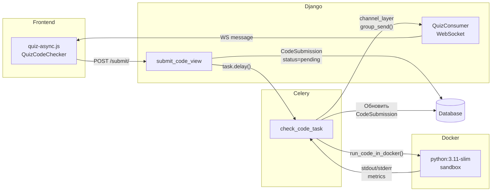
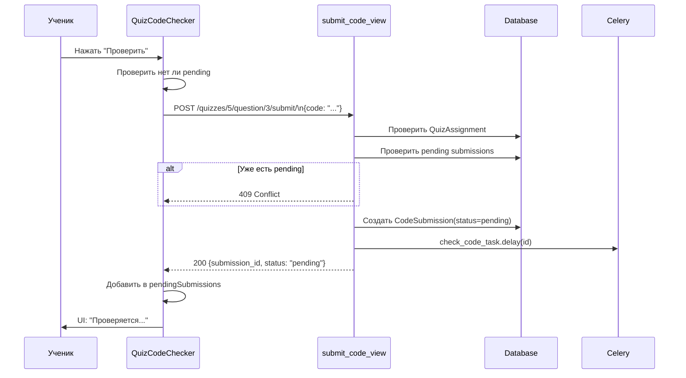
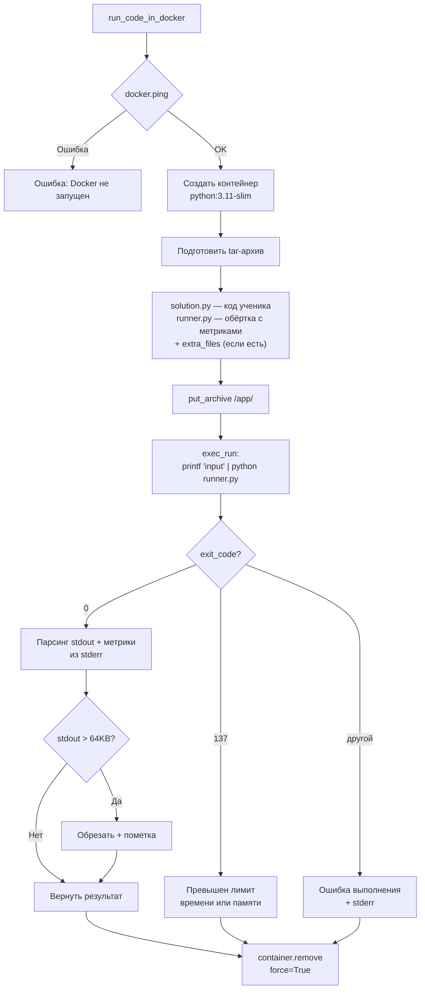
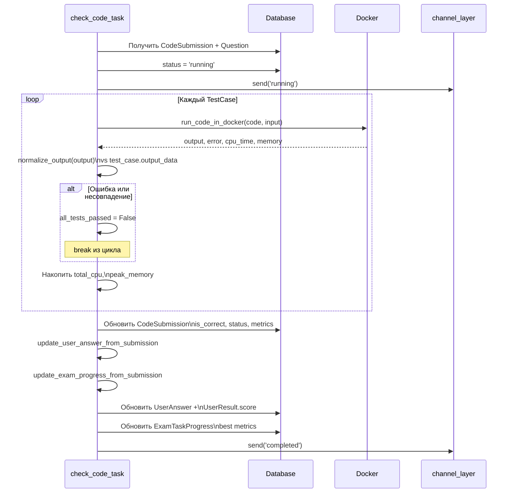
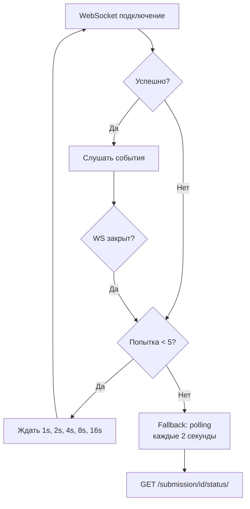

# Выполнение кода

Async pipeline: клиент → Django → Celery → Docker → WebSocket → клиент.

---

## Общая архитектура



---

## Отправка кода (Frontend → Backend)



---

## Docker Sandbox

### Ресурсные лимиты

| Параметр | Значение | Описание |
|----------|----------|----------|
| `CONTAINER_TIMEOUT` | 150 сек | Максимальное время жизни контейнера |
| `CONTAINER_MEM_LIMIT` | 128 MB | Лимит оперативной памяти |
| `CONTAINER_CPU_QUOTA` | 100000 | 100% одного ядра CPU |
| `OUTPUT_MAX_BYTES` | 64 KB | Максимальный размер stdout |
| Network | Отключена | Контейнер не имеет сети |

### Процесс выполнения



### Runner Script (runner.py)

Обёртка, которая выполняет код ученика и собирает метрики:

```
1. Прочитать solution.py
2. Перехватить stdin → StringIO
3. Перехватить stdout → StringIO
4. exec(code) с подменённым stdin/stdout
5. Вывести stdout ученика
6. stderr: __CPU_TIME_MS__:45.123
7. stderr: __MEMORY_KB__:8192
```

Метрики:
- **CPU time** — `time.process_time()` (только CPU, не wall-clock)
- **Memory** — `resource.getrusage(RUSAGE_SELF).ru_maxrss` (пиковое RSS, Linux)

---

## Celery Task Pipeline



### Обновление результатов

После проверки кода Celery task обновляет связанные записи:

**update_user_answer_from_submission:**
1. Найти `UserAnswer` связанный с `CodeSubmission`
2. Обновить `is_correct`, `error_log`, `code_answer`
3. Пересчитать `UserResult.score`:
   - Standard: count distinct correct questions
   - Exam: sum points for correct questions

**update_exam_progress_from_submission:**
1. Найти/создать `ExamTaskProgress`
2. Обновить `is_solved`, `first_solved_at`
3. Обновить лучшие метрики (если лучше предыдущих):
   - `best_cpu_time_ms` + `best_cpu_code`
   - `best_memory_kb` + `best_memory_code`

---

## WebSocket обновления

### QuizConsumer

| Событие | Payload | Когда |
|---------|---------|-------|
| `submission_update` | `{submission_id, question_id, status, is_correct, error_log, cpu_time_ms, memory_kb}` | При изменении статуса |
| `active_submissions` | `[{id, question_id, status}]` | При connect + по запросу |

**Группа:** `user_{user_id}_quiz_{quiz_id}` — изоляция на уровне пользователь+тест.

### Reconnection & Fallback



---

## Очистка зависших задач

`cleanup_stale_submissions()` — периодическая задача Celery Beat (каждые 3 минуты):

1. Найти `CodeSubmission` со статусом `pending`/`running` старше 10 минут
2. Установить `status='error'`, `error_log='Превышено время ожидания'`
3. Обновить связанные `UserAnswer`
4. Отправить WS-уведомление

!!! warning "Почему задачи зависают"
    - Docker контейнер завершился по OOM, но Celery не получил результат
    - Celery worker перезапустился во время выполнения
    - Сетевая ошибка между Celery и Redis
