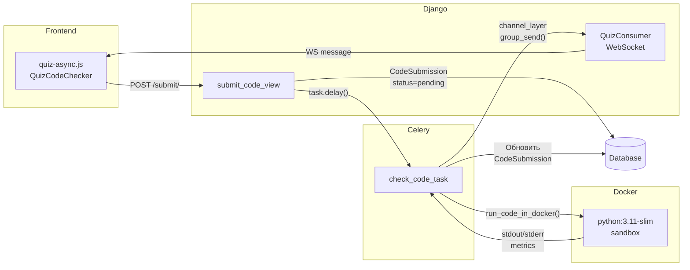
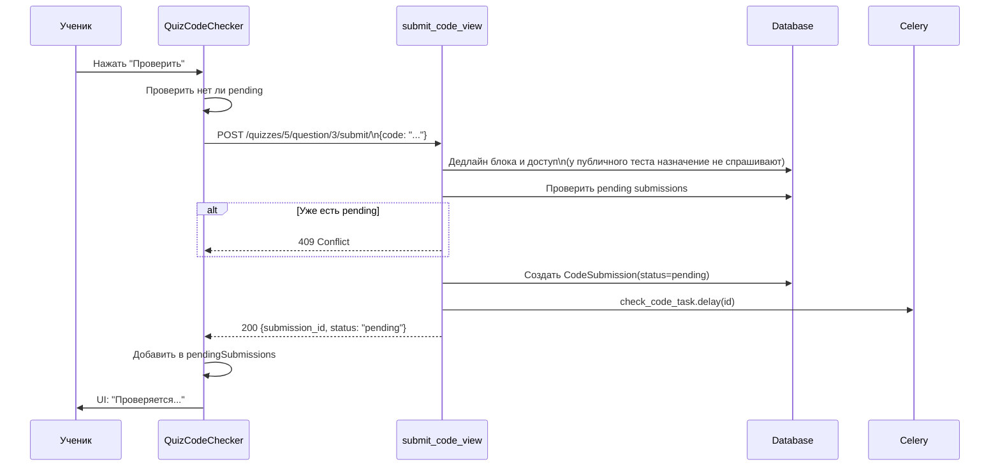
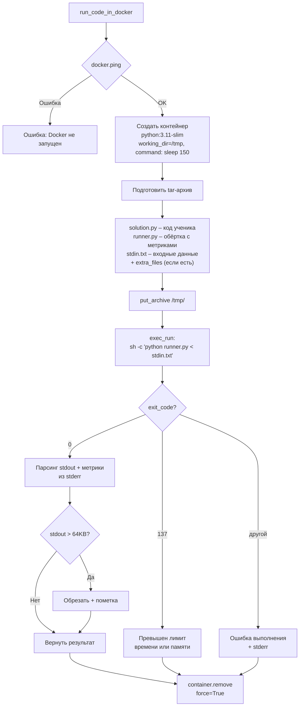
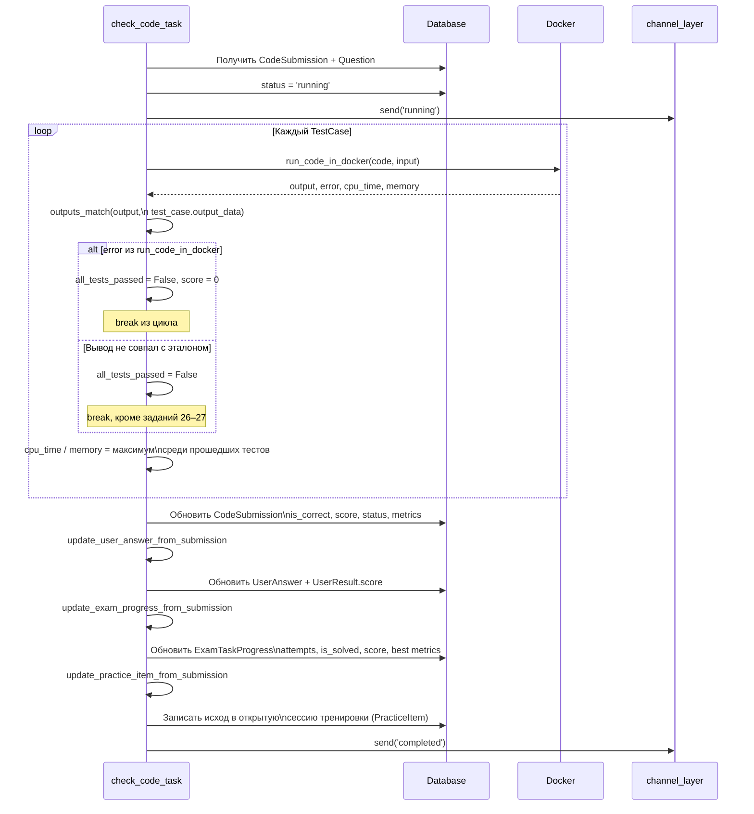
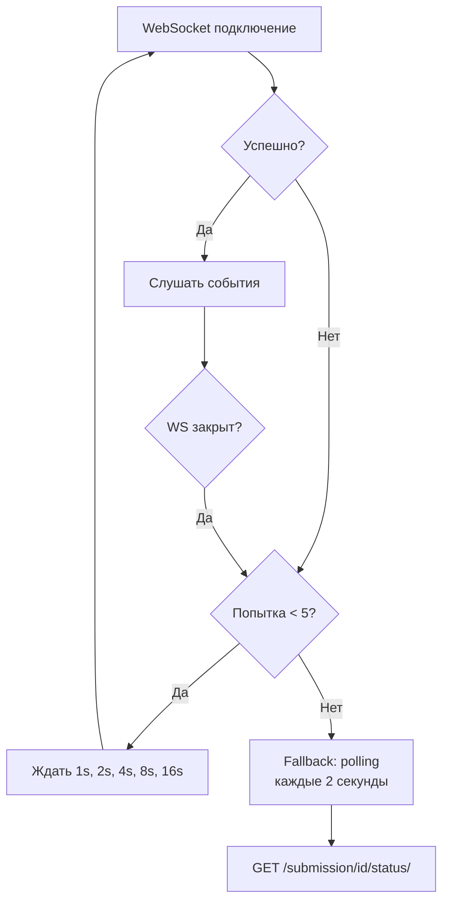

# Выполнение кода

Async pipeline: клиент → Django → Celery → Docker → WebSocket → клиент.

---

## Общая архитектура


```mermaid
flowchart LR
    subgraph Frontend
        JS[quiz-async.js\nQuizCodeChecker]
    end

    subgraph Django
        VIEW[submit_code_view]
        CONSUMER[QuizConsumer\nWebSocket]
    end

    subgraph Celery
        TASK[check_code_task]
    end

    subgraph Docker
        CONTAINER[python:3.11-slim\nsandbox]
    end

    JS -->|"POST /submit/"| VIEW
    VIEW -->|"CodeSubmission\nstatus=pending"| DB[(Database)]
    VIEW -->|"task.delay()"| TASK
    TASK -->|"run_code_in_docker()"| CONTAINER
    CONTAINER -->|"stdout/stderr\nmetrics"| TASK
    TASK -->|"Обновить\nCodeSubmission"| DB
    TASK -->|"channel_layer\ngroup_send()"| CONSUMER
    CONSUMER -->|"WS message"| JS
```

---

## Отправка кода (Frontend → Backend)


```mermaid
sequenceDiagram
    participant U as Ученик
    participant JS as QuizCodeChecker
    participant API as submit_code_view
    participant DB as Database
    participant C as Celery

    U->>JS: Нажать "Проверить"
    JS->>JS: Проверить нет ли pending
    JS->>API: POST /quizzes/5/question/3/submit/\n{code: "..."}

    API->>DB: Дедлайн блока и доступ\n(у публичного теста назначение не спрашивают)
    API->>DB: Проверить pending submissions
    alt Уже есть pending
        API-->>JS: 409 Conflict
    end
    API->>DB: Создать CodeSubmission(status=pending)
    API->>C: check_code_task.delay(id)
    API-->>JS: 200 {submission_id, status: "pending"}
    JS->>JS: Добавить в pendingSubmissions
    JS->>U: UI: "Проверяется..."
```

---

## Docker Sandbox

### Ресурсные лимиты

| Параметр | Значение | Описание |
|----------|----------|----------|
| `CONTAINER_TIMEOUT` | 150 сек | Максимальное время жизни контейнера |
| `CONTAINER_MEM_LIMIT` | 128 MB | Лимит оперативной памяти (cgroup) |
| `CONTAINER_CPU_QUOTA` | 100000 | 100% одного ядра CPU (cgroup) |
| `CONTAINER_PIDS_LIMIT` | 64 | Потолок числа процессов: `os.fork()` в цикле выедает таблицу процессов сервера, а не контейнера |
| `CONTAINER_FSIZE_LIMIT` | 64 МБ | Потолок на один файл, который пишет решение (`RLIMIT_FSIZE` в раннере) |
| `OUTPUT_MAX_BYTES` | 64 KB | Максимальный размер stdout |
| Network | Отключена | `network_disabled`: не выкачать и не выложить наружу, `pip` тоже не работает |

Ограничения прав собраны в `CONTAINER_SECURITY`:

| Ключ | Значение | Зачем |
|------|----------|-------|
| `user` | `nobody` | Запись только в свой каталог, не в `/etc` и не в корень |
| `cap_drop` | `ALL` | Ни одной capability, даже из дефолтного набора Docker |
| `security_opt` | `no-new-privileges` | setuid-бинарь не поднимет права обратно |
| `network_disabled` | `True` | Сети нет |

Рабочий каталог – `/tmp` (`CONTAINER_WORKDIR`), а не `/app`: каталог из `working_dir` принадлежит root с правами 755, и от `nobody` в нём не создать файл – задачи «запиши результат в файл» перестали бы решаться. У `/tmp` в образе права 1777.

Внутри песочницы ученику позволено всё, что позволено Python: создать файл, прочитать его, запустить процесс. Значение имеет не запрет действий, а их потолок – запрещать `execve` бессмысленно, `solution.py` и так исполняется целиком.

### Процесс выполнения


```mermaid
flowchart TD
    START[run_code_in_docker] --> PING{docker.ping}
    PING -->|Ошибка| ERR_DOCKER[Ошибка: Docker не запущен]
    PING -->|OK| CREATE["Создать контейнер\npython:3.11-slim\nworking_dir=/tmp, command: sleep 150"]
    CREATE --> TAR[Подготовить tar-архив]

    TAR --> FILES["solution.py – код ученика\nrunner.py – обёртка с метриками\nstdin.txt – входные данные\n+ extra_files (если есть)"]
    FILES --> UPLOAD[put_archive /tmp/]
    UPLOAD --> EXEC["exec_run:\nsh -c 'python runner.py &lt; stdin.txt'"]

    EXEC --> EXIT{exit_code?}
    EXIT -->|0| PARSE_OK[Парсинг stdout + метрики\nиз stderr]
    EXIT -->|137| TIMEOUT[Превышен лимит\nвремени или памяти]
    EXIT -->|другой| ERROR[Ошибка выполнения\n+ stderr]

    PARSE_OK --> TRUNC{stdout > 64KB?}
    TRUNC -->|Да| CUT[Обрезать + пометка]
    TRUNC -->|Нет| RETURN[Вернуть результат]
    CUT --> RETURN

    RETURN --> CLEANUP[container.remove\nforce=True]
    TIMEOUT --> CLEANUP
    ERROR --> CLEANUP
```

### Runner Script (runner.py)

Обёртка, которая выполняет код ученика и собирает метрики:

```
1. Игнорировать SIGXFSZ и поставить RLIMIT_FSIZE – потолок на файл, который пишет решение
2. Прочитать stdin (файл `stdin.txt`, поданный на вход шеллом) и подменить его на StringIO
3. Запомнить пиковую память интерпретатора до запуска решения
4. Перехватить stdout → StringIO
5. exec(solution.py, {'__name__': '__main__'})
6. Вывести stdout ученика в настоящий stdout
7. stderr: __CPU_TIME_MS__:45.123
8. stderr: __MEMORY_KB__:8192
```

Метрики:
- **CPU time** – `time.process_time()` (только CPU, не wall-clock)
- **Memory** – `resource.getrusage(RUSAGE_SELF).ru_maxrss` минус пик интерпретатора до запуска решения (пиковое RSS, Linux, КБ)

Потолок `RLIMIT_FSIZE` стоит на один файл: тысяча файлов по чуть-чуть его обойдёт, суммарную квоту дал бы только `storage_opt` на xfs/pquota, которого на обычном overlay2 нет. `SIGXFSZ` глушится намеренно – без этого процесс умирал бы молча, а так ученик видит привычную ошибку «File too large».

---

## Celery Task Pipeline


```mermaid
sequenceDiagram
    participant C as check_code_task
    participant DB as Database
    participant D as Docker
    participant WS as channel_layer

    C->>DB: Получить CodeSubmission + Question
    C->>DB: status = 'running'
    C->>WS: send('running')

    loop Каждый TestCase
        C->>D: run_code_in_docker(code, input)
        D-->>C: output, error, cpu_time, memory
        C->>C: outputs_match(output,\n test_case.output_data)
        alt error из run_code_in_docker
            C->>C: all_tests_passed = False, score = 0
            Note over C: break из цикла
        else Вывод не совпал с эталоном
            C->>C: all_tests_passed = False
            Note over C: break, кроме заданий 26–27
        end
        C->>C: cpu_time / memory = максимум\nсреди прошедших тестов
    end

    C->>DB: Обновить CodeSubmission\nis_correct, score, status, metrics
    C->>C: update_user_answer_from_submission
    C->>DB: Обновить UserAnswer + UserResult.score
    C->>C: update_exam_progress_from_submission
    C->>DB: Обновить ExamTaskProgress\nattempts, is_solved, score, best metrics
    C->>C: update_practice_item_from_submission
    C->>DB: Записать исход в открытую\nсессию тренировки (PracticeItem)
    C->>WS: send('completed')
```

Задача на код выполняется в очереди `code_execution` – маршрут задан в `task_routes` (`config/celery.py`), поэтому проверку кода можно развести с остальными задачами по разным воркерам.

### Зачёт задачи

Задача засчитана, только если прошли **все** тест-кейсы: тест-кейсы – это разные входы одной задачи, а не варианты записи одного ответа. Первый же провал прекращает проверку и попадает в `error_log` (плюс к нему – вывод ученика и входные данные, но не эталон).

Исключение – задания 26 и 27 (`ege_scoring.is_partial_task`): неверный ответ там ещё может стоить 1 балла, поэтому прогоняются все тесты, а баллом становится **худший** из них (`grade()`). Решённой такая задача считается только при полном балле (`score >= question.points`) – частичный балл остаётся в работе над ошибками, а в статистику идёт половиной верного ответа.

Метрики берутся по худшему из прошедших тестов (`max` по времени и по памяти), а не по одному удачному запуску: иначе решение выглядело бы лучше, чем есть. Если задача не засчитана, метрики не сохраняются вовсе (`cpu_time_ms` и `memory_kb` остаются пустыми).

### Обновление результатов

После проверки кода Celery task обновляет связанные записи:

**update_user_answer_from_submission:**
1. Найти `UserAnswer` связанный с `CodeSubmission`
2. Обновить `is_correct`, `score`, `error_log`, `code_answer`
3. Пересчитать `UserResult.score` под `select_for_update` – тест мог быть закрыт, пока проверка ещё шла:
   - Standard: count distinct correct questions
   - Exam: сумма баллов; там, где балл частичный (26 и 27), берётся `answer.score`, иначе `question.points` за верный ответ
4. Для самопроверки учебника – `update_article_mastery`: пройденная самопроверка помечает статью «освоено»

**update_exam_progress_from_submission** (выходит сразу, если `quiz_type != 'exam'`):
1. Найти/создать `ExamTaskProgress`
2. Пока задача не решена – `attempts_to_solve += 1`. После решения счётчик замирает: он показывает, с какой попытки задача взята, а не сколько раз ученик потом переписывал решение
3. Частичный балл (26 и 27) – держится лучший: неудачная вторая попытка не должна отнимать уже заработанное
4. Обновить `is_solved`, `first_solved_at`
5. Обновить лучшие метрики (меньше = лучше), если лучше предыдущих:
   - `best_cpu_time_ms` + `best_cpu_code`
   - `best_memory_kb` + `best_memory_code`

**update_practice_item_from_submission:**
Записывает исход в **незавершённую** сессию тренировки ученика с этой задачей: `attempts += 1`, дальше `is_correct` и `score`. Провал сюда тоже попадает – по последнему исходу собирается работа над ошибками. Закрытую задачу (`PracticeItem.is_locked`) повторная отправка не меняет: счётчик попыток и отказ от задачи должны остаться такими, как были. В сессии `kind='retry'` записывается только успех – неудачный эксперимент не переводит уже решённую задачу в нерешённые.

---

## WebSocket обновления

### QuizConsumer

| Событие | Payload | Когда |
|---------|---------|-------|
| `submission_update` | `{submission_id, question_id, status, is_correct, error_log, event_type, cpu_time_ms, memory_kb}` | При изменении статуса |
| `active_submissions` | `{submissions: [{id, question_id, status}]}` | При connect + в ответ на `{"action": "get_status"}` |

**Группа:** `user_{user_id}_quiz_{quiz_id}` – изоляция на уровне пользователь+тест.

### Reconnection & Fallback


```mermaid
flowchart TD
    WS[WebSocket подключение] --> OPEN{Успешно?}
    OPEN -->|Да| LISTEN[Слушать события]
    OPEN -->|Нет| RETRY{Попытка < 5?}
    RETRY -->|Да| BACKOFF["Ждать 1s, 2s, 4s, 8s, 16s"]
    BACKOFF --> WS
    RETRY -->|Нет| POLLING[Fallback: polling\nкаждые 2 секунды]
    POLLING --> POLL_EP["GET /submission/id/status/"]

    LISTEN --> CLOSE{WS закрыт?}
    CLOSE -->|Да| RETRY
```

---

## Очистка зависших задач

`cleanup_stale_submissions()` – периодическая задача Celery Beat (раз в 30 минут, `beat_schedule` в `config/celery.py`):

1. Найти `CodeSubmission` со статусом `pending`/`running` старше 10 минут
2. Установить `status='error'`, `error_log='Превышено время ожидания'`
3. Обновить связанные `UserAnswer`
4. Отправить WS-уведомление

!!! warning "Почему задачи зависают"
    - Docker контейнер завершился по OOM, но Celery не получил результат
    - Celery worker перезапустился во время выполнения
    - Сетевая ошибка между Celery и Redis
