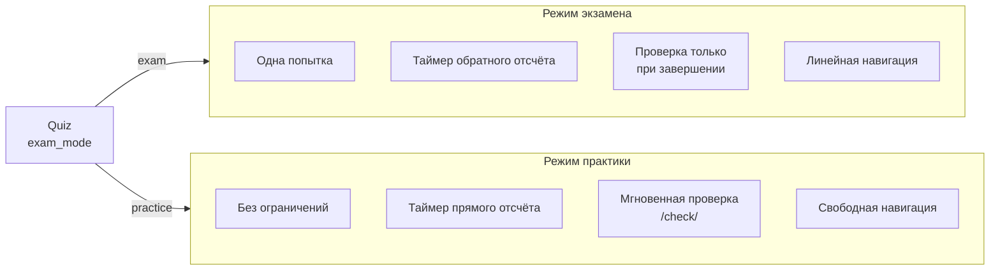
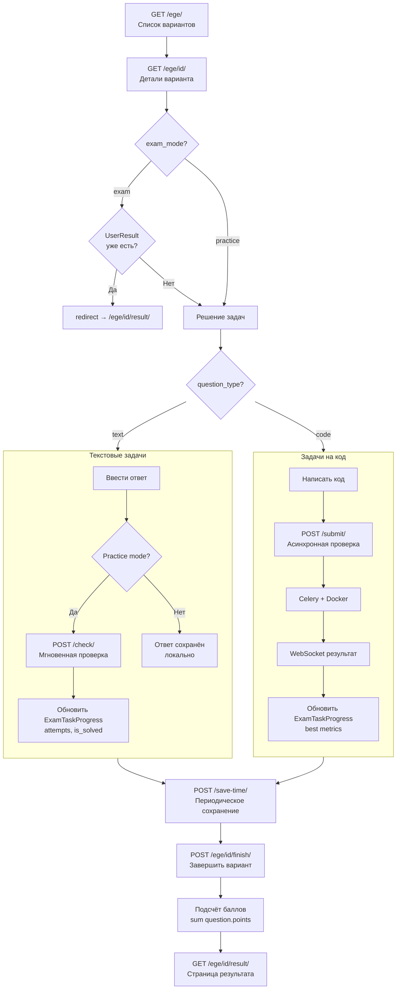
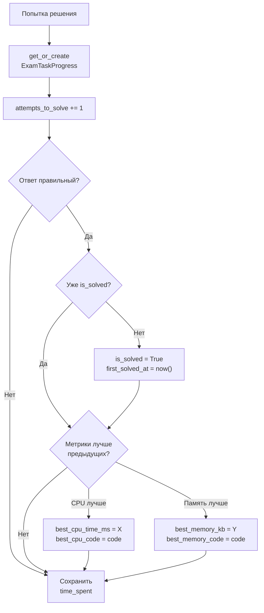
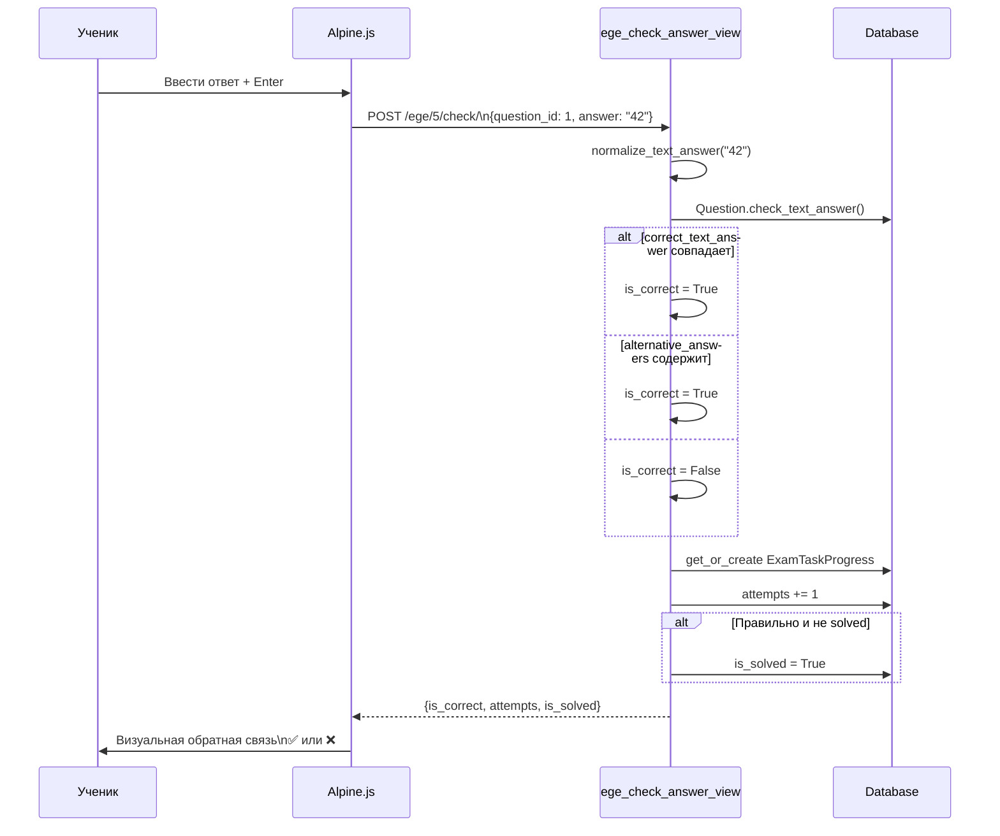
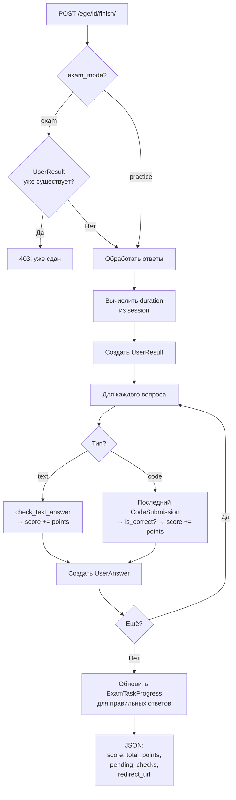

# EGE Тренажёр

Режим подготовки к ЕГЭ по информатике с двумя режимами: экзамен и практика.

---

## Два режима работы



---

## Общий flow



---

## ExamTaskProgress — Отслеживание прогресса

Модель хранит прогресс по каждой задаче для каждого ученика.



### Хранимые метрики

| Метрика | Описание | Обновление |
|---------|----------|------------|
| `time_spent_seconds` | Общее время на задачу | При каждом save-time |
| `attempts_to_solve` | Количество попыток | При каждой проверке |
| `is_solved` | Решена ли задача | При первом правильном ответе |
| `first_solved_at` | Когда решена впервые | Однократно |
| `best_cpu_time_ms` | Лучшее время CPU | Если лучше предыдущего |
| `best_cpu_code` | Код лучшего по CPU | Вместе с best_cpu_time_ms |
| `best_memory_kb` | Лучшее использование RAM | Если лучше предыдущего |
| `best_memory_code` | Код лучшего по памяти | Вместе с best_memory_kb |

---

## Проверка текстового ответа (Practice)



---

## Завершение варианта



---

## Дополнительные функции

### Прикрепление решений

`POST /ege/<id>/task/<num>/upload-attachment/` — загрузка файла или скриншота решения.

- `SolutionAttachment` с `unique_together = [user, quiz, question]`
- Повторная загрузка обновляет существующее прикрепление

### Просмотр решений

`GET /ege/<id>/task/<num>/solution/<user_id>/` — просмотр решения ученика.

Доступно автору и staff. Показывает код, прикреплённые файлы, метрики.

### Лайки решений

`POST /ege/solutions/<answer_id>/like/` — toggle лайка.

- `SolutionLike` с `UniqueConstraint(user, answer)`
- Повторный запрос убирает лайк
- Отображается в профиле ученика (`likes_received`)

---

## Сохранение времени

Фронтенд периодически отправляет `POST /ege/<id>/save-time/` с текущим `time_spent` для активной задачи. Это обеспечивает сохранение прогресса даже при закрытии вкладки.

```json
{"question_id": 1, "time_spent": 120}
```

Значение **перезаписывает** `ExamTaskProgress.time_spent_seconds` (не инкрементирует).
