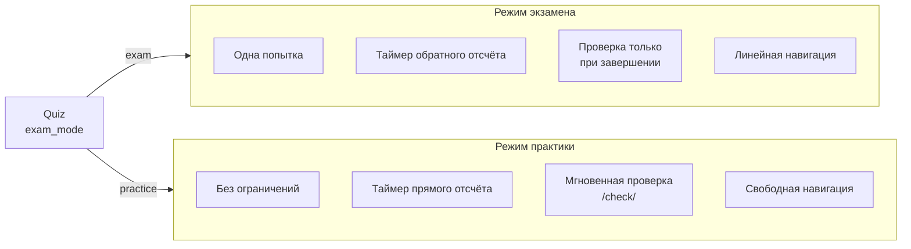
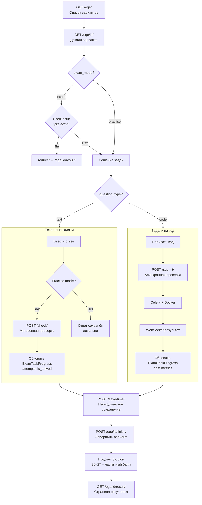
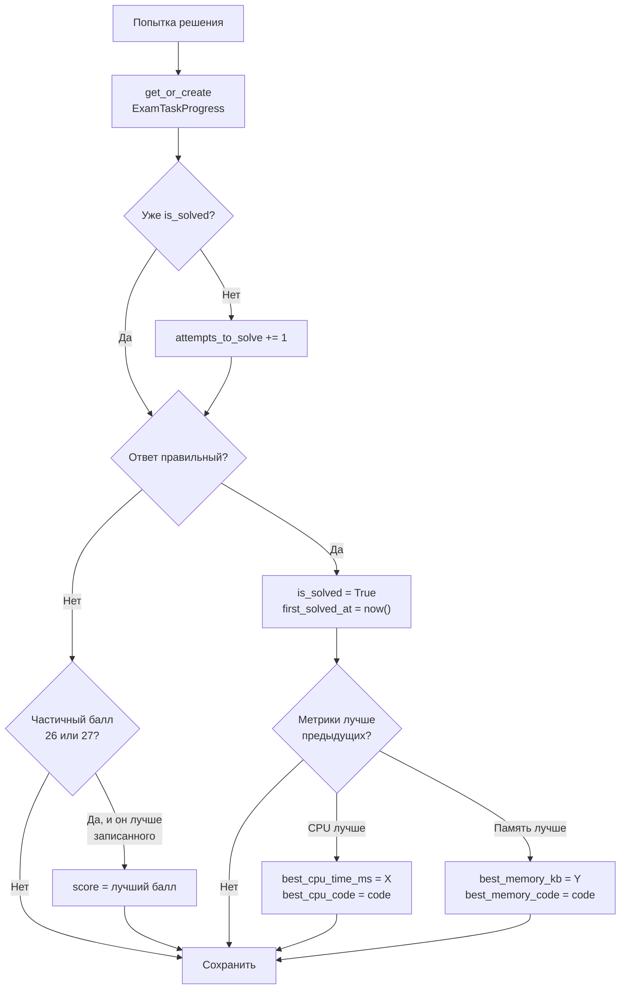
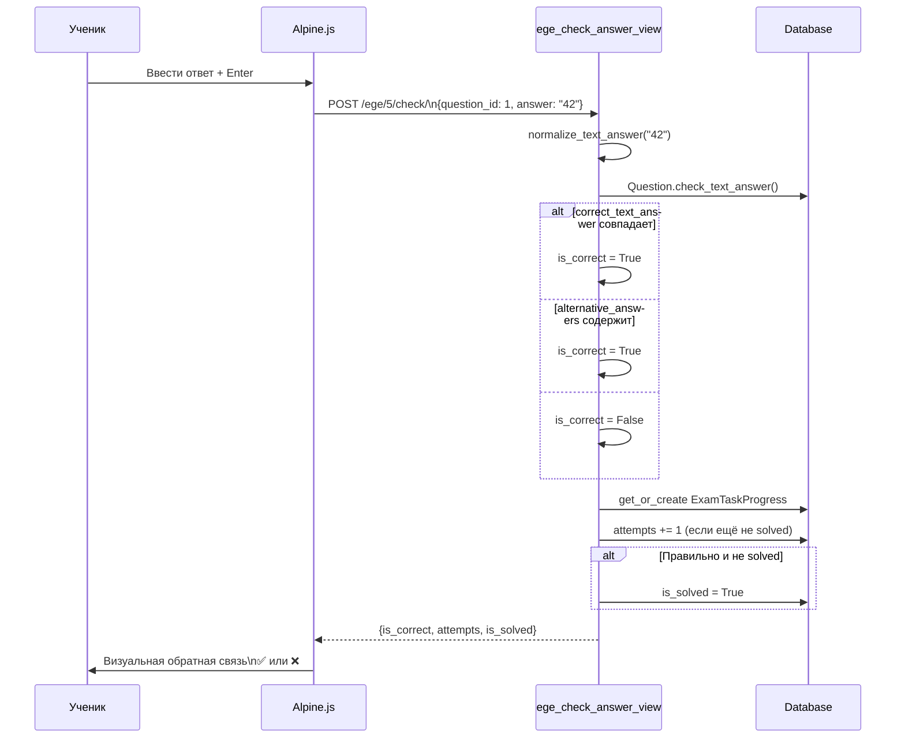
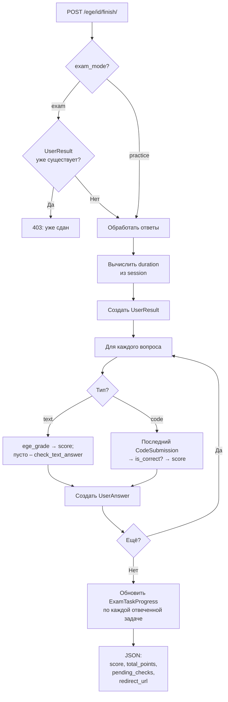
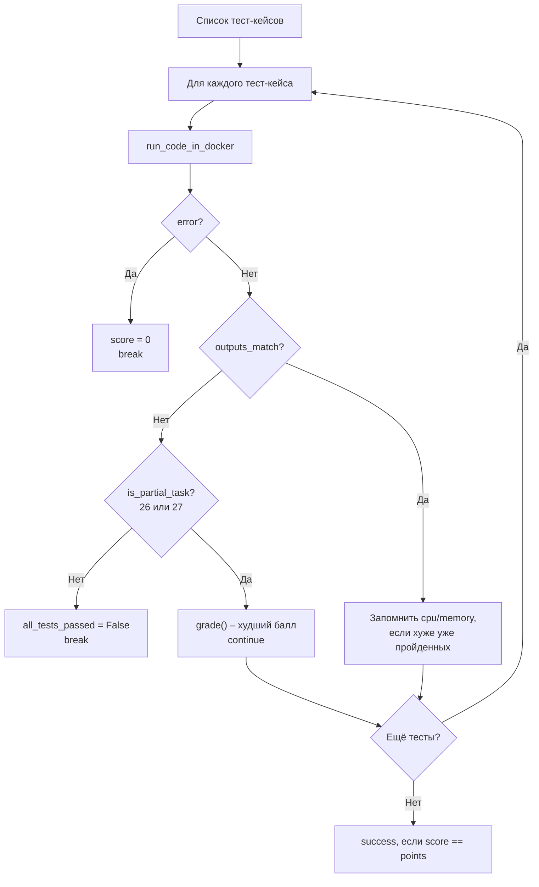
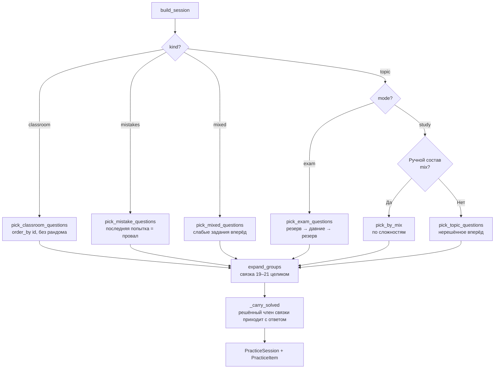
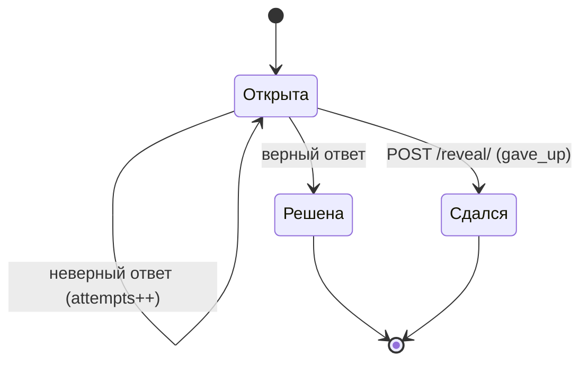

# EGE Тренажёр

Подготовка к ЕГЭ по информатике. Две подсистемы, которые меряют разное и
поэтому не смешивают данные:

| | Вариант | Тренировка по темам |
|---|---------|---------------------|
| Что меряет | Собранную работу целиком, 235 минут | Проработку одного номера |
| Источник задач | `Quiz(quiz_type='exam')` | `Quiz(quiz_type='bank')` |
| Журнал | `ExamTaskProgress` (агрегат) | `PracticeItem` (каждая попытка) |
| Точка входа | `/ege/<id>/` | `/ege/task/<n>/` → сессия |

Задача принадлежит ровно одному квизу, поэтому пересечения нет по построению:
`ege_practice.bank_queryset` читает `PRACTICE_QUIZ_TYPES = ('bank',)`.

---

## Два режима работы


```mermaid
flowchart LR
    subgraph EXAM["Режим экзамена"]
        direction TB
        E1[Одна попытка]
        E2[Таймер обратного отсчёта]
        E3["Проверка только\nпри завершении"]
        E4[Линейная навигация]
    end

    subgraph PRACTICE["Режим практики"]
        direction TB
        P1[Без ограничений]
        P2[Таймер прямого отсчёта]
        P3["Мгновенная проверка\n/check/"]
        P4[Свободная навигация]
    end

    QUIZ[Quiz\nexam_mode] -->|exam| EXAM
    QUIZ -->|practice| PRACTICE
```

---

## Общий flow


```mermaid
flowchart TD
    LIST[GET /ege/\nСписок вариантов] --> DETAIL[GET /ege/id/\nДетали варианта]
    DETAIL --> MODE{exam_mode?}

    MODE -->|exam| EXAM_CHECK{UserResult\nуже есть?}
    EXAM_CHECK -->|Да| RESULT[redirect → /ege/id/result/]
    EXAM_CHECK -->|Нет| SOLVE

    MODE -->|practice| SOLVE[Решение задач]

    SOLVE --> TASK_TYPE{question_type?}

    TASK_TYPE -->|text| TEXT_FLOW
    TASK_TYPE -->|code| CODE_FLOW

    subgraph TEXT_FLOW[Текстовые задачи]
        direction TB
        T1[Ввести ответ] --> T2{Practice mode?}
        T2 -->|Да| T3["POST /check/\nМгновенная проверка"]
        T3 --> T4[Обновить ExamTaskProgress\nattempts, is_solved]
        T2 -->|Нет| T5[Ответ сохранён\nлокально]
    end

    subgraph CODE_FLOW[Задачи на код]
        direction TB
        C1[Написать код] --> C2["POST /submit/\nАсинхронная проверка"]
        C2 --> C3[Celery + Docker]
        C3 --> C4[WebSocket результат]
        C4 --> C5[Обновить ExamTaskProgress\nbest metrics]
    end

    TEXT_FLOW --> SAVE_TIME["POST /save-time/\nПериодическое сохранение"]
    CODE_FLOW --> SAVE_TIME

    SAVE_TIME --> FINISH["POST /ege/id/finish/\nЗавершить вариант"]
    FINISH --> SCORE["Подсчёт баллов\n26–27 – частичный балл"]
    SCORE --> RESULT_PAGE[GET /ege/id/result/\nСтраница результата]
```

---

## ExamTaskProgress – Отслеживание прогресса

Модель хранит прогресс по каждой задаче для каждого ученика.


```mermaid
flowchart TD
    ATTEMPT[Попытка решения] --> PROGRESS[get_or_create\nExamTaskProgress]
    PROGRESS --> SOLVED{Уже is_solved?}
    SOLVED -->|Нет| INC[attempts_to_solve += 1]
    SOLVED -->|Да| CORRECT{Ответ правильный?}
    INC --> CORRECT

    CORRECT -->|Нет| PARTIAL{Частичный балл<br/>26 или 27?}
    CORRECT -->|Да| MARK["is_solved = True\nfirst_solved_at = now()"]

    PARTIAL -->|Да, и он лучше<br/>записанного| SCORE["score = лучший балл"]
    PARTIAL -->|Нет| SAVE[Сохранить]
    SCORE --> SAVE

    MARK --> METRICS{Метрики лучше<br/>предыдущих?}
    METRICS -->|CPU лучше| BEST_CPU["best_cpu_time_ms = X\nbest_cpu_code = code"]
    METRICS -->|Память лучше| BEST_MEM["best_memory_kb = Y\nbest_memory_code = code"]
    METRICS -->|Нет| SAVE
    BEST_CPU --> SAVE
    BEST_MEM --> SAVE
```

### Хранимые метрики

| Метрика | Описание | Обновление |
|---------|----------|------------|
| `time_spent_seconds` | Общее время на задачу | `+=` при каждом save-time, замирает после первого верного ответа |
| `attempts_to_solve` | С какой попытки задача взята | `+= 1` при каждой проверке, пока `is_solved` ещё `False` |
| `is_solved` | Решена ли задача | При первом правильном ответе; частичный балл за 26 и 27 её не закрывает |
| `score` | Балл, если он частичный (26 и 27) | Держится лучший; пусто у остальных задач |
| `first_solved_at` | Когда решена впервые | Однократно |
| `best_cpu_time_ms` | Лучшее время CPU | Если меньше предыдущего |
| `best_cpu_code` | Код лучшего по CPU | Вместе с best_cpu_time_ms |
| `best_memory_kb` | Лучшее использование RAM | Если меньше предыдущего |
| `best_memory_code` | Код лучшего по памяти | Вместе с best_memory_kb |

---

## Проверка текстового ответа (Practice)


```mermaid
sequenceDiagram
    participant U as Ученик
    participant JS as Alpine.js
    participant API as ege_check_answer_view
    participant DB as Database

    U->>JS: Ввести ответ + Enter
    JS->>API: POST /ege/5/check/\n{question_id: 1, answer: "42"}

    API->>API: normalize_text_answer("42")
    API->>DB: Question.check_text_answer()

    alt correct_text_answer совпадает
        API->>API: is_correct = True
    else alternative_answers содержит
        API->>API: is_correct = True
    else
        API->>API: is_correct = False
    end

    API->>DB: get_or_create ExamTaskProgress
    API->>DB: attempts += 1 (если ещё не solved)
    alt Правильно и не solved
        API->>DB: is_solved = True
    end

    API-->>JS: {is_correct, attempts, is_solved}
    JS->>U: Визуальная обратная связь\n✅ или ❌
```

Проверка доступна только в тренировочном варианте: при `exam_mode != 'practice'` возвращается 403. Принимается и `choice` – тип проверяется вместе с `text` (всё остальное даёт 400). Балл здесь не ставится: растут только `attempts_to_solve` и `is_solved`, а балл варианта считает `finish` по своим правилам.

---

## Завершение варианта


```mermaid
flowchart TD
    FINISH["POST /ege/id/finish/"] --> EXAM_MODE{exam_mode?}

    EXAM_MODE -->|exam| EXISTS{UserResult\nуже существует?}
    EXISTS -->|Да| DENY[403: уже сдан]
    EXISTS -->|Нет| PROCESS

    EXAM_MODE -->|practice| PROCESS[Обработать ответы]

    PROCESS --> DURATION[Вычислить duration\nиз session]
    DURATION --> RESULT[Создать UserResult]
    RESULT --> LOOP[Для каждого вопроса]

    LOOP --> QTYPE{Тип?}
    QTYPE -->|text| CHECK_TEXT[ege_grade → score;\nпусто – check_text_answer]
    QTYPE -->|code| CHECK_CODE[Последний CodeSubmission\n→ is_correct? → score]

    CHECK_TEXT --> ANSWER[Создать UserAnswer]
    CHECK_CODE --> ANSWER
    ANSWER --> NEXT{Ещё?}
    NEXT -->|Да| LOOP
    NEXT -->|Нет| UPDATE_PROGRESS[Обновить ExamTaskProgress\nпо каждой отвеченной задаче]
    UPDATE_PROGRESS --> RESPONSE["JSON:\nscore, total_points,\npending_checks,\nredirect_url"]
```

---

## Логика проверки code-задач

Задача на код засчитывается, только если прошли **все** тест-кейсы: тест-кейсы – это разные входы одной задачи, а не варианты записи одного ответа. Первый же провал прекращает проверку и попадает в `error_log`.


```mermaid
flowchart TD
    CASES[Список тест-кейсов] --> LOOP[Для каждого тест-кейса]
    LOOP --> RUN[run_code_in_docker]
    RUN --> ERR{error?}
    ERR -->|Да| FAIL0["score = 0\nbreak"]
    ERR -->|Нет| MATCH{outputs_match?}
    MATCH -->|Нет| PARTIAL{is_partial_task?<br/>26 или 27}
    PARTIAL -->|Нет| FAIL[all_tests_passed = False\nbreak]
    PARTIAL -->|Да| GRADE["grade() – худший балл\ncontinue"]
    MATCH -->|Да| METRICS["Запомнить cpu/memory,<br/>если хуже уже пройденных"]
    METRICS --> MORE{Ещё тесты?}
    GRADE --> MORE
    MORE -->|Да| LOOP
    MORE -->|Нет| DONE["success, если score == points"]
```

Исключение – задания 26 и 27 (`ege_scoring.is_partial_task`): неверный ответ там ещё может стоить 1 балла, поэтому тесты прогоняются до конца, а баллом становится **худший** из них. Решённой такая задача считается только при полном балле; частичный балл остаётся в работе над ошибками.

Вывод сравнивает `ege_scoring.outputs_match` – тот же, что и в синхронной проверке `quiz_detail_view`. Если и эталон, и ответ состоят только из чисел, сравниваются числа по порядку (задание 20 печатает два числа, и «98 293» одной строкой равно тем же числам в две), иначе – нормализованный текст. Метрики берутся по худшему из прошедших тестов, а не по одному удачному запуску.

---

## Дополнительные функции

### Панель ответов для суперпользователя

На странице прохождения теста суперпользователь видит кнопку **«Показать ответ»** под каждым вопросом:

- **Text-вопросы:** правильный ответ + альтернативные варианты
- **Code-вопросы:** все тест-кейсы в виде сетки «Вход / Ожидаемый выход»

### Прикрепление решений

`POST /ege/<id>/task/<num>/upload-attachment/` – загрузка файла или скриншота решения.

- `SolutionAttachment` с `unique_together = [user, quiz, question]`
- Повторная загрузка обновляет существующее прикрепление
- Доступна только по решённой задаче, иначе – редирект на страницу решения
- Документ – до 20 МБ (`txt`, `csv`, `ods`, `odt`, `xlsx`, `doc`, `docx`, `pdf`), изображение – до 5 МБ (`jpg`, `jpeg`, `png`, `gif`, `webp`)

### Просмотр решений

`GET /ege/<id>/task/<num>/solution/<user_id>/` – просмотр решения ученика.

Доступно тому, кто сам решил эту задачу, и суперпользователю: решение открывается только после того, как задача решена (`ExamTaskProgress.is_solved`), иначе – редирект с предупреждением. Показывает код, прикреплённые файлы, метрики и лучшие попытки по CPU и памяти.

### Лайки решений

`POST /ege/solutions/<answer_id>/like/` – toggle лайка.

- `SolutionLike` с `UniqueConstraint(user, answer)`
- Повторный запрос убирает лайк
- Своё решение лайкать нельзя – 403
- Счётчик виден в сводной таблице варианта (`/ege/<id>/results/`) рядом с решением ученика

---

## Сохранение времени

Фронтенд периодически досылает `POST /ege/<id>/save-time/` время, потраченное на активную задачу. Это обеспечивает сохранение прогресса даже при закрытии вкладки.

```json
{"question_id": 1, "seconds": 60}
```

Значение **прибавляется** к `ExamTaskProgress.time_spent_seconds`, а не перезаписывает его. Порция обрезается до 120 секунд за запрос – это защита от подделанного запроса, а не от забытой вкладки. После первого верного ответа время замораживается (ответ помечен `frozen: true`): досчитывать его после решения нечестно по отношению к нормативу.

---

## Тренировка по темам

### Сессия

`PracticeSession` – короткая пачка задач под одну цель. Одна модель закрывает
пять сценариев, различие только в правиле отбора (`kind`):

| `kind` | Что отбирает | Размер |
|--------|--------------|--------|
| `topic` | По номеру задания, нерешённое вперёд | `study_session_size()` или число из формы |
| `mistakes` | Задачи, чья **последняя** попытка провалена | Весь долг целиком |
| `mixed` | По одной задаче из разных заданий, начиная со слабых | 5 |
| `classroom` | Пул `classroom_only`, по `id` – одинаковый у всего класса | Сколько отмечено учителем |
| `retry` | Одна решённая задача на коде, переписать | 1 (+ связка) |

Два режима (`mode`): `study` проверяет ответ сразу, `exam` молчит до разбора
и закрывается сам через `EXAM_MINUTES` от `created_at`.

### Отбор задач


```mermaid
flowchart TD
    START[build_session] --> KIND{kind?}
    KIND -->|classroom| CL[pick_classroom_questions<br/>order_by id, без рандома]
    KIND -->|mistakes| MI[pick_mistake_questions<br/>последняя попытка = провал]
    KIND -->|mixed| MX[pick_mixed_questions<br/>слабые задания вперёд]
    KIND -->|topic| MODE{mode?}
    MODE -->|exam| EX[pick_exam_questions<br/>резерв → давние → резерв]
    MODE -->|study| MIX{Ручной состав<br/>mix?}
    MIX -->|Да| BM[pick_by_mix<br/>по сложностям]
    MIX -->|Нет| TO[pick_topic_questions<br/>нерешённое вперёд]

    CL --> GRP[expand_groups<br/>связка 19–21 целиком]
    MI --> GRP
    MX --> GRP
    EX --> GRP
    BM --> GRP
    TO --> GRP
    GRP --> CARRY[_carry_solved<br/>решённый член связки приходит с ответом]
    CARRY --> DONE[PracticeSession + PracticeItem]
```

Состав экзамена ученик не выбирает: `size` и `mix` из формы игнорируются, `difficulty` сбрасывается – иначе «экзамен» из пяти базовых задач ничего бы не проверял.

**Решённое не выдаётся снова** – `exclude_solved()` убирает верно решённую
задачу из отбора и из счётчиков формы. Исключение – `question_type='code'`:
тот же алгоритм можно написать быстрее или экономнее, поэтому такая задача
может вернуться (последней, начиная с самых давних) и переписывается по кнопке
из `/ege/task/<n>/solved/`.

**Связка 19–21** – `Question.group_id` / `group_order`. Задание 19 описывает
игру, 20 и 21 на неё ссылаются, поэтому `expand_groups` тянет всю тройку в
любом сценарии, включая уже решённых её членов. Размер режется по целым
связкам, одна связка проходит всегда. Уже решённый член приходит с
подставленным ответом и флагом `carried` – он в сессии как условие, а не как
задание, и в статистику не идёт.

### Замок на задаче


```mermaid
stateDiagram-v2
    [*] --> Открыта
    Открыта --> Открыта : неверный ответ (attempts++)
    Открыта --> Решена : верный ответ
    Открыта --> Сдался : POST /reveal/ (gave_up)
    Решена --> [*]
    Сдался --> [*]
```

`PracticeItem.is_locked` – задача решена или ответ открыт; дальнейшие ответы
получают 409. Верный ответ **никогда** не сериализуется в страницу: его отдаёт
только `/reveal/`, и это записывается как отказ от задачи. Поэтому цена
подсказки равна цене неверного ответа, и смотреть её «чтобы проверить себя»
незачем. В сессии `kind='retry'` замка нет вовсе.

### Открытие экзамена

`EgeTask.exam_unlock_threshold` (по умолчанию 10) – сколько **разных** задач
номера нужно решить в режиме `study`, чтобы открылся `exam`.
`ege_practice.exam_access()` возвращает `(открыт, решено, порог)`; форма прячет
кнопку, `practice_start_view` отклоняет прямой POST. Решённое в режиме
экзамена, на уроке и в `retry` порог не двигает.

### Три пула банка

| Пул | Флаг | Где выдаётся |
|-----|------|--------------|
| Тренировка | – | `study`, `mixed`, `mistakes` |
| В классе | `classroom_only` | Только `kind='classroom'`, одинаково у всех |
| Экзамен | `exam_only` | Только `mode='exam'` |

Резерв нужен, чтобы экзамен проверял знание темы, а не память о прорешанных
задачах. Классный набор исключён из **любой** статистики и из счётчика
открытия экзамена: эти задачи разбирают вместе у доски, они меряют урок.
Раскладывают пулы страницей `/ege/task/<n>/bank/` или командой `mark_exam_pool`.

### Сложность – гибридная

`Question.difficulty` приходит из импорта, `Question.solve_rate` пересчитывается
по фактической доле верных **первых** попыток командой `recalc_ege_difficulty`
(ежедневно через Celery Beat). `effective_difficulty()` предпочитает статистику;
те же пороги продублированы в SQL – `ege_practice.effective_difficulty_expr()`.

### Статистика

Вся аналитика – `quizzes/ege_stats.py`, один источник для хаба, профиля и
учительской таблицы: числа обязаны совпадать везде.

- `predicted_score` – **только по экзаменам**: `EGE_TASK_POINTS[n] × точность`.
  Задание без экзамена не даёт ни баллов, ни минут: тренировочную точность
  нельзя повышать до прогноза
- `variant_forecast` – балл **последнего** написанного экзаменационного
  варианта, не среднее: первый вариант писался с половиной непройденных тем
- `class_rows(users)` – весь класс семью запросами вместо `overview()` в цикле
  (это было бы ~500 запросов на страницу), формулы повторены буквально
