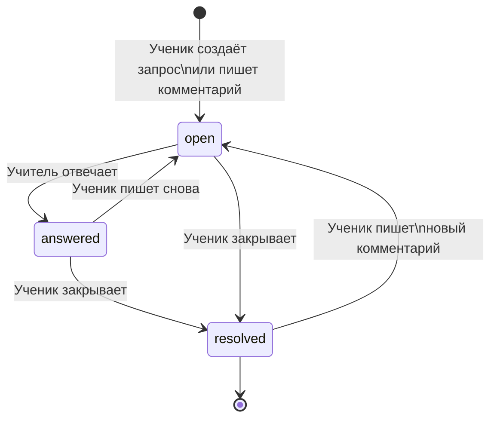
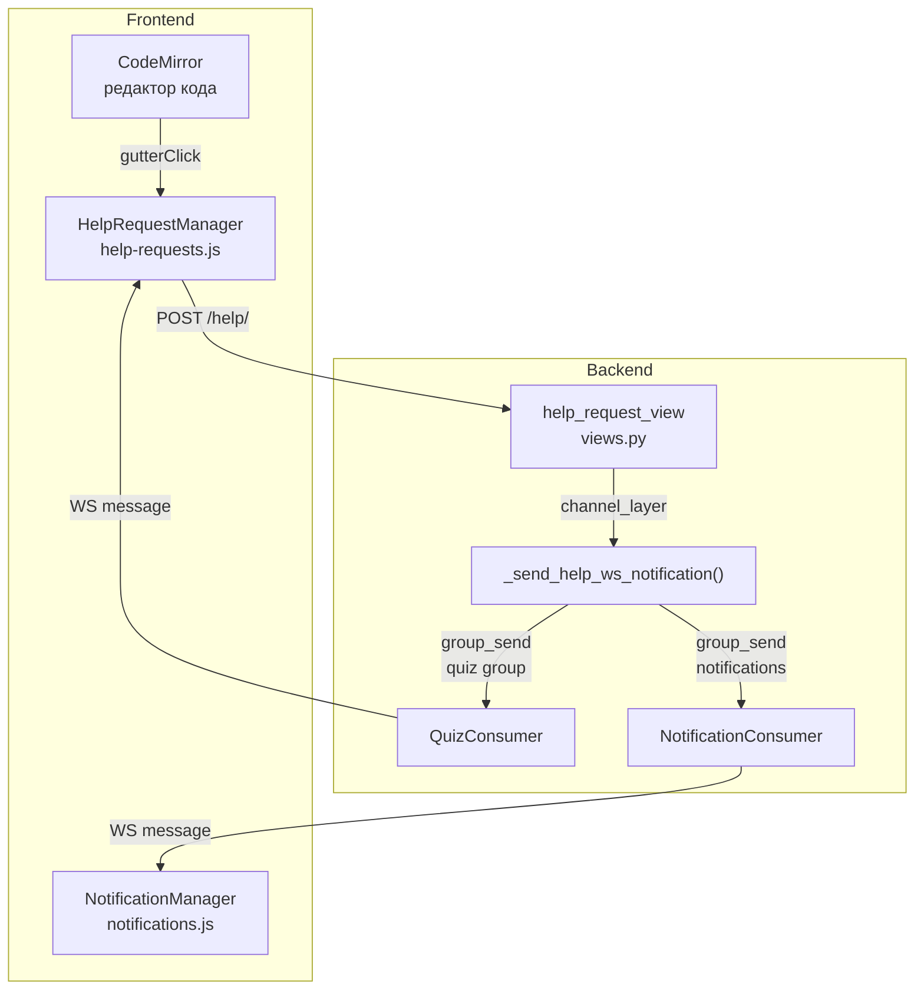
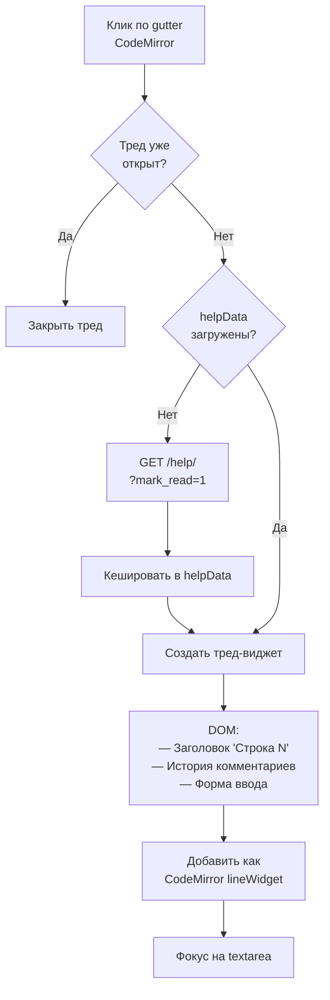
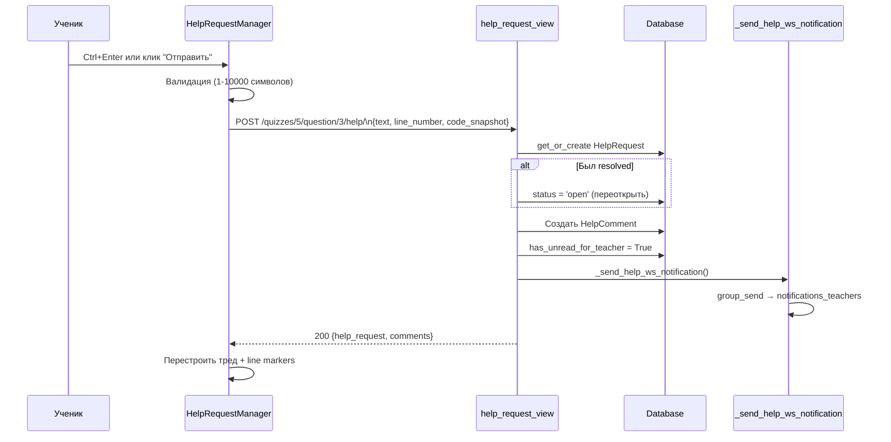
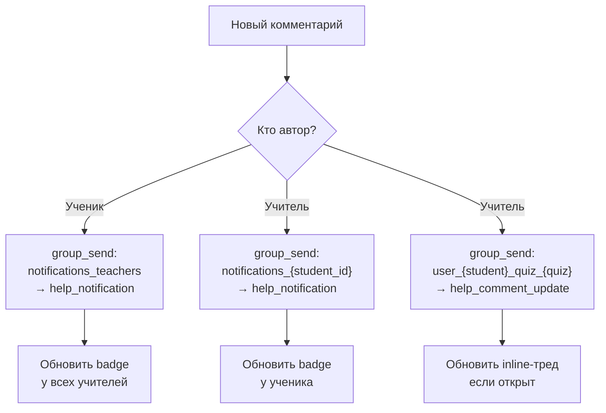

# Система помощи

Тред-система для диалога ученик ↔ учитель с inline-комментариями к строкам кода и уведомлениями в реальном времени.

---

## Жизненный цикл запроса



**Статусы:**

| Статус | Описание | has_unread_for_teacher | has_unread_for_student |
|--------|----------|----------------------|----------------------|
| `open` | Ожидает ответа учителя | ✅ True | — |
| `answered` | Учитель ответил | — | ✅ True |
| `resolved` | Закрыт учеником | — | — |

---

## Архитектура компонентов



---

## Inline-комментарии

Ученик кликает на гutter CodeMirror — открывается тред-виджет для конкретной строки.



### Структура треда

```
┌──────────────────────────────┐
│ 📌 Строка 5              [✕] │
├──────────────────────────────┤
│ student1 • 10:30             │
│ Не понимаю, почему тут ошибка│
│                              │
│ teacher • 10:45              │
│ Посмотри на тип переменной   │
├──────────────────────────────┤
│ [textarea          ] [→]     │
└──────────────────────────────┘
```

### Line Markers

После загрузки данных, `_updateLineMarkers()` добавляет CSS-класс `line-has-comments` к строкам с комментариями — визуальный индикатор в gutter.

---

## Отправка комментария



---

## Уведомления

### Маршрутизация WebSocket уведомлений



### NotificationManager

| Механизм | Когда | Интервал |
|----------|-------|----------|
| WebSocket | Основной | Мгновенно |
| Polling fallback | WS недоступен | 30 секунд |

**Dropdown уведомлений:**

```
┌─ 🔔 3 ─────────────────────────┐
│                                 │
│ Задача 5: Циклы                │
│ Тест: Основы Python            │
│ teacher: Посмотри строку 5...   │
│ 5 мин. назад                    │
│                                 │
│ Задача 2: Строки               │
│ Тест: Строки и списки          │
│ teacher: Правильно, но...       │
│ 2 ч. назад                      │
└─────────────────────────────────┘
```

Клик по уведомлению → `/quizzes/{quiz_id}/?open_help={question_id}#question-{question_id}`

---

## Уникальные ограничения

- **Один запрос на вопрос:** `unique_together = [student, question]` — все комментарии к вопросу в одном треде
- **code_snapshot:** Фиксирует состояние кода на момент комментария — учитель видит контекст
- **Переоткрытие:** Resolved запрос автоматически переоткрывается при новом комментарии
- **mark_read:** GET с `?mark_read=1` сбрасывает флаг `has_unread_for_student`
