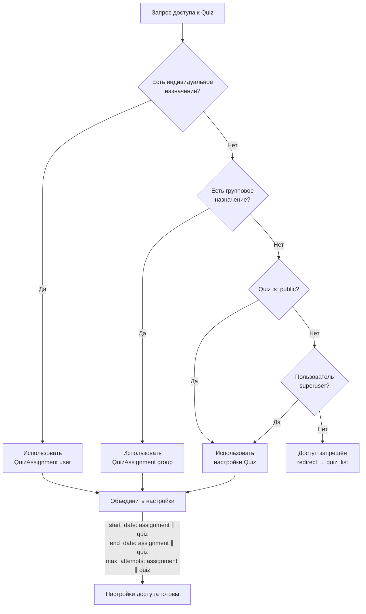
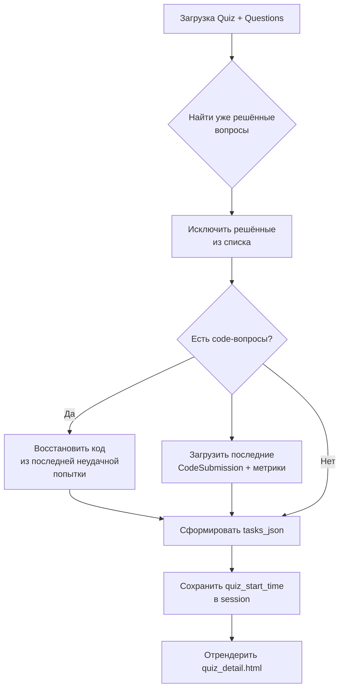
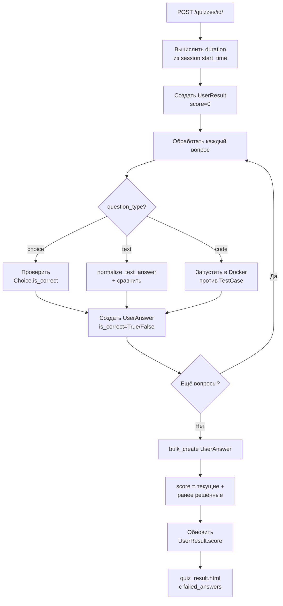
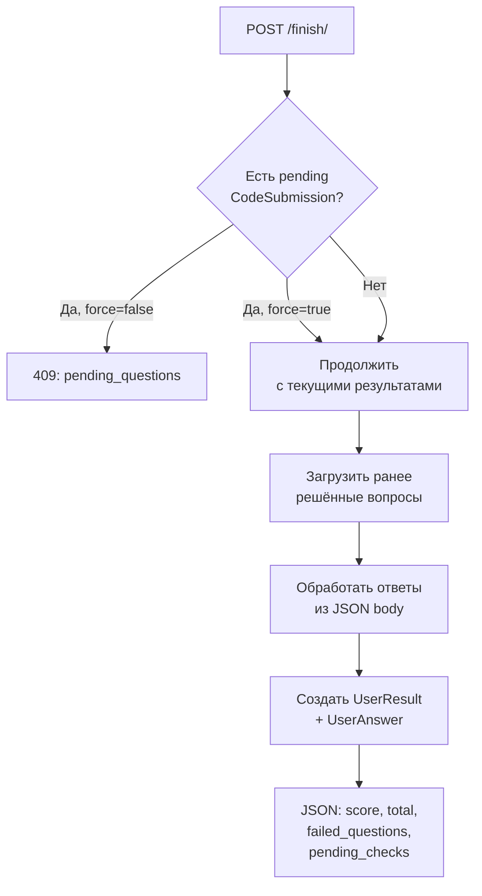

# Quiz Flow

Полный цикл работы с тестами: назначение, контроль доступа, прохождение, подсчёт баллов.

---

## Каскад назначений (Assignment Cascade)

Система определяет доступ к тесту через `get_effective_quiz_settings()`:



**Приоритет полей:** Если в `QuizAssignment` заполнены `start_date`, `end_date` или `max_attempts` — они переопределяют аналогичные поля `Quiz`. Иначе берутся из `Quiz`.

---

## Контроль доступа

```mermaid
flowchart TD
    REQ[GET /quizzes/id/] --> SETTINGS{get_effective_quiz_settings}
    SETTINGS -->|None| DENY[redirect → quiz_list]
    SETTINGS -->|OK| TIME_START{now < start_date?}
    TIME_START -->|Да| NOT_STARTED[redirect: тест ещё не начался]
    TIME_START -->|Нет| TIME_END{now > end_date?}
    TIME_END -->|Да, GET| READ_ONLY[Показать в режиме\nтолько чтение]
    TIME_END -->|Да, POST| EXPIRED[redirect: время вышло]
    TIME_END -->|Нет| ATTEMPTS{max_attempts > 0?}
    ATTEMPTS -->|Да| COUNT{attempts_count\n>= max_attempts?}
    COUNT -->|Да| LIMIT[redirect: попытки исчерпаны]
    COUNT -->|Нет| ACTIVE[Активный режим]
    ATTEMPTS -->|Нет (безлимит)| ACTIVE
```

### Read-Only режим

Когда тест завершён (`end_date` прошёл), ученик может просмотреть свои лучшие ответы:

- Для каждого вопроса выбирается лучший `UserAnswer` (правильный предпочтительнее)
- Код восстанавливается из `code_answer` или связанного `CodeSubmission`
- Нельзя отправлять новые ответы

---

## Прохождение теста

### GET — Загрузка вопросов



### POST — Отправка ответов



---

## Подсчёт баллов

### Standard Quiz
Балл = количество уникальных правильно отвеченных вопросов за все попытки.
Уже решённые вопросы не показываются повторно.

### Exam Quiz
Балл = сумма `question.points` для правильных ответов.
Каждый вопрос может иметь разный вес (1-2 балла в ЕГЭ).

---

## Финализация через API

`POST /quizzes/<id>/finish/` — альтернативный путь (из Alpine.js фронтенда):



!!! tip "Паттерн force/pending"
    Если ученик нажал «Завершить», но код ещё проверяется — фронтенд получит 409 и покажет предупреждение. Повторный запрос с `force=true` завершит тест, используя последний доступный результат каждой посылки.
