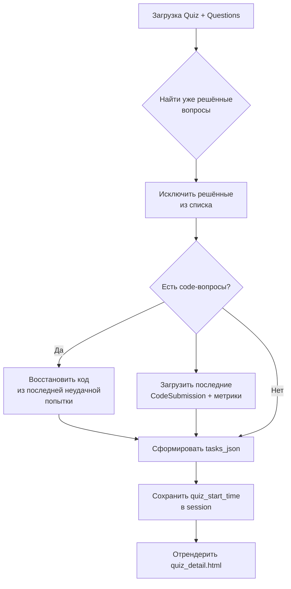
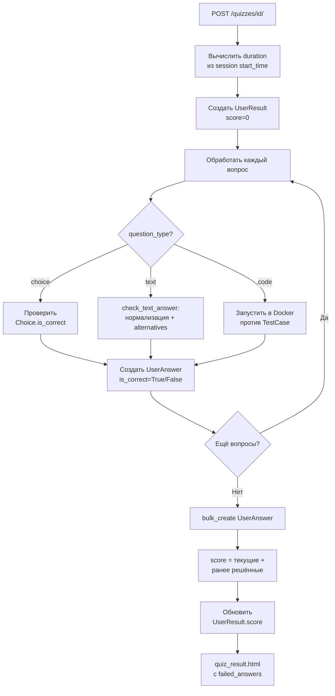
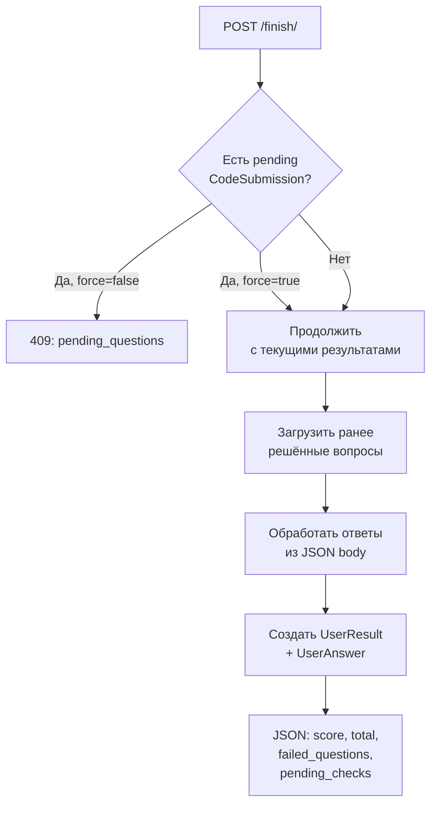

# Quiz Flow

Полный цикл работы с тестами: назначение, контроль доступа, прохождение, подсчёт баллов.

---

## Каскад назначений (Assignment Cascade)

Система определяет доступ к тесту через `get_effective_quiz_settings()`:

```mermaid
flowchart TD
    START[Запрос доступа к Quiz] --> SC{"quiz.is_self_check?<br/>и user авторизован"}
    SC -->|Да| HID{Блок спрятан\n(quiz_is_hidden)?}
    HID -->|Да, и это не superuser| DENY[Доступ запрещён\nredirect → back_url]
    HID -->|Нет| USE_QUIZ[Использовать\nнастройки Quiz]

    SC -->|Нет| IND{Есть индивидуальное\nназначение?}
    IND -->|Да| USE_IND[Использовать\nQuizAssignment user]
    IND -->|Нет| GRP{Есть групповое\nназначение?}
    GRP -->|Да| USE_GRP[Использовать\nQuizAssignment group]
    GRP -->|Нет| SU{Пользователь\nsuperuser?}
    SU -->|Да| USE_QUIZ
    SU -->|Нет| DENY

    USE_IND --> MERGE[Объединить настройки]
    USE_GRP --> MERGE
    USE_QUIZ --> MERGE

    MERGE --> |"start_date: assignment ∥ quiz\nend_date: assignment ∥ quiz\nmax_attempts: assignment ∥ quiz"| ACCESS[Настройки доступа готовы]
```

**Приоритет полей:** Если в `QuizAssignment` заполнены `start_date`, `end_date` или `max_attempts` – они переопределяют аналогичные поля `Quiz`. Иначе берутся из `Quiz`.

**Самопроверки учебника – отдельная ветка.** Тесту с `is_self_check` назначение на группу не нужно: доступ гейтит статья, а не деканат, поэтому настройки берутся прямо из `Quiz`. Единственный гейт – публикация блока: спрятанный блок не должен отдавать свои задачи по прямой ссылке `/quizzes/<id>/`, а суперпользователю видно и спрятанное.

**`is_public` в этой функции не участвует.** Он отсекает чужие варианты в списках `/ege/`, а `submit_code_view` по нему лишь решает, спрашивать ли назначение вовсе.

---

## Контроль доступа

```mermaid
flowchart TD
    REQ[GET /quizzes/id/] --> SETTINGS{get_effective_quiz_settings}
    SETTINGS -->|None| DENY[redirect → back_url]
    SETTINGS -->|OK| TIME_START{now < start_date?}
    TIME_START -->|Да| NOT_STARTED[redirect: тест ещё не начался]
    TIME_START -->|Нет| TIME_END{now > end_date?}
    TIME_END -->|Да, GET| READ_ONLY[Показать в режиме\nтолько чтение]
    TIME_END -->|Да, POST| EXPIRED[redirect: время вышло]
    TIME_END -->|Нет| ATTEMPTS{max_attempts > 0?}
    ATTEMPTS -->|Да| COUNT{attempts_count\n>= max_attempts?}
    COUNT -->|Да| LIMIT[redirect: попытки исчерпаны]
    COUNT -->|Нет| ACTIVE[Активный режим]
    ATTEMPTS -->|Нет (безлимит)| ACTIVE
```

### Дедлайн блока учебника

Тест, привязанный к блоку учебника, закрывается вместе с ним: `quiz_is_locked(quiz, user)` смотрит общий дедлайн `Section` и личное продление (`SectionExtension`). После дедлайна решать нельзя, а смотреть свои ответы – можно: страница уходит в режим только чтения, а `finish_quiz_view` и `submit_code_view` отвечают 403.

### Read-Only режим

Когда тест завершён (`end_date` прошёл), ученик может просмотреть свои лучшие ответы:

- Для каждого вопроса выбирается лучший `UserAnswer` (правильный предпочтительнее)
- Код восстанавливается из `code_answer` или связанного `CodeSubmission`
- Нельзя отправлять новые ответы

---

## Прохождение теста

### GET – Загрузка вопросов

```mermaid
flowchart TD
    LOAD[Загрузка Quiz + Questions] --> SOLVED{Найти уже решённые\nвопросы}
    SOLVED --> FILTER[Исключить решённые\nиз списка]
    FILTER --> CODE{Есть code-вопросы?}
    CODE -->|Да| RESTORE[Восстановить код\nиз последней неудачной\nпопытки]
    CODE --> SUBMISSIONS[Загрузить последние\nCodeSubmission + метрики]
    RESTORE --> JSON[Сформировать tasks_json]
    SUBMISSIONS --> JSON
    CODE -->|Нет| JSON
    JSON --> SESSION[Сохранить quiz_start_time\nв session]
    SESSION --> RENDER[Отрендерить quiz_detail.html]
```

### POST – Отправка ответов

```mermaid
flowchart TD
    POST[POST /quizzes/id/] --> DURATION[Вычислить duration\nиз session start_time]
    DURATION --> RESULT[Создать UserResult\nscore=0]
    RESULT --> LOOP[Обработать каждый вопрос]

    LOOP --> TYPE{question_type?}
    TYPE -->|choice| CHOICE[Проверить\nChoice.is_correct]
    TYPE -->|text| TEXT[check_text_answer:\nнормализация + alternatives]
    TYPE -->|code| DOCKER[Запустить в Docker\nпротив TestCase]

    CHOICE --> ANSWER[Создать UserAnswer\nis_correct=True/False]
    TEXT --> ANSWER
    DOCKER --> ANSWER

    ANSWER --> NEXT{Ещё вопросы?}
    NEXT -->|Да| LOOP
    NEXT -->|Нет| BULK[bulk_create UserAnswer]
    BULK --> SCORE[score = текущие +\nранее решённые]
    SCORE --> UPDATE[Обновить\nUserResult.score]
    UPDATE --> RENDER[quiz_result.html\nс failed_answers]
```

### Подсказка и мгновенная проверка

Две AJAX-точки работают во время прохождения теста:

- `POST /quizzes/question/<question_id>/check/` (`question_check_view`) – вердикт по одному текстовому ответу. Ничего не сохраняет и правильный ответ наружу не отдаёт: балл по-прежнему ставит `finish_quiz_view`. Это единственный способ узнать исход до конца теста; у задач на код ту же роль играет асинхронная проверка.
- `GET/POST /quizzes/question/<question_id>/hint/` (`question_hint_view`) – подсказка. `GET` отдаёт **только состояние** (`offer` / `taken` / `declined` / `None`), без текста: иначе подсказку можно было бы вычитать из сети, не сделав выбора. `POST` с `action=take|decline` фиксирует выбор в `HintChoice` – это уходит учителю в отчёт, ученику нигде не показывается.

Обе точки стоят за тем же гейтом, что и страница теста (`get_effective_quiz_settings`): без него перебор `question_id` отвечает по задачам чужой группы или спрятанного блока, а блочные условия открытия подсказки от назначения теста не зависят.

---

## Подсчёт баллов

### Standard Quiz
Балл = количество уникальных правильно отвеченных вопросов за все попытки.
Уже решённые вопросы не показываются повторно.

### Exam Quiz
Балл = сумма баллов за отвеченные задачи: `question.points` за верный ответ, а за задания 26 и 27 – балл из `ege_scoring.grade()` (0/1/2), который может быть частичным. Каждый вопрос имеет свой вес (1-2 балла в ЕГЭ).

---

## Финализация через API

`POST /quizzes/<id>/finish/` – альтернативный путь (из Alpine.js фронтенда):

```mermaid
flowchart TD
    FINISH[POST /finish/] --> PENDING{Есть pending\nCodeSubmission?}
    PENDING -->|Да, force=false| CONFLICT[409: pending_questions]
    PENDING -->|Да, force=true| PROCEED[Продолжить\nс текущими результатами]
    PENDING -->|Нет| PROCEED
    PROCEED --> SOLVED[Загрузить ранее\nрешённые вопросы]
    SOLVED --> PROCESS[Обработать ответы\nиз JSON body]
    PROCESS --> RESULT[Создать UserResult\n+ UserAnswer]
    RESULT --> RESPONSE["JSON: score, total,\nfailed_questions,\npending_checks"]
```

!!! tip "Паттерн force/pending"
    Если ученик нажал «Завершить», но код ещё проверяется – фронтенд получит 409 и покажет предупреждение. Повторный запрос с `force=true` завершит тест, используя последний доступный результат каждой посылки.

!!! note "Тест учебника"
    У самопроверки после сдачи вызывается `update_article_mastery`: пройденный тест помечает статью статусом «освоено». `redirect_url` в ответе – адрес статьи с якорем `#self-check`, у практикума – главная учебника (`textbook.services.textbook_link_for_quiz`), а не список тестов.
