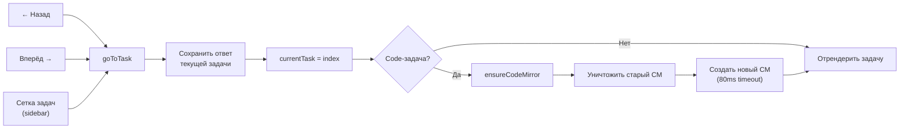
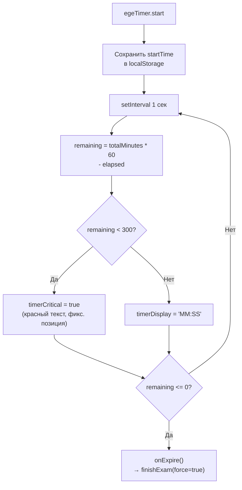
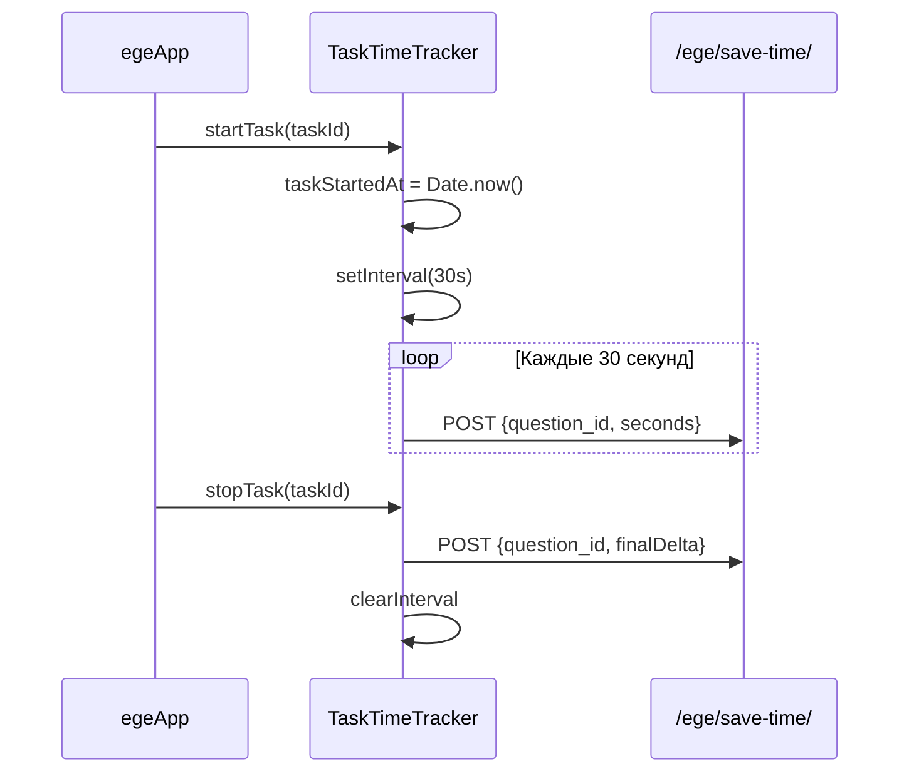

# Alpine.js компоненты

Основные интерактивные компоненты реализованы как Alpine.js `x-data` объекты.

---

## quizApp() — Прохождение теста

**Шаблон:** `quizzes/quiz_detail.html`
**Назначение:** Навигация по задачам, приём ответов, интеграция с CodeMirror и WebSocket.

### Структура данных

```javascript
quizApp() {
  // Задачи и навигация
  tasks: [...],              // массив вопросов из tasks_json
  currentTask: 0,            // индекс текущей задачи

  // Ответы
  answers: {},               // {questionId: value}

  // Проверка кода
  codeStatuses: {},          // {qId: 'pending'|'running'|'success'|'failed'|'error'}
  codeErrors: {},            // {qId: errorMessage}
  codeMetrics: {},           // {qId: {cpu_time_ms, memory_kb}}
  codeChecker: null,         // QuizCodeChecker (WebSocket)

  // Редакторы
  codeMirrors: {},            // {qId: CodeMirror instance}

  // Помощь
  helpManager: null,          // HelpRequestManager

  // UI
  finishing: false,
  showFinishConfirm: false,
  showSavePrompt: false,
  pendingNavigationUrl: null,
  timerDisplay: '',
  timerCritical: false
}
```

### Навигация по задачам



### Сетка задач (sidebar)

```
┌───┬───┬───┬───┬───┐
│ 1 │ 2 │ 3 │ 4 │ 5 │
├───┼───┼───┼───┼───┤
│ 6 │ 7 │ 8 │ 9 │10 │
└───┴───┴───┴───┴───┘
```

Цвета:
- ⬜ Серый — не начата
- 🟦 Синий — есть ответ
- 🟩 Зелёный — решена правильно
- 🟥 Красный — неправильный ответ

### Отправка кода

```javascript
submitCode(qId) {
  const code = codeMirrors[qId].getValue()
  codeStatuses[qId] = 'pending'
  codeChecker.submitCode(qId, code)
}

// Callback от WebSocket:
onStatusChange(qId, status, isCorrect, errorLog, cpuMs, memKb) {
  codeStatuses[qId] = status
  codeErrors[qId] = errorLog
  codeMetrics[qId] = { cpu_time_ms: cpuMs, memory_kb: memKb }
  // Обновить сетку задач
}
```

### Защита от потери данных

- **Link interceptor:** перехватывает клики по `<a>` — показывает `showSavePrompt`
- **beforeunload:** браузерный диалог при наличии несохранённых ответов
- **Finish confirmation:** модальное окно перед завершением теста

---

## egeApp() — EGE-тренажёр

**Шаблон:** `quizzes/ege_detail.html`
**Назначение:** Решение EGE-варианта в режиме экзамена или практики.

### Отличия от quizApp()

| Аспект | quizApp | egeApp |
|--------|---------|--------|
| Таймер | Нет | `EgeTimer` (countdown/count-up) |
| Мгновенная проверка | Нет | `checkAnswer()` (practice) |
| Трекинг времени | Нет | `TaskTimeTracker` (per-task) |
| Сохранение ответов | sessionStorage | localStorage (`EgeAnswerStore`) |
| Баллы | Все по 1 | `question.points` (1-2) |
| Повторные попытки | Исключает solved | Показывает все |

### Дополнительные данные

```javascript
egeApp() {
  // ... все поля quizApp() плюс:

  isExam: false,             // exam vs practice mode
  checkResults: {},          // {qId: true|false} — результат /check/
  checkingAnswer: null,      // qId текущей проверки

  // Вспомогательные объекты
  egeTimer: null,            // EgeTimer (только exam mode)
  timeTracker: null,         // TaskTimeTracker
  answerStore: null,         // EgeAnswerStore (localStorage)
}
```

### EgeTimer (exam mode)



Таймер **персистентен**: `startTime` хранится в `localStorage` → переживает перезагрузку страницы.

### TaskTimeTracker



### Проверка ответа (Practice)

```javascript
async checkAnswer(qId) {
  checkingAnswer = qId
  const resp = await fetch(`/ege/${quizId}/check/`, {
    method: 'POST',
    body: JSON.stringify({ question_id: qId, answer: answers[qId] })
  })
  const data = await resp.json()
  checkResults[qId] = data.is_correct
  if (data.is_solved) tasks[i].is_solved = true
  checkingAnswer = null
}
```

---

## CodeMirror + Alpine.js

### Проблема

CodeMirror 5 не работает корректно в скрытых контейнерах (`display: none`). Alpine `x-show` скрывает элементы через `display: none`, что приводит к повреждению внутреннего состояния CM при переключении задач.

### Решение: Destroy + Recreate

```javascript
ensureCodeMirror(task) {
  // 1. Уничтожить старый инстанс
  if (codeMirrors[task.id]) {
    codeMirrors[task.id].toTextArea()
    delete codeMirrors[task.id]
  }

  // 2. Подождать рендер DOM (80ms)
  setTimeout(() => {
    // 3. Создать новый инстанс
    const cm = CodeMirror.fromTextArea(textarea, {
      mode: 'python',
      theme: 'material-darker',
      lineNumbers: true,
      indentUnit: 4,
      gutters: ['CodeMirror-linenumbers', 'help-gutter']
    })

    // 4. Восстановить значение
    cm.setValue(savedCode || task.last_code || '')

    // 5. Привязать обработчики
    cm.on('change', () => {
      answers[task.id] = cm.getValue()
      sessionStorage.setItem(key, cm.getValue())
    })

    codeMirrors[task.id] = cm
  }, 80)
}
```

!!! tip "Почему 80ms timeout"
    Alpine `x-show` анимирует переход. DOM-элемент textarea должен быть видим и иметь ненулевые размеры, прежде чем CodeMirror сможет корректно вычислить layout. 80ms — эмпирически подобранное значение.

### Загрузка скриптов

```
      ← quizApp() / egeApp() определение
  <script src="quiz-async.js">
  <script src="help-requests.js">
  <script src="ege-timer.js">
  <script>
    function quizApp() { ... }
  </script>


<!-- Alpine.js CDN -->          ← Alpine инициализация (подхватит x-data)

            ← пост-загрузочные скрипты
  <script src="notifications.js">

```
