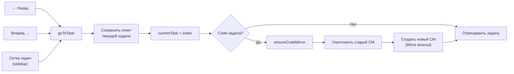
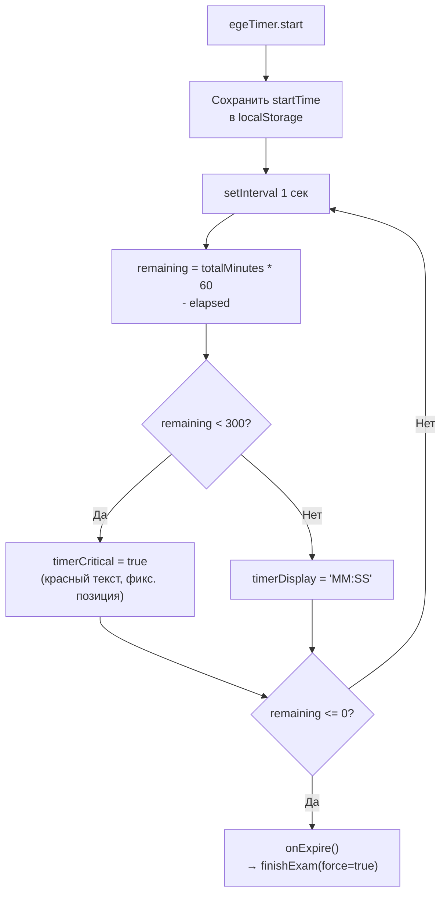
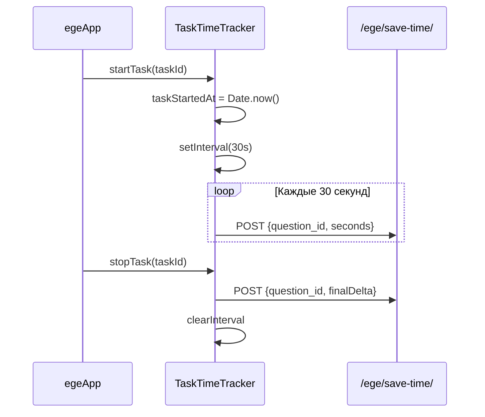
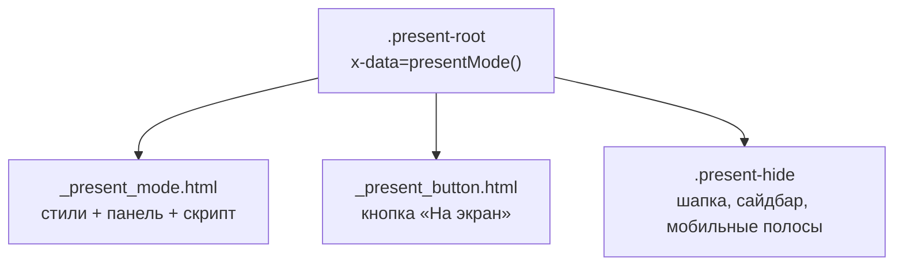

# Alpine.js компоненты

Основные интерактивные компоненты реализованы как Alpine.js `x-data` объекты: часть объявлена функциями прямо в шаблоне (`quizApp()`, `egeApp()`), часть вынесена в отдельные файлы (`presentMode()`, `articlePresent()`, `gameBoard()`).

---

## quizApp() – Прохождение теста

**Шаблон:** `quizzes/quiz_detail.html`
**Назначение:** Навигация по задачам, приём ответов, интеграция с CodeMirror и WebSocket.

### Структура данных

```javascript
quizApp() {
  // Задачи и навигация
  tasks: [...],              // массив вопросов из tasks_json
  currentTask: 0,            // индекс текущей задачи
  answers: {},               // {questionId: value}

  // Проверка
  codeStatuses: {},          // {qId: 'pending'|'running'|'success'|'failed'|'error'}
  textVerdicts: {},          // {qId: true|false} – вердикт по кнопке «Проверить ответ»
  textChecking: {},          // {qId: идёт проверка}
  codeErrors: {},            // {qId: errorMessage}
  codeErrorDetails: {},      // {qId: подробный лог теста}
  codeMetrics: {},           // {qId: {cpu_time_ms, memory_kb}}
  codeChecker: null,         // QuizCodeChecker (WebSocket)

  // Редакторы
  codeMirrors: {},           // {qId: CodeMirror instance}

  // Подсказки
  hintOffer: false,          // показать модалку «нужна подсказка?»

  // UI
  finishing: false,
  showFinishConfirm: false,
  showSavePrompt: false,
  pendingNavigationUrl: null,
  showMobileSidebar: false,
  bestCodeModal: { show, title, subtitle, code, questionId },
  timerDisplay: '00:00:00',
  timerCritical: false,
  quizId, csrfToken
}
```

### Навигация по задачам


```mermaid
flowchart LR
    PREV["← Назад"] --> NAV[goToTask]
    NEXT["Вперёд →"] --> NAV
    GRID["Сетка задач\n(sidebar)"] --> NAV

    NAV --> SAVE[Сохранить ответ\nтекущей задачи]
    SAVE --> SWITCH[currentTask = index]
    SWITCH --> CM{Code-задача?}
    CM -->|Да| ENSURE[ensureCodeMirror]
    CM -->|Нет| RENDER[Отрендерить задачу]
    ENSURE --> DESTROY[Уничтожить старый CM]
    DESTROY --> CREATE["Создать новый CM\n(80ms timeout)"]
    CREATE --> RENDER
```

### Сетка задач (sidebar)

Цвет кнопки задачи считает `taskBtnClass(i)`:

- ⬜ `default` – не начата;
- 🟦 `answered` – есть непустой ответ;
- 🟩 `solved` – решена (`is_solved`, успешная посылка кода или верный текстовый ответ);
- 🟥 `wrong` – посылка кода провалилась;
- `active` – текущая задача.

### Таймер

Свой таймер (не `EgeTimer`): страница получает с сервера `end_date` окна доступа и считает `timerDisplay` до него, раз в секунду. Меньше пяти минут – `timerCritical`, по истечении задача закрывается автоматически (`doFinish(true)`). Если окна нет, таймера на странице нет вовсе.

### Подсказки

Задача не знает о подсказке, пока сервер не отдаст `hint_state` – до трёх неудачных попыток (или до дедлайна) поля в `tasks` попросту нет. `maybeOfferHint()` открывает модалку, `hintDecide(action)` отправляет выбор на `/quizzes/question/<id>/hint/` и получает текст `hint_html` или состояние `declined`.

### Защита от потери данных

- **Link interceptor:** перехватывает клики по `<a>` – показывает `showSavePrompt`
- **beforeunload:** браузерный диалог при наличии несохранённых ответов
- **Finish confirmation:** модальное окно перед завершением теста

---

## egeApp() – Решение EGE-варианта

**Шаблон:** `quizzes/ege_detail.html`
**Назначение:** Решение EGE-варианта целиком (235 минут), в режиме экзамена или практики.

### Отличия от quizApp()

| Аспект | quizApp | egeApp |
|--------|---------|--------|
| Таймер | До `end_date` окна доступа | `EgeTimer`, 235 минут |
| Проверка текстового ответа | `textVerdicts` | `checkResults` (там же и статус «решена») |
| Трекинг времени | Нет | `TaskTimeTracker` (per-task) |
| Сохранение ответов | `sessionStorage` (черновики) | `localStorage` (`EgeAnswerStore`) |
| Баллы | Все по 1 | `question.points`, у заданий 26 и 27 – частичный балл |
| Подсказки | Есть | Нет |

### Дополнительные данные

```javascript
egeApp() {
  // ... поля quizApp() плюс:

  isExam: false,             // '{{ quiz.exam_mode }}' === 'exam'
  checkResults: {},          // {qId: true|false} – результат /ege/<id>/check/
  checkingAnswer: null,      // qId текущей проверки

  egeTimer: null,            // EgeTimer (только exam mode)
  timeTracker: null,         // TaskTimeTracker
  answerStore: null,         // EgeAnswerStore (localStorage)
}
```

### EgeTimer (exam mode)


```mermaid
flowchart TD
    START[egeTimer.start] --> STORE[Сохранить startTime\nв localStorage]
    STORE --> TICK[setInterval 1 сек]
    TICK --> CALC["remaining = totalMinutes * 60\n- elapsed"]
    CALC --> CRITICAL{remaining < 300?}
    CRITICAL -->|Да| RED["timerCritical = true\n(красный текст, фикс. позиция)"]
    CRITICAL -->|Нет| NORMAL["timerDisplay = 'MM:SS'"]
    RED --> ZERO{remaining <= 0?}
    NORMAL --> ZERO
    ZERO -->|Да| EXPIRE["onExpire()\n→ finishExam(force=true)"]
    ZERO -->|Нет| TICK
```

Таймер **персистентен**: `startTime` хранится в `localStorage` → переживает перезагрузку страницы. `stop()` снимает интервал и чистит ключ.

### TaskTimeTracker


```mermaid
sequenceDiagram
    participant APP as egeApp
    participant TT as TaskTimeTracker
    participant API as /ege/save-time/

    APP->>TT: startTask(taskId)
    TT->>TT: taskStartedAt = Date.now()
    TT->>TT: setInterval(30s)

    loop Каждые 30 секунд
        TT->>API: POST {question_id, seconds}
    end

    APP->>TT: stopTask(taskId)
    TT->>API: POST {question_id, finalDelta}
    TT->>TT: clearInterval
```

Своё время считается по задачам, а не по варианту целиком: при переключении `stopTask` предыдущей предшествует `startTask` новой. При восстановлении страницы из bfcache (`pageshow` с `persisted`) `onBfcacheRestore()` сбрасывает устаревшую метку старта.

### Проверка ответа (Practice)

```javascript
async checkAnswer(questionId) {
  checkingAnswer = questionId
  const resp = await fetch(`/ege/${quizId}/check/`, {
    method: 'POST',
    headers: { 'Content-Type': 'application/json', 'X-CSRFToken': csrfToken },
    body: JSON.stringify({ question_id: questionId, answer: answers[questionId] })
  })
  const data = await resp.json()
  if (resp.ok) {
    checkResults[questionId] = data.is_correct
    if (data.is_solved) {
      const task = tasks.find(t => t.id === questionId)
      if (task) { task.is_solved = true; task.attempts = data.attempts }
    }
  }
  checkingAnswer = null
}
```

---

## practiceApp() – Сессия практики ЕГЭ

**Шаблон:** `quizzes/ege_practice.html`
**Назначение:** Короткая сессия по одному заданию (`topic`), работа над ошибками (`mistakes`), смешанная (`mixed`), переписывание кода (`retry`).

Один компонент обслуживает оба режима, и они расходятся принципиально:

| | Тренировка (`study`) | Экзамен (`exam`) |
|---|---|---|
| Проверка | Сразу, с `attempts` | Нет кнопки: ответы автосохраняются, итог – только на странице результата |
| Правильный ответ | Только после «Показать ответ» (`reveal`) | На страницу не попадает вовсе |
| Время | `clock` – сколько прошло | `examLeft` – обратный отсчёт до `deadline` сессии |
| Закрытие задачи | `locked[itemId]` при верном ответе или открытии ответа | Задачу не закрывает никто до конца сессии |

### Ключевые поля

```javascript
practiceApp() {
  items: [...],              // задачи сессии из items_json
  taskRows: [...],           // навигатор, посчитанный на сервере (nav_rows_json)
  sessionId, csrf,

  current: 0,
  answers: {},               // itemId -> ответ
  verdict: {},               // itemId -> true|false
  attempts: {},              // itemId -> сколько раз проверяли
  locked: {},                // itemId -> задача закрыта
  dirty: {},                 // itemId -> ответ введён, но не отправлен
  saved: {},                 // itemId -> ответ принят сервером (режим «Экзамен»)
  correct: {},               // itemId -> правильный ответ (только после reveal)
  errors: {},                // itemId -> лог провалившегося теста
  scores: {},                // itemId -> частичный балл (задания 26 и 27)
  points: {},                // itemId -> сколько баллов стоит задача
  busy: {},                  // itemId -> идёт проверка
  editors: {},               // itemId -> CodeMirror
  examLeft: null,            // секунд до конца экзамена
  _polls: {},                // itemId -> интервал опроса статуса посылки
}
```

Правильный ответ приходит в браузер **единственным путём** – из `practice_reveal_view` по кнопке «Показать ответ»; она же закрывает задачу как нерешённую. На экзамене ни ответ на сохранение, ни разметка страницы результата не несут.

Проверка кода опрашивает `/quizzes/submission/<id>/status/` раз в две секунды (см. [WebSocket](websocket.md)): задачи сессии приходят из разных банков, и один сокет на `quiz_id` их не покрывает.

---

## presentMode() – Режим проектора

**Файл:** `static/js/present-mode.js` (подключается из `templates/_present_mode.html`)
**Назначение:** Показать задание с проектора: страница уходит в нативный полный экран, обвязка прячется, материал масштабируется.


```mermaid
flowchart TD
    ROOT[".present-root\nx-data=presentMode()"] --> MODE["_present_mode.html\nстили + панель + скрипт"]
    ROOT --> BTN["_present_button.html\nкнопка «На экран»"]
    ROOT --> HIDE[".present-hide\nшапка, сайдбар, мобильные полосы"]
```

Механика:

- **Масштаб – через корневой `font-size`**, а не `zoom`: вся вёрстка проекта в rem, поэтому вместе с текстом растут отступы, кнопки и поля ввода, а длинное условие переливается под новую ширину, а не уезжает за край.
- **Диапазон 60–300%**, ввод числом в `<input type="number">` рядом с кнопками шага 20%. Границы и округление до процента – в `setZoom`: пустое поле даёт `0`, и оно отвергается вместе с `NaN`, а в поле возвращается применённое значение.
- **Значение – в `localStorage` под общим ключом** `egePresentZoom`: проектор в кабинете один.
- **Выход и по Esc** отслеживается через `fullscreenchange`, состояние берётся у браузера.
- **CSS `zoom` здесь нельзя** из-за CodeMirror: он меряет ширину символа сам и под `zoom` смешивает масштабированные `rect` с немаштабированными `offset` – код остаётся мелким, каретка уезжает. Поэтому `_resetEditorMetrics()` снимает фокус с редактора при смене масштаба (у редактора без фокуса каретки нет) и чинит геометрию первым кликом. `refresh()`, `setOption` и пересоздание инстанса в этот момент ломают редактор наглухо – все варианты проверены в браузере.
- **Хром проектора не растёт вместе с материалом**: `.present-chrome` в `_present_mode.html` задан в px, а не в rem, иначе на 200% ряд кнопок занимал бы полторы строки урока.

Панель общая для варианта, практикума и тренировки; переход к соседней задаче каждая страница подставляет своим включением:

```

```

Без этих трёх имён панель остаётся с одним масштабом и выходом.

---

## articlePresent() – Показ урока

**Файл:** `static/js/article-present.js`
**Шаблон:** `textbook/article_detail.html`
**Назначение:** Тот же проектор, плюс листание блоков статьи.

`articlePresent()` распространяет (`...base`) объект `presentMode()` и добавляет шаги:

- **Слайд – существующий `ArticleBlock`**, помеченный `data-slide` в `article_detail.html`. Записей в базе под презентацию нет: статья и показ – один текст, расходиться им негде.
- **Листание работает только в полном экране**; вне его страница остаётся обычной статьёй, которую читают скроллом.
- **Узлы слайдов хранятся в замыкании**, а не в состоянии Alpine: DOM-элемент внутри `Proxy` перестаёт быть равным самому себе (та же ловушка, что с `fullscreenElement` в `present-mode.js`). В состояние попадают только индексы.
- **Клавиши:** `→ ↓ PageDown Space` вперёд, `← ↑ PageUp` назад, `Home`/`End` – в начало и конец. Пульт-презентер шлёт `PageUp`/`PageDown`, а не стрелки, поэтому без них учитель привязан к клавиатуре ноутбука. Внутри полей ввода и виджетов клавиши остаются их владельцам.
- Скроллится сам `.present-root`: в полном экране окно не прокручивается, а у корня свой `overflow-y`.

---

## gameBoard() – Доска «Своей игры»

**Файл:** `static/js/svoya-igra-board.js`, шаблон `games/svoya_igra/play.html`
**Назначение:** Поле с категориями, счёт игроков и сохранение состояния партии.

Единственный компонент, зарегистрированный через `Alpine.data('gameBoard', gameBoard)` на `alpine:init`, – остальным файлам хватает глобальной функции.

Состояние партии (`boardState` – какие вопросы сыграны, `players` – имена и очки) живёт на сервере: `board_state` и `players` – JSON-поля `GameSession`. Любая правка вызывает `scheduleSave()` с задержкой 500 мс, чтобы серия нажатий не ушла десятком запросов; ошибка сохранения видна ведущему (`saveError`). Настройка игроков показывается, пока партия не начата: `setupMode` включён, если игроков нет или поле ещё пустое.

---

## startForm() – Форма запуска сессии

**Шаблон:** `quizzes/_ege_start_form.html`
**Назначение:** Выбор режима (Тренировка / Экзамен) и состава сессии на карточке задания.

Получает с сервера числа (`default_size`, `counts.base/medium/high`) и связанными значениями показывает то, что относится к выбранному режиму. Экзамен скрыт, пока закрыт: вместо кнопки рисуется полоса прогресса «решено N из `unlock_threshold` разных задач». Состав экзамена не выбирается – он берётся из резерва, поэтому ручной миксатор в этом режиме спрятан.

---

## Мелкие компоненты

| Шаблон | Объект | Что делает |
|--------|--------|-----------|
| `ege_list.html` | `{ tab }` | Вкладки хаба: карта заданий / варианты / прогресс |
| `ege_results.html` | `resultsPage()` | Сортировка таблицы результатов по колонкам |
| `ege_result.html` | `egeResult()` | Опрос страницы, пока есть непроверенные посылки |
| `ege_solved.html`, `ege_student_mistakes.html`, `ege_bank.html` | `{ open }` | Раскрытие карточки задания |
| `ege_student_mistakes.html`, `ege_practice.html` | `{ peek }` | Взгляд на правильный ответ (только для учителя) |
| `ege_solution_detail.html` | `{ viewMode }` | Переключение решения с лучшим cpu / лучшей памятью |
| `ege_class.html`, `_ege_progress.html` | объект подсказки | Один `data-tip`-тултип на блок таблицы |
| `spetskurs/_simulation_frame.html` | `simulationFrame()` | Кадр WASM-симуляции: тема, перезапуск, полный экран |
| `textbook/textbook_home.html` | `{ open }` | Раскрытие группы блоков |
| `home.html` | `{ flipped }` | Карточка-перевёртыш |
| `base.html` | `{ mobileMenu }`, `{ show }` | Мобильное меню; закрытие flash-сообщения |

---

## CodeMirror + Alpine.js

### Проблема

CodeMirror 5 не работает корректно в скрытых контейнерах (`display: none`). Alpine `x-show` скрывает элементы через `display: none`, что приводит к повреждению внутреннего состояния CM при переключении задач.

### Решение: Destroy + Recreate

Редактор создаётся не из `<textarea>`, а на `<div>`-обёртке (`codemirror-wrap-<id>` в тесте, `cm-wrap-<item_id>` в сессии практики) – это позволяет пересоздавать его, не трогая разметку:

```javascript
ensureCodeMirror() {
  const task = this.tasks[this.currentTask];
  if (!task || task.type !== 'code') return;
  if (this.codeMirrors[task.id]) {
    // 1. Забрать значение и забыть инстанс
    this.answers[task.id] = this.codeMirrors[task.id].getValue();
    delete this.codeMirrors[task.id];
  }

  // 2. Подождать рендер DOM (80ms)
  setTimeout(() => {
    if (this.codeMirrors[task.id]) return;
    const cm = this._createCodeMirror(task);
    if (cm) cm.focus();
  }, 80);
}

_createCodeMirror(task) {
  const wrap = document.getElementById(`codemirror-wrap-${task.id}`);
  if (!wrap || wrap.offsetParent === null) return;   // задача ещё скрыта

  // 3. Удалить осиротевшую разметку прошлого инстанса
  const oldCmEl = wrap.querySelector('.CodeMirror');
  if (oldCmEl) oldCmEl.remove();

  const cm = CodeMirror(wrap, {
    value: this.answers[task.id] || '',
    mode: 'python',
    theme: 'material-darker',
    lineNumbers: true,
    matchBrackets: true,
    autoCloseBrackets: true,
    indentUnit: 4,
    tabSize: 4,
    extraKeys: { Tab: (cm) => cm.replaceSelection('    ', 'end') },
  });

  // 4. Ответ уходит в состояние компонента, а не в скрытое поле
  cm.on('change', () => { this.answers[task.id] = cm.getValue(); });
  this.codeMirrors[task.id] = cm;
  return cm;
}
```

Проверка `offsetParent === null` отсекает попытку создать редактор в скрытом контейнере: у невидимого элемента нет геометрии, и CodeMirror построил бы его с нулевыми размерами.

!!! tip "Почему 80ms timeout"
    Alpine `x-show` анимирует переход. DOM-элемент должен быть видим и иметь ненулевые размеры, прежде чем CodeMirror сможет корректно вычислить layout. 80ms – эмпирически подобранное значение.

В `egeApp()` и `practiceApp()` сохранение ответа идёт в их хранилища (`EgeAnswerStore` / состояние сессии) тем же обработчиком `change`. В `quizApp()` ответы дополнительно ложатся в `sessionStorage`, чтобы пережить уход со страницы: два глубоких `$watch` («`answers`» и «`textVerdicts`») пишут их под ключами `quiz_<id>_question_<qid>` и `quiz_<id>_solved`. Пишутся все типы ответов одинаково – раньше сохранялся только код, и текстовый ответ или выбранный вариант терялись при перезагрузке, потому что уходят на сервер лишь по кнопке «Сохранить результат».

### Загрузка скриптов

```
      ← CodeMirror (cdnjs) + quiz-async.js + определение quizApp()


<!-- Alpine.js CDN -->          ← Alpine инициализация (подхватит x-data)
```

`present-mode.js` и `article-present.js` устроены иначе: их подключает `_present_mode.html` внутри блока `content`, который выводится раньше Alpine в конце `body`. О компоненте в этот момент странице помнить не нужно – он уже объявлен.
