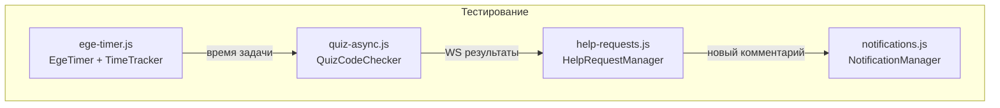

# Фронтенд — Обзор

Фронтенд построен на **Alpine.js** + **Tailwind CSS** с серверным рендерингом Django-шаблонов. Интерактивность реализована через Alpine-компоненты, CodeMirror для редактирования кода и WebSocket для real-time обновлений.

---

## Стек технологий

| Технология | Версия | Назначение | Загрузка |
|-----------|--------|------------|----------|
| **Tailwind CSS** | 3.x | Утилитарный CSS-фреймворк | CDN с custom config |
| **Alpine.js** | 3.14.3 | Реактивные UI-компоненты | CDN (lazy) |
| **CodeMirror** | 5.65.18 | Редактор кода Python | CDN (per-page) |
| **htmx** | 1.9.10 | AJAX-взаимодействия | CDN |
| **AOS** | 2.3.1 | Анимации при скролле | CDN |
| **Swiper** | 11 | Карусель/слайдер | CDN |
| **PhotoSwipe** | 5 | Лайтбокс для изображений | CDN |
| **Highlight.js** | — | Подсветка синтаксиса | CDN (per-page) |
| **Google Fonts** | — | Inter (400-700) | CDN |
| **Font Awesome** | — | Иконки | CDN |

---

## JavaScript файлы

### Собственные (static/js/)

| Файл | Строк | Назначение |
|------|-------|------------|
| `quiz-async.js` | 285 | `QuizCodeChecker` — WebSocket клиент для проверки кода |
| `help-requests.js` | 533 | `HelpRequestManager` — inline-треды в CodeMirror |
| `notifications.js` | 162 | `NotificationManager` — badge + dropdown уведомлений |
| `ege-timer.js` | 180 | `EgeTimer` + `TaskTimeTracker` + `EgeAnswerStore` |

### Инвентарь по функциональности



---

---

## Структура шаблонов

### Template Blocks (base.html)

```
base.html
├──            — заголовок страницы
├──        — per-page CSS (CodeMirror, etc.)
├── Navbar (Alpine: mobileMenu)
├── Messages (Django flash)
├──          — основное содержание
├──    — скрипты ДО Alpine (компоненты)
├── Alpine.js (CDN)
└──         — скрипты ПОСЛЕ Alpine
```

!!! warning "Порядок загрузки скриптов"
    Скрипты, определяющие Alpine-компоненты (`quizApp()`, `egeApp()`), **должны** загружаться в `pre_alpine_js` — до инициализации Alpine.js. Иначе `x-data` не найдёт компонент.

### Шаблоны с Alpine.js (8 файлов)

| Шаблон | Alpine-компонент | Описание |
|--------|-----------------|----------|
| `base.html` | `{ mobileMenu }` | Мобильное меню |
| `about.html` | — | Блоки контента (только display) |
| `quiz_detail.html` | `quizApp()` | Прохождение теста |
| `quiz_list.html` | `{ search }` | Фильтр тестов |
| `ege_detail.html` | `egeApp()` | EGE-тренажёр |
| `ege_result.html` | `{ showDetails }` | Результаты EGE |
| `ege_results.html` | `{ tab }` | История результатов |
| `ege_solution_detail.html` | `{ zoom }` | Просмотр решения |

---

## Навигация (Navbar)

```
┌─────────────────────────────────────────────────┐
│ [Logo]  База знаний  Задачи  ЕГЭ  Об авторе    │
│                                    🔔3  [User ▾] │
└─────────────────────────────────────────────────┘
```

- **Logo** → `/`
- **База знаний** → `/lessons/`
- **Задачи** → `/quizzes/`
- **Тренажёр ЕГЭ** → `/ege/` (если `is_ege`)
- **Об авторе** → `/about/`
- **🔔** — badge уведомлений (`NotificationManager`)
- **User** — dropdown: профиль, выход
- Mobile: hamburger → Alpine `mobileMenu` toggle

---

## Хранение состояния

| Хранилище | Данные | Время жизни |
|-----------|--------|-------------|
| `sessionStorage` | Ответы quiz (текст, код) | До закрытия вкладки |
| `localStorage` | Ответы EGE, таймер EGE | Постоянно |
| Django session | `quiz_start_time` | Серверная сессия |
| URL query params | `?open_help=qId` | Одноразово |

---

## Tailwind Config

Custom-конфигурация в `base.html`:

```javascript
tailwind.config = {
  theme: {
    extend: {
      colors: {
        brand: { /* blue palette */ }
      },
      fontFamily: {
        sans: ['Inter', 'sans-serif']
      }
    }
  }
}
```

Стиль `[x-cloak] { display: none !important }` — скрывает Alpine-элементы до инициализации.
