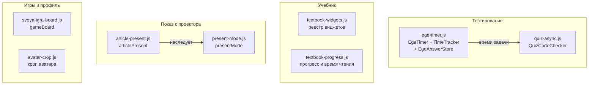

# Фронтенд – Обзор

Фронтенд построен на **Alpine.js** + **Tailwind CSS** с серверным рендерингом Django-шаблонов. Интерактивность реализована через Alpine-компоненты, CodeMirror для редактирования кода и WebSocket для real-time обновлений. Отдельно стоят два режима показа: **проектор** (страница на весь экран с масштабом) и **показ урока** (то же плюс листание блоков статьи).

---

## Стек технологий

| Технология | Версия | Назначение | Загрузка |
|-----------|--------|------------|----------|
| **Tailwind CSS** | 3.4 | Утилитарный CSS-фреймворк | локальная сборка, CDN нет |
| **Alpine.js** | 3.14.3 | Реактивные UI-компоненты | CDN, конец `base.html` |
| **CodeMirror** | 5.65.18 | Редактор кода Python | cdnjs, per-page |
| **Highlight.js** | 11.9.0 | Подсветка готового кода (условия, решения) | cdnjs, per-page |
| **MathJax** | 3 | Вёрстка формул LaTeX | CDN, подключается включением `_mathjax.html` |
| **htmx** | 1.9.10 | Подключён в `base.html`, но `hx-*` в разметке не используется – все AJAX-запросы идут через `fetch` | CDN |
| **AOS** | 2.3.1 | Анимации при скролле (`data-aos`) | CDN |
| **Swiper** | 11 | Карусель/слайдер | CDN |
| **PhotoSwipe** | 5 | Лайтбокс для изображений (`data-pswp-width`) | CDN, `type="module"` |
| **Google Fonts** | – | Inter (400–700) | CDN |

Font Awesome в проекте не подключён: иконки – инлайновые `<svg>` прямо в шаблонах.

---

## CSS-файлы

| Файл | Назначение |
|------|-----------|
| `static/css/tailwind.input.css` | Вход сборки: три директивы `@tailwind` |
| `static/css/tailwind.css` | Результат сборки, подключён в `base.html` |
| `static/css/design-tokens.css` | CSS-переменные (`--color-*`, `--radius-*`, `--shadow-*`) |
| `static/css/textbook-article.css` | Типографика статьи учебника, рамка виджетов, sticky-сайдбар |

Сборка Tailwind описана ниже, в разделе «Сборка CSS».

---

## JavaScript файлы

### Собственные (`static/js/`)

| Файл | Строк | Назначение |
|------|-------|------------|
| `quiz-async.js` | 280 | `QuizCodeChecker` – WebSocket-клиент проверки кода + polling-фолбэк |
| `ege-timer.js` | 180 | `EgeTimer` + `TaskTimeTracker` + `EgeAnswerStore` |
| `present-mode.js` | 108 | `presentMode()` – режим проектора (вариант, практикум, тренировка) |
| `article-present.js` | 73 | `articlePresent()` – проектор + листание блоков статьи |
| `textbook-widgets.js` | ~14700 | Реестр 33 интерактивных виджетов учебника |
| `textbook-progress.js` | 105 | Отметка «прочитано» и учёт времени чтения статьи |
| `svoya-igra-board.js` | 150 | `gameBoard()` – доска «Своей игры» |
| `avatar-crop.js` | 111 | Кроп аватара в `<canvas>` перед отправкой формы |

### Инвентарь по функциональности


```mermaid
graph TB
    subgraph "Тестирование"
        QA[quiz-async.js\nQuizCodeChecker]
        ET[ege-timer.js\nEgeTimer + TimeTracker\n+ EgeAnswerStore]
    end

    subgraph "Учебник"
        TW[textbook-widgets.js\nреестр виджетов]
        TP[textbook-progress.js\nпрогресс и время чтения]
    end

    subgraph "Показ с проектора"
        PM[present-mode.js\npresentMode]
        AP[article-present.js\narticlePresent]
    end

    subgraph "Игры и профиль"
        GB[svoya-igra-board.js\ngameBoard]
        AC[avatar-crop.js\nкроп аватара]
    end

    ET -->|"время задачи"| QA
    AP -->|"наследует"| PM
```

---

## Структура шаблонов

### Template Blocks (`base.html`)

```
base.html
├──           – заголовок страницы
├──         – Яндекс.Метрика (гасится на страницах с чужим именем)
├── Navbar (Alpine: mobileMenu) + переключатель темы
├── Messages (Django flash, Alpine: show)
├──         – основное содержание
├──   – скрипты ДО Alpine (компоненты)
├── Alpine.js → htmx → Swiper → PhotoSwipe → AOS (CDN)
└──        – скрипты ПОСЛЕ Alpine
```

!!! warning "Порядок загрузки скриптов"
    Компонент, который страница объявляет как `x-data="quizApp()"`, должен быть определён **до** инициализации Alpine.js – либо в `pre_alpine_js`, либо в самом блоке `content` (он выводится раньше, чем Alpine в конце `body`). Так сделаны `present-mode.js` и `article-present.js`: их подключает `_present_mode.html`, и странице не приходится помнить про второе включение.

    Третий путь – регистрация через `alpine:init` (`Alpine.data('gameBoard', gameBoard)` в `svoya-igra-board.js`): тогда файл можно грузить в любом месте до срабатывания события.

### Шаблоны с Alpine.js

| Шаблон | Alpine-компонент | Описание |
|--------|-----------------|----------|
| `base.html` | `{ mobileMenu }`, `{ show }` | Мобильное меню, закрытие flash-сообщений |
| `textbook/article_detail.html` | `articlePresent()`, `{ sidebarOpen }` | Статья учебника: показ урока и сайдбар |
| `textbook/textbook_home.html` | `{ open }` | Раскрытие групп блоков |
| `quizzes/quiz_detail.html` | `presentMode()`, `quizApp()` | Прохождение теста |
| `quizzes/ege_detail.html` | `presentMode()`, `egeApp()` | Решение EGE-варианта |
| `quizzes/ege_practice.html` | `presentMode()`, `practiceApp()` | Сессия практики по заданию |
| `quizzes/ege_list.html` | `{ tab }` | Вкладки хаба ЕГЭ |
| `quizzes/ege_result.html` | `egeResult()` | Итог варианта, опрос непроверенных задач |
| `quizzes/ege_results.html` | `resultsPage()` | История результатов, сортировка |
| `quizzes/ege_solved.html` | `{ open }` | Архив решённых задач |
| `quizzes/ege_student_mistakes.html` | `{ open }`, `{ peek }` | Разбор ошибок ученика (взгляд учителя) |
| `quizzes/ege_solution_detail.html` | `{ viewMode }` | Просмотр решения (cpu / memory) |
| `quizzes/ege_bank.html` | `{ open }` | Банк заданий |
| `quizzes/ege_class.html` | подсказка `data-tip` | Таблица класса |
| `quizzes/_ege_progress.html` | подсказка `data-tip` | Прогресс ученика |
| `quizzes/_ege_start_form.html` | `startForm(...)` | Форма запуска сессии (режим, состав) |
| `games/svoya_igra/play.html` | `gameBoard(...)` | Доска «Своей игры» |
| `games/svoya_igra/moderate_detail.html`, `my_edit.html` | `{ editing }` | Правка категорий и вопросов |
| `spetskurs/_simulation_frame.html` | `simulationFrame()` | Кадр WASM-симуляции: перезапуск, полный экран |
| `home.html` | `{ flipped }` | Карточки-перевёртыши |

Компоненты, вынесенные в отдельные файлы, описаны в [Alpine.js – компоненты](alpine.md).

---

## Навигация (Navbar)

```
┌─────────────────────────────────────────────────────────────┐
│ [Logo]  Учебник  Тренажёр ЕГЭ  Спецкурс  Игры   ☾  [User]  │
└─────────────────────────────────────────────────────────────┘
```

- **Logo** → `/`
- **Учебник** → `/textbook/`
- **Тренажёр ЕГЭ** → `/ege/`
- **Спецкурс** → `/spetskurs/`
- **Игры** → `/games/`
- **Об авторе** → `/about/`
- **☾/☀** – переключатель темы (класс `dark` на `<html>`, выбор в `localStorage`)
- **User** – «Мой профиль» и выход
- Mobile: hamburger → Alpine `mobileMenu`, те же ссылки отдельным блоком

---

## Хранение состояния

| Хранилище | Ключ | Данные | Время жизни |
|-----------|------|--------|-------------|
| `sessionStorage` | `quiz_<id>_question_<qid>`, `quiz_<id>_solved` | Черновики ответов теста и вердикты текстовых проверок | До закрытия вкладки |
| `localStorage` | `ege_answers_<quizId>` | Ответы EGE-варианта (`EgeAnswerStore`) | Постоянно |
| `localStorage` | `ege_timer_<quizId>` | Время старта экзамена (`EgeTimer`) | До завершения экзамена |
| `localStorage` | `egePresentZoom` | Масштаб проектора (общий на все страницы) | Постоянно |
| `localStorage` | `theme` | Тёмная тема | Постоянно |
| Django session | `quiz_<id>_start` | Время старта теста (сервер) | Серверная сессия |

Сессия практики ЕГЭ (`practiceApp()`) ответы в браузере не хранит: на тренировке они проверяются сразу, на экзамене автосохраняются на сервер.

---

## Сборка CSS (Tailwind)

Tailwind собирается **локально**, CDN-сборки в проекте нет.

```bash
npm run tw:build   # static/css/tailwind.input.css → static/css/tailwind.css --minify
npm run tw:watch   # то же с пересборкой на лету во время вёрстки
```

Конфигурация – `tailwind.config.js`:

| Ключ | Значение |
|------|----------|
| `content` | `templates/**/*.html`, `static/js/**/*.js` – по этим файлам Tailwind ищет классы |
| `darkMode` | `'class'` – тёмная тема через класс `dark` на `<html>` |
| `theme.extend.colors.brand` | Полная шкала 50–900 (значения как у встроенного синего) |
| `theme.extend.fontFamily.sans` | `Inter, system-ui, sans-serif` |

!!! warning "Класс должен быть в сборке"
    Tailwind сканирует шаблоны и JS и включает в CSS только встреченные классы. Новый класс, которого ещё нет ни в одном файле из `content`, в `tailwind.css` не попадёт: браузер молча его проигнорирует, и вёрстка не изменится. После новых утилит – `npm run tw:build`.

В `<style>` в `base.html` живёт то, что утилитами не выражается:

- `[x-cloak] { display: none !important }` – скрывает Alpine-элементы до инициализации;
- переопределения тёмной темы (`html.dark :where(.bg-white)` и т. п.) – через `:where()` со специфичностью `(0,1,1)`, чтобы `dark:*` и `hover:*` могли их перебивать;
- инлайн-скрипт в `<head>` ставит класс `dark` **до** отрисовки, иначе страница мигает светлым.
