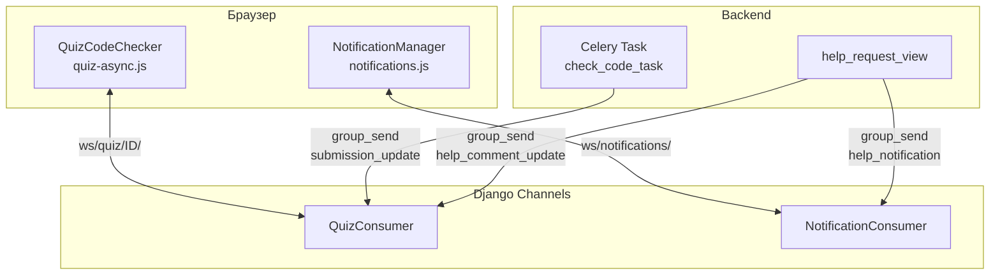
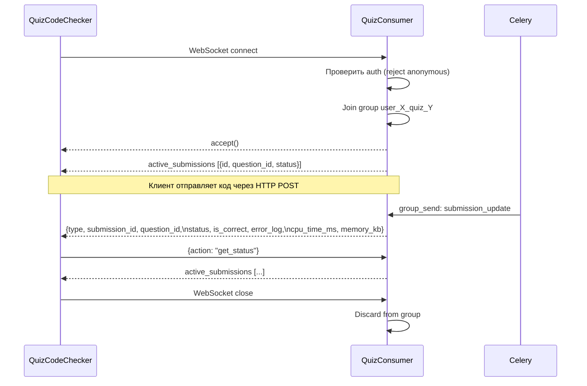
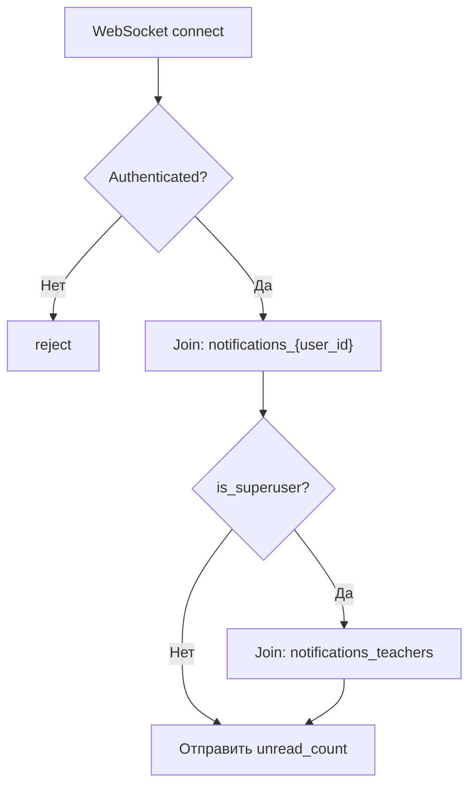
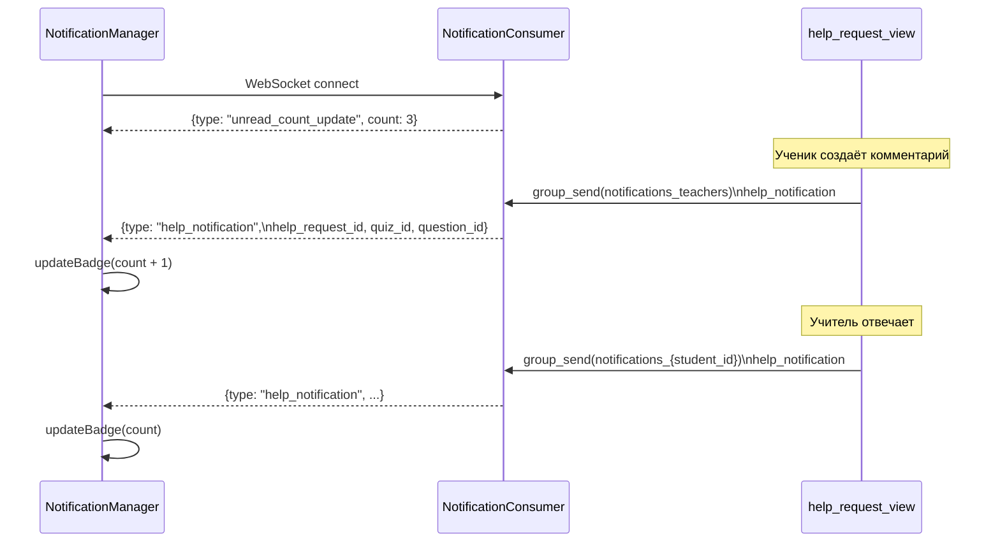
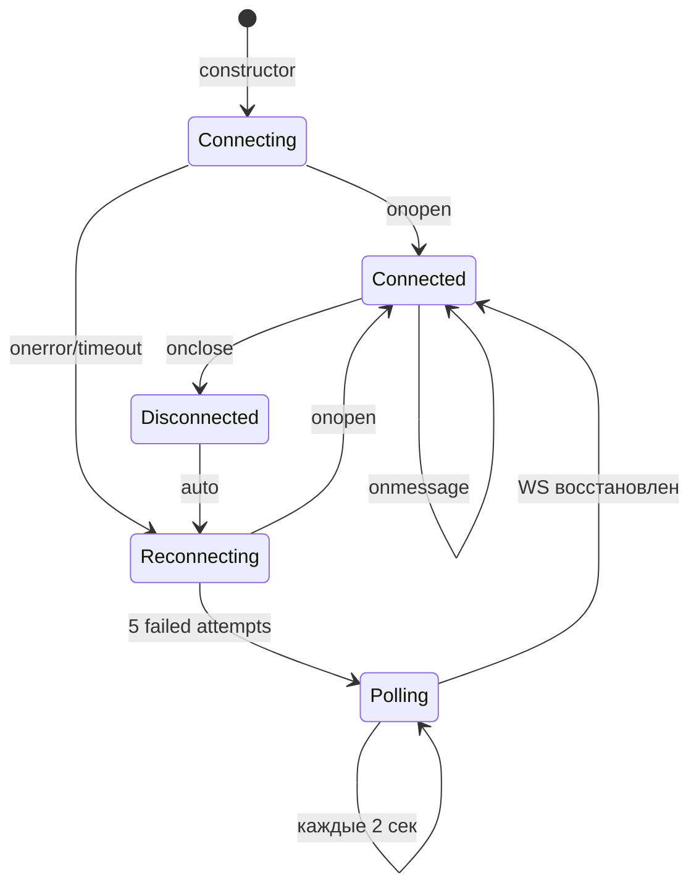

# WebSocket

Два WebSocket consumer'а обеспечивают real-time коммуникацию: результаты проверки кода и уведомления о помощи.

---

## Архитектура



---

## QuizConsumer (`ws/quiz/<quiz_id>/`)

Обновления статуса проверки кода в реальном времени.

### Группы

```
user_{user_id}_quiz_{quiz_id}
```

Каждый пользователь в каждом тесте — отдельная группа. Изоляция гарантирует, что результаты видны только автору.

### Протокол



### Типы сообщений

**Server → Client:**

| Тип | Поля | Когда |
|-----|------|-------|
| `active_submissions` | `submissions: [{id, question_id, status}]` | При connect и по запросу |
| `submission_update` | `submission_id, question_id, status, is_correct, error_log, event_type, cpu_time_ms, memory_kb` | При изменении статуса (running → success/failed/error) |
| `help_comment_update` | `question_id, comment, status, resolved` | При ответе учителя на inline-тред |

**Client → Server:**

| Действие | Payload | Эффект |
|----------|---------|--------|
| `get_status` | `{}` | Повторная отправка active_submissions |

---

## NotificationConsumer (`ws/notifications/`)

Badge-уведомления о запросах помощи.

### Группы



- **Personal group** (`notifications_{user_id}`) — уведомления для конкретного ученика
- **Teachers group** (`notifications_teachers`) — уведомления для всех учителей (superusers)

### Протокол



### Unread Count Query

```python
# @database_sync_to_async
def get_unread_count():
    if user.is_superuser:
        # Все открытые/answered запросы с непрочитанными для учителя
        HelpRequest.filter(has_unread_for_teacher=True)
                   .exclude(status='resolved').count()
    else:
        # Запросы ученика с непрочитанными ответами
        HelpRequest.filter(student=user, has_unread_for_student=True).count()
```

---

## Frontend: QuizCodeChecker

Класс в `quiz-async.js` — клиентская часть WebSocket-протокола.

### Lifecycle



### Reconnection Strategy

| Попытка | Задержка | Действие |
|---------|----------|----------|
| 1 | 1 сек | Переподключение |
| 2 | 2 сек | Переподключение |
| 3 | 4 сек | Переподключение |
| 4 | 8 сек | Переподключение |
| 5 | 16 сек | Переподключение |
| 6+ | — | Переход на polling (каждые 2 сек) |

При reconnect: если есть `pendingSubmissions` — немедленно выполняет `_pollOnce()` для получения пропущенных обновлений.

### Polling Fallback

```
GET /quizzes/submission/{id}/status/
→ {status, is_correct, error_log, cpu_time_ms, memory_kb}
```

Polling активируется только при потере WebSocket и работает для каждой pending submission.

---

## Frontend: NotificationManager

Класс в `notifications.js` — badge-счётчик + dropdown.

### Badge UI

```
Есть непрочитанные:  🔔 3
Нет непрочитанных:   🔔 (скрыт)
Больше 99:           🔔 99+
```

Элемент: `#help-badge-global`

### Dropdown

При клике на badge загружает список уведомлений:

```
GET /quizzes/help-requests/my-notifications/
→ {notifications: [{quiz_id, quiz_title, question_id, question_title,
    status, preview, teacher_name, updated_at}]}
```

Каждое уведомление — ссылка:
```
/quizzes/{quiz_id}/?open_help={question_id}#question-{question_id}
```

### Reconnection

| Попытка | Задержка |
|---------|----------|
| 1 | 2 сек |
| 2 | 4 сек |
| 3 | 6 сек |
| 4+ | Polling каждые 30 сек |

### Время

Формат `_timeAgo()`:

| Интервал | Вывод |
|----------|-------|
| < 1 мин | «только что» |
| < 60 мин | «N мин. назад» |
| < 24 ч | «N ч. назад» |
| ≥ 24 ч | «N дн. назад» |
