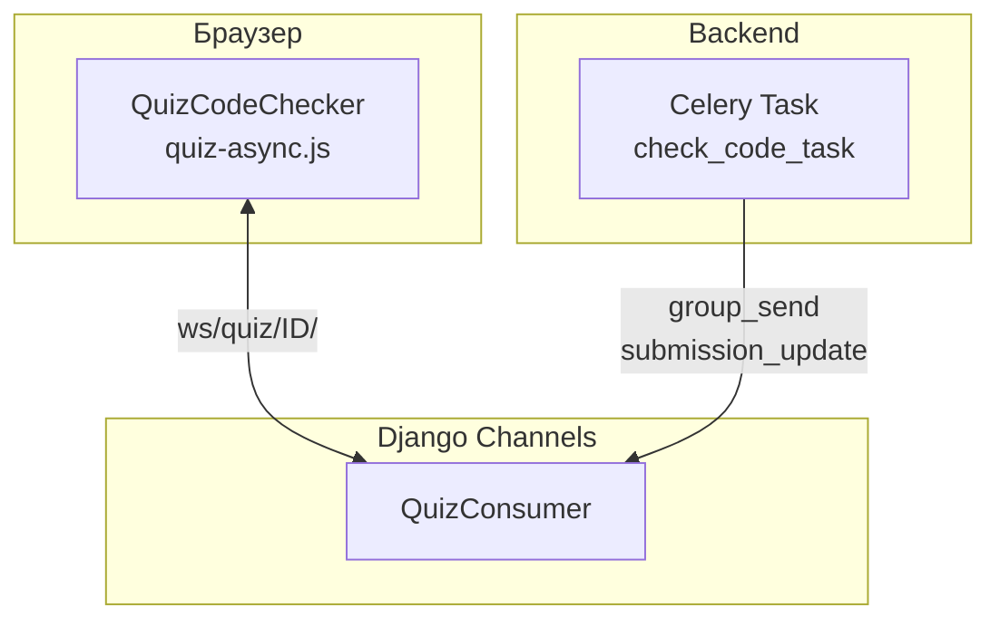
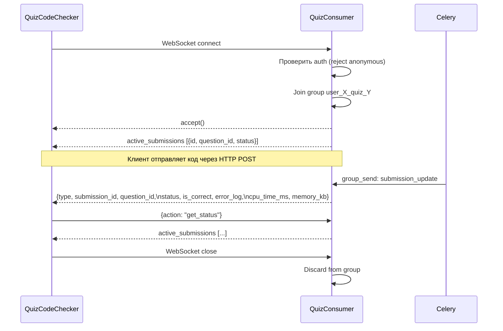
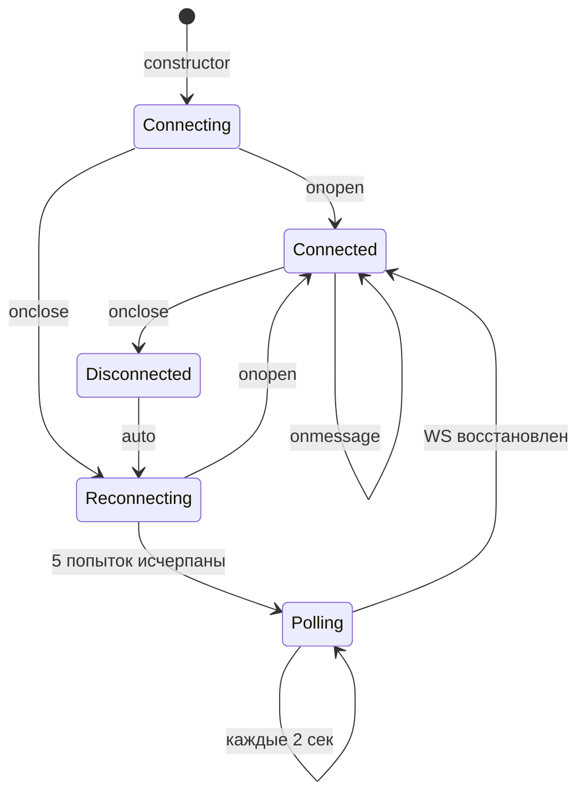

# WebSocket

WebSocket-consumer обеспечивает real-time коммуникацию: результаты проверки кода.

---

## Архитектура


```mermaid
flowchart TB
    subgraph Browser["Браузер"]
        QCC[QuizCodeChecker\nquiz-async.js]
    end

    subgraph Django["Django Channels"]
        QC[QuizConsumer]
    end

    subgraph Backend["Backend"]
        CELERY[Celery Task\ncheck_code_task]
    end

    QCC <-->|"ws/quiz/ID/"| QC

    CELERY -->|"group_send\nsubmission_update"| QC
```

Отправка кода при этом идёт не по сокету, а обычным POST: `/quizzes/<quiz_id>/question/<question_id>/submit/`. Сокет доставляет только результат проверки.

---

## QuizConsumer (`ws/quiz/<quiz_id>/`)

Обновления статуса проверки кода в реальном времени.

### Группы

```
user_{user_id}_quiz_{quiz_id}
```

Каждый пользователь в каждом тесте – отдельная группа. Изоляция гарантирует, что результаты видны только автору. Неавторизованного consumer закрывает соединение до `accept()`.

### Протокол


```mermaid
sequenceDiagram
    participant C as QuizCodeChecker
    participant QC as QuizConsumer
    participant CL as Celery

    C->>QC: WebSocket connect
    QC->>QC: Проверить auth (reject anonymous)
    QC->>QC: Join group user_X_quiz_Y
    QC-->>C: accept()
    QC-->>C: active_submissions [{id, question_id, status}]

    Note over C,QC: Клиент отправляет код через HTTP POST

    CL->>QC: group_send: submission_update
    QC-->>C: {type, submission_id, question_id,\nstatus, is_correct, error_log,\ncpu_time_ms, memory_kb}

    C->>QC: {action: "get_status"}
    QC-->>C: active_submissions [...]

    C->>QC: WebSocket close
    QC->>QC: Discard from group
```

### Типы сообщений

**Server → Client:**

| Тип | Поля | Когда |
|-----|------|-------|
| `active_submissions` | `submissions: [{id, question_id, status}]` | При connect и по запросу; содержит только `pending` и `running` |
| `submission_update` | `submission_id, question_id, status, is_correct, error_log, event_type, cpu_time_ms, memory_kb` | При изменении статуса (running → success/failed/error) |

**Client → Server:**

| Действие | Payload | Эффект |
|----------|---------|--------|
| `get_status` | `{}` | Повторная отправка active_submissions |

---

## Frontend: QuizCodeChecker

Класс в `quiz-async.js` – клиентская часть WebSocket-протокола.

### Lifecycle


```mermaid
stateDiagram-v2
    [*] --> Connecting: constructor
    Connecting --> Connected: onopen
    Connecting --> Reconnecting: onclose

    Connected --> Disconnected: onclose
    Connected --> Connected: onmessage

    Disconnected --> Reconnecting: auto
    Reconnecting --> Connected: onopen
    Reconnecting --> Polling: 5 попыток исчерпаны

    Polling --> Connected: WS восстановлен
    Polling --> Polling: каждые 2 сек
```

`onerror` только помечает соединение разорванным (`connected = false`) – переподключение планирует `onclose`. `destroy()` останавливает polling и закрывает сокет; страница вызывает его перед повторной инициализацией, потому что Alpine может выполнить `init()` дважды.

О смене состояния соединения клиент сообщает наружу через `onConnectionChange(status)` со значениями `connected` / `disconnected` / `reconnecting` / `polling`; результат проверки приходит в `onStatusChange(questionId, status, isCorrect, errorLog, cpuMs, memKb)`.

### Reconnection Strategy

| Попытка | Задержка | Действие |
|---------|----------|----------|
| 1 | 1 сек | Переподключение |
| 2 | 2 сек | Переподключение |
| 3 | 4 сек | Переподключение |
| 4 | 8 сек | Переподключение |
| 5 | 16 сек | Переподключение |
| 6+ | – | Переход на polling (каждые 2 сек) |

При reconnect: если есть `pendingSubmissions` – немедленно выполняет `_pollOnce()` для получения пропущенных обновлений.

Отправка кода блокируется, пока по задаче есть незавершённая проверка (`pendingSubmissions`), поэтому двойной клик по «Проверить» не создаёт вторую посылку.

### Polling Fallback

```
GET /quizzes/submission/{id}/status/
→ {submission_id, question_id, status, is_correct, score, points,
   error_log, cpu_time_ms, memory_kb, created_at, completed_at}
```

Polling активируется только при потере WebSocket и работает для каждой pending submission. Отдельно от этого **`practiceApp()`** (`ege_practice.html`) опрашивает тот же адрес **сознательно, без сокета**: `QuizCodeChecker` подписан на один `quiz_id`, а задачи сессии практики приходят из разных банков и вариантов, так что одна группа на сессию их не покрывает. Переход на WebSocket здесь – вопрос задержки в пару секунд, а не архитектуры.

Текстовые и выборные ответы проверяются другим адресом – `POST /ege/<quiz_id>/check/` (`ege_check_answer_view`, только тренировка). Он отвечает `{is_correct, attempts, is_solved}` и ведёт `ExamTaskProgress.attempts_to_solve`; после верного ответа счётчик замирает – проверки из любопытства к трудности задачи отношения не имеют.
