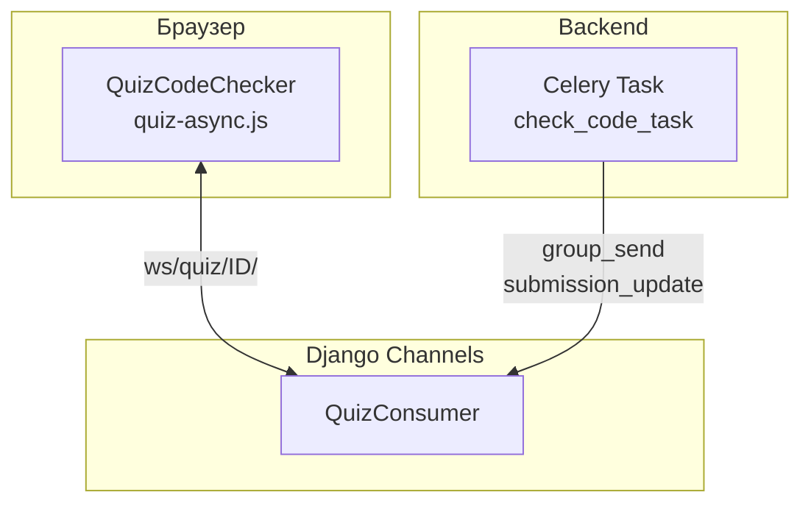
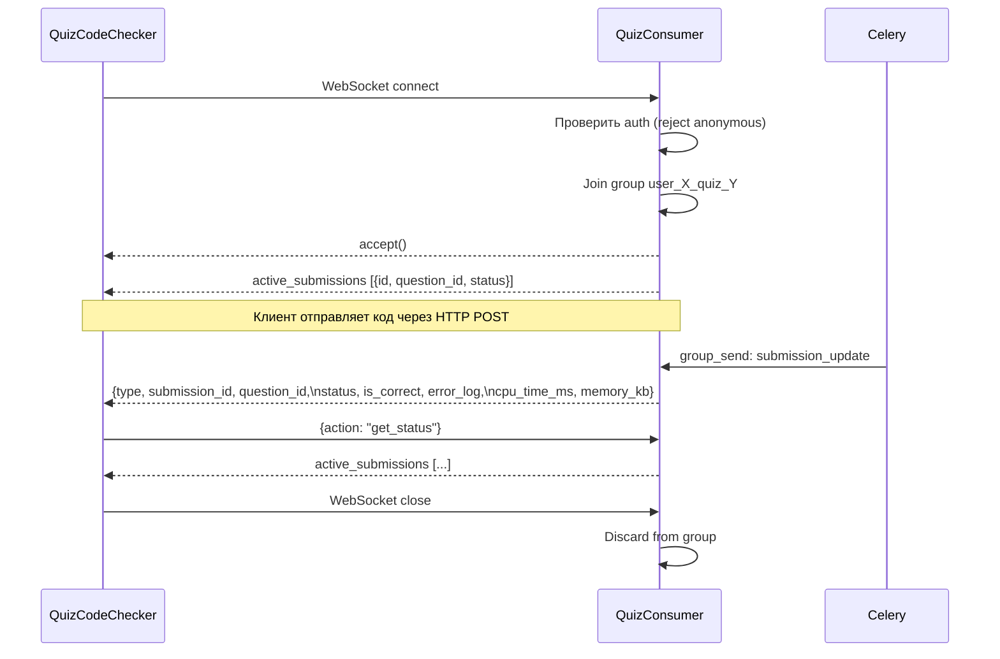
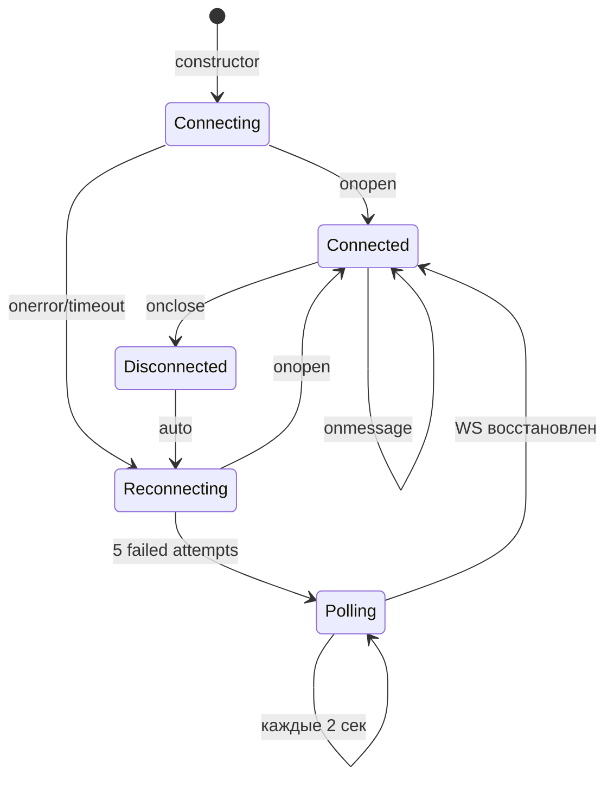

# WebSocket

WebSocket-consumer обеспечивает real-time коммуникацию: результаты проверки кода.

---

## Архитектура


```mermaid
flowchart TB
    subgraph Browser["Браузер"]
        QCC[QuizCodeChecker\nquiz-async.js]
    end

    subgraph Django["Django Channels"]
        QC[QuizConsumer]
    end

    subgraph Backend["Backend"]
        CELERY[Celery Task\ncheck_code_task]
    end

    QCC <-->|"ws/quiz/ID/"| QC

    CELERY -->|"group_send\nsubmission_update"| QC
```

---

## QuizConsumer (`ws/quiz/<quiz_id>/`)

Обновления статуса проверки кода в реальном времени.

### Группы

```
user_{user_id}_quiz_{quiz_id}
```

Каждый пользователь в каждом тесте — отдельная группа. Изоляция гарантирует, что результаты видны только автору.

### Протокол


```mermaid
sequenceDiagram
    participant C as QuizCodeChecker
    participant QC as QuizConsumer
    participant CL as Celery

    C->>QC: WebSocket connect
    QC->>QC: Проверить auth (reject anonymous)
    QC->>QC: Join group user_X_quiz_Y
    QC-->>C: accept()
    QC-->>C: active_submissions [{id, question_id, status}]

    Note over C,QC: Клиент отправляет код через HTTP POST

    CL->>QC: group_send: submission_update
    QC-->>C: {type, submission_id, question_id,\nstatus, is_correct, error_log,\ncpu_time_ms, memory_kb}

    C->>QC: {action: "get_status"}
    QC-->>C: active_submissions [...]

    C->>QC: WebSocket close
    QC->>QC: Discard from group
```

### Типы сообщений

**Server → Client:**

| Тип | Поля | Когда |
|-----|------|-------|
| `active_submissions` | `submissions: [{id, question_id, status}]` | При connect и по запросу |
| `submission_update` | `submission_id, question_id, status, is_correct, error_log, event_type, cpu_time_ms, memory_kb` | При изменении статуса (running → success/failed/error) |

**Client → Server:**

| Действие | Payload | Эффект |
|----------|---------|--------|
| `get_status` | `{}` | Повторная отправка active_submissions |

---

## Frontend: QuizCodeChecker

Класс в `quiz-async.js` — клиентская часть WebSocket-протокола.

### Lifecycle


```mermaid
stateDiagram-v2
    [*] --> Connecting: constructor
    Connecting --> Connected: onopen
    Connecting --> Reconnecting: onerror/timeout

    Connected --> Disconnected: onclose
    Connected --> Connected: onmessage

    Disconnected --> Reconnecting: auto
    Reconnecting --> Connected: onopen
    Reconnecting --> Polling: 5 failed attempts

    Polling --> Connected: WS восстановлен
    Polling --> Polling: каждые 2 сек
```

### Reconnection Strategy

| Попытка | Задержка | Действие |
|---------|----------|----------|
| 1 | 1 сек | Переподключение |
| 2 | 2 сек | Переподключение |
| 3 | 4 сек | Переподключение |
| 4 | 8 сек | Переподключение |
| 5 | 16 сек | Переподключение |
| 6+ | — | Переход на polling (каждые 2 сек) |

При reconnect: если есть `pendingSubmissions` — немедленно выполняет `_pollOnce()` для получения пропущенных обновлений.

### Polling Fallback

```
GET /quizzes/submission/{id}/status/
→ {status, is_correct, error_log, cpu_time_ms, memory_kb}
```

Polling активируется только при потере WebSocket и работает для каждой pending submission.
