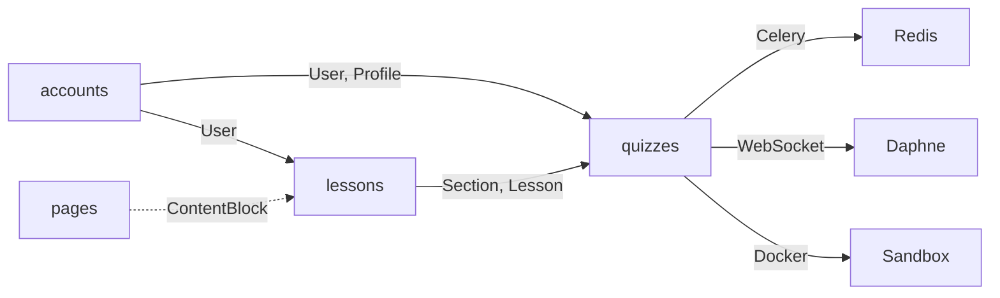

# Kirill Lab - Образовательная платформа

Документация для разработчика образовательной платформы [kirill-lab.ru](https://kirill-lab.ru).

## Стек технологий

| Слой | Технологии |
|------|-----------|
| **Backend** | Django 6.0.1, Python 3.12 |
| **Database** | PostgreSQL, psycopg2-binary |
| **Async** | Celery 5.3.6, Redis 5.0.1 |
| **WebSocket** | Django Channels 4.0, Daphne 4.1 |
| **Frontend** | Tailwind CSS, Alpine.js, CodeMirror 5 |
| **Контейнеры** | Docker (песочница для кода) |
| **Сервер** | Ubuntu 24.04, Nginx, Gunicorn, Daphne |
| **SSL** | Let's Encrypt (Certbot) |

## Приложения



| Приложение | Описание | Моделей |
|-----------|----------|---------|
| **accounts** | Авторизация, профили, группы студентов | 2 |
| **pages** | Главная, О нас — блоки контента | 1 |
| **lessons** | Разделы, уроки, блоки контента | 3 |
| **quizzes** | Тесты, вопросы, выполнение кода, помощь, EGE | 13 |

## Быстрый старт

### Локальная разработка

```bash
# 1. Клонировать и установить зависимости
git clone https://github.com/Kirill2517nv/SiteAboutMe.git
cd SiteAboutMe
pip install -r requirements.txt

# 2. Настроить .env (DATABASE_URL, SECRET_KEY, DEBUG)
cp .env.example .env  # отредактировать

# 3. Миграции и запуск
python manage.py migrate
python manage.py createsuperuser
python manage.py runserver
```

### С async-функциями (выполнение кода)

```bash
# Терминал 1: Redis
docker run -p 6379:6379 redis

# Терминал 2: Celery worker
celery -A config worker -l info

# Терминал 3: Django (или Daphne для WebSocket)
python manage.py runserver
# или: daphne -p 8000 config.asgi:application
```

## Структура проекта

```
Site/
├── config/             # Django project settings
│   ├── settings.py
│   ├── urls.py
│   ├── asgi.py         # Channels routing
│   ├── celery.py       # Celery config
│   └── wsgi.py
├── accounts/           # Auth, profiles, groups
├── pages/              # Static content pages
├── lessons/            # Sections, lessons, files
├── quizzes/            # Core app: quizzes, code exec, help
│   ├── consumers.py    # WebSocket consumers
│   ├── tasks.py        # Celery tasks
│   ├── routing.py      # WS URL routing
│   └── utils.py        # Docker sandbox
├── static/
│   ├── css/            # Tailwind styles
│   └── js/             # Alpine.js, CodeMirror, WS clients
├── templates/          # Django templates
├── media/              # Uploaded files
├── fixtures/           # Quiz JSON fixtures
└── docs/               # Эта документация (MkDocs)
```

## Навигация по документации

- **[Архитектура](architecture/overview.md)** — общая архитектура, слои, зависимости
- **[База данных](database/er-diagram.md)** — ER-диаграммы, описание моделей
- **[API и маршруты](api/overview.md)** — все URL endpoints
- **[Бизнес-логика](flows/quiz-flow.md)** — потоки данных, async execution
- **[Фронтенд](frontend/overview.md)** — JS, WebSocket, Alpine.js
- **[Инфраструктура](infra/server.md)** — сервер, деплой, сервисы
