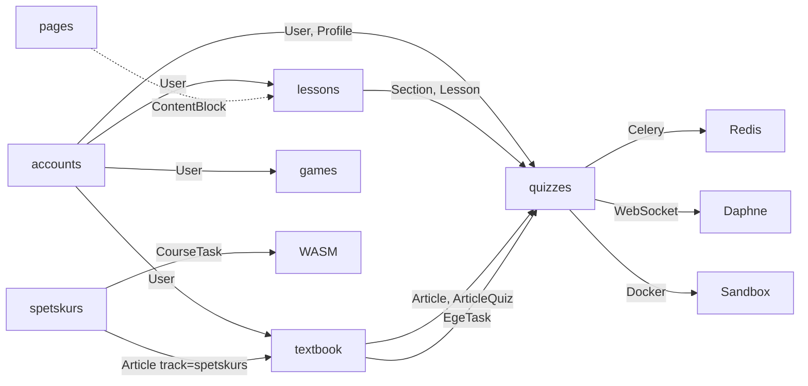

# Kirill Lab - Образовательная платформа

Документация для разработчика образовательной платформы [kirill-lab.ru](https://kirill-lab.ru).

Платформа закрывает полный цикл школьного курса: учебник с теорией и практикумом, тренажёр ЕГЭ по информатике на 27 заданий, годовой спецкурс по численному моделированию на C++, тесты с асинхронной проверкой кода, «Своя игра» и учебные группы.

## Стек технологий

| Слой | Технологии |
|------|-----------|
| **Backend** | Django 6.0.1, Python 3.12 |
| **Database** | PostgreSQL, psycopg2-binary |
| **Async** | Celery 5.3.6, Redis 5.0.1 |
| **WebSocket** | Django Channels 4.0, Daphne 4.1 |
| **Frontend** | Tailwind CSS (сборка npm), Alpine.js, CodeMirror 5, MathJax, Slidev |
| **Контейнеры** | Docker (песочница для кода) |
| **Сервер** | Ubuntu 24.04, Nginx, Gunicorn, Daphne |
| **SSL** | Let's Encrypt (Certbot) |

## Приложения


```mermaid
graph LR
    A[accounts] -->|User, Profile| Q[quizzes]
    A -->|User| L[lessons]
    A -->|User| T[textbook]
    A -->|User| G[games]
    P[pages] -.->|ContentBlock| L
    L -->|Section, Lesson| Q
    T -->|Article, ArticleQuiz| Q
    Q -->|Celery| R[Redis]
    Q -->|WebSocket| D[Daphne]
    Q -->|Docker| S[Sandbox]
    SP[spetskurs] -->|CourseTask| W[WASM]
    SP -->|Article track=spetskurs| T
    T -->|EgeTask| Q
```

| Приложение | Описание | Моделей |
|-----------|----------|---------|
| **accounts** | Авторизация, профили, группы студентов, выпускники | 2 |
| **pages** | Главная и «Обо мне»: блоки контента, профиль автора | 5 |
| **lessons** | Разделы, уроки, вложения, Slidev-презентации | 4 |
| **quizzes** | Тесты, вопросы, выполнение кода, тренажёр ЕГЭ | 16 |
| **textbook** | Учебник: статьи, теория ЕГЭ, практикум, спецкурс | 7 |
| **spetskurs** | Курс численного моделирования: задачи с WASM-симуляцией; теория – на моделях учебника | 1 |
| **games** | «Своя игра»: вопросы учеников, модерация, игровые паки | 6 |

Всего 41 модель (плюс стандартная `User` из Django).

## Быстрый старт

### Локальная разработка

```bash
# 1. Клонировать и установить зависимости
git clone https://github.com/Kirill2517nv/SiteAboutMe.git
cd SiteAboutMe
pip install -r requirements.txt

# 2. Зависимости и сборка фронтенда
npm install
npm run tw:build     # static/css/tailwind.css собирается заранее, не через CDN
                     # при вёрстке удобнее держать запущенным npm run tw:watch

# 3. Настроить .env (SECRET_KEY, DEBUG, DB_NAME, DB_USER, DB_PASSWORD, DB_HOST, DB_PORT)
# Файла-шаблона в репозитории нет – .env создаётся вручную

# 4. Миграции и запуск
python manage.py migrate
python manage.py createsuperuser
python manage.py runserver
```

### С async-функциями (выполнение кода)

```bash
# Терминал 1: Redis
docker run -p 6379:6379 redis

# Терминал 2: Celery worker
celery -A config worker -l info --pool=solo -Q default,code_execution

# Терминал 3: планировщик периодических задач (необязательно)
celery -A config beat -l info

# Терминал 4: Django (или Daphne для WebSocket)
python manage.py runserver
# или: daphne -p 8000 config.asgi:application
```

Очередь `code_execution` объявлена в `config/celery.py` (`app.conf.task_routes`), поэтому worker должен слушать и её, а не только `default`.

## Структура проекта

```
Site/
├── config/             # Django project settings
│   ├── settings.py
│   ├── urls.py
│   ├── asgi.py         # Channels routing
│   ├── celery.py       # Celery config, очереди и beat-schedule
│   └── wsgi.py
├── accounts/           # Auth, profiles, groups, alumni
├── pages/              # Home page, «Обо мне», changelog
├── lessons/            # Sections, lessons, files, Slidev
├── textbook/           # Учебник: статьи, теория ЕГЭ, практикум, спецкурс
├── quizzes/            # Core app: quizzes, code exec, тренажёр ЕГЭ
│   ├── consumers.py    # WebSocket consumers
│   ├── tasks.py        # Celery tasks
│   ├── routing.py      # WS URL routing
│   ├── urls_ege.py     # EGE-тренажёр, смонтирован на /ege/
│   ├── ege_stats.py    # Аналитика ЕГЭ
│   └── utils.py        # Docker sandbox
├── spetskurs/          # Numerical physics course: tasks + WASM simulations
├── games/              # «Своя игра»: вопросы, модерация, паки, сессии
├── static/
│   ├── css/            # Tailwind styles (собираются npm run tw:build)
│   ├── js/             # Alpine.js, CodeMirror, WS clients, виджеты учебника
│   └── spetskurs/wasm/ # Compiled WASM files (deployed manually, не в git)
├── templates/          # Django templates
├── media/              # Uploaded files
├── fixtures/           # Quiz и EGE JSON fixtures (не в git)
└── docs/               # Эта документация (MkDocs)
```

## Навигация по документации

- **[Архитектура](architecture/overview.md)** – общая архитектура, слои, зависимости между приложениями
- **[База данных](database/er-diagram.md)** – ER-диаграммы и [описание моделей](database/models.md)
- **[API и маршруты](api/overview.md)** – все URL endpoints: [accounts](api/accounts.md), [pages](api/pages.md), [lessons](api/lessons.md), [quizzes](api/quizzes.md), [EGE](api/ege.md), [учебник](api/textbook.md), [спецкурс](api/spetskurs.md), [игры](api/games.md)
- **[Бизнес-логика](flows/quiz-flow.md)** – потоки данных, [выполнение кода](flows/code-execution.md), [тренажёр ЕГЭ](flows/ege-trainer.md), [формат банка задач](ege-bank-format.md) и [его выкатка](ege-bank-deploy.md)
- **[Учебник](textbook-structure.md)** – структура курса, [правила написания урока](textbook-lesson-brief.md), [ревизия блока](textbook-block-revision.md)
- **[Спецкурс](spetskurs-deploy.md)** – выкладка симуляций
- **[Уроки](slidev-guide.md)** – Slidev-презентации
- **[Фронтенд](frontend/overview.md)** – JS, [WebSocket](frontend/websocket.md), [Alpine.js](frontend/alpine.md)
- **[Инфраструктура](infra/server.md)** – сервер, [деплой](infra/deployment.md), [сервисы](infra/services.md)
