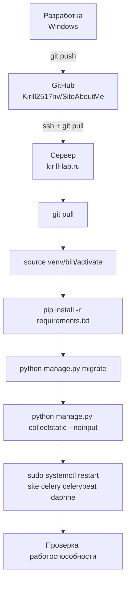

# Деплой

## Процесс деплоя



---

## Шаги деплоя

### 1. Подключение к серверу

```bash
ssh admin@192.168.1.199 -p 2222
cd /home/admin/site
```

### 2. Получение изменений

```bash
git pull
```

### 3. Обновление зависимостей

```bash
source venv/bin/activate
pip install -r requirements.txt
```

### 4. Миграции БД

```bash
python manage.py migrate
```

!!! warning "Миграции на production"
    Всегда проверяйте миграции перед деплоем: `python manage.py showmigrations`. Деструктивные миграции (удаление столбцов/таблиц) требуют особого внимания.

### 5. Статические файлы

```bash
python manage.py collectstatic --noinput
```

Собирает файлы из `static/` и приложений в `staticfiles/` для отдачи Nginx.

### 6. Перезапуск сервисов

```bash
sudo systemctl restart site celery celerybeat daphne
```

!!! tip "Nginx"
    Nginx перезапускать обычно не нужно — конфигурация меняется редко. При изменении конфига: `sudo nginx -t && sudo systemctl restart nginx`.

### 7. Верификация

```bash
# Проверить статус сервисов
sudo systemctl status site celery celerybeat daphne nginx redis-server

# Проверить логи на ошибки
sudo journalctl -u site --since "5 minutes ago"
sudo journalctl -u daphne --since "5 minutes ago"
sudo journalctl -u celery --since "5 minutes ago"

# Проверить Redis
redis-cli ping  # → PONG
```

---

## Полная команда (one-liner)

```bash
cd /home/admin/site && git pull && source venv/bin/activate && \
pip install -r requirements.txt && \
python manage.py migrate && \
python manage.py collectstatic --noinput && \
sudo systemctl restart site celery celerybeat daphne
```

---

## Откат

При проблемах после деплоя:

```bash
# 1. Откат кода
cd /home/admin/site
git log --oneline -5          # найти предыдущий коммит
git checkout <commit-hash>    # откатиться

# 2. Откат миграции (если применена)
python manage.py migrate <app_name> <previous_migration>

# 3. Перезапуск
sudo systemctl restart site celery celerybeat daphne
```

---

## Импорт тестов

Для загрузки новых тестов из JSON-фикстур:

```bash
python manage.py load_quiz fixtures/my_quiz.json
```

Шаблон формата: `fixtures/quiz_template.json`. Поддерживает все 3 типа вопросов: `choice`, `text`, `code`.

---

## SSL-сертификат

Certbot (Let's Encrypt) автоматически обновляет сертификат. Проверка:

```bash
sudo certbot renew --dry-run
```

---

## Окружение (.env)

Секреты хранятся в `/home/admin/site/.env`:

| Переменная | Описание |
|------------|----------|
| `SECRET_KEY` | Django secret key |
| `DATABASE_URL` | PostgreSQL connection string |
| `DEBUG` | False на production |
| `ALLOWED_HOSTS` | kirill-lab.ru |

!!! danger "Безопасность"
    `.env` файл **не** коммитится в Git. Содержит приватные ключи и credentials.
