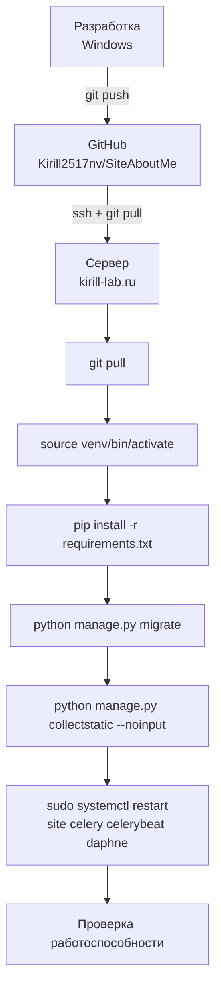

# Деплой

## Процесс деплоя


```mermaid
flowchart TD
    DEV[Разработка\nWindows] -->|"git push"| GH[GitHub\nKirill2517nv/SiteAboutMe]
    GH -->|"ssh + git pull"| SERVER[Сервер\nkirill-lab.ru]

    SERVER --> PULL[git pull]
    PULL --> VENV[source venv/bin/activate]
    VENV --> PIP[pip install -r requirements.txt]
    PIP --> MIGRATE[python manage.py migrate]
    MIGRATE --> STATIC[python manage.py collectstatic --noinput]
    STATIC --> RESTART["sudo systemctl restart\nsite celery celerybeat daphne"]
    RESTART --> VERIFY[Проверка работоспособности]
```

---

## Шаги деплоя

### 1. Подключение к серверу

```bash
ssh admin@192.168.1.199 -p 2222
cd /home/admin/site
```

### 2. Получение изменений

```bash
git pull
```

### 2а. Пересборка Tailwind CSS (при изменении шаблонов или конфига)

Если в коммите менялись HTML-шаблоны или `tailwind.config.js`, CSS пересобирается локально перед деплоем и коммитится в репозиторий. На сервере дополнительных действий не требуется – `static/css/tailwind.css` уже актуален.

Для локальной пересборки (на Windows-машине разработчика):

```bash
npm run tw:build
```

!!! info "Node.js"
    Требуется Node.js с установленными зависимостями (`npm install`). Tailwind v3.4+ установлен в `devDependencies`.

### 3. Обновление зависимостей

```bash
source venv/bin/activate
pip install -r requirements.txt
```

### 4. Миграции БД

```bash
python manage.py migrate
```

!!! warning "Миграции на production"
    Всегда проверяйте миграции перед деплоем: `python manage.py showmigrations`. Деструктивные миграции (удаление столбцов/таблиц) требуют особого внимания.

### 5. Статические файлы

```bash
python manage.py collectstatic --noinput
```

Собирает файлы из `static/` и приложений в `staticfiles/` для отдачи Nginx.

### 6. Перезапуск сервисов

```bash
sudo systemctl restart site celery celerybeat daphne
```

!!! tip "Nginx"
    Nginx перезапускать обычно не нужно – конфигурация меняется редко. При изменении конфига: `sudo nginx -t && sudo systemctl restart nginx`.

### 7. Верификация

```bash
# Проверить статус сервисов
sudo systemctl status site celery celerybeat daphne nginx redis-server

# Проверить логи на ошибки
sudo journalctl -u site --since "5 minutes ago"
sudo journalctl -u daphne --since "5 minutes ago"
sudo journalctl -u celery --since "5 minutes ago"

# Проверить Redis
redis-cli ping  # → PONG
```

---

## Полная команда (one-liner)

```bash
cd /home/admin/site && git pull && source venv/bin/activate && \
pip install -r requirements.txt && \
python manage.py migrate && \
python manage.py collectstatic --noinput && \
sudo systemctl restart site celery celerybeat daphne
```

!!! note "Tailwind CSS"
    `static/css/tailwind.css` хранится в репозитории и деплоится через `git pull`. Пересборка CSS выполняется на машине разработчика командой `npm run tw:build` и коммитируется вместе с изменениями шаблонов.

---

## Выкладка данных и медиа

Код и схема БД едут шагами выше. Данные и медиа выкладываются отдельно, и порядок внутри них важен – медиа строго до загрузчиков, пулы после банков. Он описан в двух отдельных документах, здесь не дублируется:

- **[Банк ЕГЭ](../ege-bank-deploy.md)** – `media/ege/bank-*` через `rsync`, затем `load_ege`, `seed_ege_tasks` и `ege_pools`;
- **[Симуляции спецкурса](../spetskurs-deploy.md)** – собранные `.wasm` и архив исходников через `rsync`, выпуск разборов через `publish_spetskurs`.

Оба артефакта в git не хранятся: в `.gitignore` стоят `media/`, `fixtures/*`, собранные `static/spetskurs/wasm/*.{html,js,wasm}` и архив `static/spetskurs/*.zip`. Переносят их `rsync`/`scp` вручную.

---

## Откат

При проблемах после деплоя:

```bash
# 1. Откат кода
cd /home/admin/site
git log --oneline -5          # найти предыдущий коммит
git checkout <commit-hash>    # откатиться

# 2. Откат миграции (если применена)
python manage.py migrate <app_name> <previous_migration>

# 3. Перезапуск
sudo systemctl restart site celery celerybeat daphne
```

---

## Импорт тестов

Для загрузки новых тестов из JSON-фикстур:

```bash
python manage.py load_quiz fixtures/my_quiz.json
```

Шаблон формата: `fixtures/quiz_template.json`. Поддерживает все 3 типа вопросов: `choice`, `text`, `code`.

Банки ЕГЭ грузятся отдельной командой – `python manage.py load_ege fixtures/bank-05.json`; её место в общем порядке выкладки описано в [выкладке банка ЕГЭ](../ege-bank-deploy.md).

---

## SSL-сертификат

Certbot (Let's Encrypt) автоматически обновляет сертификат. Проверка:

```bash
sudo certbot renew --dry-run
```

---

## Окружение (.env)

Секреты хранятся в `/home/admin/site/.env`:

| Переменная | Описание |
|------------|----------|
| `SECRET_KEY` | Django secret key |
| `DEBUG` | `False` на production (значение сравнивается со строкой `'True'`) |
| `DB_NAME`, `DB_USER`, `DB_PASSWORD`, `DB_HOST`, `DB_PORT` | Подключение к PostgreSQL |
| `CELERY_BROKER_URL`, `CELERY_RESULT_BACKEND` | Redis для Celery; по умолчанию `redis://localhost:6379/0` |
| `REDIS_HOST`, `REDIS_PORT` | Redis для Channel Layer (Channels); по умолчанию `localhost:6379` |
| `USE_X_ACCEL_REDIRECT` | `True` на production: media отдаёт Nginx по `X-Accel-Redirect` |
| `YANDEX_METRIKA_ID` | Номер счётчика Яндекс.Метрики. Задаётся только на production: пусто – счётчик не выводится |

`ALLOWED_HOSTS` из `.env` не читается – список хостов задан прямо в `config/settings.py`.

!!! danger "Безопасность"
    `.env` файл **не** коммитится в Git. Содержит приватные ключи и credentials.
