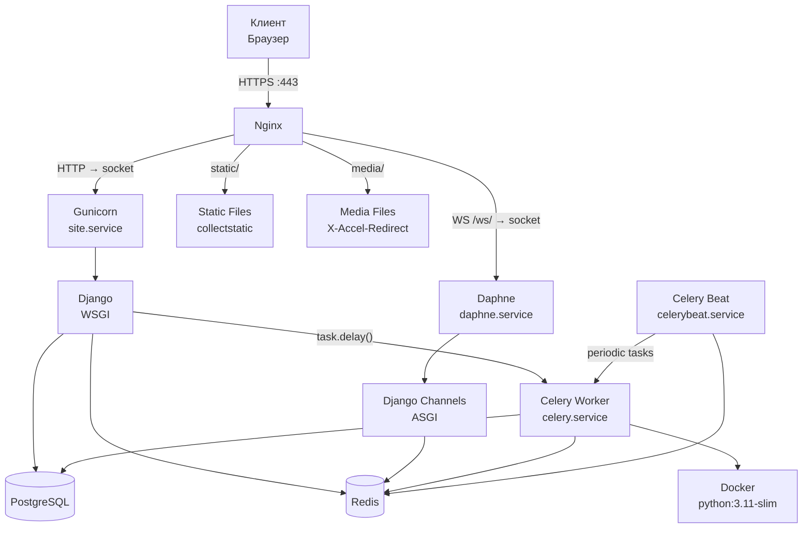

# Сервер

## Общая архитектура



---

## Характеристики сервера

| Параметр | Значение |
|----------|----------|
| **Хост** | kirill-lab.ru |
| **Локальный IP** | 192.168.1.199 |
| **ОС** | Ubuntu 24.04 |
| **Пользователь** | admin |
| **SSH** | `ssh admin@192.168.1.199 -p 2222` |
| **Путь проекта** | `/home/admin/site` |
| **Python venv** | `/home/admin/site/venv` |
| **SSL** | Let's Encrypt (Certbot) |

---

## Стек технологий

| Компонент | Версия | Назначение |
|-----------|--------|------------|
| Django | 6.0.1 | Web-фреймворк |
| PostgreSQL | — | Основная БД |
| Redis | — | Брокер Celery + Channel Layer |
| Celery | 5.3.6 | Async-задачи (проверка кода) |
| Django Channels | 4.0 | WebSocket |
| Daphne | 4.1 | ASGI-сервер |
| Gunicorn | 23.0.0 | WSGI-сервер |
| Nginx | — | Reverse proxy |
| Docker | 7.1.0 (py) | Sandbox для кода |
| Pillow | 12.1.0 | Обработка изображений |

---

## Потоки запросов

### HTTP запрос

```
Клиент → Nginx (:443)
       → Unix socket /run/gunicorn/site.sock
       → Gunicorn (site.service)
       → Django WSGI (config/wsgi.py)
       → View → Template/JSON
       → Ответ клиенту
```

### WebSocket соединение

```
Клиент → Nginx (:443, /ws/*)
       → Unix socket /run/daphne/site.sock
       → Daphne (daphne.service)
       → Django Channels ASGI (config/asgi.py)
       → QuizConsumer / NotificationConsumer
       → Двусторонняя связь
```

### Статические файлы

```
Клиент → Nginx (:443, /static/*)
       → Прямая отдача из /home/admin/site/staticfiles/
```

### Media файлы

```
Клиент → Nginx (:443, /media/*)
       → Django View (проверка доступа)
       → X-Accel-Redirect → Nginx
       → Прямая отдача из /home/admin/site/media/
```

!!! info "X-Accel-Redirect"
    Django проверяет права доступа, затем отправляет Nginx заголовок `X-Accel-Redirect` с внутренним путём к файлу. Nginx отдаёт файл напрямую, минуя Python — эффективнее `FileResponse`.

---

## Структура каталогов (сервер)

```
/home/admin/site/
├── config/              # Django settings, urls, wsgi, asgi
├── accounts/            # App: пользователи
├── pages/               # App: контент-страницы
├── lessons/             # App: уроки
├── quizzes/             # App: тесты
├── templates/           # HTML-шаблоны
├── static/              # Исходные статические файлы
├── staticfiles/         # collectstatic output
├── media/               # Загруженные файлы
│   ├── content/         # Изображения контент-блоков
│   ├── lessons_files/   # Файлы уроков
│   ├── lessons_content/ # Изображения блоков уроков
│   └── question_files/  # Файлы вопросов
├── fixtures/            # JSON для load_quiz
├── venv/                # Python virtualenv
├── requirements.txt
├── manage.py
└── .env                 # Секреты (SECRET_KEY, DB credentials)
```
