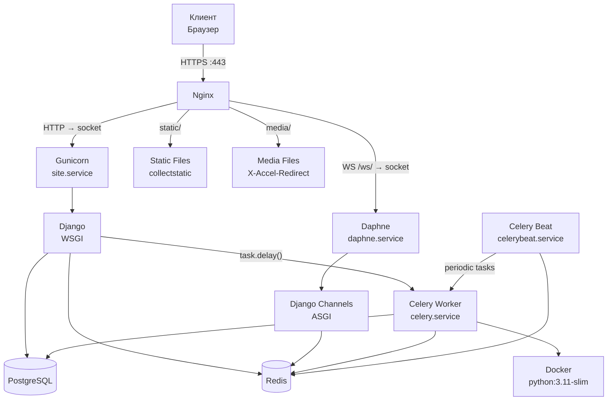

# Сервер

## Общая архитектура


```mermaid
graph TB
    CLIENT[Клиент\nБраузер] -->|"HTTPS :443"| NGINX[Nginx]

    NGINX -->|"HTTP → socket"| GUNICORN[Gunicorn\nsite.service]
    NGINX -->|"WS /ws/ → socket"| DAPHNE[Daphne\ndaphne.service]
    NGINX -->|"static/"| STATIC[Static Files\ncollectstatic]
    NGINX -->|"media/"| MEDIA[Media Files\nX-Accel-Redirect]

    GUNICORN --> DJANGO[Django\nWSGI]
    DAPHNE --> CHANNELS[Django Channels\nASGI]

    DJANGO --> DB[(PostgreSQL)]
    DJANGO --> REDIS[(Redis)]
    CHANNELS --> REDIS

    DJANGO -->|"task.delay()"| CELERY[Celery Worker\ncelery.service]
    CELERY --> REDIS
    CELERY --> DB
    CELERY --> DOCKER[Docker\npython:3.11-slim]

    BEAT[Celery Beat\ncelerybeat.service] -->|"periodic tasks"| CELERY
    BEAT --> REDIS
```

---

## Характеристики сервера

| Параметр | Значение |
|----------|----------|
| **Хост** | kirill-lab.ru |
| **Локальный IP** | 192.168.1.199 |
| **ОС** | Ubuntu 24.04 |
| **Пользователь** | admin |
| **SSH** | `ssh admin@192.168.1.199 -p 2222` |
| **Путь проекта** | `/home/admin/site` |
| **Python venv** | `/home/admin/site/venv` |
| **SSL** | Let's Encrypt (Certbot) |

---

## Стек технологий

| Компонент | Версия | Назначение |
|-----------|--------|------------|
| Django | 6.0.1 | Web-фреймворк |
| PostgreSQL | – | Основная БД |
| Redis | – | Брокер Celery + Channel Layer |
| Celery | 5.3.6 | Async-задачи (проверка кода) |
| Django Channels | 4.0 | WebSocket |
| channels-redis | 4.2.0 | Channel Layer поверх Redis |
| Daphne | 4.1 | ASGI-сервер |
| Gunicorn | 23.0.0 | WSGI-сервер |
| WhiteNoise | 6.11.0 | Отдача статики через Django |
| Nginx | – | Reverse proxy |
| Docker | 7.1.0 (py) | Sandbox для кода |
| Pillow | 12.1.0 | Обработка изображений |

---

## Потоки запросов

### HTTP запрос

```
Клиент → Nginx (:443)
       → Unix socket /run/gunicorn/site.sock
       → Gunicorn (site.service)
       → Django WSGI (config/wsgi.py)
       → View → Template/JSON
       → Ответ клиенту
```

### WebSocket соединение

```
Клиент → Nginx (:443, /ws/*)
       → Unix socket /run/daphne/site.sock
       → Daphne (daphne.service)
       → Django Channels ASGI (config/asgi.py)
       → QuizConsumer
       → Двусторонняя связь
```

### Статические файлы

```
Клиент → Nginx (:443, /static/*)
       → Прямая отдача из /home/admin/site/staticfiles/
```

!!! info "WhiteNoise"
    В `config/settings.py` включён `WhiteNoiseMiddleware` со `CompressedManifestStaticFilesStorage`. На проде статику отдаёт Nginx из `staticfiles/`, а WhiteNoise выручает там, где Nginx впереди нет (dev-сервер, Daphne напрямую), и отдаёт уже сжатые версии файлов. Отсюда два следствия: `collectstatic` обязателен на каждой выкладке, а манифест-хранилище требует, чтобы шаблоны ссылались на файл через `` – ссылка на несуществующий файл падает с ошибкой, а не отдаёт 404.

### Media файлы

```
Клиент → Nginx (:443, /media/*)
       → Django View (проверка доступа)
       → X-Accel-Redirect → Nginx
       → Прямая отдача из /home/admin/site/media/
```

!!! info "X-Accel-Redirect"
    Django проверяет права доступа, затем отправляет Nginx заголовок `X-Accel-Redirect` с внутренним путём к файлу. Nginx отдаёт файл напрямую, минуя Python – эффективнее `FileResponse`.

---

## Структура каталогов (сервер)

```
/home/admin/site/
├── config/              # Django settings, urls, wsgi, asgi
├── accounts/            # App: пользователи
├── pages/               # App: контент-страницы
├── lessons/             # App: уроки
├── quizzes/             # App: тесты и тренажёр ЕГЭ
├── textbook/            # App: учебник (материал, теория ЕГЭ, спецкурс)
├── spetskurs/           # App: курс численного моделирования
├── games/               # App: «Своя игра»
├── templates/           # HTML-шаблоны
├── static/              # Исходные статические файлы
│   └── spetskurs/       # Собранные WASM-симуляции (в git не хранятся)
├── staticfiles/         # collectstatic output
├── media/               # MEDIA_ROOT: загруженные файлы
│   ├── lessons/         # media/lessons/{урок}/ – файлы уроков и картинки блоков
│   ├── ege/             # Медиа банков и вариантов ЕГЭ
│   ├── textbook/        # Картинки статей учебника
│   ├── spetskurs/       # Иллюстрации разборов спецкурса
│   ├── games/           # Медиа «Своей игры»
│   ├── content/         # Изображения контент-блоков
│   ├── question_files/  # Файлы вопросов, question_images/ – картинки
│   └── about/ avatars/ alumni/   # Профиль автора, аватары, фото классов
├── fixtures/            # JSON для load_quiz и load_ege
├── venv/                # Python virtualenv
├── requirements.txt
├── manage.py
└── .env                 # Секреты (SECRET_KEY, доступ к БД)
```
