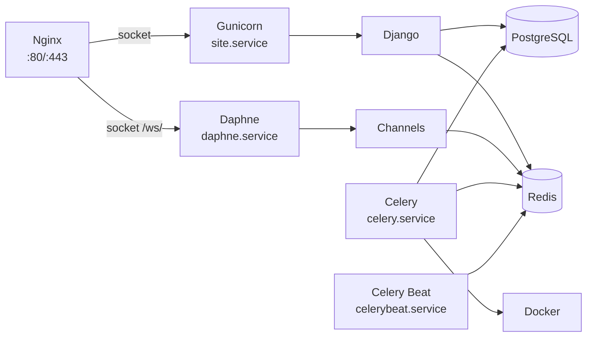

# Сервисы

Все сервисы управляются через **systemd**. Обзор каждого сервиса с конфигурацией и командами диагностики.

---

## Карта сервисов



---

## Nginx

Reverse proxy + отдача статических и media файлов.

| Параметр | Значение |
|----------|----------|
| **Конфиг** | `/etc/nginx/sites-available/site` |
| **Порты** | 80 (→ 443 redirect), 443 (SSL) |
| **SSL** | Let's Encrypt (Certbot) |

### Маршрутизация

| Путь | Назначение | Backend |
|------|-----------|---------|
| `/` | HTTP запросы | → Gunicorn (Unix socket) |
| `/ws/` | WebSocket | → Daphne (Unix socket) |
| `/static/` | Статические файлы | Прямая отдача |
| `/media/` | Media файлы | X-Accel-Redirect |

### WASM MIME-тип

Браузер отказывается загружать `.wasm` файлы без заголовка `Content-Type: application/wasm`. Нужно добавить в конфиг nginx (`/etc/nginx/sites-available/site`) в блок `/static/`:

```nginx
location /static/ {
    alias /home/admin/site/staticfiles/;

    # WASM-симуляции спецкурса
    location ~* \.wasm$ {
        types { application/wasm wasm; }
    }
}
```

После изменения конфига:

```bash
sudo nginx -t && sudo systemctl reload nginx
```

### Команды

```bash
sudo nginx -t                      # Проверить конфигурацию
sudo systemctl restart nginx       # Перезапуск
sudo systemctl status nginx        # Статус
sudo tail -f /var/log/nginx/error.log    # Логи ошибок
sudo tail -f /var/log/nginx/access.log   # Логи доступа
```

---

## Gunicorn (site.service)

WSGI-сервер для обработки HTTP-запросов Django.

| Параметр | Значение |
|----------|----------|
| **Systemd unit** | `site.service` |
| **Socket** | `/run/gunicorn/site.sock` |
| **WSGI** | `config.wsgi:application` |

### Команды

```bash
sudo systemctl status site         # Статус
sudo systemctl restart site        # Перезапуск
sudo journalctl -u site -f         # Логи (follow)
sudo journalctl -u site --since "1 hour ago"  # Логи за период
```

---

## Daphne (daphne.service)

ASGI-сервер для WebSocket-соединений через Django Channels.

| Параметр | Значение |
|----------|----------|
| **Systemd unit** | `daphne.service` |
| **Socket** | `/run/daphne/site.sock` |
| **ASGI** | `config.asgi:application` |

### Обслуживает

- `ws/quiz/<quiz_id>/` → `QuizConsumer` (результаты кода)
- `ws/notifications/` → `NotificationConsumer` (уведомления помощи)

### Команды

```bash
sudo systemctl status daphne       # Статус
sudo systemctl restart daphne      # Перезапуск
sudo journalctl -u daphne -f       # Логи
```

---

## Redis

In-memory store: брокер сообщений Celery и Channel Layer для Django Channels.

| Параметр | Значение |
|----------|----------|
| **Systemd unit** | `redis-server.service` |
| **Адрес** | `localhost:6379` |
| **DB 0** | Celery broker |
| **Channel Layer** | Channels backend |

### Проверка

```bash
redis-cli ping                     # → PONG
redis-cli info memory              # Использование памяти
redis-cli info clients             # Активные подключения
sudo systemctl status redis-server # Статус
```

!!! warning "Redis как single point"
    Redis используется и Celery, и Channels. Падение Redis → потеря WebSocket + остановка async-задач. Мониторьте через `redis-cli ping`.

---

## Celery (celery.service)

Async worker для выполнения кода в Docker-контейнерах.

| Параметр | Значение |
|----------|----------|
| **Systemd unit** | `celery.service` |
| **Broker** | `redis://localhost:6379/0` |
| **Конфиг** | `config/celery.py` |
| **Задачи** | `quizzes/tasks.py` |

### Основная задача

`check_code_task(submission_id)`:

1. Получить `CodeSubmission` из БД
2. Запустить код в Docker sandbox
3. Сравнить вывод с test cases
4. Обновить результат в БД
5. Отправить уведомление через WebSocket

### Конфигурация

| Параметр | Значение |
|----------|----------|
| Task time limit | 300 сек (5 мин) |
| Result expiry | 3600 сек (1 час) |
| Serializer | JSON |
| Timezone | Asia/Novosibirsk |
| Max retries | 1 |

### Команды

```bash
sudo systemctl status celery       # Статус
sudo systemctl restart celery      # Перезапуск
sudo journalctl -u celery -f       # Логи

# Ручной запуск (для отладки)
cd /home/admin/site
source venv/bin/activate
celery -A config worker -l info
```

---

## Celery Beat (celerybeat.service)

Планировщик периодических задач.

| Параметр | Значение |
|----------|----------|
| **Systemd unit** | `celerybeat.service` |
| **Конфиг** | `config/celery.py` |

### Периодические задачи

| Задача | Интервал | Описание |
|--------|----------|----------|
| `cleanup_stale_submissions` | 3 мин | Помечает зависшие CodeSubmission (>10 мин) как error |

### Команды

```bash
sudo systemctl status celerybeat   # Статус
sudo systemctl restart celerybeat  # Перезапуск
sudo journalctl -u celerybeat -f   # Логи

# Ручной запуск
celery -A config beat -l info
```

---

## PostgreSQL

Основная база данных.

| Параметр | Значение |
|----------|----------|
| **Драйвер** | psycopg2-binary |
| **Хост** | localhost |

### Команды

```bash
sudo systemctl status postgresql   # Статус
sudo -u postgres psql              # Консоль PostgreSQL

# Бэкап
sudo -u postgres pg_dump <db_name> > backup.sql

# Восстановление
sudo -u postgres psql <db_name> < backup.sql
```

---

## Docker

Sandbox для выполнения пользовательского кода.

| Параметр | Значение |
|----------|----------|
| **Образ** | `python:3.11-slim` |
| **Timeout** | 150 сек |
| **Memory** | 128 MB |
| **CPU** | 1 ядро (quota 100000) |
| **Network** | Отключена |
| **Max output** | 64 KB |

### Команды

```bash
docker ps                          # Активные контейнеры
docker images                      # Доступные образы
docker system prune -f             # Очистка неиспользуемых ресурсов

# Проверить образ
docker run --rm python:3.11-slim python --version
```

!!! tip "Мониторинг контейнеров"
    При нормальной работе контейнеры живут секунды. Если `docker ps` показывает долгоживущие контейнеры — возможна утечка. `cleanup_stale_submissions` помогает, но стоит проверить логи Celery.

---

## Диагностика

### Быстрая проверка всех сервисов

```bash
sudo systemctl status redis-server celery celerybeat daphne site nginx
```

### Полная проверка

```bash
# 1. Сервисы
for svc in nginx site daphne celery celerybeat redis-server; do
  echo "=== $svc ==="
  sudo systemctl is-active $svc
done

# 2. Redis
redis-cli ping

# 3. Docker
docker info > /dev/null 2>&1 && echo "Docker OK" || echo "Docker FAIL"

# 4. Порты
ss -tlnp | grep -E '(80|443|6379|8000)'

# 5. Disk
df -h /home/admin/site
```

### Частые проблемы

| Симптом | Возможная причина | Решение |
|---------|-------------------|---------|
| 502 Bad Gateway | Gunicorn/Daphne упал | `sudo systemctl restart site daphne` |
| WebSocket не подключается | Daphne упал или Nginx misconfigured | Проверить `journalctl -u daphne` |
| Код не проверяется | Celery или Docker упал | `sudo systemctl restart celery`, проверить Docker |
| Уведомления не приходят | Redis упал | `redis-cli ping`, restart redis |
| Зависшие задачи | Celery worker перезапустился | `cleanup_stale_submissions` (автоматически) |
| Нет места на диске | Docker images/containers | `docker system prune -f` |
